# CHILDES-CCPCL Benchmark Report

**Date:** 2026-04-28

## 0. Gold RTTM

- **File:** `ccpcl_gold_standard_trimmed.rttm`
- **Path (resolved):** `/g/gold_dir/ccpcl_gold_standard_trimmed.rttm`

The benchmark gold reference is the RTTM above. When generated in this repository, the first header line is produced by `gold_rttm_from_annotations.format_gold_rttm_header` (fields such as `pipeline`, `source`, `merge_threshold`, `min_duration`, `output`, and annotation/audio directories). If silence **edge** trimming was applied when building the file, a second line records trim parameters via `format_trim_provenance_line` (`; trim_params …`).

**Embedded header lines (verbatim from the gold RTTM):**

1. Gold generation provenance (`format_gold_rttm_header`)

```text
; gold_rttm pipeline=CHILDES-CCPCL source=cha merge_threshold=1.0s min_duration=0.1s prioritize_pog=N/A output=ccpcl_gold_standard_trimmed.rttm cha_dir=data/raw/CCPCL/CCPCL audio_dir=data/CHILDES-CCPCL/audio
```

2. Silence-edge trim parameters (`format_trim_provenance_line`)

```text
; trim_params pitch_floor=75.0 pitch_ceiling=500.0 intensity_drop_db=15.0 guard_ms=30.0 max_trim_s=1.5 min_duration=0.1 pad_s=0.5 time_step=0.01 method=pitch_or_intensity trim_silence_within=True min_silence_dur=0.5 verbose=True
```

**Decoded gold generation metadata (from first header line):**

| Key | Value | Description |
|---|---|---|
| `pipeline` | `CHILDES-CCPCL` | Benchmark pipeline / dataset name |
| `source` | `cha` | Annotation source (e.g. trs, cha) |
| `merge_threshold` | `1.0s` | Adjacent same-speaker merge threshold (s) |
| `min_duration` | `0.1s` | Minimum kept segment duration (s) |
| `prioritize_pog` | `N/A` | ROG TRS variant preference (pog/std) |
| `output` | `ccpcl_gold_standard_trimmed.rttm` | Gold RTTM filename written |
| `cha_dir` | `data/raw/CCPCL/CCPCL` | CHA directory used |
| `audio_dir` | `data/CHILDES-CCPCL/audio` | Audio directory used for trimming / filtering |

**Decoded trim parameters (from second header line):**

| Key | Value | Description |
|---|---|---|
| `pitch_floor` | `75.0` | Lower bound (Hz) for Praat pitch tracking when locating voiced speech at segment edges |
| `pitch_ceiling` | `500.0` | Upper bound (Hz) for Praat pitch tracking |
| `intensity_drop_db` | `15.0` | dB below local max intensity treated as non-speech for edge refinement |
| `guard_ms` | `30.0` | Minimum margin (ms) kept at trimmed boundaries after VAD |
| `max_trim_s` | `1.5` | Maximum seconds an edge may move inward (caps aggressive trims) |
| `min_duration` | `0.1` | Segments shorter than this (s) after trimming are dropped |
| `pad_s` | `0.5` | Padding (s) added back after trimming to avoid cutting into speech |
| `time_step` | `0.01` | Analysis frame step (s) for pitch/intensity sampling |
| `method` | `pitch_or_intensity` | VAD mode: pitch_or_intensity | pitch_only | intensity_only |
| `trim_silence_within` | `True` | If true, split segments at internal silences (not only edge trim) |
| `min_silence_dur` | `0.5` | Minimum internal silence duration (s) required to split a segment |
| `verbose` | `True` | If true, trimmer emits detailed per-file diagnostics to the console |

### Errata and evaluation window (UEM)

Metrics and timelines use a single evaluation interval per file: `[trim_start, trim_end]` when set (seconds), intersected with audio duration from run metadata. Auto errata is written beside trimmed gold as `AUTO_DATASET_ERRATA.json` and merged with manual errata by default.

- **Manual errata path:** `/g/errata.json`
- **Auto errata path:** `/g/gold_dir/AUTO_DATASET_ERRATA.json`

*No manual errata file entries.*

#### Auto-generated errata (silence trim caps)

| File ID | trim_start (s) | trim_end (s) | source | reason (trunc.) |
|---|---|---|---|---|
| 3-0114 | 1.5416185567010308 |  | auto | auto: VAD-informed speech boundary exceeds what max_trim_s can move on the gold RTTM edge; residual margin still contains misleading speech labels. UEM excludes these edges during evaluation. |

#### Merged effective UEM (used for scoring)

| File ID | trim_start (s) | trim_end (s) | reason |
|---|---|---|---|
| 3-0114 | 1.5416185567010308 |  | auto: auto: VAD-informed speech boundary exceeds what max_trim_s can move on the gold RTTM edge; residual margin still contains misleading speech labels. UEM excludes these edges during evaluation. |
## 1. Evaluated Models
* **diar sortformer 4spk v1** (`nvidia/diar_sortformer_4spk-v1`) - [HuggingFace](https://huggingface.co/nvidia/diar_sortformer_4spk-v1)
* **diar streaming sortformer 4spk v2** (`nvidia/diar_streaming_sortformer_4spk-v2`) - [HuggingFace](https://huggingface.co/nvidia/diar_streaming_sortformer_4spk-v2)
* **diar streaming sortformer 4spk v2.1** (`nvidia/diar_streaming_sortformer_4spk-v2.1`) - [HuggingFace](https://huggingface.co/nvidia/diar_streaming_sortformer_4spk-v2.1)
* **diarizen** (`BUT-FIT/diarizen-wavlm-large-s80-md`) - [HuggingFace](https://huggingface.co/BUT-FIT/diarizen-wavlm-large-s80-md)
* **diarizen v2** (`BUT-FIT/diarizen-wavlm-large-s80-md-v2`) - [HuggingFace](https://huggingface.co/BUT-FIT/diarizen-wavlm-large-s80-md-v2)
* **pyannote 3 1** (`pyannote/speaker-diarization-3.1`) - [HuggingFace](https://huggingface.co/pyannote/speaker-diarization-3.1)
* **pyannote community 1** (`pyannote/speaker-diarization-community-1`) - [HuggingFace](https://huggingface.co/pyannote/speaker-diarization-community-1)
* **reverb diarization v2** (`Revai/reverb-diarization-v2`) - [HuggingFace](https://huggingface.co/Revai/reverb-diarization-v2)
* **speaker diarization precision 2** (`pyannote/speaker-diarization-precision-2`) - [HuggingFace](https://huggingface.co/pyannote/speaker-diarization-precision-2)

## 2. Executive Summary

### Dataset overview

- **Files:** 20
- **Gold timeline span (extent):** total 4.61 h; min 8.37 min, mean 13.82 min, max 18.05 min
- **Gold RTTM speech time (sum of RTTM segments; overlaps add up):** total 3.70 h; min 6.33 min, mean 11.09 min, max 14.89 min
- **Primary category:** Age 3 / M (16), Age 3 / F (15), Age 5 / M (15), Age 5 / F (14)
- **Type:** CHILDES-CCPCL (60)
- **Audio technicals (best effort):** audio directory was found but no files were probed.

| Model                               |   Collar | DER       | JER       | B-P       | B-R       | B-F1      | Purity    | Cover     | Miss     | FA       | Conf     | RTF        | VRAM (GB)   | Completed   |
|-------------------------------------|----------|-----------|-----------|-----------|-----------|-----------|-----------|-----------|----------|----------|----------|------------|-------------|-------------|
| speaker diarization precision 2     |     0.25 | **15.50** | **17.67** | 71.04     | 74.01     | **72.49** | 94.94     | 95.59     | 10.26    | 2.72     | 2.63     | 0.05       | **0.0**     | 20/20       |
| diarizen                            |     0.25 | 16.12     | 18.14     | 70.67     | 73.31     | 71.97     | 94.69     | 95.26     | 10.48    | 3.16     | 2.58     | 0.09       | 11.0        | 20/20       |
| diarizen v2                         |     0.25 | 16.23     | 18.27     | 70.35     | 73.45     | 71.87     | 94.72     | 95.34     | 10.61    | 3.12     | 2.59     | 0.09       | 11.0        | 20/20       |
| diar streaming sortformer 4spk v2   |     0.25 | 16.44     | 18.73     | **71.98** | 63.48     | 67.46     | 94.39     | 94.70     | 9.93     | 3.83     | 2.90     | **< 0.01** | 1.1         | 20/20       |
| diar streaming sortformer 4spk v2.1 |     0.25 | 18.47     | 20.43     | 65.48     | 70.99     | 68.12     | 95.40     | 95.65     | 13.52    | 2.56     | **2.55** | < 0.01     | 1.1         | 20/20       |
| pyannote 3 1                        |     0.25 | 19.88     | 24.59     | 62.00     | 65.60     | 63.75     | 91.45     | 91.82     | 11.98    | 2.35     | 5.71     | 0.07       | 1.6         | 20/20       |
| pyannote community 1                |     0.25 | 19.89     | 24.51     | 61.50     | 65.73     | 63.54     | 91.52     | 91.84     | 11.98    | 2.35     | 5.71     | 0.07       | 1.6         | 20/20       |
| diar sortformer 4spk v1             |     0.25 | 20.44     | 22.69     | 59.05     | **74.93** | 66.05     | **95.99** | **96.12** | 16.64    | **1.17** | 2.82     | 0.01       | 39.7        | 20/20       |
| reverb diarization v2               |     0.25 | 52.34     | 59.59     | 56.33     | 6.61      | 11.83     | 67.68     | 87.87     | **0.48** | 21.20    | 30.68    | 0.10       | 4.3         | 20/20       |

> **Note on aggregation:** Headline DER/JER/Boundary/Purity/Coverage are pooled only over recordings with per-file `Status == OK` (the numerator in the `Completed` column). Miss/FA/Conf are also averaged over the same completed recordings. Recordings with missing/failed outputs are shown in the deep dive tables but are not included in these headline aggregates.


### Terminology & Methodology
* **DER (Diarization Error Rate):** Primary metric. Lower is better. Sum of Missed, False Alarm, and Confusion rates.
* **JER (Jaccard Error Rate):** Speaker-balanced diarization error. Lower is better.
* **Miss (%):** Speech present in Gold Standard but missed by the model.
* **FA (False Alarm %):** Model predicted speech where Gold Standard is silent.
* **Conf (Confusion %):** Speech correctly detected but assigned to the wrong speaker.
* **Boundary P/R/F1 (%):** Segmentation boundary precision/recall/F1 using tolerance 0.250s.
* **Purity (%):** Evaluates cluster purity. High purity = when a model identifies a speaker, it is consistently the same person.
* **Cover (Coverage %):** Evaluates how much of the original speaker's speech was captured under a single hypothesis cluster.
* **RTF (Real Time Factor):** Processing time divided by audio length. e.g., `< 0.01` means exceptionally fast processing.
* **VRAM (GB):** Peak GPU memory utilized. `0.0 GB` indicates an API/Cloud-based model.

## 3. Dataset Errata (Corrections Applied)
Corrections applied via Universal Evaluation Maps (UEM). See **§0** for full manual vs auto errata tables and merged bounds.

* **`3-0114`**: from **1.5416185567010308**s. *auto: auto: VAD-informed speech boundary exceeds what max_trim_s can move on the gold RTTM edge; residual margin still contains misleading speech labels. UEM excludes these edges during evaluation.*

## 4. Visual & Category Analysis
Bar charts compare models across **all** configured collars; boxplots and comparison tables use one evaluation collar and group files by **Primary category** (from recording metadata).

* **Category analysis collar:** `0.25`s.

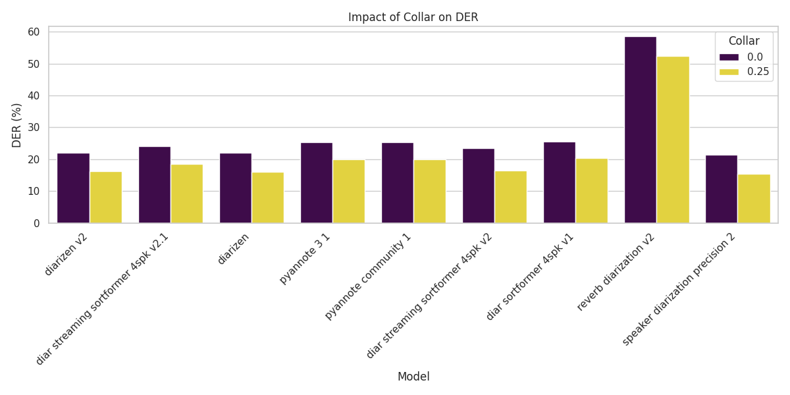

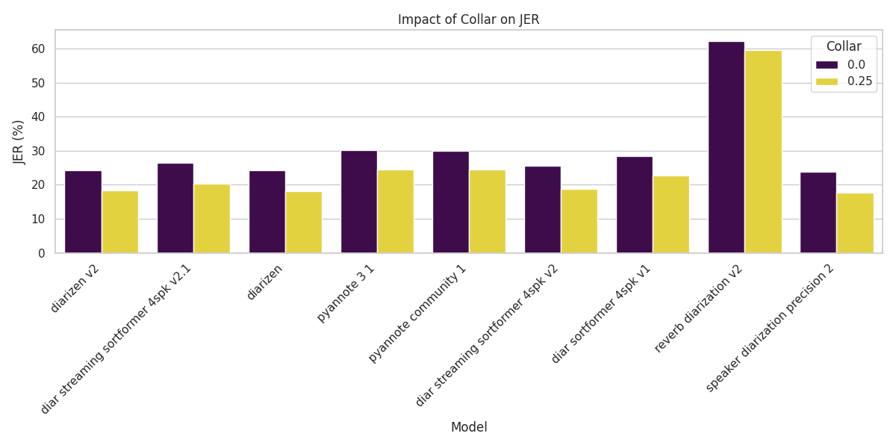

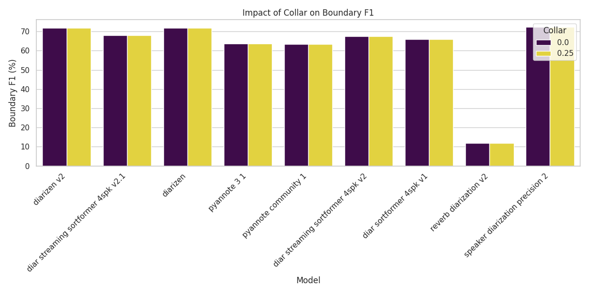

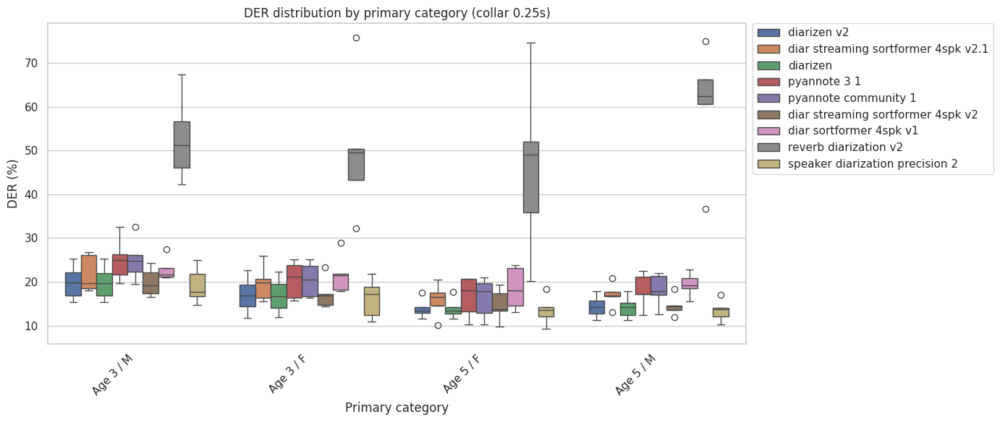

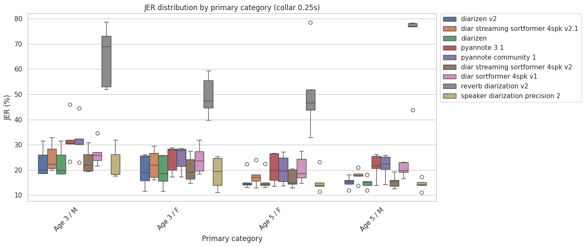

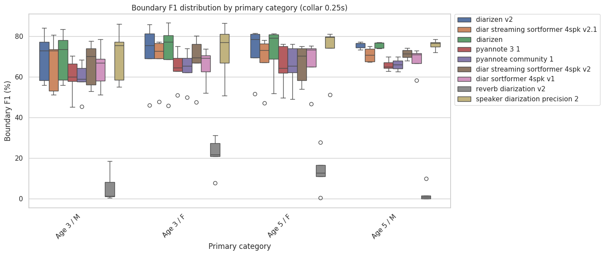

### Category comparison (DER %)
Average DER per primary category at collar `0.25`s. **Bold** highlights the best (lowest) model per row.

| Primary category   |     A |     B |     C |     D |     E |     F |     G |     H | I         |   AVG |
|--------------------|-------|-------|-------|-------|-------|-------|-------|-------|-----------|-------|
| Age 3 / F          | 21.7  | 17.34 | 19.69 | 16.9  | 17.01 | 20.44 | 20.51 | 50.2  | **16.26** | 22.23 |
| Age 3 / M          | 22.92 | 19.94 | 21.86 | 19.84 | 19.92 | 25.03 | 25.1  | 52.72 | **19.17** | 25.17 |
| Age 5 / F          | 18.49 | 14.74 | 15.9  | 13.95 | 13.96 | 16.59 | 16.39 | 46.34 | **13.52** | 18.88 |
| Age 5 / M          | 19.39 | 14.61 | 17.07 | 14.21 | 14.38 | 18.12 | 18.15 | 60.18 | **13.49** | 21.07 |

### Category comparison (JER %)
Average JER per primary category at collar `0.25`s. **Bold** highlights the best (lowest) model per row.

| Primary category   |     A |     B |     C |     D |     E |     F |     G |     H | I         |   AVG |
|--------------------|-------|-------|-------|-------|-------|-------|-------|-------|-----------|-------|
| Age 3 / F          | 24.13 | 20.37 | 22.29 | 19.49 | 19.6  | 24.45 | 24.66 | 49.36 | **18.89** | 24.81 |
| Age 3 / M          | 26.56 | 23.57 | 24.83 | 22.85 | 22.96 | 32.4  | 32.06 | 65.14 | **22.46** | 30.32 |
| Age 5 / F          | 20.43 | 16.57 | 17.53 | 15.68 | 15.73 | 20.48 | 20.17 | 50.73 | **15.37** | 21.41 |
| Age 5 / M          | 20.32 | 15.36 | 17.7  | 14.92 | 15.11 | 21.59 | 21.63 | 70.88 | **14.30** | 23.53 |

### Category comparison (Boundary F1 %)
Average boundary F1 per primary category at collar `0.25`s (boundary tolerance 0.250s). **Bold** highlights the best (highest) model per row.

| Primary category   |     A |     B |     C |     D |     E |     F |     G |     H | I         |   AVG |
|--------------------|-------|-------|-------|-------|-------|-------|-------|-------|-----------|-------|
| Age 3 / F          | 65.58 | 67.99 | 68.59 | 71.72 | 71.51 | 64.48 | 64.14 | 21.84 | **72.39** | 63.14 |
| Age 3 / M          | 64.66 | 66.08 | 66.31 | 69.85 | 69.63 | 59.93 | 58.88 |  6.02 | **70.42** | 59.09 |
| Age 5 / F          | 66.86 | 66.28 | 68.28 | 72.31 | 72.36 | 65.39 | 65.33 | 13.76 | **73.11** | 62.63 |
| Age 5 / M          | 68.06 | 71.26 | 70.86 | 75.68 | 75.6  | 65.78 | 66.09 |  2.51 | **75.76** | 63.51 |

### Category comparison model legend (shared)
* **A**: diar sortformer 4spk v1
* **B**: diar streaming sortformer 4spk v2
* **C**: diar streaming sortformer 4spk v2.1
* **D**: diarizen
* **E**: diarizen v2
* **F**: pyannote 3 1
* **G**: pyannote community 1
* **H**: reverb diarization v2
* **I**: speaker diarization precision 2

## 5. Deep Dive: File-by-File Analysis
Detailed breakdown for every file. *For metric definitions, see Executive Summary.*

### File: 1-00606

**Primary category:** Age 3 / M | **Quality:** N/A | **Device:** N/A

> *Keywords:* chronological_age=3;11; audio=1-00606-i.mp3; cha=1-00606-i.cha

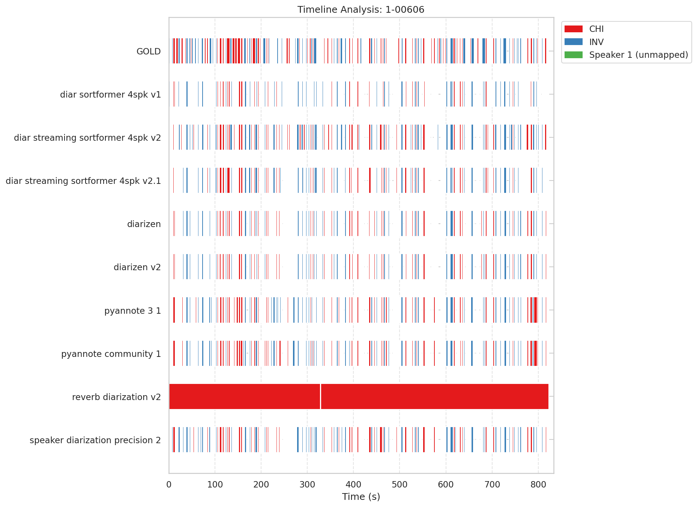

#### 60-Second Snippets (Zoom-in)
Below are 60-second zoomed-in windows showing where the models performed best and worst (based on average DER).

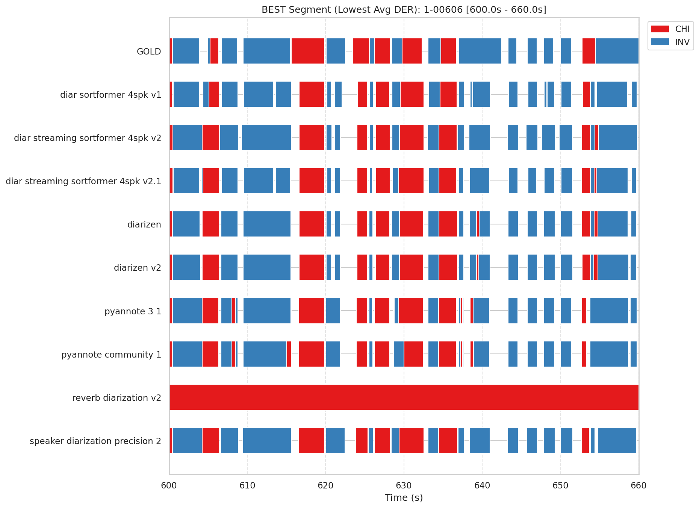

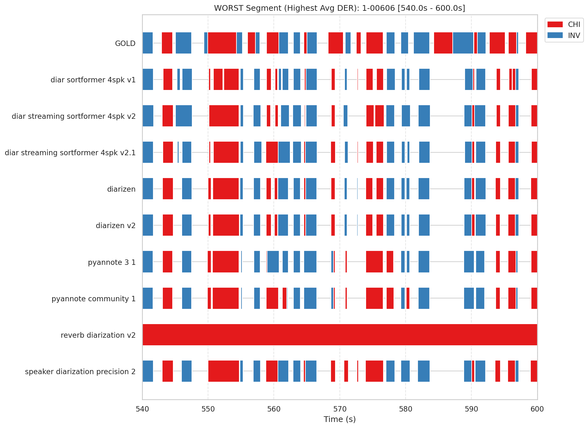

#### Metrics (Collar: 0.00s)

| Model                               | DER       | JER       | Miss     | FA       | Conf     | B-P        | B-R       | B-F1      | Pur       | Cov        | VRAM (GB)   |
|-------------------------------------|-----------|-----------|----------|----------|----------|------------|-----------|-----------|-----------|------------|-------------|
| speaker diarization precision 2     | **23.73** | **24.32** | 14.47    | 6.42     | 2.83     | 73.47      | **77.63** | **75.49** | 93.99     | 93.99      | **0.0**     |
| diarizen                            | 24.63     | 25.02     | 16.87    | 5.43     | **2.33** | 69.90      | **77.63** | 73.56     | 94.33     | 94.33      | 11.0        |
| diarizen v2                         | 24.71     | 25.20     | 17.02    | 5.27     | 2.42     | 68.92      | 77.09     | 72.77     | 94.30     | 94.30      | 11.0        |
| diar streaming sortformer 4spk v2.1 | 25.72     | 25.87     | 17.01    | 6.31     | 2.40     | 70.15      | 76.01     | 72.96     | 93.95     | 93.95      | 0.9         |
| diar streaming sortformer 4spk v2   | 26.04     | 26.13     | 15.04    | 7.45     | 3.55     | 75.71      | 72.24     | 73.93     | 94.21     | 93.25      | 0.9         |
| diar sortformer 4spk v1             | 26.41     | 27.15     | 20.08    | **3.91** | 2.42     | 62.56      | 76.55     | 68.85     | **95.09** | 95.09      | 23.2        |
| pyannote community 1                | 31.42     | 34.90     | 16.36    | 6.20     | 8.86     | 51.74      | 68.19     | 58.84     | 86.20     | 86.20      | 1.6         |
| pyannote 3 1                        | 31.76     | 35.47     | 16.36    | 6.20     | 9.20     | 53.60      | 68.19     | 60.02     | 85.81     | 85.81      | 1.6         |
| reverb diarization v2               | 73.64     | 79.77     | **0.05** | 23.68    | 49.91    | **100.00** | 0.27      | 0.54      | 50.06     | **100.00** | 4.3         |

#### Metrics (Collar: 0.25s)

| Model                               | DER       | JER       | Miss     | FA       | Conf     | B-P        | B-R       | B-F1      | Pur       | Cov        | VRAM (GB)   |
|-------------------------------------|-----------|-----------|----------|----------|----------|------------|-----------|-----------|-----------|------------|-------------|
| speaker diarization precision 2     | **17.76** | **18.32** | 13.06    | 3.25     | 1.45     | 73.47      | **77.63** | **75.49** | 95.82     | 96.96      | **0.0**     |
| diar streaming sortformer 4spk v2   | 19.22     | 19.61     | 13.31    | 3.66     | 2.26     | 75.71      | 72.24     | 73.93     | 96.23     | 95.88      | 0.9         |
| diarizen                            | 19.63     | 19.80     | 15.32    | 3.25     | **1.05** | 69.90      | **77.63** | 73.56     | 96.09     | 97.24      | 11.0        |
| diar streaming sortformer 4spk v2.1 | 19.77     | 19.93     | 15.01    | 3.62     | 1.13     | 70.15      | 76.01     | 72.96     | 95.92     | 96.89      | 0.9         |
| diarizen v2                         | 19.79     | 20.05     | 15.44    | 3.20     | 1.16     | 68.92      | 77.09     | 72.77     | 96.05     | 97.21      | 11.0        |
| diar sortformer 4spk v1             | 21.01     | 21.55     | 17.69    | **2.05** | 1.28     | 62.56      | 76.55     | 68.85     | **96.81** | 97.78      | 23.2        |
| pyannote community 1                | 26.19     | 30.21     | 14.94    | 3.72     | 7.54     | 51.74      | 68.19     | 58.84     | 88.15     | 89.45      | 1.6         |
| pyannote 3 1                        | 26.36     | 30.52     | 14.94    | 3.72     | 7.70     | 53.60      | 68.19     | 60.02     | 87.97     | 89.28      | 1.6         |
| reverb diarization v2               | 67.32     | 78.63     | **0.01** | 17.56    | 49.74    | **100.00** | 0.27      | 0.54      | 50.25     | **100.00** | 4.3         |


---

### File: 1-011610

**Primary category:** Age 3 / F | **Quality:** N/A | **Device:** N/A

> *Keywords:* chronological_age=3;04; audio=1-011610-i.mp3; cha=1-011610-i.cha

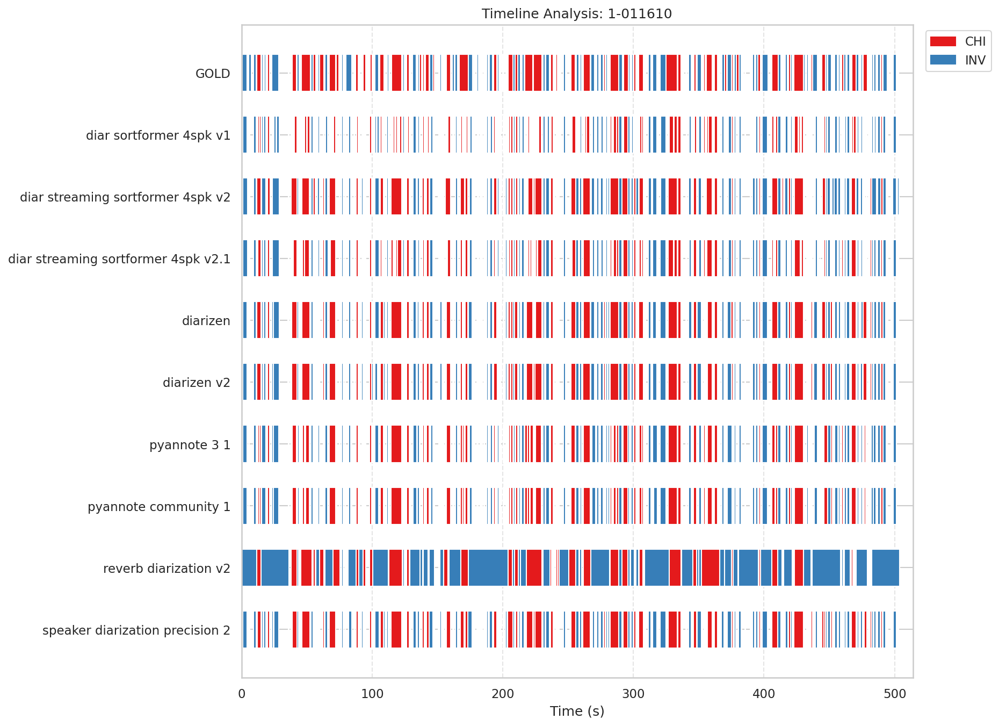

#### 60-Second Snippets (Zoom-in)
Below are 60-second zoomed-in windows showing where the models performed best and worst (based on average DER).

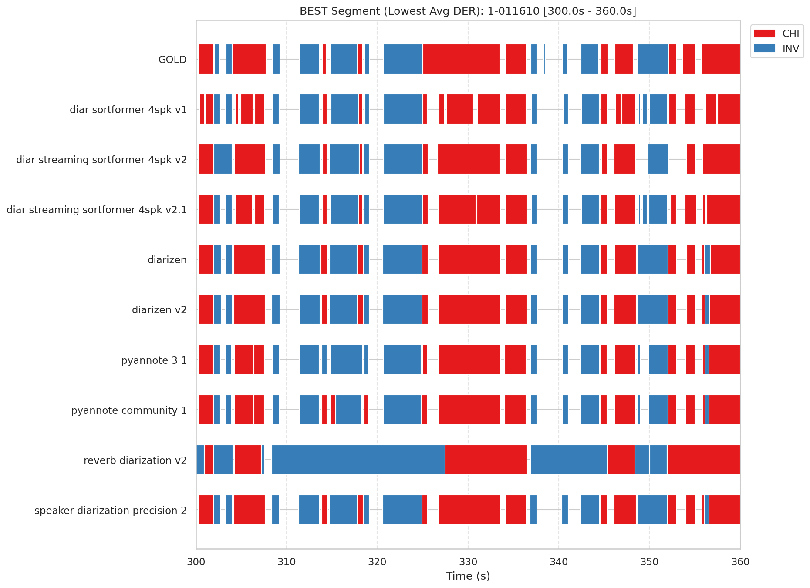

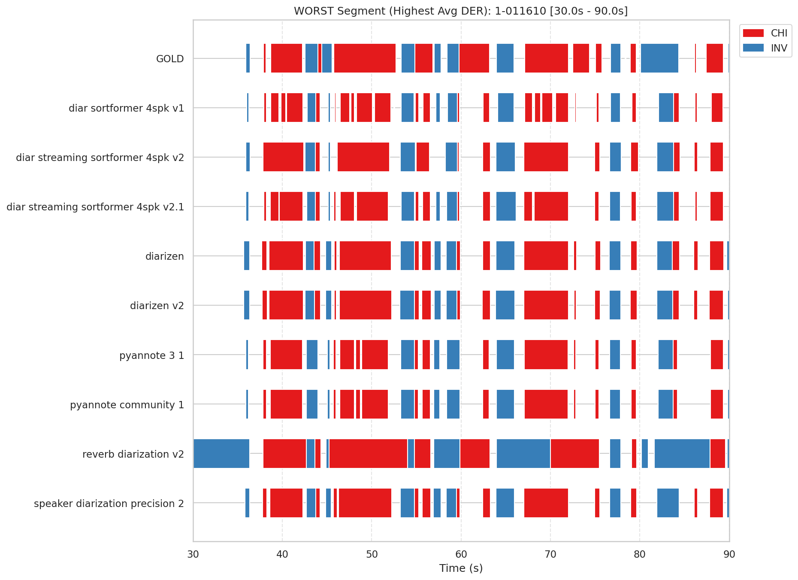

#### Metrics (Collar: 0.00s)

| Model                               | DER       | JER       | Miss     | FA       | Conf     | B-P       | B-R       | B-F1      | Pur       | Cov       | VRAM (GB)   |
|-------------------------------------|-----------|-----------|----------|----------|----------|-----------|-----------|-----------|-----------|-----------|-------------|
| speaker diarization precision 2     | **18.08** | **18.04** | 10.15    | 6.44     | 1.49     | 84.08     | **88.79** | 86.37     | 96.09     | 96.09     | **0.0**     |
| diarizen                            | 19.76     | 18.86     | 9.68     | 8.92     | **1.16** | **85.96** | 87.07     | **86.51** | 94.74     | 94.74     | 11.0        |
| diarizen v2                         | 19.89     | 19.00     | 9.72     | 8.98     | 1.19     | 84.52     | 87.07     | 85.77     | 94.97     | 94.97     | 11.0        |
| diar streaming sortformer 4spk v2.1 | 22.55     | 22.39     | 17.67    | 3.71     | 1.17     | 70.96     | 83.19     | 76.59     | 96.73     | 96.73     | 0.8         |
| pyannote 3 1                        | 22.56     | 23.70     | 15.53    | 4.07     | 2.96     | 65.76     | 72.84     | 69.12     | 94.75     | 94.75     | 1.6         |
| pyannote community 1                | 22.62     | 23.78     | 15.53    | 4.07     | 3.01     | 66.02     | 72.84     | 69.26     | 94.68     | 94.68     | 1.6         |
| diar streaming sortformer 4spk v2   | 22.68     | 22.25     | 14.58    | 6.68     | 1.43     | 81.98     | 78.45     | 80.18     | 96.03     | 96.03     | 0.8         |
| diar sortformer 4spk v1             | 23.80     | 24.26     | 20.39    | **1.89** | 1.53     | 60.24     | 84.91     | 70.48     | **97.48** | **97.48** | 9.2         |
| reverb diarization v2               | 52.18     | 44.94     | **1.35** | 33.50    | 17.33    | 52.00     | 22.41     | 31.33     | 78.47     | 78.47     | 4.3         |

#### Metrics (Collar: 0.25s)

| Model                               | DER       | JER       | Miss     | FA       | Conf     | B-P       | B-R       | B-F1      | Pur       | Cov       | VRAM (GB)   |
|-------------------------------------|-----------|-----------|----------|----------|----------|-----------|-----------|-----------|-----------|-----------|-------------|
| speaker diarization precision 2     | **10.87** | **10.98** | 8.66     | 1.70     | 0.51     | 84.08     | **88.79** | 86.37     | 98.05     | 98.87     | **0.0**     |
| diarizen v2                         | 11.81     | 11.61     | 8.37     | 3.04     | 0.40     | 84.52     | 87.07     | 85.77     | 97.18     | 97.93     | 11.0        |
| diarizen                            | 11.87     | 11.62     | 8.32     | 3.17     | 0.39     | **85.96** | 87.07     | **86.51** | 96.97     | 97.65     | 11.0        |
| diar streaming sortformer 4spk v2   | 14.79     | 14.71     | 12.02    | 2.31     | 0.46     | 81.98     | 78.45     | 80.18     | 98.11     | 98.49     | 0.8         |
| pyannote 3 1                        | 16.36     | 17.18     | 12.93    | 1.78     | 1.65     | 65.76     | 72.84     | 69.12     | 96.49     | 96.75     | 1.6         |
| diar streaming sortformer 4spk v2.1 | 16.42     | 16.13     | 14.73    | 1.36     | **0.33** | 70.96     | 83.19     | 76.59     | 98.40     | 99.17     | 0.8         |
| pyannote community 1                | 16.42     | 17.28     | 12.93    | 1.78     | 1.71     | 66.02     | 72.84     | 69.26     | 96.43     | 96.73     | 1.6         |
| diar sortformer 4spk v1             | 18.24     | 18.36     | 17.11    | **0.46** | 0.68     | 60.24     | 84.91     | 70.48     | **98.84** | **99.31** | 9.2         |
| reverb diarization v2               | 43.29     | 39.78     | **0.86** | 27.31    | 15.12    | 52.00     | 22.41     | 31.33     | 80.98     | 80.40     | 4.3         |


---

### File: 1-01308

**Primary category:** Age 3 / F | **Quality:** N/A | **Device:** N/A

> *Keywords:* chronological_age=3;08; audio=1-01308-i.mp3; cha=1-01308-i.cha

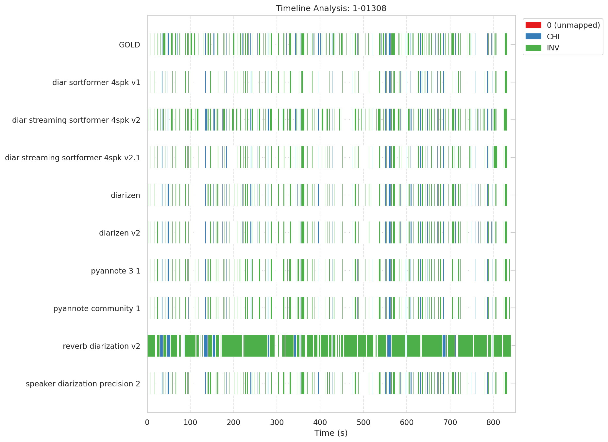

#### 60-Second Snippets (Zoom-in)
Below are 60-second zoomed-in windows showing where the models performed best and worst (based on average DER).

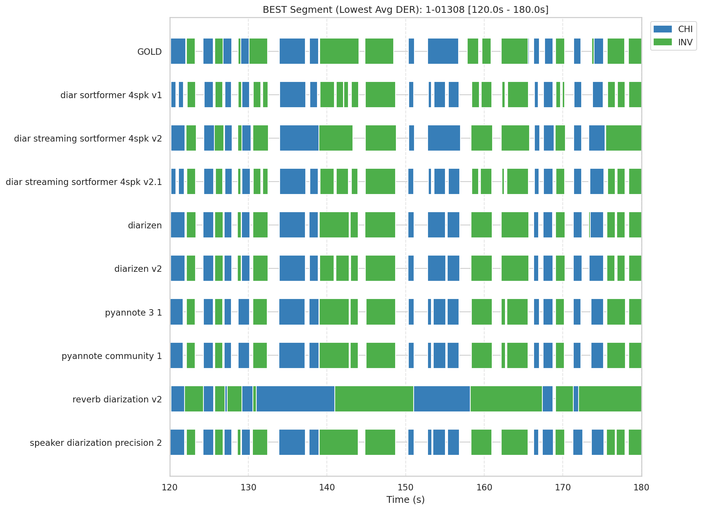

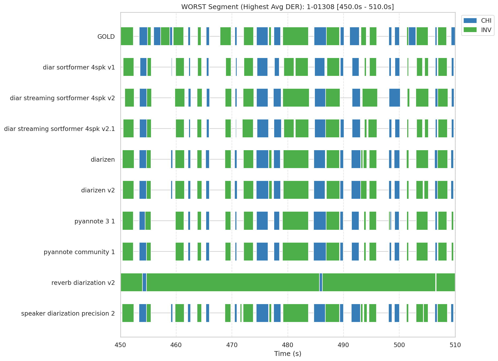

#### Metrics (Collar: 0.00s)

| Model                               | DER       | JER       | Miss     | FA       | Conf     | B-P       | B-R       | B-F1      | Pur       | Cov       | VRAM (GB)   |
|-------------------------------------|-----------|-----------|----------|----------|----------|-----------|-----------|-----------|-----------|-----------|-------------|
| speaker diarization precision 2     | **18.77** | **20.20** | 11.68    | 5.80     | 1.30     | 79.90     | **82.41** | 81.14     | 97.71     | 97.71     | **0.0**     |
| diarizen                            | 20.30     | 21.58     | 12.53    | 6.33     | 1.45     | 79.84     | 81.10     | 80.47     | 97.33     | 97.24     | 11.0        |
| diarizen v2                         | 20.35     | 21.59     | 12.56    | 6.34     | 1.46     | 80.94     | 81.36     | **81.15** | 97.31     | 97.22     | 11.0        |
| diar streaming sortformer 4spk v2.1 | 21.54     | 23.25     | 16.20    | 4.17     | **1.17** | 74.39     | 80.05     | 77.12     | 97.90     | 97.90     | 1.0         |
| pyannote 3 1                        | 21.56     | 25.50     | 13.88    | 3.84     | 3.84     | 73.55     | 76.64     | 75.06     | 94.64     | 94.64     | 1.6         |
| pyannote community 1                | 22.31     | 26.57     | 13.88    | 3.84     | 4.59     | 70.74     | 77.43     | 73.93     | 93.78     | 93.78     | 1.6         |
| diar streaming sortformer 4spk v2   | 22.75     | 24.09     | 11.89    | 8.93     | 1.94     | **84.57** | 69.03     | 76.01     | 96.59     | 96.59     | 1.0         |
| diar sortformer 4spk v1             | 23.54     | 25.52     | 20.11    | **2.04** | 1.39     | 67.25     | 81.36     | 73.63     | **97.98** | **97.98** | 24.1        |
| reverb diarization v2               | 59.79     | 59.44     | **0.17** | 33.32    | 26.29    | 51.02     | 13.12     | 20.88     | 72.27     | 86.18     | 4.3         |

#### Metrics (Collar: 0.25s)

| Model                               | DER       | JER       | Miss     | FA       | Conf     | B-P       | B-R       | B-F1      | Pur       | Cov       | VRAM (GB)   |
|-------------------------------------|-----------|-----------|----------|----------|----------|-----------|-----------|-----------|-----------|-----------|-------------|
| speaker diarization precision 2     | **12.51** | **13.98** | 10.41    | 1.73     | 0.37     | 79.90     | **82.41** | 81.14     | 99.01     | 99.19     | **0.0**     |
| diarizen                            | 14.14     | 15.57     | 11.51    | 2.13     | 0.51     | 79.84     | 81.10     | 80.47     | 98.71     | 98.78     | 11.0        |
| diarizen v2                         | 14.34     | 15.69     | 11.55    | 2.27     | 0.51     | 80.94     | 81.36     | **81.15** | 98.68     | 98.84     | 11.0        |
| diar streaming sortformer 4spk v2   | 14.43     | 16.41     | 10.33    | 3.36     | 0.74     | **84.57** | 69.03     | 76.01     | 98.38     | 98.23     | 1.0         |
| diar streaming sortformer 4spk v2.1 | 15.51     | 17.15     | 13.68    | 1.48     | **0.35** | 74.39     | 80.05     | 77.12     | **99.15** | **99.19** | 1.0         |
| pyannote 3 1                        | 15.78     | 19.90     | 11.95    | 1.02     | 2.80     | 73.55     | 76.64     | 75.06     | 96.11     | 96.48     | 1.6         |
| pyannote community 1                | 16.74     | 21.47     | 11.95    | 1.02     | 3.76     | 70.74     | 77.43     | 73.93     | 95.02     | 95.73     | 1.6         |
| diar sortformer 4spk v1             | 17.86     | 19.55     | 16.74    | **0.43** | 0.70     | 67.25     | 81.36     | 73.63     | 98.97     | 99.11     | 24.1        |
| reverb diarization v2               | 50.39     | 55.51     | **0.15** | 26.32    | 23.92    | 51.02     | 13.12     | 20.88     | 74.63     | 87.70     | 4.3         |


---

### File: 1-01801

**Primary category:** Age 3 / M | **Quality:** N/A | **Device:** N/A

> *Keywords:* chronological_age=3;05; audio=1-01801-i.mp3; cha=1-01801-i.cha

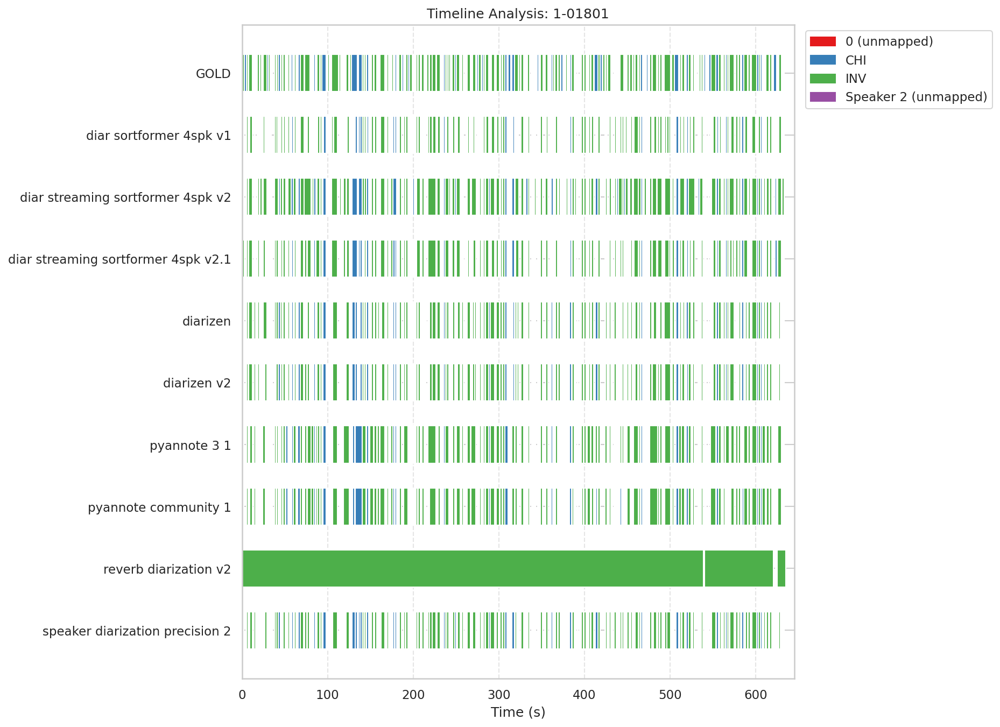

#### 60-Second Snippets (Zoom-in)
Below are 60-second zoomed-in windows showing where the models performed best and worst (based on average DER).

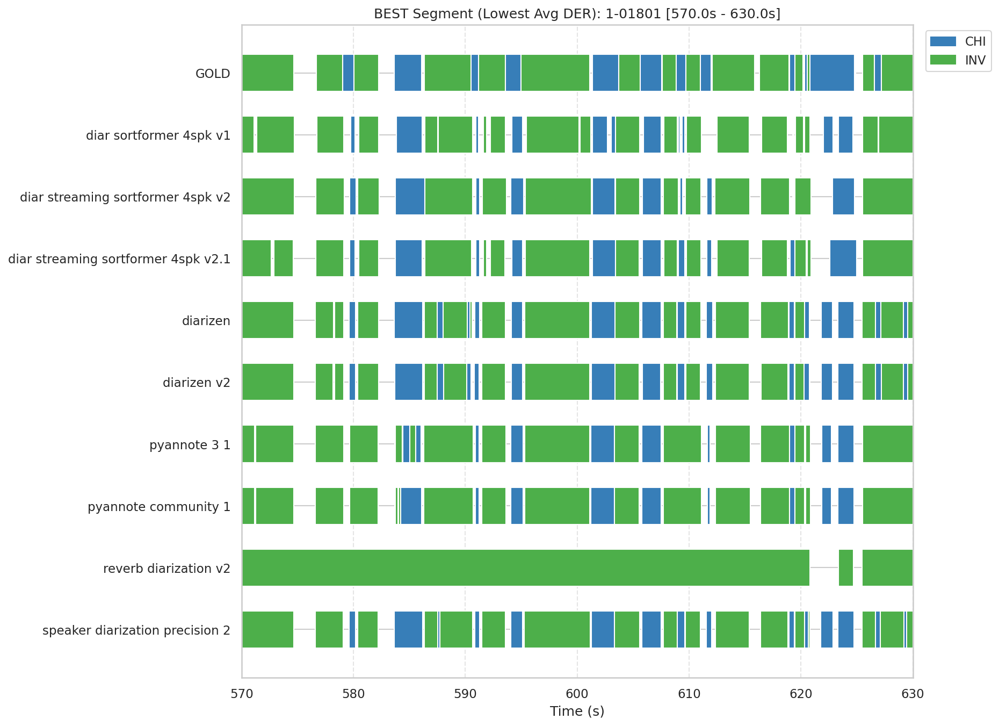

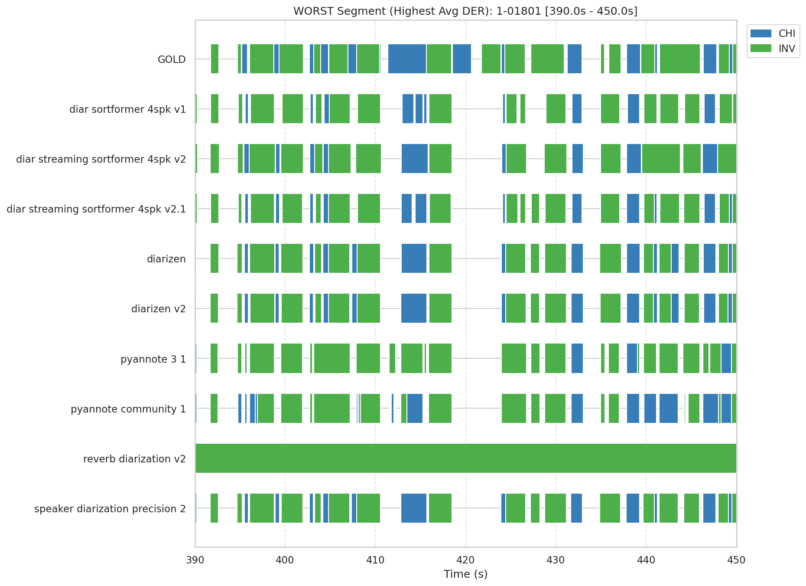

#### Metrics (Collar: 0.00s)

| Model                               | DER       | JER       | Miss     | FA       | Conf     | B-P       | B-R       | B-F1      | Pur       | Cov        | VRAM (GB)   |
|-------------------------------------|-----------|-----------|----------|----------|----------|-----------|-----------|-----------|-----------|------------|-------------|
| speaker diarization precision 2     | **20.77** | **24.18** | 14.40    | 4.09     | **2.28** | **85.67** | **86.20** | **85.93** | 95.44     | 95.44      | **0.0**     |
| diarizen                            | 21.42     | 24.93     | 14.20    | 4.56     | 2.66     | 82.98     | 83.74     | 83.36     | 94.91     | 94.81      | 11.0        |
| diarizen v2                         | 21.51     | 24.97     | 14.57    | 4.43     | 2.51     | 84.05     | 84.05     | 84.05     | 94.98     | 94.89      | 11.0        |
| diar streaming sortformer 4spk v2   | 23.73     | 29.63     | 13.28    | 5.38     | 5.07     | 79.15     | 62.88     | 70.09     | 93.30     | 93.30      | 0.8         |
| diar streaming sortformer 4spk v2.1 | 24.24     | 29.23     | 18.40    | 2.63     | 3.21     | 83.55     | 77.91     | 80.63     | 95.61     | 95.40      | 0.8         |
| diar sortformer 4spk v1             | 27.29     | 32.64     | 23.11    | **1.55** | 2.63     | 75.42     | 81.90     | 78.53     | **96.37** | 96.37      | 14.1        |
| pyannote 3 1                        | 27.58     | 37.51     | 14.51    | 3.82     | 9.25     | 68.63     | 64.42     | 66.46     | 87.67     | 87.67      | 1.6         |
| pyannote community 1                | 28.12     | 37.72     | 14.51    | 3.82     | 9.78     | 62.61     | 66.26     | 64.38     | 87.06     | 87.06      | 1.6         |
| reverb diarization v2               | 48.89     | 71.11     | **0.51** | 15.13    | 33.24    | 66.67     | 0.61      | 1.22      | 66.58     | **100.00** | 4.3         |

#### Metrics (Collar: 0.25s)

| Model                               | DER       | JER       | Miss     | FA       | Conf     | B-P       | B-R       | B-F1      | Pur       | Cov        | VRAM (GB)   |
|-------------------------------------|-----------|-----------|----------|----------|----------|-----------|-----------|-----------|-----------|------------|-------------|
| speaker diarization precision 2     | **14.71** | **17.60** | 12.59    | 1.57     | **0.54** | **85.67** | **86.20** | **85.93** | 98.03     | 98.83      | **0.0**     |
| diarizen                            | 15.32     | 18.47     | 12.70    | 1.74     | 0.88     | 82.98     | 83.74     | 83.36     | 97.64     | 98.18      | 11.0        |
| diarizen v2                         | 15.45     | 18.63     | 12.86    | 1.74     | 0.85     | 84.05     | 84.05     | 84.05     | 97.62     | 98.16      | 11.0        |
| diar streaming sortformer 4spk v2   | 16.56     | 21.89     | 12.25    | 1.99     | 2.32     | 79.15     | 62.88     | 70.09     | 96.87     | 96.14      | 0.8         |
| diar streaming sortformer 4spk v2.1 | 18.08     | 22.22     | 15.88    | 1.08     | 1.11     | 83.55     | 77.91     | 80.63     | 98.39     | 97.88      | 0.8         |
| diar sortformer 4spk v1             | 21.23     | 25.84     | 20.05    | **0.34** | 0.84     | 75.42     | 81.90     | 78.53     | **98.82** | 98.81      | 14.1        |
| pyannote 3 1                        | 21.73     | 31.92     | 12.79    | 1.82     | 7.12     | 68.63     | 64.42     | 66.46     | 90.40     | 89.99      | 1.6         |
| pyannote community 1                | 22.38     | 32.39     | 12.79    | 1.82     | 7.76     | 62.61     | 66.26     | 64.38     | 89.68     | 89.68      | 1.6         |
| reverb diarization v2               | 42.24     | 68.92     | **0.52** | 10.80    | 30.93    | 66.67     | 0.61      | 1.22      | 68.91     | **100.00** | 4.3         |


---

### File: 1-02209

**Primary category:** Age 3 / M | **Quality:** N/A | **Device:** N/A

> *Keywords:* chronological_age=3;08; audio=1-02209-i.mp3; cha=1-02209-i.cha

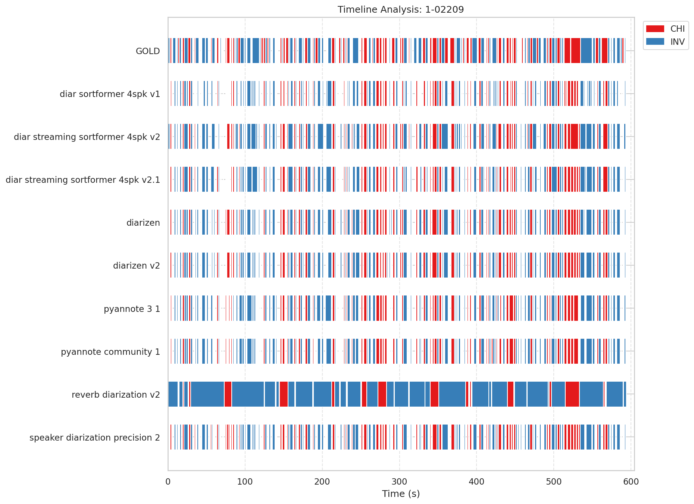

#### 60-Second Snippets (Zoom-in)
Below are 60-second zoomed-in windows showing where the models performed best and worst (based on average DER).

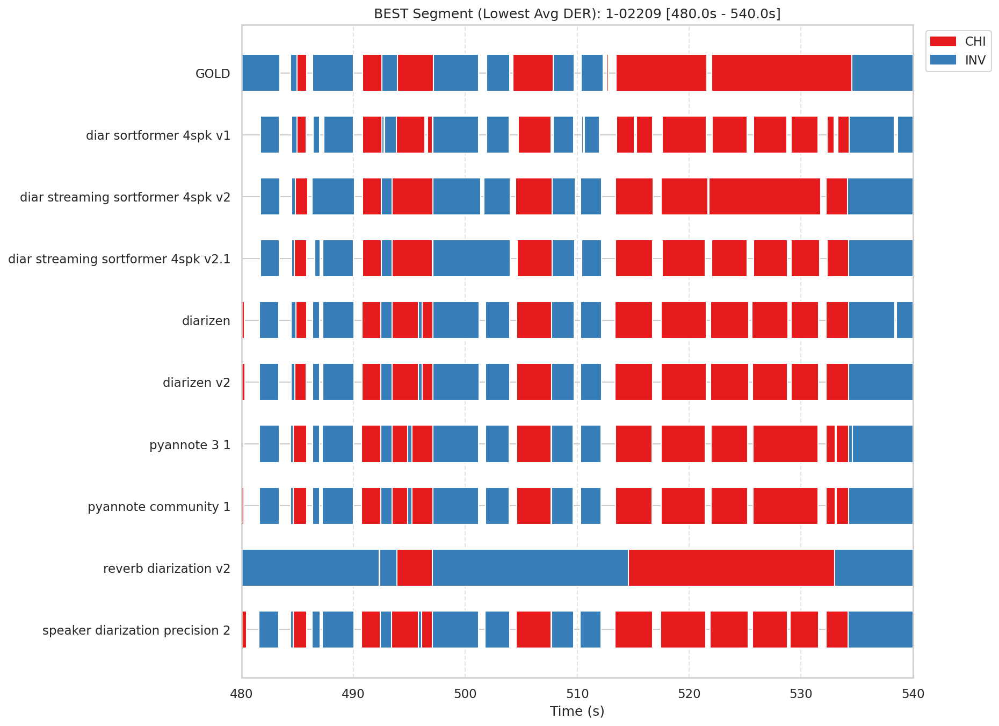

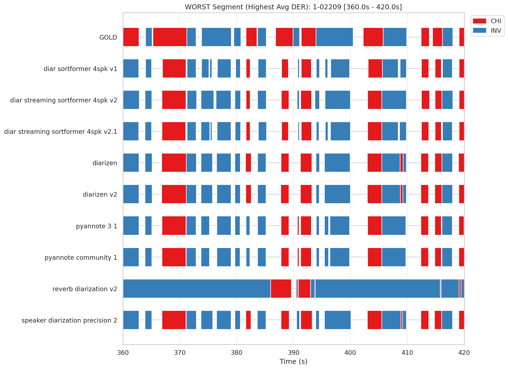

#### Metrics (Collar: 0.00s)

| Model                               | DER       | JER       | Miss     | FA       | Conf     | B-P       | B-R       | B-F1      | Pur       | Cov       | VRAM (GB)   |
|-------------------------------------|-----------|-----------|----------|----------|----------|-----------|-----------|-----------|-----------|-----------|-------------|
| speaker diarization precision 2     | **21.02** | **23.00** | 13.61    | 4.35     | 3.07     | 72.96     | **81.73** | 77.10     | 93.56     | 93.56     | **0.0**     |
| diarizen v2                         | 21.08     | 23.04     | 14.01    | 4.09     | 2.98     | 73.68     | 80.77     | 77.06     | 93.79     | 93.79     | 11.0        |
| diarizen                            | 21.13     | 23.01     | 13.84    | 4.33     | **2.97** | 74.56     | **81.73** | **77.98** | 93.68     | 93.68     | 11.0        |
| diar streaming sortformer 4spk v2   | 21.91     | 24.12     | 14.18    | 4.52     | 3.21     | **80.73** | 74.52     | 77.50     | 93.90     | 93.90     | 0.8         |
| diar streaming sortformer 4spk v2.1 | 23.01     | 25.34     | 16.67    | 3.24     | 3.11     | 70.67     | 76.44     | 73.44     | 94.09     | 94.09     | 0.8         |
| pyannote community 1                | 23.75     | 27.46     | 15.70    | 2.85     | 5.21     | 62.65     | 75.00     | 68.27     | 92.09     | 92.09     | 1.6         |
| pyannote 3 1                        | 23.85     | 27.70     | 15.70    | 2.85     | 5.31     | 65.29     | 75.96     | 70.22     | 91.97     | 91.97     | 1.6         |
| diar sortformer 4spk v1             | 25.82     | 28.39     | 21.26    | **1.40** | 3.16     | 58.21     | 78.37     | 66.80     | **95.07** | **95.07** | 12.5        |
| reverb diarization v2               | 51.89     | 55.90     | **0.49** | 22.98    | 28.43    | 19.64     | 5.29      | 8.33      | 70.23     | 80.81     | 4.3         |

#### Metrics (Collar: 0.25s)

| Model                               | DER       | JER       | Miss     | FA       | Conf     | B-P       | B-R       | B-F1      | Pur       | Cov       | VRAM (GB)   |
|-------------------------------------|-----------|-----------|----------|----------|----------|-----------|-----------|-----------|-----------|-----------|-------------|
| speaker diarization precision 2     | **16.65** | **18.34** | 12.09    | 2.58     | 1.98     | 72.96     | **81.73** | 77.10     | 95.32     | 96.05     | **0.0**     |
| diarizen v2                         | 16.91     | 18.55     | 12.70    | 2.33     | 1.89     | 73.68     | 80.77     | 77.06     | 95.56     | 96.24     | 11.0        |
| diarizen                            | 16.95     | 18.52     | 12.65    | 2.44     | **1.86** | 74.56     | **81.73** | **77.98** | 95.47     | 96.21     | 11.0        |
| diar streaming sortformer 4spk v2   | 17.39     | 19.37     | 12.79    | 2.47     | 2.12     | **80.73** | 74.52     | 77.50     | 95.64     | 96.23     | 0.8         |
| diar streaming sortformer 4spk v2.1 | 18.62     | 20.69     | 14.38    | 2.00     | 2.24     | 70.67     | 76.44     | 73.44     | 95.66     | 95.83     | 0.8         |
| pyannote community 1                | 19.51     | 23.01     | 13.84    | 1.52     | 4.15     | 62.65     | 75.00     | 68.27     | 93.89     | 93.92     | 1.6         |
| pyannote 3 1                        | 19.62     | 23.27     | 13.84    | 1.52     | 4.27     | 65.29     | 75.96     | 70.22     | 93.76     | 93.80     | 1.6         |
| diar sortformer 4spk v1             | 21.66     | 23.86     | 18.45    | **0.82** | 2.39     | 58.21     | 78.37     | 66.80     | **96.34** | **96.57** | 12.5        |
| reverb diarization v2               | 46.14     | 52.97     | **0.48** | 18.72    | 26.94    | 19.64     | 5.29      | 8.33      | 71.65     | 81.91     | 4.3         |


---

### File: 1-02604

**Primary category:** Age 3 / M | **Quality:** N/A | **Device:** N/A

> *Keywords:* chronological_age=3;01; audio=1-02604-i.mp3; cha=1-02604-i.cha

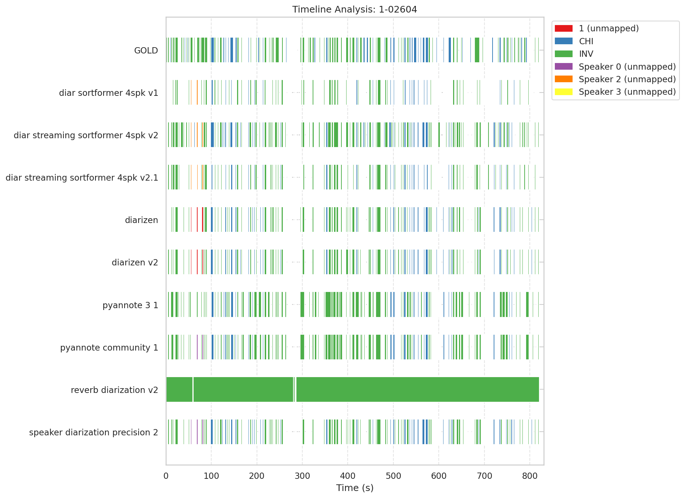

#### 60-Second Snippets (Zoom-in)
Below are 60-second zoomed-in windows showing where the models performed best and worst (based on average DER).

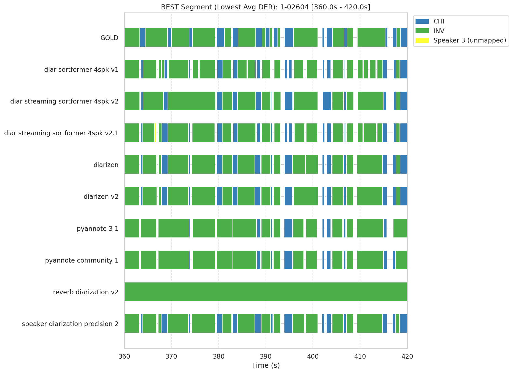

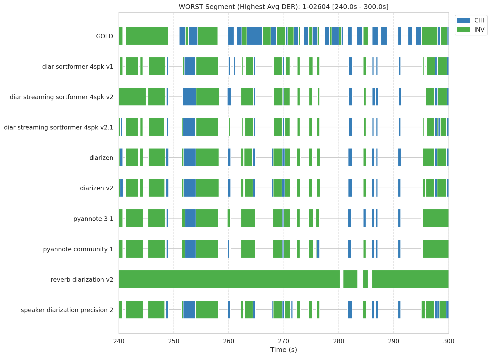

#### Metrics (Collar: 0.00s)

| Model                               | DER       | JER       | Miss     | FA       | Conf      | B-P       | B-R       | B-F1      | Pur       | Cov        | VRAM (GB)   |
|-------------------------------------|-----------|-----------|----------|----------|-----------|-----------|-----------|-----------|-----------|------------|-------------|
| speaker diarization precision 2     | **30.24** | 37.30     | 9.24     | 6.15     | 14.85     | 53.64     | 56.73     | 55.14     | 82.37     | 80.47      | **0.0**     |
| diarizen v2                         | 30.35     | 36.89     | 9.71     | 6.45     | 14.20     | 54.30     | 57.69     | **55.94** | 82.49     | 80.55      | 11.0        |
| diar streaming sortformer 4spk v2   | 30.37     | **36.68** | 9.39     | 7.10     | 13.89     | 56.25     | 49.76     | 52.81     | 83.68     | 81.67      | 0.9         |
| diarizen                            | 30.42     | 36.86     | 9.57     | 6.68     | 14.17     | 54.32     | 57.45     | 55.84     | 82.45     | 80.51      | 11.0        |
| diar streaming sortformer 4spk v2.1 | 31.81     | 38.37     | 14.84    | 4.13     | **12.85** | 50.65     | 56.01     | 53.20     | 84.40     | 82.22      | 0.9         |
| diar sortformer 4spk v1             | 32.30     | 39.77     | 17.57    | **1.87** | 12.86     | 45.66     | **58.17** | 51.16     | **85.23** | 83.56      | 23.0        |
| pyannote 3 1                        | 36.87     | 49.62     | 11.39    | 3.85     | 21.64     | 44.06     | 46.39     | 45.20     | 73.94     | 73.94      | 1.6         |
| pyannote community 1                | 36.87     | 48.30     | 11.38    | 3.85     | 21.64     | 43.39     | 47.36     | 45.29     | 75.91     | 73.93      | 1.6         |
| reverb diarization v2               | 56.79     | 74.67     | **0.23** | 14.93    | 41.62     | **75.00** | 0.72      | 1.43      | 58.28     | **100.00** | 4.3         |

#### Metrics (Collar: 0.25s)

| Model                               | DER       | JER       | Miss     | FA       | Conf      | B-P       | B-R       | B-F1      | Pur       | Cov        | VRAM (GB)   |
|-------------------------------------|-----------|-----------|----------|----------|-----------|-----------|-----------|-----------|-----------|------------|-------------|
| diar streaming sortformer 4spk v2   | **24.34** | **30.85** | 8.09     | 4.52     | 11.73     | 56.25     | 49.76     | 52.81     | 86.69     | 85.15      | 0.9         |
| speaker diarization precision 2     | 24.94     | 31.91     | 8.46     | 4.11     | 12.38     | 53.64     | 56.73     | 55.14     | 85.44     | 84.64      | **0.0**     |
| diarizen                            | 25.27     | 31.47     | 8.73     | 4.87     | 11.68     | 54.32     | 57.45     | 55.84     | 85.54     | 84.75      | 11.0        |
| diarizen v2                         | 25.30     | 31.58     | 8.78     | 4.77     | 11.74     | 54.30     | 57.69     | **55.94** | 85.52     | 84.76      | 11.0        |
| diar streaming sortformer 4spk v2.1 | 26.73     | 32.94     | 12.75    | 3.13     | **10.86** | 50.65     | 56.01     | 53.20     | 87.34     | 85.94      | 0.9         |
| diar sortformer 4spk v1             | 27.49     | 34.60     | 15.42    | **1.08** | 10.98     | 45.66     | **58.17** | 51.16     | **88.12** | 86.90      | 23.0        |
| pyannote 3 1                        | 32.49     | 46.01     | 10.19    | 2.57     | 19.72     | 44.06     | 46.39     | 45.20     | 76.30     | 76.60      | 1.6         |
| pyannote community 1                | 32.57     | 44.54     | 10.19    | 2.57     | 19.81     | 43.39     | 47.36     | 45.29     | 78.42     | 76.44      | 1.6         |
| reverb diarization v2               | 51.23     | 73.11     | **0.18** | 10.66    | 40.39     | **75.00** | 0.72      | 1.43      | 59.54     | **100.00** | 4.3         |


---

### File: 1-02808

**Primary category:** Age 3 / F | **Quality:** N/A | **Device:** N/A

> *Keywords:* chronological_age=3;08; audio=1-02808-i.mp3; cha=1-02808-i.cha

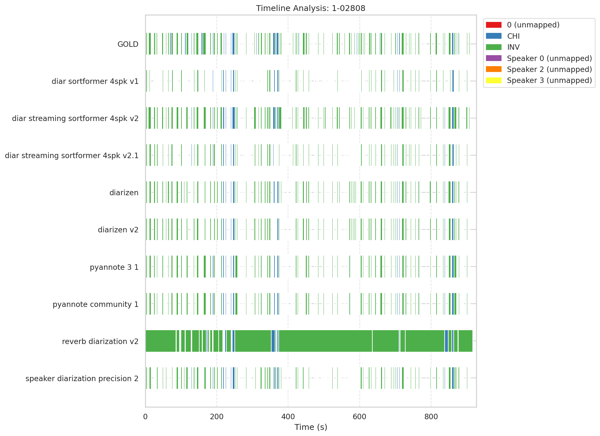

#### 60-Second Snippets (Zoom-in)
Below are 60-second zoomed-in windows showing where the models performed best and worst (based on average DER).

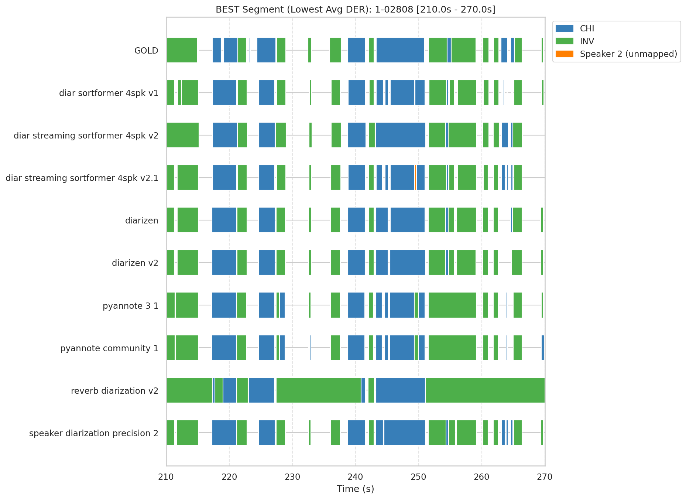

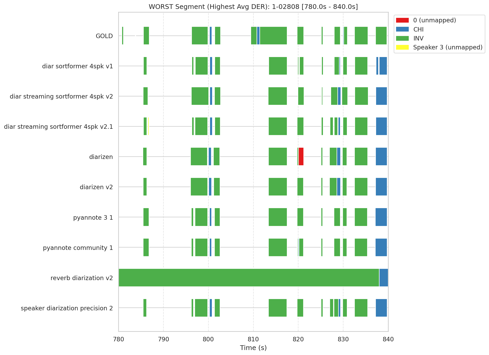

#### Metrics (Collar: 0.00s)

| Model                               | DER       | JER       | Miss     | FA       | Conf     | B-P       | B-R       | B-F1      | Pur       | Cov       | VRAM (GB)   |
|-------------------------------------|-----------|-----------|----------|----------|----------|-----------|-----------|-----------|-----------|-----------|-------------|
| diar streaming sortformer 4spk v2   | **24.09** | 30.74     | 15.91    | 5.33     | 2.85     | **80.08** | 61.27     | **69.42** | 96.00     | 96.00     | 1.0         |
| speaker diarization precision 2     | 24.39     | **30.43** | 18.26    | 3.58     | 2.56     | 66.88     | 66.67     | 66.77     | 96.41     | 96.41     | **0.0**     |
| diarizen v2                         | 25.11     | 31.40     | 18.44    | 3.78     | 2.90     | 71.43     | 66.67     | 68.97     | 96.29     | 95.86     | 11.0        |
| diarizen                            | 25.38     | 31.53     | 18.64    | 3.87     | 2.87     | 71.88     | 65.71     | 68.66     | 96.45     | 95.86     | 11.0        |
| pyannote community 1                | 25.95     | 33.72     | 19.66    | 2.82     | 3.47     | 62.30     | 61.90     | 62.10     | 94.66     | 94.66     | 1.6         |
| diar streaming sortformer 4spk v2.1 | 25.97     | 32.00     | 20.17    | 3.14     | 2.66     | 67.17     | **70.79** | 68.93     | 97.03     | 95.84     | 1.0         |
| pyannote 3 1                        | 26.36     | 33.88     | 19.66    | 2.82     | 3.89     | 64.24     | 61.59     | 62.88     | 95.06     | 94.15     | 1.6         |
| diar sortformer 4spk v1             | 26.68     | 32.71     | 23.42    | **1.38** | **1.88** | 57.99     | 67.94     | 62.57     | **97.36** | **97.36** | 28.5        |
| reverb diarization v2               | 79.66     | 61.87     | **0.37** | 60.34    | 18.95    | 34.15     | 4.44      | 7.87      | 79.84     | 91.13     | 4.3         |

#### Metrics (Collar: 0.25s)

| Model                               | DER       | JER       | Miss     | FA       | Conf     | B-P       | B-R       | B-F1      | Pur       | Cov       | VRAM (GB)   |
|-------------------------------------|-----------|-----------|----------|----------|----------|-----------|-----------|-----------|-----------|-----------|-------------|
| diar streaming sortformer 4spk v2   | **17.22** | **24.14** | 13.73    | 1.90     | 1.60     | **80.08** | 61.27     | **69.42** | 97.68     | 97.84     | 1.0         |
| speaker diarization precision 2     | 18.82     | 24.65     | 16.07    | 1.36     | 1.39     | 66.88     | 66.67     | 66.77     | 97.90     | 98.10     | **0.0**     |
| diarizen v2                         | 19.38     | 25.71     | 15.85    | 1.72     | 1.81     | 71.43     | 66.67     | 68.97     | 97.63     | 97.62     | 11.0        |
| diarizen                            | 19.52     | 25.80     | 16.15    | 1.59     | 1.78     | 71.88     | 65.71     | 68.66     | 97.80     | 97.56     | 11.0        |
| pyannote community 1                | 20.59     | 28.51     | 16.89    | 1.25     | 2.45     | 62.30     | 61.90     | 62.10     | 96.06     | 96.75     | 1.6         |
| diar streaming sortformer 4spk v2.1 | 20.72     | 26.63     | 17.43    | 1.46     | 1.83     | 67.17     | **70.79** | 68.93     | 98.29     | 97.90     | 1.0         |
| pyannote 3 1                        | 21.10     | 28.81     | 16.89    | 1.25     | 2.96     | 64.24     | 61.59     | 62.88     | 96.35     | 96.06     | 1.6         |
| diar sortformer 4spk v1             | 21.83     | 27.29     | 20.48    | **0.34** | **1.01** | 57.99     | 67.94     | 62.57     | **98.56** | **98.69** | 28.5        |
| reverb diarization v2               | 75.68     | 59.35     | **0.37** | 58.00    | 17.31    | 34.15     | 4.44      | 7.87      | 81.43     | 92.05     | 4.3         |


---

### File: 1-03007

**Primary category:** Age 3 / F | **Quality:** N/A | **Device:** N/A

> *Keywords:* chronological_age=3;01; audio=1-03007-i.mp3; cha=1-03007-i.cha

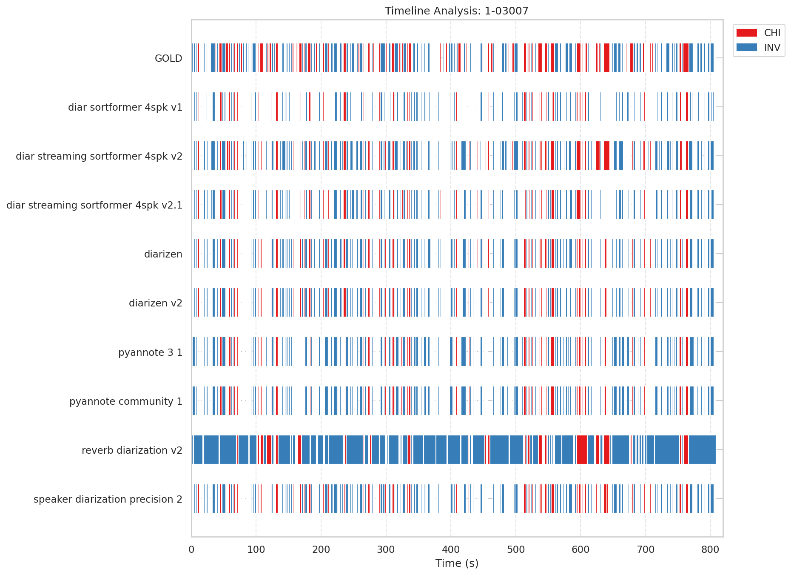

#### 60-Second Snippets (Zoom-in)
Below are 60-second zoomed-in windows showing where the models performed best and worst (based on average DER).

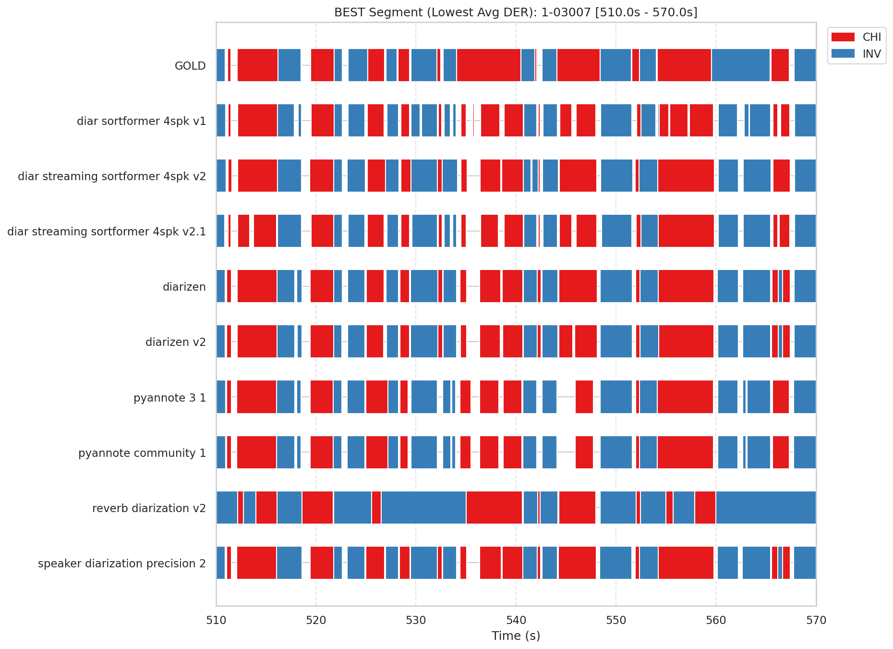

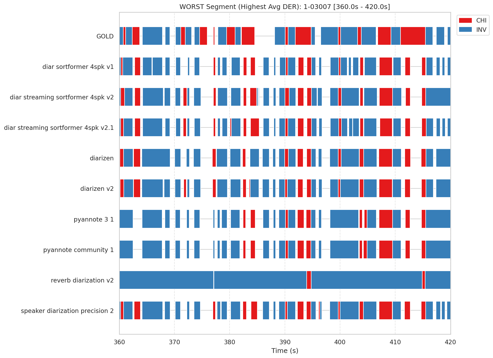

#### Metrics (Collar: 0.00s)

| Model                               | DER       | JER       | Miss     | FA       | Conf     | B-P       | B-R       | B-F1      | Pur       | Cov       | VRAM (GB)   |
|-------------------------------------|-----------|-----------|----------|----------|----------|-----------|-----------|-----------|-----------|-----------|-------------|
| diarizen                            | **21.74** | **24.24** | 12.89    | 5.47     | 3.38     | **73.24** | 81.57     | **77.18** | 93.26     | 93.26     | 11.0        |
| diarizen v2                         | 21.95     | 24.45     | 13.34    | 5.29     | 3.31     | 70.95     | 80.76     | 75.54     | 93.42     | 93.42     | 11.0        |
| speaker diarization precision 2     | 22.26     | 24.94     | 14.25    | 4.95     | 3.06     | 72.32     | 82.11     | 76.90     | 93.98     | 93.98     | **0.0**     |
| diar streaming sortformer 4spk v2   | 23.26     | 25.51     | 11.87    | 7.51     | 3.88     | 67.31     | 66.40     | 66.85     | 91.71     | 91.71     | 0.9         |
| diar streaming sortformer 4spk v2.1 | 24.62     | 27.41     | 17.52    | 3.78     | 3.32     | 65.71     | 81.03     | 72.57     | 93.71     | 93.71     | 0.9         |
| diar sortformer 4spk v1             | 25.59     | 28.45     | 20.31    | **2.26** | **3.02** | 58.71     | **84.01** | 69.12     | **95.02** | **95.02** | 22.5        |
| pyannote community 1                | 28.14     | 32.76     | 20.41    | 3.33     | 4.40     | 64.97     | 65.85     | 65.41     | 92.86     | 92.86     | 1.6         |
| pyannote 3 1                        | 28.28     | 33.03     | 20.41    | 3.33     | 4.54     | 63.35     | 65.58     | 64.45     | 92.69     | 92.69     | 1.6         |
| reverb diarization v2               | 38.20     | 49.00     | **1.03** | 13.53    | 23.64    | 57.39     | 17.89     | 27.27     | 74.26     | 81.67     | 4.3         |

#### Metrics (Collar: 0.25s)

| Model                               | DER       | JER       | Miss     | FA       | Conf     | B-P       | B-R       | B-F1      | Pur       | Cov       | VRAM (GB)   |
|-------------------------------------|-----------|-----------|----------|----------|----------|-----------|-----------|-----------|-----------|-----------|-------------|
| diarizen                            | **16.64** | **18.64** | 12.72    | 2.44     | 1.48     | **73.24** | 81.57     | **77.18** | 96.44     | 96.66     | 11.0        |
| diar streaming sortformer 4spk v2   | 16.92     | 19.05     | 11.50    | 3.58     | 1.85     | 67.31     | 66.40     | 66.85     | 95.37     | 95.65     | 0.9         |
| diarizen v2                         | 16.96     | 18.91     | 13.26    | 2.33     | 1.37     | 70.95     | 80.76     | 75.54     | 96.65     | 97.01     | 11.0        |
| speaker diarization precision 2     | 17.29     | 19.47     | 14.07    | 2.02     | **1.19** | 72.32     | 82.11     | 76.90     | 96.97     | 97.45     | **0.0**     |
| diar streaming sortformer 4spk v2.1 | 19.86     | 22.04     | 16.62    | 1.79     | 1.45     | 65.71     | 81.03     | 72.57     | 96.75     | 97.17     | 0.9         |
| diar sortformer 4spk v1             | 21.54     | 23.57     | 19.25    | **1.03** | 1.26     | 58.71     | **84.01** | 69.12     | **97.59** | **97.91** | 22.5        |
| pyannote community 1                | 23.66     | 27.71     | 19.82    | 1.42     | 2.42     | 64.97     | 65.85     | 65.41     | 95.79     | 95.71     | 1.6         |
| pyannote 3 1                        | 23.79     | 27.99     | 19.82    | 1.42     | 2.55     | 63.35     | 65.58     | 64.45     | 95.63     | 95.55     | 1.6         |
| reverb diarization v2               | 32.15     | 44.71     | **0.95** | 9.69     | 21.50    | 57.39     | 17.89     | 27.27     | 76.49     | 83.17     | 4.3         |


---

### File: 1-0605

**Primary category:** Age 5 / F | **Quality:** N/A | **Device:** N/A

> *Keywords:* chronological_age=5;0; audio=1-0605-i.mp3; cha=1-0605-i.cha

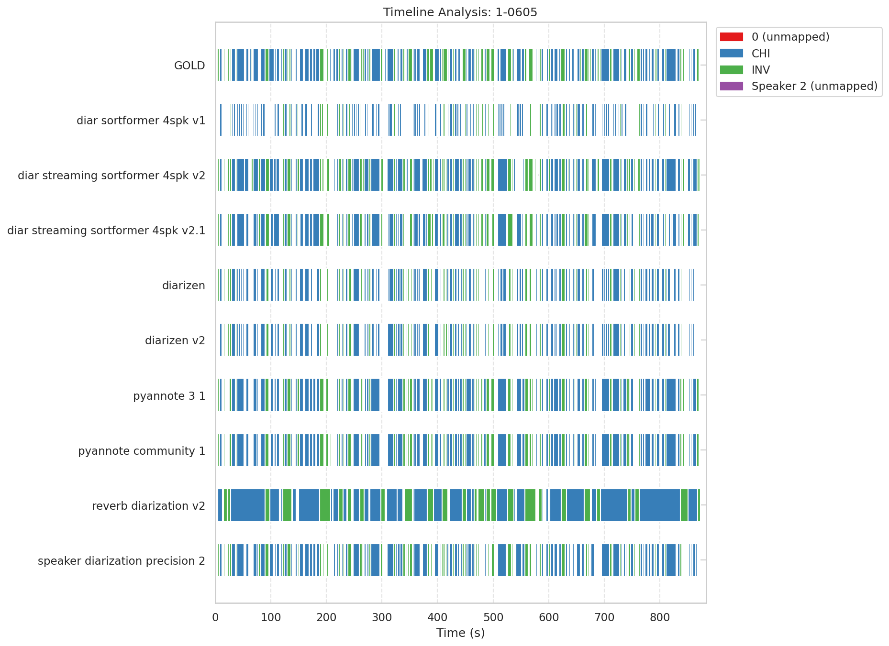

#### 60-Second Snippets (Zoom-in)
Below are 60-second zoomed-in windows showing where the models performed best and worst (based on average DER).

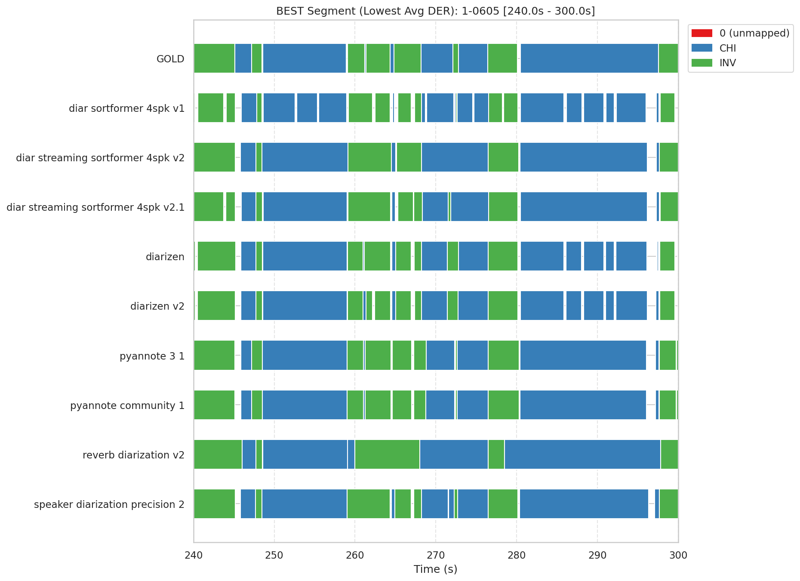

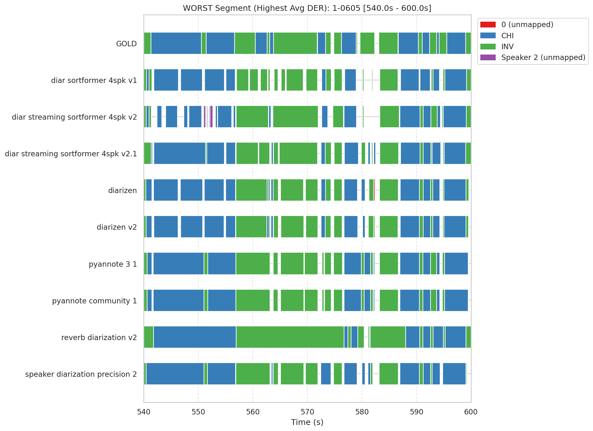

#### Metrics (Collar: 0.00s)

| Model                               | DER       | JER       | Miss     | FA       | Conf     | B-P       | B-R       | B-F1      | Pur       | Cov       | VRAM (GB)   |
|-------------------------------------|-----------|-----------|----------|----------|----------|-----------|-----------|-----------|-----------|-----------|-------------|
| speaker diarization precision 2     | **13.59** | **16.72** | 4.08     | 5.22     | 4.30     | **74.06** | 74.32     | **74.19** | 91.62     | 91.62     | **0.0**     |
| pyannote 3 1                        | 14.40     | 18.81     | 4.44     | 4.11     | 5.86     | 66.18     | 62.33     | 64.20     | 90.96     | 90.96     | 1.6         |
| diar streaming sortformer 4spk v2   | 14.41     | 18.81     | 4.11     | 4.31     | 5.99     | 63.93     | 53.42     | 58.21     | 91.31     | 91.16     | 1.0         |
| diar streaming sortformer 4spk v2.1 | 14.50     | 18.59     | 6.15     | 3.19     | 5.16     | 67.96     | 66.10     | 67.01     | 92.38     | 92.38     | 1.0         |
| pyannote community 1                | 14.50     | 18.98     | 4.44     | 4.11     | 5.96     | 68.68     | 62.33     | 65.35     | 90.85     | 90.85     | 1.6         |
| diarizen                            | 15.70     | 18.08     | 6.02     | 5.81     | 3.88     | 63.22     | 75.34     | 68.75     | 91.08     | 91.05     | 11.0        |
| diarizen v2                         | 15.71     | 18.05     | 6.09     | 5.84     | **3.77** | 63.28     | 76.71     | 69.35     | 91.13     | 91.13     | 11.0        |
| diar sortformer 4spk v1             | 18.08     | 21.72     | 11.95    | **1.88** | 4.25     | 54.98     | **79.45** | 64.99     | **93.56** | **93.56** | 26.0        |
| reverb diarization v2               | 24.49     | 36.90     | **0.15** | 5.28     | 19.06    | 35.16     | 10.96     | 16.71     | 79.92     | 79.92     | 4.3         |

#### Metrics (Collar: 0.25s)

| Model                               | DER      | JER       | Miss     | FA       | Conf     | B-P       | B-R       | B-F1      | Pur       | Cov       | VRAM (GB)   |
|-------------------------------------|----------|-----------|----------|----------|----------|-----------|-----------|-----------|-----------|-----------|-------------|
| speaker diarization precision 2     | **9.24** | **11.33** | 3.86     | 2.92     | 2.46     | **74.06** | 74.32     | **74.19** | 94.67     | 95.40     | **0.0**     |
| diar streaming sortformer 4spk v2   | 9.79     | 12.85     | 3.98     | 2.11     | 3.71     | 63.93     | 53.42     | 58.21     | 94.54     | 94.40     | 1.0         |
| diar streaming sortformer 4spk v2.1 | 10.18    | 12.87     | 5.63     | 1.55     | 2.99     | 67.96     | 66.10     | 67.01     | 95.47     | 95.33     | 1.0         |
| pyannote 3 1                        | 10.23    | 13.51     | 4.16     | 2.28     | 3.79     | 66.18     | 62.33     | 64.20     | 93.95     | 94.06     | 1.6         |
| pyannote community 1                | 10.36    | 13.74     | 4.16     | 2.28     | 3.92     | 68.68     | 62.33     | 65.35     | 93.82     | 93.89     | 1.6         |
| diarizen                            | 11.59    | 13.01     | 5.93     | 3.59     | 2.07     | 63.22     | 75.34     | 68.75     | 94.29     | 95.02     | 11.0        |
| diarizen v2                         | 11.63    | 13.03     | 6.01     | 3.61     | **2.01** | 63.28     | 76.71     | 69.35     | 94.30     | 95.16     | 11.0        |
| diar sortformer 4spk v1             | 14.50    | 16.90     | 11.17    | **0.95** | 2.38     | 54.98     | **79.45** | 64.99     | **96.30** | **96.65** | 26.0        |
| reverb diarization v2               | 20.26    | 32.83     | **0.16** | 3.35     | 16.76    | 35.16     | 10.96     | 16.71     | 82.32     | 81.03     | 4.3         |


---

### File: 1-10106

**Primary category:** Age 3 / M | **Quality:** N/A | **Device:** N/A

> *Keywords:* chronological_age=3;01; audio=1-10106-i.mp3; cha=1-10106-i.cha

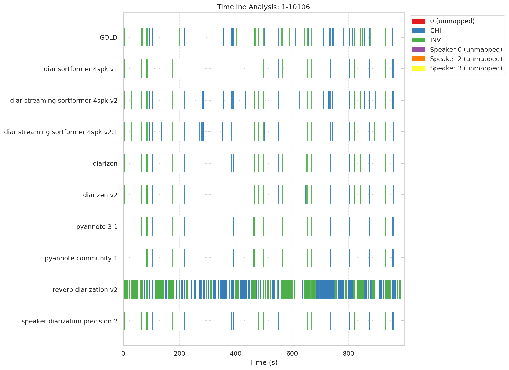

#### 60-Second Snippets (Zoom-in)
Below are 60-second zoomed-in windows showing where the models performed best and worst (based on average DER).

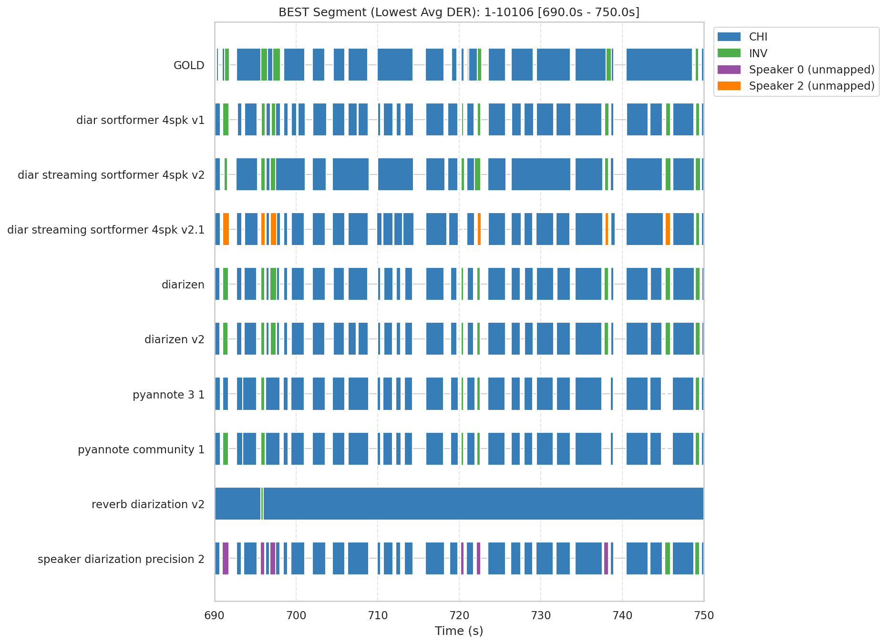

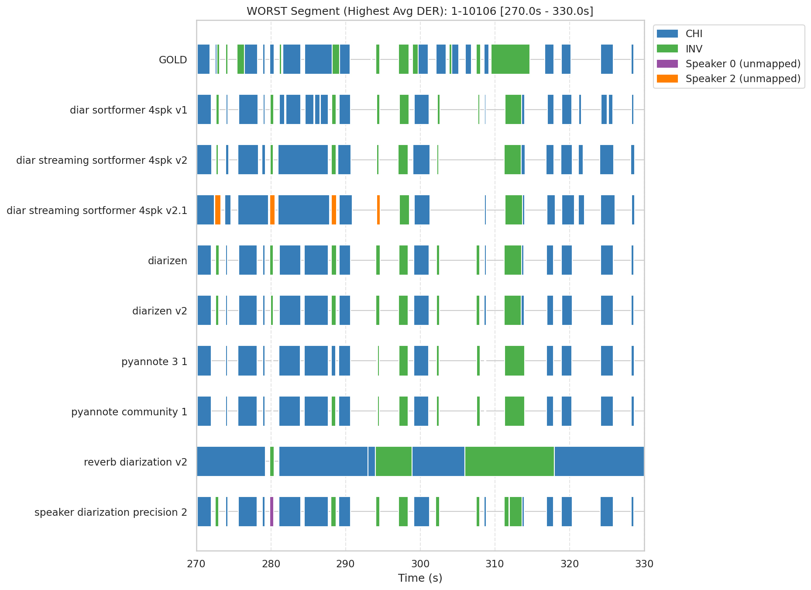

#### Metrics (Collar: 0.00s)

| Model                               | DER       | JER       | Miss     | FA       | Conf     | B-P       | B-R       | B-F1      | Pur       | Cov       | VRAM (GB)   |
|-------------------------------------|-----------|-----------|----------|----------|----------|-----------|-----------|-----------|-----------|-----------|-------------|
| diarizen                            | **28.29** | **32.29** | 14.87    | 5.45     | 7.97     | 58.17     | 58.80     | **58.48** | 88.59     | 88.58     | 11.0        |
| speaker diarization precision 2     | 28.52     | 32.66     | 14.33    | 5.18     | 9.01     | 57.89     | 59.01     | 58.45     | 88.78     | 88.09     | **0.0**     |
| diarizen v2                         | 28.55     | 32.39     | 15.05    | 5.64     | 7.86     | 58.09     | 58.58     | 58.33     | 88.71     | 88.71     | 11.0        |
| diar sortformer 4spk v1             | 29.30     | 33.37     | 19.76    | **2.59** | **6.95** | 55.25     | **60.94** | 57.96     | **90.64** | **90.64** | 33.0        |
| diar streaming sortformer 4spk v2   | 30.20     | 33.29     | 15.34    | 7.15     | 7.70     | **59.85** | 52.79     | 56.10     | 89.63     | 89.52     | 1.0         |
| pyannote community 1                | 30.53     | 35.90     | 18.33    | 3.17     | 9.03     | 55.71     | 59.66     | 57.62     | 87.74     | 87.74     | 1.6         |
| pyannote 3 1                        | 30.62     | 36.07     | 18.34    | 3.17     | 9.12     | 55.80     | 59.87     | 57.76     | 87.63     | 87.63     | 1.6         |
| diar streaming sortformer 4spk v2.1 | 33.85     | 35.28     | 16.21    | 7.69     | 9.95     | 51.52     | 51.07     | 51.29     | 90.51     | 86.93     | 1.0         |
| reverb diarization v2               | 64.53     | 55.77     | **1.65** | 36.72    | 26.16    | 38.78     | 12.23     | 18.60     | 72.16     | 72.16     | 4.3         |

#### Metrics (Collar: 0.25s)

| Model                               | DER       | JER       | Miss     | FA       | Conf     | B-P       | B-R       | B-F1      | Pur       | Cov       | VRAM (GB)   |
|-------------------------------------|-----------|-----------|----------|----------|----------|-----------|-----------|-----------|-----------|-----------|-------------|
| speaker diarization precision 2     | **21.78** | 26.14     | 12.96    | 2.04     | 6.78     | 57.89     | 59.01     | 58.45     | 91.35     | 91.81     | **0.0**     |
| diarizen                            | 22.01     | **26.01** | 13.07    | 2.97     | 5.98     | 58.17     | 58.80     | **58.48** | 90.99     | 92.11     | 11.0        |
| diarizen v2                         | 22.13     | 26.02     | 13.17    | 3.06     | 5.90     | 58.09     | 58.58     | 58.33     | 91.11     | 92.29     | 11.0        |
| diar streaming sortformer 4spk v2   | 22.21     | 26.12     | 13.20    | 3.09     | 5.92     | **59.85** | 52.79     | 56.10     | 91.83     | 92.52     | 1.0         |
| diar sortformer 4spk v1             | 23.22     | 26.96     | 16.83    | **1.15** | **5.24** | 55.25     | **60.94** | 57.96     | **92.97** | **93.76** | 33.0        |
| pyannote community 1                | 24.87     | 30.17     | 16.06    | 1.50     | 7.31     | 55.71     | 59.66     | 57.62     | 90.00     | 90.76     | 1.6         |
| pyannote 3 1                        | 24.94     | 30.29     | 16.06    | 1.50     | 7.39     | 55.80     | 59.87     | 57.76     | 89.91     | 90.68     | 1.6         |
| diar streaming sortformer 4spk v2.1 | 26.11     | 28.37     | 14.14    | 4.34     | 7.64     | 51.52     | 51.07     | 51.29     | 92.91     | 90.79     | 1.0         |
| reverb diarization v2               | 56.68     | 52.07     | **1.47** | 31.22    | 23.99    | 38.78     | 12.23     | 18.60     | 74.44     | 73.27     | 4.3         |


---

### File: 1-13112

**Primary category:** Age 3 / F | **Quality:** N/A | **Device:** N/A

> *Keywords:* chronological_age=3;04; audio=1-13112-i.mp3; cha=1-13112-i.cha

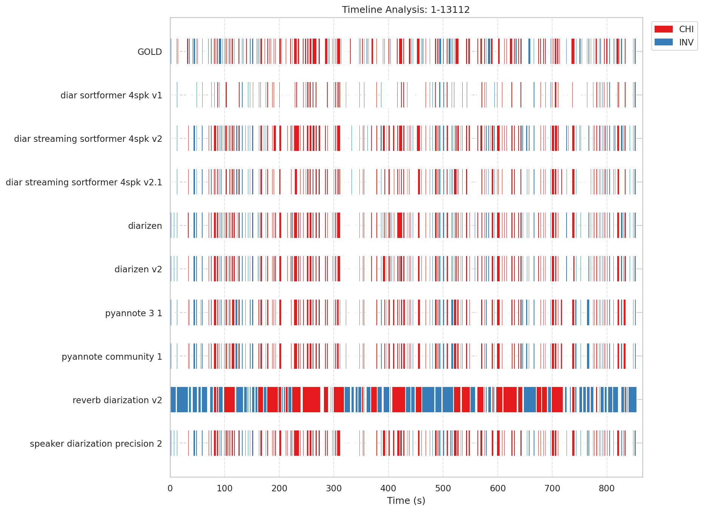

#### 60-Second Snippets (Zoom-in)
Below are 60-second zoomed-in windows showing where the models performed best and worst (based on average DER).

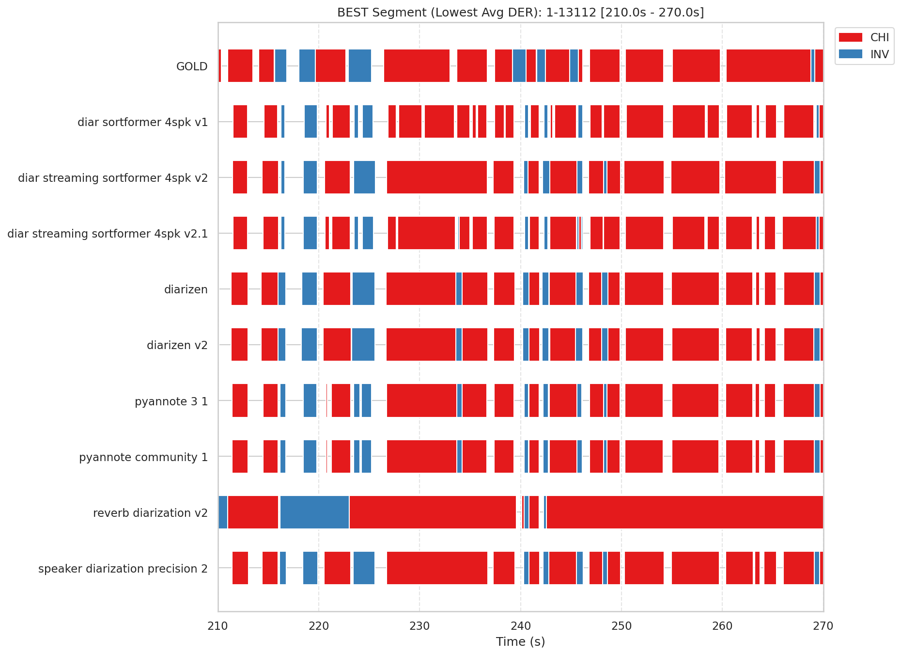

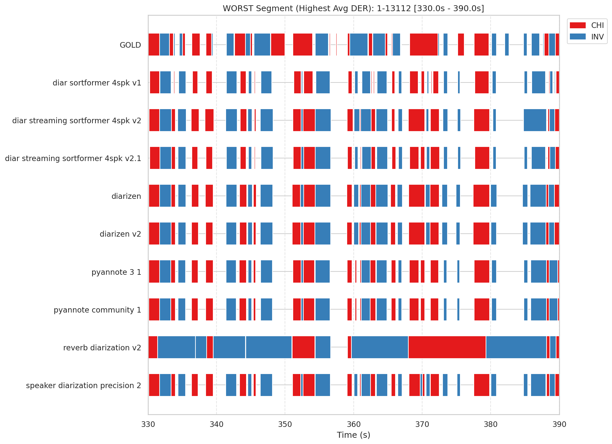

#### Metrics (Collar: 0.00s)

| Model                               | DER       | JER       | Miss     | FA       | Conf     | B-P       | B-R       | B-F1      | Pur       | Cov       | VRAM (GB)   |
|-------------------------------------|-----------|-----------|----------|----------|----------|-----------|-----------|-----------|-----------|-----------|-------------|
| speaker diarization precision 2     | **29.22** | **33.13** | 14.13    | 6.77     | 8.32     | 54.13     | 47.76     | 50.75     | 88.48     | 88.48     | **0.0**     |
| diarizen                            | 30.24     | 33.81     | 12.94    | 8.50     | 8.80     | 49.45     | 42.59     | 45.76     | 86.80     | 86.80     | 11.0        |
| diarizen v2                         | 30.34     | 33.93     | 13.31    | 8.26     | 8.78     | 49.59     | 43.06     | 46.10     | 86.80     | 86.80     | 11.0        |
| diar streaming sortformer 4spk v2   | 31.44     | 35.39     | 13.96    | 8.16     | 9.32     | 52.89     | 43.06     | 47.47     | 87.11     | 87.11     | 1.0         |
| pyannote community 1                | 31.91     | 35.41     | 17.52    | 6.42     | 7.97     | 53.64     | 46.82     | 50.00     | 88.18     | 88.18     | 1.6         |
| pyannote 3 1                        | 31.92     | 35.45     | 17.52    | 6.42     | 7.98     | **55.07** | 47.29     | 50.89     | 88.17     | 88.17     | 1.6         |
| diar streaming sortformer 4spk v2.1 | 32.57     | 36.67     | 19.27    | 5.01     | 8.29     | 48.66     | 46.82     | 47.72     | 88.22     | 88.22     | 1.0         |
| diar sortformer 4spk v1             | 35.01     | 38.88     | 25.61    | **2.35** | **7.05** | 49.06     | **55.53** | **52.10** | **90.22** | **90.22** | 25.0        |
| reverb diarization v2               | 56.45     | 51.34     | **1.81** | 31.72    | 22.93    | 45.86     | 14.35     | 21.86     | 74.48     | 74.48     | 4.3         |

#### Metrics (Collar: 0.25s)

| Model                               | DER       | JER       | Miss     | FA       | Conf     | B-P       | B-R       | B-F1      | Pur       | Cov       | VRAM (GB)   |
|-------------------------------------|-----------|-----------|----------|----------|----------|-----------|-----------|-----------|-----------|-----------|-------------|
| speaker diarization precision 2     | **21.81** | **25.38** | 13.97    | 2.94     | 4.90     | 54.13     | 47.76     | 50.75     | 92.73     | 93.06     | **0.0**     |
| diarizen                            | 22.30     | 25.85     | 12.73    | 4.21     | 5.37     | 49.45     | 42.59     | 45.76     | 91.04     | 91.39     | 11.0        |
| diarizen v2                         | 22.58     | 26.09     | 13.02    | 4.20     | 5.37     | 49.59     | 43.06     | 46.10     | 91.01     | 91.47     | 11.0        |
| diar streaming sortformer 4spk v2   | 23.34     | 27.51     | 13.49    | 3.92     | 5.93     | 52.89     | 43.06     | 47.47     | 91.19     | 91.36     | 1.0         |
| pyannote community 1                | 25.16     | 28.36     | 16.85    | 3.44     | 4.87     | 53.64     | 46.82     | 50.00     | 92.23     | 92.56     | 1.6         |
| pyannote 3 1                        | 25.16     | 28.37     | 16.85    | 3.44     | 4.87     | **55.07** | 47.29     | 50.89     | 92.23     | 92.55     | 1.6         |
| diar streaming sortformer 4spk v2.1 | 25.97     | 29.51     | 18.59    | 2.44     | 4.94     | 48.66     | 46.82     | 47.72     | 92.51     | 92.71     | 1.0         |
| diar sortformer 4spk v1             | 29.00     | 31.88     | 24.33    | **0.76** | **3.91** | 49.06     | **55.53** | **52.10** | **94.53** | **94.16** | 25.0        |
| reverb diarization v2               | 49.50     | 47.45     | **1.89** | 27.27    | 20.35    | 45.86     | 14.35     | 21.86     | 77.13     | 76.28     | 4.3         |


---

### File: 3-00112

**Primary category:** Age 5 / F | **Quality:** N/A | **Device:** N/A

> *Keywords:* chronological_age=5;06; audio=3-00112-i.mp3; cha=3-00112-i.cha

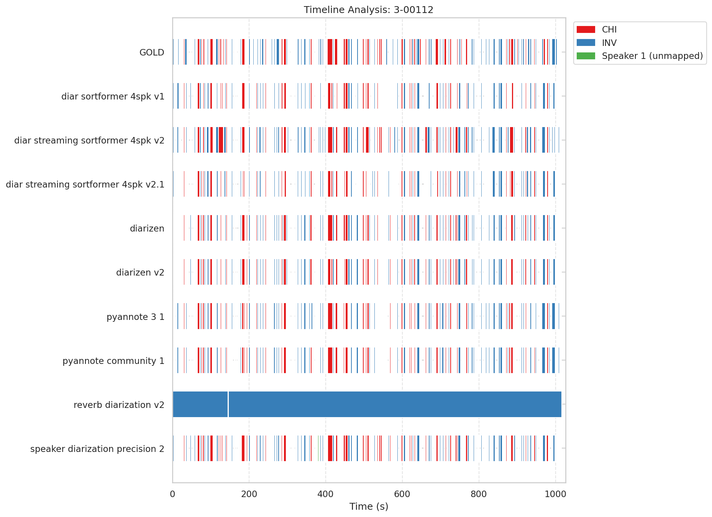

#### 60-Second Snippets (Zoom-in)
Below are 60-second zoomed-in windows showing where the models performed best and worst (based on average DER).

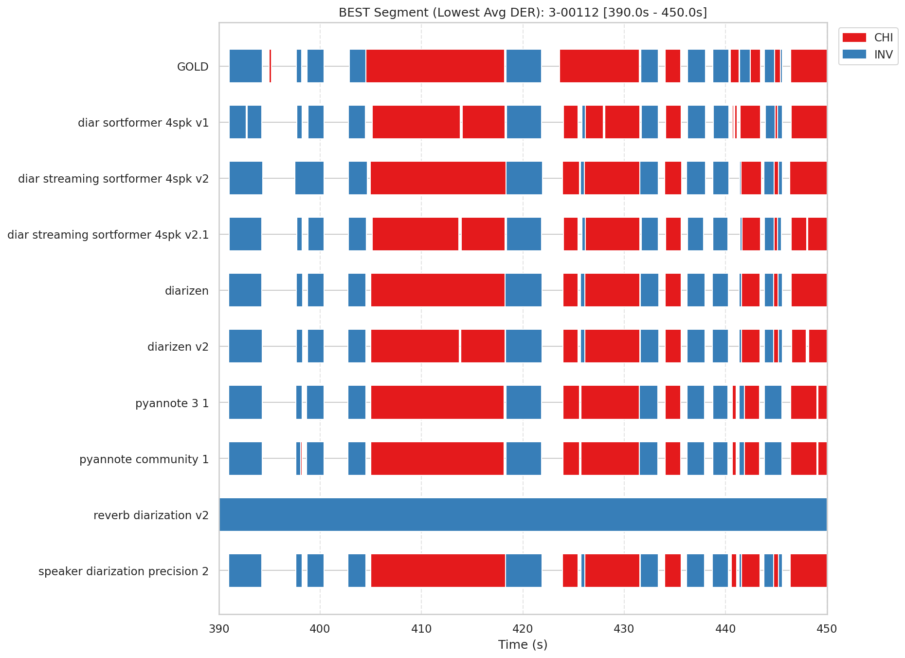

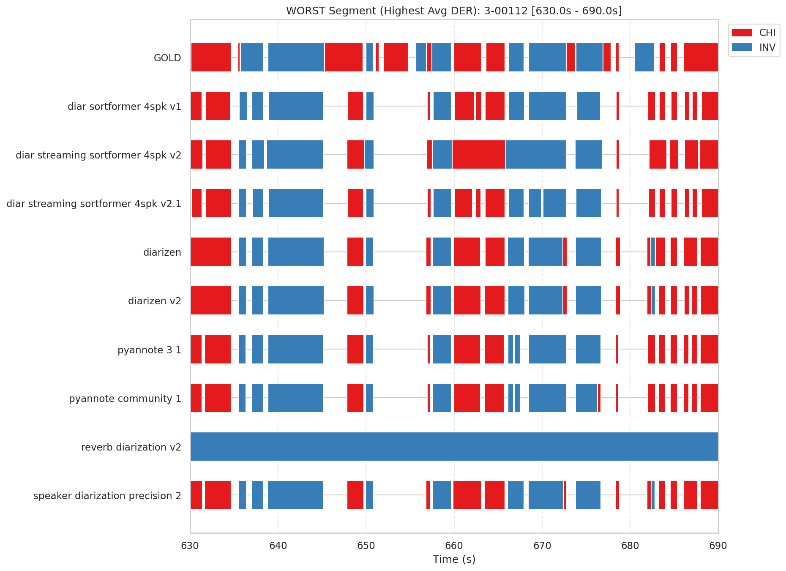

#### Metrics (Collar: 0.00s)

| Model                               | DER       | JER       | Miss     | FA       | Conf     | B-P        | B-R       | B-F1      | Pur       | Cov        | VRAM (GB)   |
|-------------------------------------|-----------|-----------|----------|----------|----------|------------|-----------|-----------|-----------|------------|-------------|
| speaker diarization precision 2     | **17.69** | **18.98** | 8.54     | 6.13     | 3.02     | 78.57      | 80.42     | **79.48** | 94.85     | 94.50      | **0.0**     |
| pyannote community 1                | 18.34     | 20.78     | 9.70     | 4.79     | 3.85     | 70.09      | 78.33     | 73.98     | 93.78     | 93.78      | 1.6         |
| diar sortformer 4spk v1             | 18.35     | 20.11     | 11.92    | **3.75** | 2.69     | 70.55      | **80.68** | 75.27     | 95.61     | 95.61      | 34.9        |
| pyannote 3 1                        | 18.54     | 21.15     | 9.70     | 4.79     | 4.05     | 71.56      | 78.85     | 75.03     | 93.56     | 93.56      | 1.6         |
| diarizen v2                         | 18.60     | 19.58     | 9.33     | 6.81     | 2.46     | 77.69      | 79.11     | 78.40     | 94.83     | 94.83      | 11.0        |
| diarizen                            | 18.66     | 19.45     | 9.09     | 7.21     | 2.36     | 79.42      | 78.59     | 79.00     | 94.77     | 94.77      | 11.0        |
| diar streaming sortformer 4spk v2.1 | 19.93     | 21.02     | 13.37    | 4.37     | **2.19** | 70.02      | 76.24     | 73.00     | **95.69** | 95.69      | 1.1         |
| diar streaming sortformer 4spk v2   | 20.54     | 20.73     | 8.57     | 9.68     | 2.29     | 78.53      | 69.71     | 73.86     | 94.24     | 94.24      | 1.1         |
| reverb diarization v2               | 80.07     | 79.36     | **0.06** | 36.30    | 43.70    | **100.00** | 0.26      | 0.52      | 56.24     | **100.00** | 4.3         |

#### Metrics (Collar: 0.25s)

| Model                               | DER       | JER       | Miss     | FA       | Conf     | B-P        | B-R       | B-F1      | Pur       | Cov        | VRAM (GB)   |
|-------------------------------------|-----------|-----------|----------|----------|----------|------------|-----------|-----------|-----------|------------|-------------|
| speaker diarization precision 2     | **12.11** | **13.49** | 7.27     | 2.72     | 2.12     | 78.57      | 80.42     | **79.48** | 96.21     | 96.74      | **0.0**     |
| diarizen                            | 12.73     | 13.83     | 7.84     | 3.36     | 1.53     | 79.42      | 78.59     | 79.00     | 96.10     | 96.98      | 11.0        |
| diarizen v2                         | 12.86     | 14.09     | 8.08     | 3.16     | 1.62     | 77.69      | 79.11     | 78.40     | 96.14     | 97.05      | 11.0        |
| pyannote community 1                | 13.01     | 15.41     | 7.94     | 2.19     | 2.87     | 70.09      | 78.33     | 73.98     | 95.31     | 95.95      | 1.6         |
| diar sortformer 4spk v1             | 13.15     | 14.81     | 9.52     | **1.70** | 1.93     | 70.55      | **80.68** | 75.27     | 96.82     | 97.46      | 34.9        |
| pyannote 3 1                        | 13.26     | 15.89     | 7.94     | 2.19     | 3.13     | 71.56      | 78.85     | 75.03     | 95.04     | 95.49      | 1.6         |
| diar streaming sortformer 4spk v2   | 13.39     | 14.39     | 6.97     | 4.83     | 1.59     | 78.53      | 69.71     | 73.86     | 95.67     | 96.54      | 1.1         |
| diar streaming sortformer 4spk v2.1 | 14.59     | 15.58     | 10.69    | 2.47     | **1.42** | 70.02      | 76.24     | 73.00     | **96.92** | 97.67      | 1.1         |
| reverb diarization v2               | 74.53     | 78.51     | **0.00** | 30.71    | 43.82    | **100.00** | 0.26      | 0.52      | 56.18     | **100.00** | 4.3         |


---

### File: 3-00503

**Primary category:** Age 5 / M | **Quality:** N/A | **Device:** N/A

> *Keywords:* chronological_age=5;03; audio=3-00503-i.mp3; cha=3-00503-i.cha

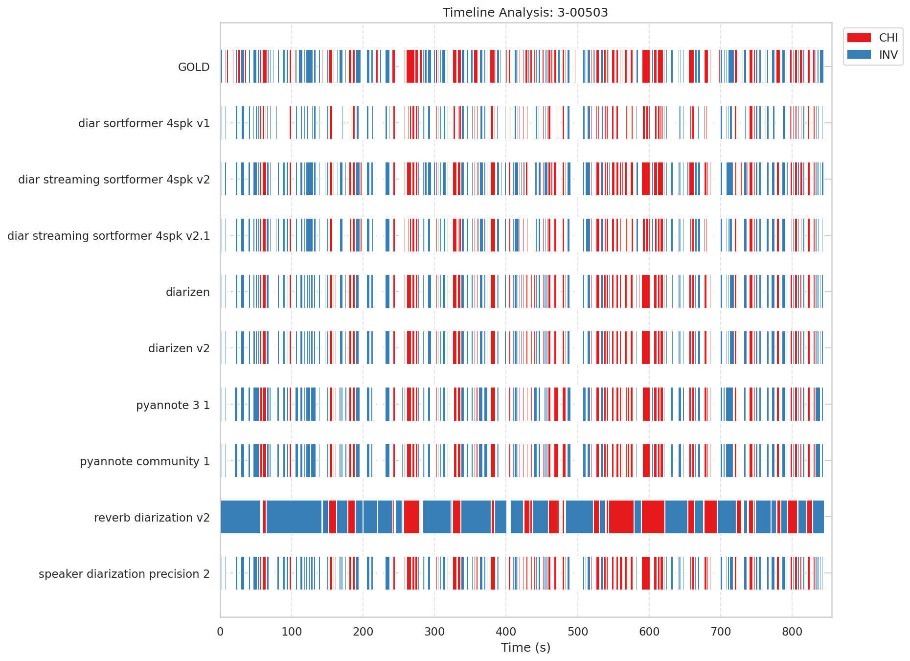

#### 60-Second Snippets (Zoom-in)
Below are 60-second zoomed-in windows showing where the models performed best and worst (based on average DER).

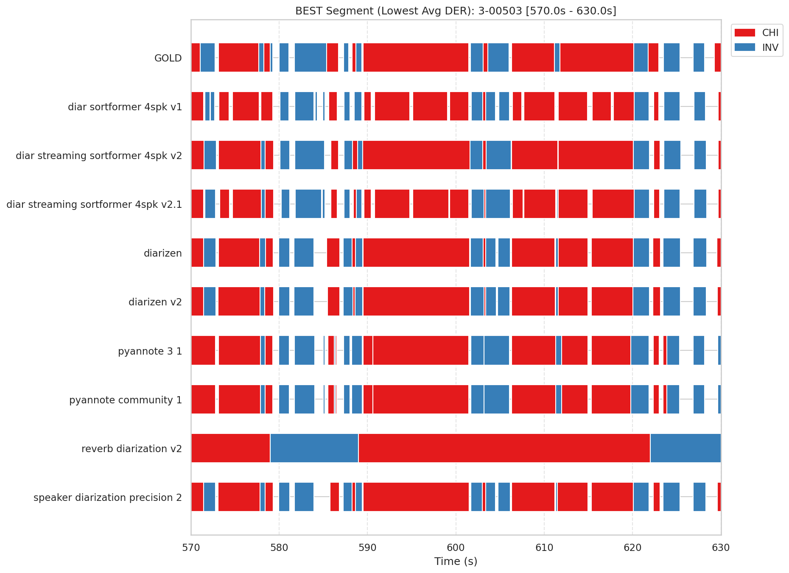

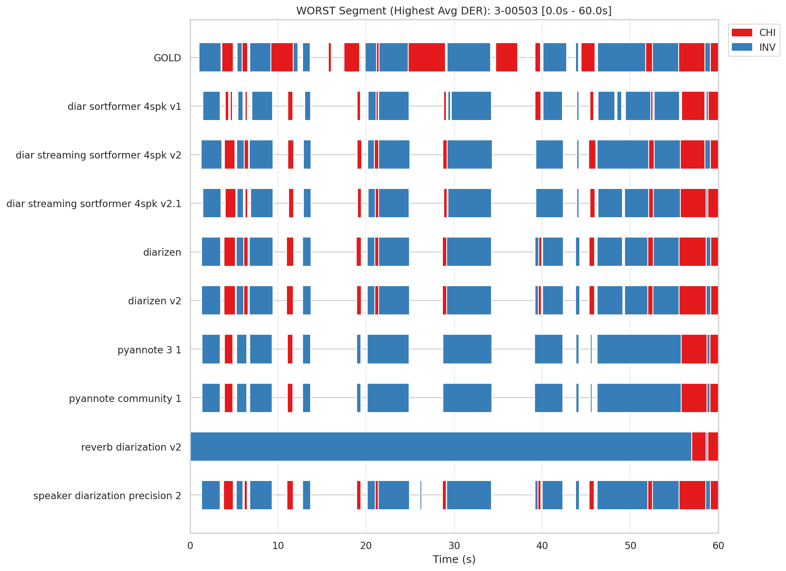

#### Metrics (Collar: 0.00s)

| Model                               | DER       | JER       | Miss     | FA       | Conf     | B-P       | B-R       | B-F1      | Pur       | Cov       | VRAM (GB)   |
|-------------------------------------|-----------|-----------|----------|----------|----------|-----------|-----------|-----------|-----------|-----------|-------------|
| speaker diarization precision 2     | **19.45** | **21.31** | 10.76    | 5.29     | **3.40** | 77.45     | 75.60     | 76.51     | 92.58     | 92.58     | **0.0**     |
| diarizen v2                         | 19.87     | 21.78     | 10.15    | 5.99     | 3.73     | 77.81     | 75.33     | 76.55     | 92.00     | 92.00     | 11.0        |
| diarizen                            | 19.91     | 21.69     | 10.13    | 6.17     | 3.61     | **78.02** | 75.33     | **76.65** | 91.95     | 91.95     | 11.0        |
| diar streaming sortformer 4spk v2   | 21.35     | 23.18     | 8.90     | 8.10     | 4.36     | 75.24     | 62.07     | 68.02     | 90.36     | 90.36     | 1.0         |
| pyannote community 1                | 22.36     | 26.56     | 10.95    | 4.67     | 6.74     | 69.94     | 62.33     | 65.92     | 89.18     | 89.18     | 1.6         |
| diar streaming sortformer 4spk v2.1 | 22.47     | 24.40     | 13.29    | 5.37     | 3.81     | 71.35     | 70.03     | 70.68     | 91.71     | 91.71     | 1.0         |
| pyannote 3 1                        | 22.64     | 27.01     | 10.95    | 4.67     | 7.03     | 68.33     | 61.80     | 64.90     | 88.87     | 88.87     | 1.6         |
| diar sortformer 4spk v1             | 23.09     | 25.55     | 17.93    | **1.70** | 3.47     | 64.94     | **79.58** | 71.51     | **94.38** | **94.38** | 24.4        |
| reverb diarization v2               | 43.55     | 48.48     | **0.50** | 17.93    | 25.12    | 33.33     | 5.84      | 9.93      | 73.79     | 73.79     | 4.3         |

#### Metrics (Collar: 0.25s)

| Model                               | DER       | JER       | Miss     | FA       | Conf     | B-P       | B-R       | B-F1      | Pur       | Cov       | VRAM (GB)   |
|-------------------------------------|-----------|-----------|----------|----------|----------|-----------|-----------|-----------|-----------|-----------|-------------|
| speaker diarization precision 2     | **14.11** | **15.11** | 10.24    | 2.58     | **1.29** | 77.45     | 75.60     | 76.51     | 95.96     | 96.54     | **0.0**     |
| diarizen v2                         | 14.28     | 15.35     | 9.87     | 2.94     | 1.48     | 77.81     | 75.33     | 76.55     | 95.49     | 96.08     | 11.0        |
| diarizen                            | 14.32     | 15.31     | 9.86     | 3.06     | 1.41     | **78.02** | 75.33     | **76.65** | 95.43     | 95.95     | 11.0        |
| diar streaming sortformer 4spk v2   | 14.55     | 15.94     | 8.41     | 4.11     | 2.03     | 75.24     | 62.07     | 68.02     | 94.17     | 94.52     | 1.0         |
| diar streaming sortformer 4spk v2.1 | 16.76     | 17.83     | 12.22    | 3.01     | 1.53     | 71.35     | 70.03     | 70.68     | 95.39     | 95.93     | 1.0         |
| pyannote community 1                | 17.01     | 20.27     | 10.22    | 2.55     | 4.24     | 69.94     | 62.33     | 65.92     | 92.76     | 92.57     | 1.6         |
| pyannote 3 1                        | 17.25     | 20.68     | 10.22    | 2.55     | 4.48     | 68.33     | 61.80     | 64.90     | 92.50     | 92.39     | 1.6         |
| diar sortformer 4spk v1             | 18.47     | 19.70     | 16.27    | **0.81** | 1.38     | 64.94     | **79.58** | 71.51     | **97.42** | **98.03** | 24.4        |
| reverb diarization v2               | 36.73     | 43.81     | **0.50** | 13.85    | 22.37    | 33.33     | 5.84      | 9.93      | 76.56     | 74.65     | 4.3         |


---

### File: 3-0114

**Primary category:** Age 5 / M | **Quality:** N/A | **Device:** N/A

> *Keywords:* chronological_age=5;10; audio=3-0114-i.mp3; cha=3-0114-i.cha

> **ERRATA (UEM):** start **1.5416185567010308**s

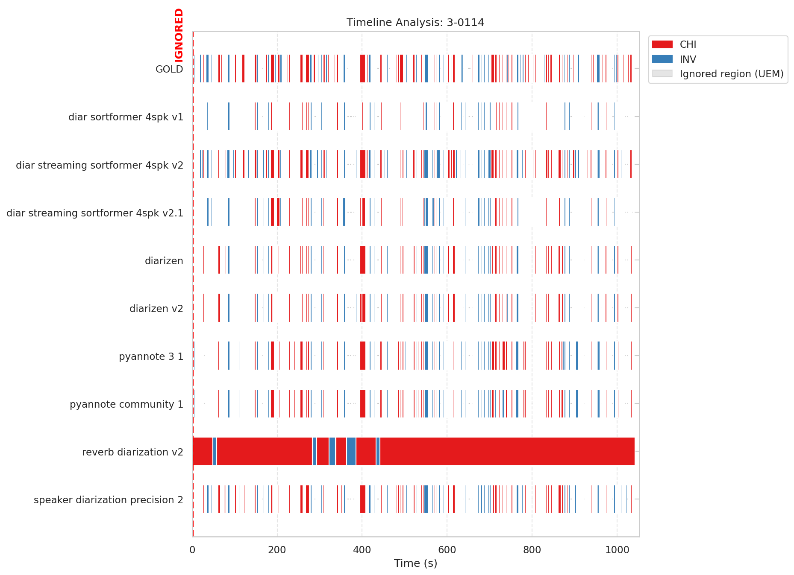

#### 60-Second Snippets (Zoom-in)
Below are 60-second zoomed-in windows showing where the models performed best and worst (based on average DER).

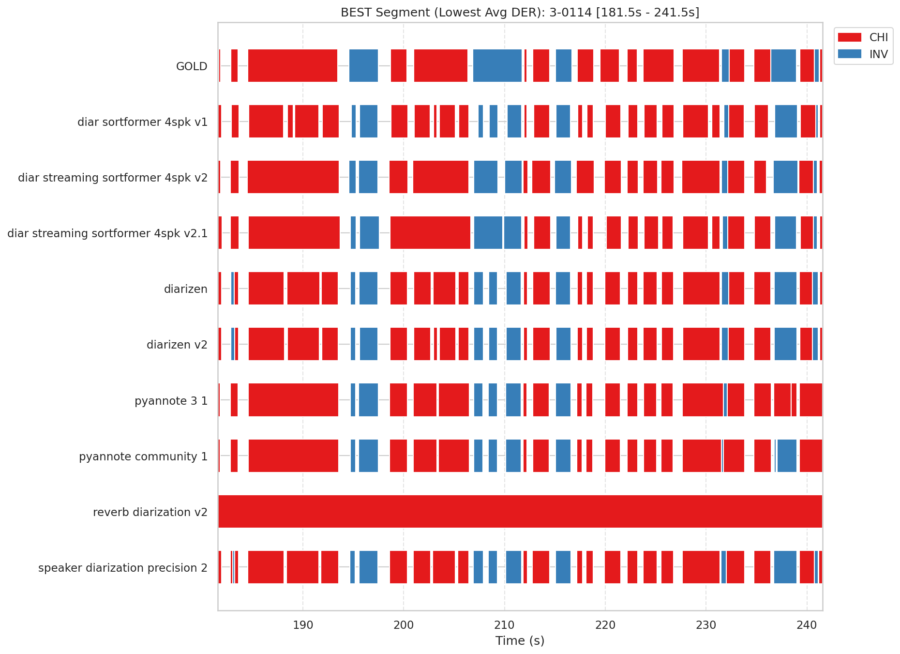

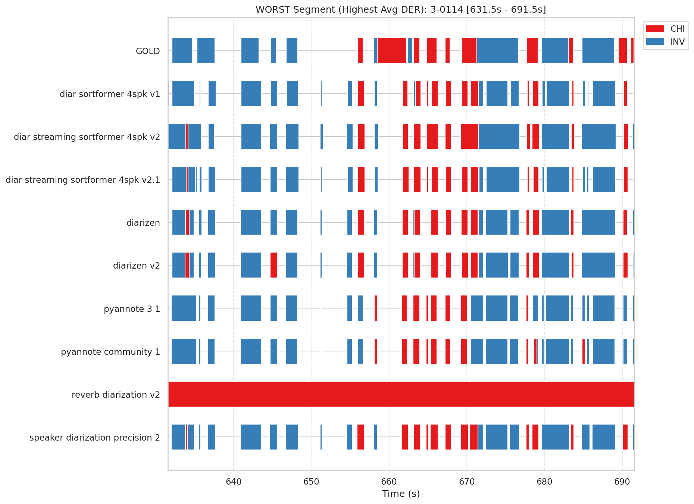

#### Metrics (Collar: 0.00s)

| Model                               | DER       | JER       | Miss     | FA       | Conf     | B-P       | B-R       | B-F1      | Pur       | Cov       | VRAM (GB)   |
|-------------------------------------|-----------|-----------|----------|----------|----------|-----------|-----------|-----------|-----------|-----------|-------------|
| speaker diarization precision 2     | **19.67** | **19.78** | 10.19    | 7.61     | 1.87     | 70.28     | 80.15     | **74.89** | 95.91     | 95.91     | **0.0**     |
| diarizen                            | 20.31     | 20.20     | 11.70    | 7.06     | 1.55     | 68.60     | 80.39     | 74.02     | 95.76     | 95.76     | 11.0        |
| diarizen v2                         | 20.85     | 20.82     | 12.16    | 6.97     | 1.72     | 67.62     | 79.90     | 73.25     | 95.66     | 95.66     | 11.0        |
| diar streaming sortformer 4spk v2   | 21.10     | 20.37     | 8.83     | 10.61    | 1.65     | **75.19** | 73.37     | 74.26     | 95.36     | 95.36     | 1.1         |
| diar streaming sortformer 4spk v2.1 | 23.12     | 22.86     | 14.87    | 6.63     | 1.61     | 59.67     | 77.72     | 67.51     | 96.09     | 96.09     | 1.1         |
| diar sortformer 4spk v1             | 24.26     | 24.25     | 17.86    | **4.87** | **1.53** | 56.33     | **81.84** | 66.73     | **96.36** | **96.36** | 36.7        |
| pyannote 3 1                        | 26.71     | 30.57     | 12.46    | 6.28     | 7.97     | 56.41     | 74.58     | 64.23     | 88.65     | 88.65     | 1.6         |
| pyannote community 1                | 26.81     | 30.67     | 12.46    | 6.28     | 8.07     | 55.83     | 75.30     | 64.12     | 88.54     | 88.54     | 1.6         |
| reverb diarization v2               | 82.11     | 79.39     | **0.00** | 34.04    | 48.07    | 16.67     | 0.48      | 0.94      | 54.22     | 96.18     | 4.3         |

#### Metrics (Collar: 0.25s)

| Model                               | DER       | JER       | Miss     | FA       | Conf     | B-P       | B-R       | B-F1      | Pur       | Cov       | VRAM (GB)   |
|-------------------------------------|-----------|-----------|----------|----------|----------|-----------|-----------|-----------|-----------|-----------|-------------|
| diar streaming sortformer 4spk v2   | **13.61** | **13.65** | 7.62     | 5.18     | 0.81     | **75.19** | 73.37     | 74.26     | 96.79     | 97.90     | 1.1         |
| speaker diarization precision 2     | 13.80     | 14.17     | 9.31     | 3.52     | 0.97     | 70.28     | 80.15     | **74.89** | 97.10     | 98.27     | **0.0**     |
| diarizen                            | 15.28     | 15.35     | 10.88    | 3.65     | 0.75     | 68.60     | 80.39     | 74.02     | 97.10     | 97.99     | 11.0        |
| diarizen v2                         | 15.81     | 15.92     | 11.24    | 3.70     | 0.86     | 67.62     | 79.90     | 73.25     | 97.03     | 97.98     | 11.0        |
| diar streaming sortformer 4spk v2.1 | 17.67     | 17.59     | 13.12    | 3.73     | 0.81     | 59.67     | 77.72     | 67.51     | 97.36     | 98.45     | 1.1         |
| diar sortformer 4spk v1             | 19.17     | 19.18     | 15.94    | **2.50** | **0.73** | 56.33     | **81.84** | 66.73     | **97.70** | **98.59** | 36.7        |
| pyannote 3 1                        | 21.13     | 25.57     | 11.13    | 3.20     | 6.80     | 56.41     | 74.58     | 64.23     | 90.25     | 91.56     | 1.6         |
| pyannote community 1                | 21.31     | 25.81     | 11.13    | 3.20     | 6.99     | 55.83     | 75.30     | 64.12     | 90.04     | 91.10     | 1.6         |
| reverb diarization v2               | 74.95     | 78.21     | **0.00** | 27.71    | 47.24    | 16.67     | 0.48      | 0.94      | 54.97     | 96.25     | 4.3         |


---

### File: 3-01606

**Primary category:** Age 5 / F | **Quality:** N/A | **Device:** N/A

> *Keywords:* chronological_age=5;09; audio=3-01606-i.mp3; cha=3-01606-i.cha

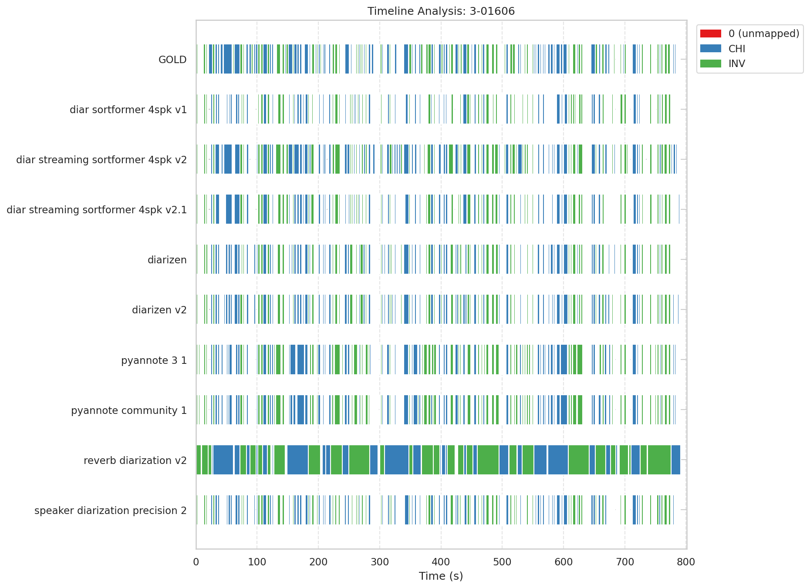

#### 60-Second Snippets (Zoom-in)
Below are 60-second zoomed-in windows showing where the models performed best and worst (based on average DER).

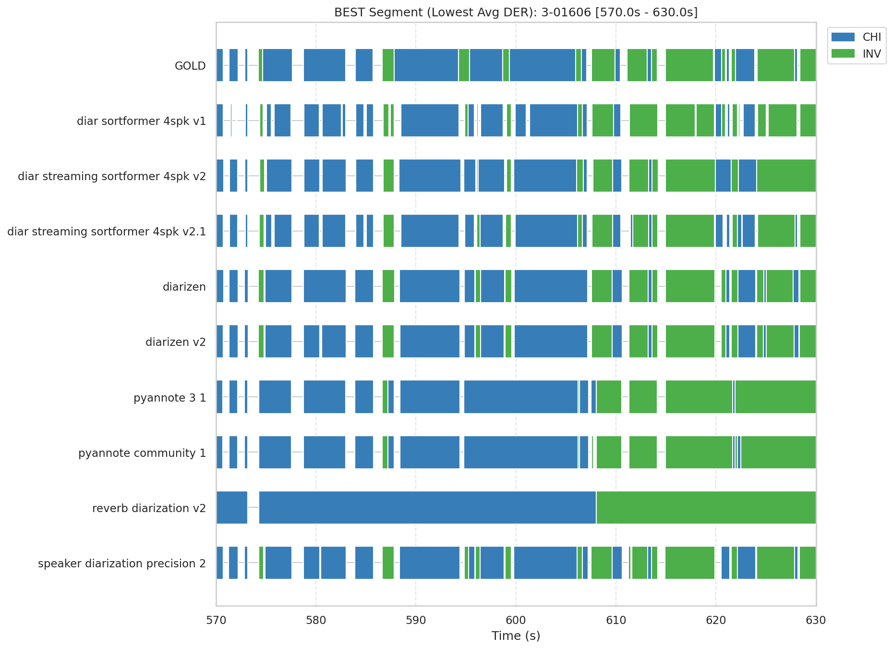

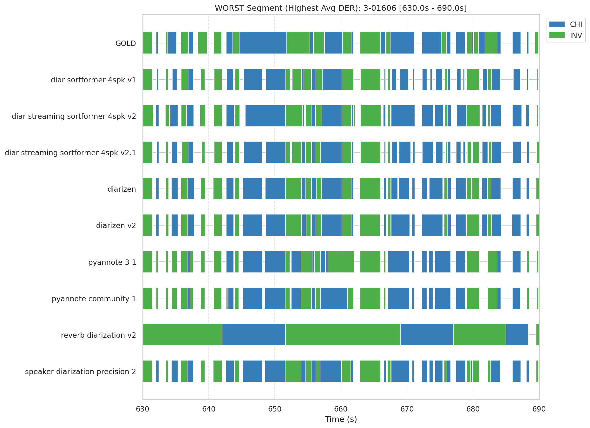

#### Metrics (Collar: 0.00s)

| Model                               | DER       | JER       | Miss     | FA       | Conf     | B-P       | B-R       | B-F1      | Pur       | Cov       | VRAM (GB)   |
|-------------------------------------|-----------|-----------|----------|----------|----------|-----------|-----------|-----------|-----------|-----------|-------------|
| diarizen                            | **18.99** | 20.25     | 8.80     | 6.73     | 3.46     | 78.29     | 83.59     | 80.86     | 91.89     | 91.85     | 11.0        |
| diarizen v2                         | 19.05     | 20.34     | 8.81     | 6.66     | 3.58     | **78.96** | 83.07     | **80.96** | 91.88     | 91.77     | 11.0        |
| speaker diarization precision 2     | 19.38     | **19.94** | 9.17     | 7.45     | **2.77** | 75.82     | **84.11** | 79.75     | 91.63     | 91.63     | **0.0**     |
| diar streaming sortformer 4spk v2   | 21.23     | 22.58     | 7.29     | 9.38     | 4.56     | 75.45     | 65.62     | 70.19     | 90.25     | 90.25     | 0.9         |
| diar streaming sortformer 4spk v2.1 | 22.19     | 23.29     | 12.87    | 5.92     | 3.41     | 72.54     | 80.47     | 76.30     | 91.57     | 91.57     | 0.9         |
| diar sortformer 4spk v1             | 23.06     | 24.56     | 16.81    | **2.99** | 3.26     | 67.45     | 82.03     | 74.03     | **93.39** | **93.39** | 21.5        |
| pyannote community 1                | 25.48     | 30.87     | 9.11     | 5.88     | 10.49    | 61.27     | 63.02     | 62.13     | 84.79     | 84.79     | 1.6         |
| pyannote 3 1                        | 26.50     | 32.33     | 9.11     | 5.88     | 11.50    | 61.54     | 62.50     | 62.02     | 83.72     | 83.72     | 1.6         |
| reverb diarization v2               | 43.36     | 48.57     | **0.10** | 17.04    | 26.23    | 34.72     | 6.51      | 10.96     | 72.66     | 72.66     | 4.3         |

#### Metrics (Collar: 0.25s)

| Model                               | DER       | JER       | Miss     | FA       | Conf     | B-P       | B-R       | B-F1      | Pur       | Cov       | VRAM (GB)   |
|-------------------------------------|-----------|-----------|----------|----------|----------|-----------|-----------|-----------|-----------|-----------|-------------|
| diarizen                            | **13.39** | 14.25     | 8.11     | 3.52     | 1.76     | 78.29     | 83.59     | 80.86     | 94.68     | 95.58     | 11.0        |
| diarizen v2                         | 13.46     | 14.33     | 8.05     | 3.54     | 1.88     | **78.96** | 83.07     | **80.96** | 94.63     | 95.45     | 11.0        |
| speaker diarization precision 2     | 13.66     | **13.96** | 8.27     | 4.16     | **1.23** | 75.82     | **84.11** | 79.75     | 94.43     | 95.62     | **0.0**     |
| diar streaming sortformer 4spk v2   | 13.79     | 14.96     | 6.45     | 4.96     | 2.39     | 75.45     | 65.62     | 70.19     | 93.66     | 94.20     | 0.9         |
| diar streaming sortformer 4spk v2.1 | 16.63     | 17.13     | 11.41    | 3.62     | 1.60     | 72.54     | 80.47     | 76.30     | 94.66     | 95.69     | 0.9         |
| diar sortformer 4spk v1             | 17.99     | 18.68     | 14.54    | **1.85** | 1.60     | 67.45     | 82.03     | 74.03     | **96.07** | **96.67** | 21.5        |
| pyannote community 1                | 19.68     | 24.85     | 8.05     | 3.51     | 8.12     | 61.27     | 63.02     | 62.13     | 87.89     | 87.74     | 1.6         |
| pyannote 3 1                        | 20.75     | 26.51     | 8.05     | 3.51     | 9.19     | 61.54     | 62.50     | 62.02     | 86.77     | 86.55     | 1.6         |
| reverb diarization v2               | 35.84     | 43.86     | **0.07** | 12.05    | 23.72    | 34.72     | 6.51      | 10.96     | 75.18     | 73.52     | 4.3         |


---

### File: 3-01707

**Primary category:** Age 5 / M | **Quality:** N/A | **Device:** N/A

> *Keywords:* chronological_age=5;08; audio=3-01707-i.mp3; cha=3-01707-i.cha

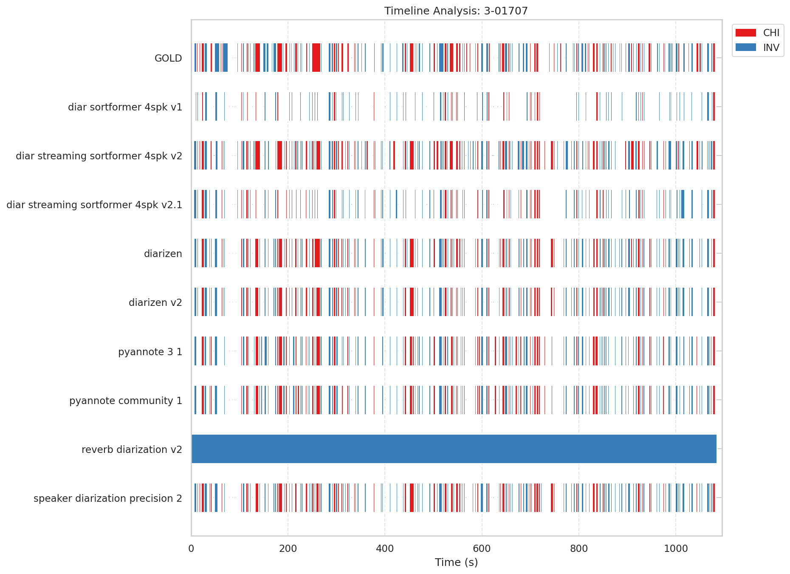

#### 60-Second Snippets (Zoom-in)
Below are 60-second zoomed-in windows showing where the models performed best and worst (based on average DER).

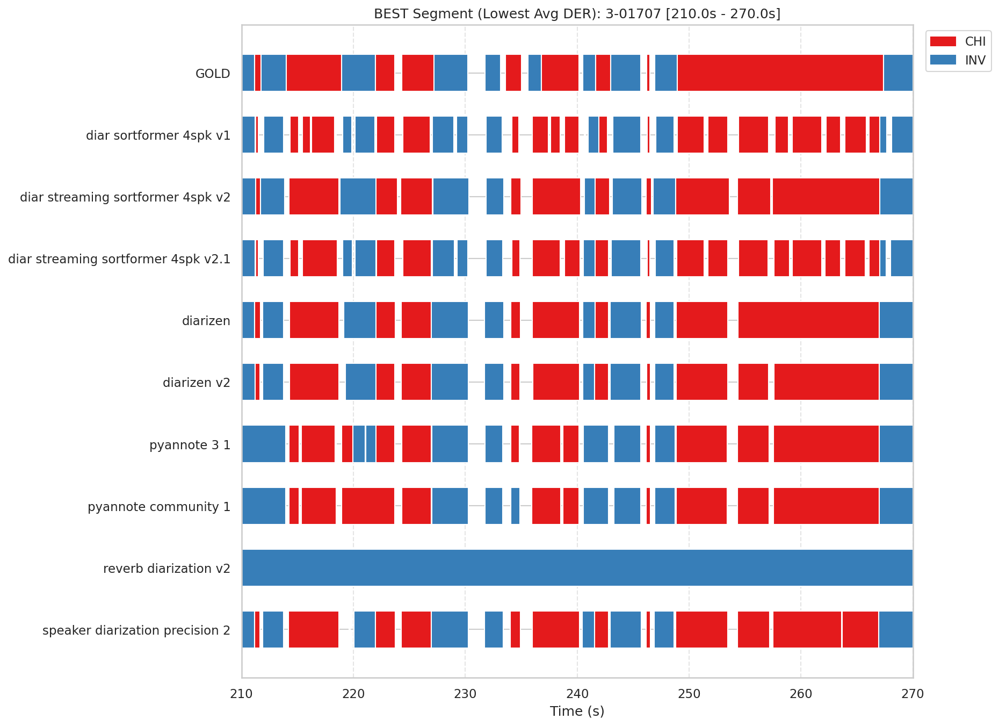

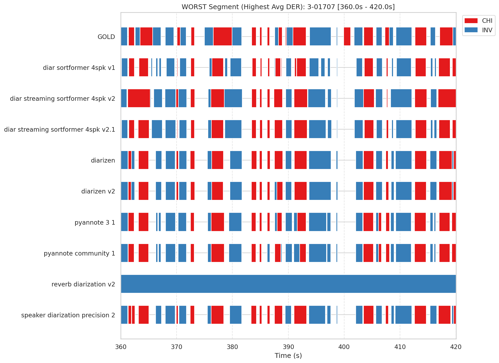

#### Metrics (Collar: 0.00s)

| Model                               | DER       | JER       | Miss     | FA       | Conf     | B-P        | B-R       | B-F1      | Pur       | Cov        | VRAM (GB)   |
|-------------------------------------|-----------|-----------|----------|----------|----------|------------|-----------|-----------|-----------|------------|-------------|
| diarizen                            | **17.77** | **19.72** | 8.63     | 5.54     | 3.60     | 73.07      | 75.23     | 74.13     | **93.98** | 93.98      | 11.0        |
| speaker diarization precision 2     | 17.95     | 19.99     | 8.22     | 5.90     | 3.83     | 70.43      | 73.64     | 72.00     | 93.65     | 93.65      | **0.0**     |
| diarizen v2                         | 17.98     | 19.95     | 9.05     | 5.35     | 3.59     | 72.67      | **76.14** | **74.36** | 93.97     | 93.97      | 11.0        |
| diar streaming sortformer 4spk v2   | 21.18     | 21.98     | 8.24     | 9.46     | 3.47     | 73.78      | 72.27     | 73.02     | 92.03     | 92.03      | 1.1         |
| diar streaming sortformer 4spk v2.1 | 22.07     | 23.87     | 14.16    | 4.47     | **3.43** | 60.96      | 75.23     | 67.34     | 93.81     | 93.81      | 1.1         |
| pyannote 3 1                        | 22.56     | 26.96     | 10.13    | 4.99     | 7.44     | 57.44      | 69.32     | 62.82     | 89.49     | 89.49      | 1.6         |
| pyannote community 1                | 23.14     | 27.80     | 10.13    | 4.99     | 8.02     | 57.66      | 68.41     | 62.58     | 88.86     | 88.86      | 1.6         |
| diar sortformer 4spk v1             | 25.83     | 28.18     | 19.24    | **2.51** | 4.08     | 48.56      | 72.73     | 58.23     | 93.24     | 93.24      | 39.7        |
| reverb diarization v2               | 67.76     | 77.92     | **0.01** | 21.33    | 46.43    | **100.00** | 0.00      | 0.00      | 53.56     | **100.00** | 4.3         |

#### Metrics (Collar: 0.25s)

| Model                               | DER       | JER       | Miss     | FA       | Conf     | B-P        | B-R       | B-F1      | Pur       | Cov        | VRAM (GB)   |
|-------------------------------------|-----------|-----------|----------|----------|----------|------------|-----------|-----------|-----------|------------|-------------|
| speaker diarization precision 2     | **12.17** | **13.93** | 7.07     | 2.75     | 2.35     | 70.43      | 73.64     | 72.00     | 95.62     | 96.25      | **0.0**     |
| diarizen                            | 12.36     | 13.98     | 7.47     | 2.70     | 2.19     | 73.07      | 75.23     | 74.13     | **95.91** | 96.33      | 11.0        |
| diarizen v2                         | 12.70     | 14.33     | 7.84     | 2.68     | 2.19     | 72.67      | **76.14** | **74.36** | 95.88     | 96.31      | 11.0        |
| diar streaming sortformer 4spk v2   | 14.48     | 15.52     | 7.01     | 5.40     | **2.06** | 73.78      | 72.27     | 73.02     | 94.00     | 95.02      | 1.1         |
| diar streaming sortformer 4spk v2.1 | 16.94     | 18.38     | 12.21    | 2.64     | 2.09     | 60.96      | 75.23     | 67.34     | 95.73     | 96.30      | 1.1         |
| pyannote 3 1                        | 17.27     | 21.64     | 8.49     | 2.77     | 6.00     | 57.44      | 69.32     | 62.82     | 91.36     | 92.28      | 1.6         |
| pyannote community 1                | 17.84     | 22.53     | 8.49     | 2.77     | 6.57     | 57.66      | 68.41     | 62.58     | 90.75     | 91.62      | 1.6         |
| diar sortformer 4spk v1             | 20.89     | 22.99     | 16.23    | **1.62** | 3.04     | 48.56      | 72.73     | 58.23     | 94.83     | 96.30      | 39.7        |
| reverb diarization v2               | 62.42     | 76.88     | **0.00** | 16.09    | 46.33    | **100.00** | 0.00      | 0.00      | 53.67     | **100.00** | 4.3         |


---

### File: 3-01804

**Primary category:** Age 5 / M | **Quality:** N/A | **Device:** N/A

> *Keywords:* chronological_age=5;0; audio=3-01804-i.mp3; cha=3-01804-i.cha

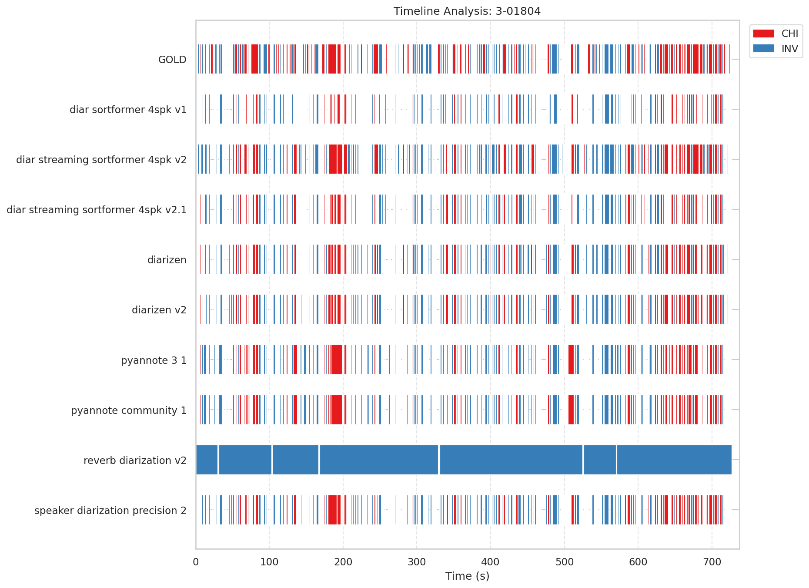

#### 60-Second Snippets (Zoom-in)
Below are 60-second zoomed-in windows showing where the models performed best and worst (based on average DER).

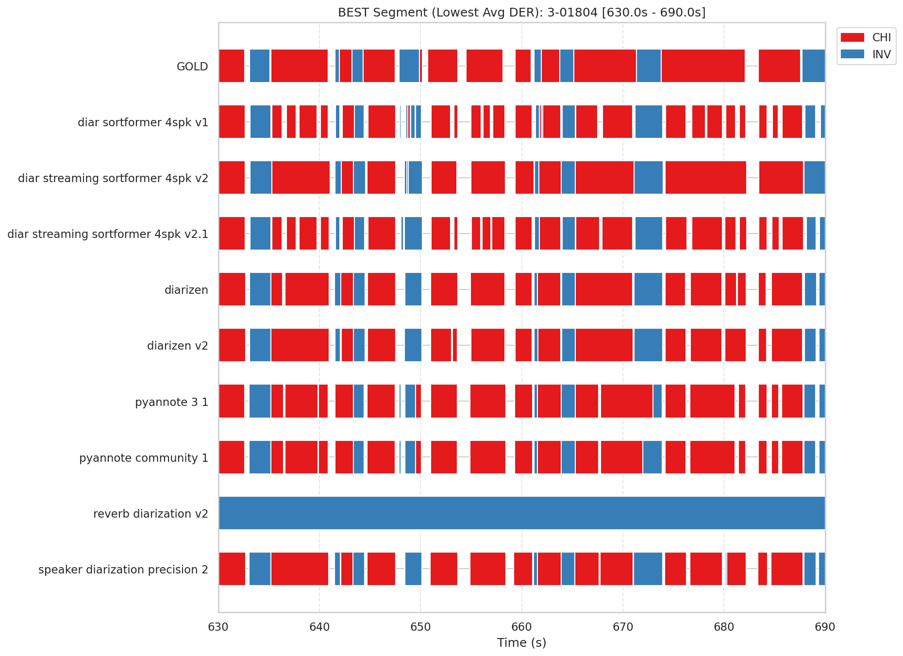

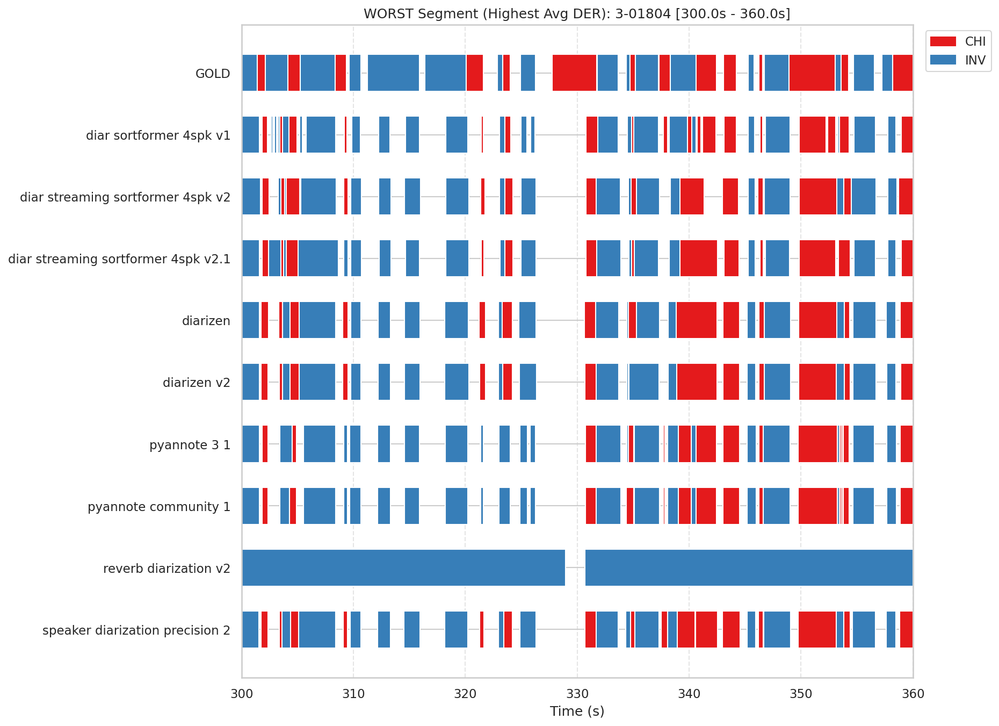

#### Metrics (Collar: 0.00s)

| Model                               | DER       | JER       | Miss     | FA       | Conf     | B-P       | B-R       | B-F1      | Pur       | Cov        | VRAM (GB)   |
|-------------------------------------|-----------|-----------|----------|----------|----------|-----------|-----------|-----------|-----------|------------|-------------|
| speaker diarization precision 2     | **22.83** | **23.65** | 13.33    | 6.41     | 3.09     | 77.37     | 79.37     | **78.36** | 93.01     | 93.01      | **0.0**     |
| diarizen v2                         | 24.13     | 24.89     | 13.23    | 7.44     | 3.46     | 76.77     | 77.65     | 77.21     | 92.03     | 92.03      | 11.0        |
| diarizen                            | 24.27     | 24.93     | 13.07    | 7.77     | 3.43     | 76.64     | 77.08     | 76.86     | 91.87     | 91.87      | 11.0        |
| diar streaming sortformer 4spk v2   | 25.54     | 26.83     | 13.21    | 7.77     | 4.56     | **77.52** | 66.19     | 71.41     | 91.19     | 91.19      | 0.9         |
| diar streaming sortformer 4spk v2.1 | 26.68     | 27.66     | 18.43    | 5.01     | 3.25     | 73.22     | 76.79     | 74.97     | 92.86     | 92.86      | 0.9         |
| pyannote community 1                | 27.04     | 30.95     | 15.40    | 4.17     | 7.47     | 67.32     | 68.48     | 67.90     | 88.91     | 88.91      | 1.6         |
| diar sortformer 4spk v1             | 27.44     | 29.04     | 22.28    | **2.08** | **3.08** | 66.28     | **81.09** | 72.94     | **94.54** | 94.54      | 18.4        |
| pyannote 3 1                        | 27.61     | 31.83     | 15.40    | 4.17     | 8.04     | 65.84     | 68.48     | 67.13     | 88.26     | 88.26      | 1.6         |
| reverb diarization v2               | 71.65     | 79.44     | **0.43** | 21.44    | 49.78    | 50.00     | 0.86      | 1.69      | 50.01     | **100.00** | 4.3         |

#### Metrics (Collar: 0.25s)

| Model                               | DER       | JER       | Miss     | FA       | Conf     | B-P       | B-R       | B-F1      | Pur       | Cov        | VRAM (GB)   |
|-------------------------------------|-----------|-----------|----------|----------|----------|-----------|-----------|-----------|-----------|------------|-------------|
| speaker diarization precision 2     | **17.10** | **17.24** | 13.05    | 3.09     | **0.96** | 77.37     | 79.37     | **78.36** | 96.09     | 96.89      | **0.0**     |
| diarizen v2                         | 17.83     | 18.06     | 13.07    | 3.56     | 1.20     | 76.77     | 77.65     | 77.21     | 95.50     | 96.17      | 11.0        |
| diarizen                            | 17.84     | 18.07     | 12.89    | 3.74     | 1.22     | 76.64     | 77.08     | 76.86     | 95.32     | 95.98      | 11.0        |
| diar streaming sortformer 4spk v2   | 18.44     | 19.21     | 12.61    | 3.85     | 1.98     | **77.52** | 66.19     | 71.41     | 94.78     | 95.11      | 0.9         |
| diar streaming sortformer 4spk v2.1 | 20.85     | 21.01     | 17.14    | 2.66     | 1.05     | 73.22     | 76.79     | 74.97     | 96.28     | 96.81      | 0.9         |
| pyannote community 1                | 21.95     | 25.22     | 14.64    | 2.16     | 5.15     | 67.32     | 68.48     | 67.90     | 91.90     | 91.92      | 1.6         |
| pyannote 3 1                        | 22.53     | 26.17     | 14.64    | 2.16     | 5.73     | 65.84     | 68.48     | 67.13     | 91.23     | 91.34      | 1.6         |
| diar sortformer 4spk v1             | 22.86     | 23.20     | 20.75    | **1.14** | 0.97     | 66.28     | **81.09** | 72.94     | **97.51** | 98.31      | 18.4        |
| reverb diarization v2               | 66.20     | 78.43     | **0.45** | 16.35    | 49.40    | 50.00     | 0.86      | 1.69      | 50.38     | **100.00** | 4.3         |


---

### File: 3-02709

**Primary category:** Age 5 / M | **Quality:** N/A | **Device:** N/A

> *Keywords:* chronological_age=5;06; audio=3-02709-i.mp3; cha=3-02709-i.cha

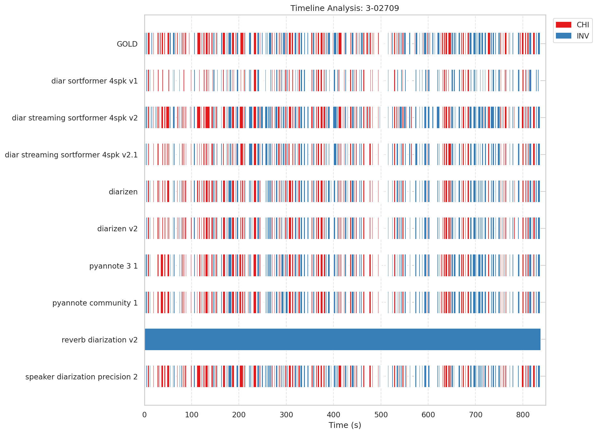

#### 60-Second Snippets (Zoom-in)
Below are 60-second zoomed-in windows showing where the models performed best and worst (based on average DER).

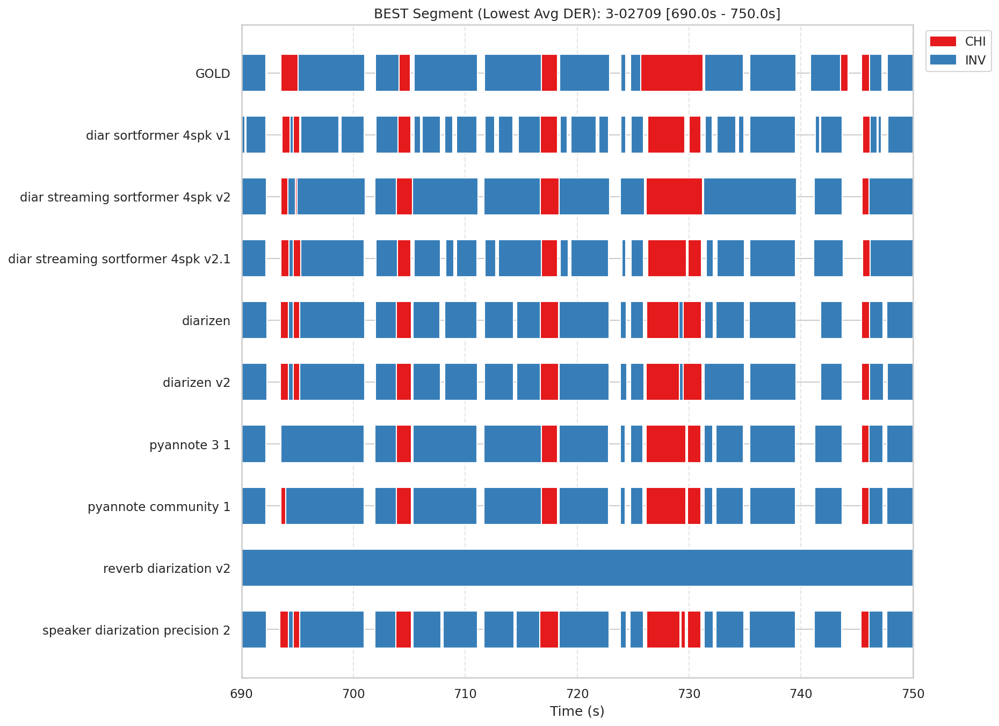

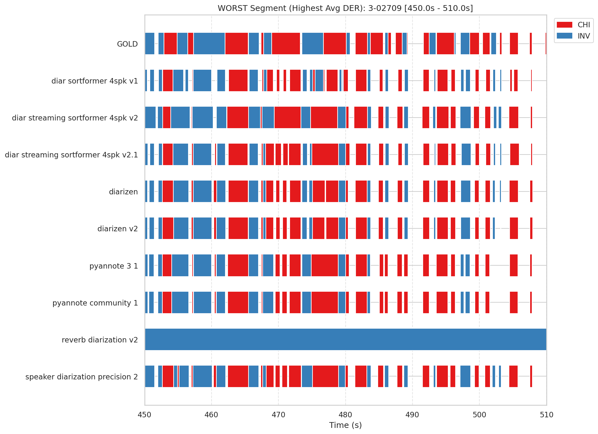

#### Metrics (Collar: 0.00s)

| Model                               | DER       | JER       | Miss     | FA       | Conf     | B-P        | B-R       | B-F1      | Pur       | Cov        | VRAM (GB)   |
|-------------------------------------|-----------|-----------|----------|----------|----------|------------|-----------|-----------|-----------|------------|-------------|
| speaker diarization precision 2     | **16.10** | **17.61** | 5.48     | 7.28     | 3.34     | 75.52      | 78.59     | **77.03** | 92.10     | 92.10      | **0.0**     |
| diarizen                            | 16.83     | 18.29     | 6.26     | 7.23     | 3.34     | 74.94      | 78.59     | 76.72     | 92.01     | 92.01      | 11.0        |
| diarizen v2                         | 16.88     | 18.31     | 6.31     | 7.25     | 3.32     | 74.74      | 78.59     | 76.62     | 92.07     | 92.07      | 11.0        |
| pyannote 3 1                        | 17.90     | 20.10     | 7.46     | 6.21     | 4.23     | 67.68      | 72.09     | 69.82     | 91.10     | 91.10      | 1.6         |
| pyannote community 1                | 18.07     | 20.39     | 7.46     | 6.21     | 4.41     | 68.12      | 71.82     | 69.92     | 90.92     | 90.92      | 1.6         |
| diar streaming sortformer 4spk v2.1 | 19.01     | 20.26     | 9.45     | 6.44     | **3.12** | 70.17      | 77.78     | 73.78     | 92.20     | 92.20      | 1.0         |
| diar streaming sortformer 4spk v2   | 19.13     | 19.85     | 4.54     | 11.03    | 3.56     | 74.77      | 65.04     | 69.57     | 90.13     | 90.13      | 1.0         |
| diar sortformer 4spk v1             | 20.40     | 22.33     | 13.93    | **3.18** | 3.29     | 62.35      | **82.11** | 70.88     | **93.63** | 93.63      | 24.1        |
| reverb diarization v2               | 64.71     | 77.88     | **0.06** | 16.01    | 48.64    | **100.00** | 0.00      | 0.00      | 51.30     | **100.00** | 4.3         |

#### Metrics (Collar: 0.25s)

| Model                               | DER       | JER       | Miss     | FA       | Conf     | B-P        | B-R       | B-F1      | Pur       | Cov        | VRAM (GB)   |
|-------------------------------------|-----------|-----------|----------|----------|----------|------------|-----------|-----------|-----------|------------|-------------|
| speaker diarization precision 2     | **10.28** | **11.07** | 4.86     | 4.07     | 1.35     | 75.52      | 78.59     | **77.03** | 95.03     | 95.94      | **0.0**     |
| diarizen                            | 11.24     | 11.88     | 5.86     | 4.14     | 1.24     | 74.94      | 78.59     | 76.72     | 95.13     | 95.84      | 11.0        |
| diarizen v2                         | 11.27     | 11.88     | 5.91     | 4.15     | 1.21     | 74.74      | 78.59     | 76.62     | 95.18     | 95.96      | 11.0        |
| diar streaming sortformer 4spk v2   | 11.97     | 12.48     | 3.91     | 6.58     | 1.48     | 74.77      | 65.04     | 69.57     | 93.56     | 93.93      | 1.0         |
| pyannote 3 1                        | 12.42     | 13.88     | 6.42     | 3.76     | 2.24     | 67.68      | 72.09     | 69.82     | 94.10     | 94.29      | 1.6         |
| pyannote community 1                | 12.65     | 14.29     | 6.42     | 3.76     | 2.46     | 68.12      | 71.82     | 69.92     | 93.87     | 94.05      | 1.6         |
| diar streaming sortformer 4spk v2.1 | 13.16     | 13.69     | 8.03     | 3.95     | **1.17** | 70.17      | 77.78     | 73.78     | 95.39     | 95.84      | 1.0         |
| diar sortformer 4spk v1             | 15.57     | 16.51     | 12.11    | **2.02** | 1.44     | 62.35      | **82.11** | 70.88     | **96.37** | 97.03      | 24.1        |
| reverb diarization v2               | 60.59     | 77.05     | **0.02** | 11.97    | 48.60    | **100.00** | 0.00      | 0.00      | 51.38     | **100.00** | 4.3         |


---

### File: 3-02912

**Primary category:** Age 5 / F | **Quality:** N/A | **Device:** N/A

> *Keywords:* chronological_age=5;01; audio=3-02912-i.mp3; cha=3-02912-i.cha

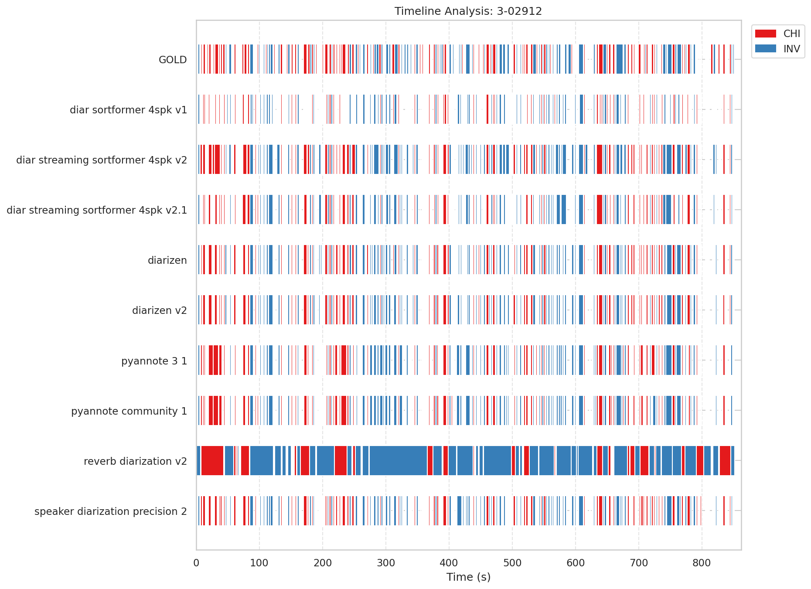

#### 60-Second Snippets (Zoom-in)
Below are 60-second zoomed-in windows showing where the models performed best and worst (based on average DER).

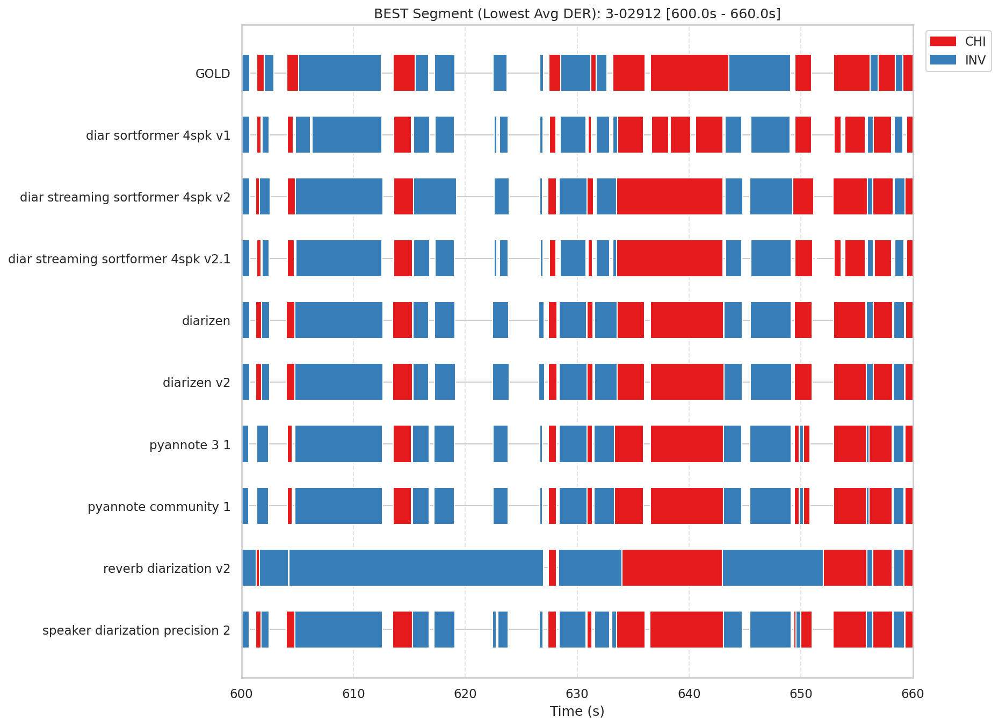

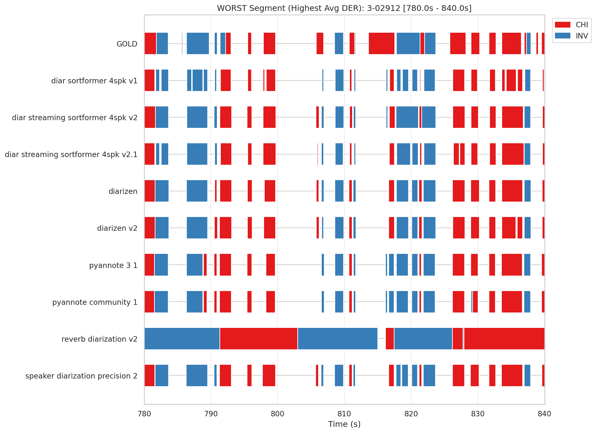

#### Metrics (Collar: 0.00s)

| Model                               | DER       | JER       | Miss     | FA       | Conf     | B-P       | B-R       | B-F1      | Pur       | Cov       | VRAM (GB)   |
|-------------------------------------|-----------|-----------|----------|----------|----------|-----------|-----------|-----------|-----------|-----------|-------------|
| diarizen v2                         | **24.02** | 29.20     | 7.34     | 6.68     | 10.00    | 51.65     | 51.52     | 51.59     | 86.47     | 86.47     | 11.0        |
| diarizen                            | 24.10     | 29.22     | 7.39     | 6.76     | 9.94     | 52.05     | 51.52     | 51.79     | 86.38     | 86.38     | 11.0        |
| diar streaming sortformer 4spk v2   | 24.34     | **27.69** | 6.59     | 9.57     | 8.18     | **58.81** | 50.00     | **54.05** | 86.69     | 86.69     | 1.0         |
| speaker diarization precision 2     | 24.36     | 29.69     | 8.00     | 6.24     | 10.13    | 50.62     | 51.78     | 51.19     | 86.05     | 86.05     | **0.0**     |
| diar streaming sortformer 4spk v2.1 | 26.33     | 30.39     | 12.89    | 5.37     | **8.06** | 45.61     | 48.73     | 47.12     | **87.98** | **87.98** | 1.0         |
| pyannote 3 1                        | 26.34     | 32.72     | 9.68     | 4.95     | 11.72    | 48.77     | 50.51     | 49.63     | 84.44     | 84.44     | 1.6         |
| pyannote community 1                | 26.65     | 33.16     | 9.67     | 4.95     | 12.02    | 47.62     | 50.76     | 49.14     | 84.11     | 84.11     | 1.6         |
| diar sortformer 4spk v1             | 28.10     | 33.37     | 16.45    | **2.62** | 9.04     | 41.04     | **54.06** | 46.66     | 87.68     | 87.68     | 24.9        |
| reverb diarization v2               | 55.43     | 54.93     | **0.55** | 26.79    | 28.10    | 32.98     | 7.87      | 12.70     | 69.98     | 71.71     | 4.3         |

#### Metrics (Collar: 0.25s)

| Model                               | DER       | JER       | Miss     | FA       | Conf     | B-P       | B-R       | B-F1      | Pur       | Cov       | VRAM (GB)   |
|-------------------------------------|-----------|-----------|----------|----------|----------|-----------|-----------|-----------|-----------|-----------|-------------|
| diar streaming sortformer 4spk v2   | **17.33** | **20.49** | 5.47     | 6.34     | **5.53** | **58.81** | 50.00     | **54.05** | 89.76     | 90.86     | 1.0         |
| diarizen v2                         | 17.56     | 22.36     | 6.67     | 3.69     | 7.20     | 51.65     | 51.52     | 51.59     | 89.53     | 90.54     | 11.0        |
| diarizen                            | 17.71     | 22.41     | 6.75     | 3.84     | 7.12     | 52.05     | 51.52     | 51.79     | 89.47     | 90.52     | 11.0        |
| speaker diarization precision 2     | 18.35     | 23.14     | 7.26     | 3.75     | 7.33     | 50.62     | 51.78     | 51.19     | 89.07     | 90.23     | **0.0**     |
| diar streaming sortformer 4spk v2.1 | 20.59     | 23.98     | 11.29    | 3.74     | 5.57     | 45.61     | 48.73     | 47.12     | **91.00** | **91.93** | 1.0         |
| pyannote 3 1                        | 20.63     | 26.63     | 8.45     | 3.03     | 9.15     | 48.77     | 50.51     | 49.63     | 87.58     | 87.66     | 1.6         |
| pyannote community 1                | 21.02     | 27.23     | 8.45     | 3.03     | 9.55     | 47.62     | 50.76     | 49.14     | 87.17     | 87.42     | 1.6         |
| diar sortformer 4spk v1             | 23.08     | 27.43     | 14.69    | **1.83** | 6.55     | 41.04     | **54.06** | 46.66     | 90.75     | 91.49     | 24.9        |
| reverb diarization v2               | 49.10     | 51.83     | **0.52** | 22.24    | 26.34    | 32.98     | 7.87      | 12.70     | 71.83     | 72.78     | 4.3         |


---

### File: 3-12012

**Primary category:** Age 5 / F | **Quality:** N/A | **Device:** N/A

> *Keywords:* chronological_age=5;03; audio=3-12012-i.mp3; cha=3-12012-i.cha

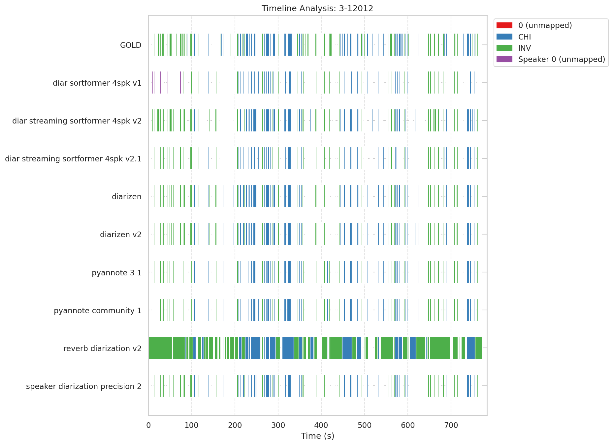

#### 60-Second Snippets (Zoom-in)
Below are 60-second zoomed-in windows showing where the models performed best and worst (based on average DER).

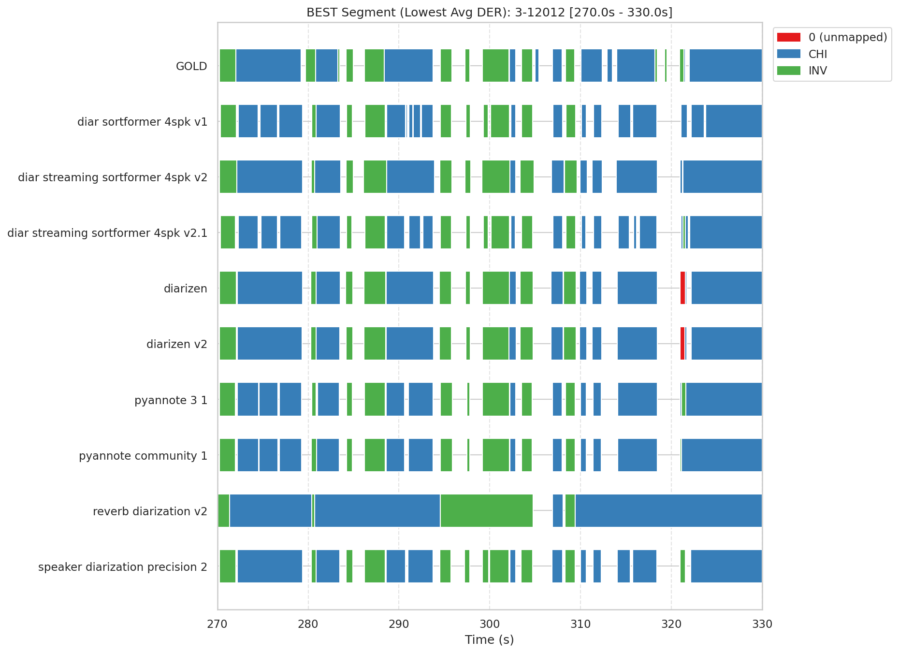

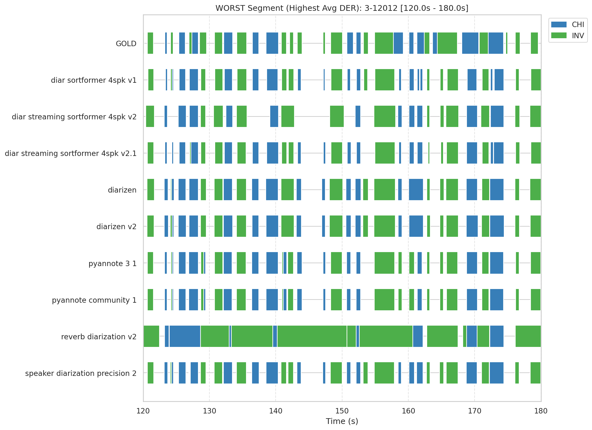

#### Metrics (Collar: 0.00s)

| Model                               | DER       | JER       | Miss     | FA       | Conf     | B-P       | B-R       | B-F1      | Pur       | Cov       | VRAM (GB)   |
|-------------------------------------|-----------|-----------|----------|----------|----------|-----------|-----------|-----------|-----------|-----------|-------------|
| speaker diarization precision 2     | **20.76** | **21.67** | 13.69    | 4.65     | 2.42     | 79.09     | **82.87** | 80.93     | 95.62     | 95.62     | **0.0**     |
| diarizen v2                         | 22.02     | 22.42     | 12.04    | 7.29     | 2.69     | **83.28** | 79.78     | **81.49** | 94.54     | 94.46     | 11.0        |
| diarizen                            | 22.21     | 22.58     | 11.86    | 7.57     | 2.78     | 82.56     | 79.78     | 81.14     | 94.28     | 94.20     | 11.0        |
| diar streaming sortformer 4spk v2.1 | 23.95     | 24.84     | 18.56    | 3.20     | **2.20** | 76.49     | 79.49     | 77.96     | 95.93     | **95.93** | 0.9         |
| pyannote community 1                | 24.31     | 26.11     | 16.65    | 3.86     | 3.80     | 74.13     | 78.09     | 76.06     | 94.00     | 94.00     | 1.6         |
| pyannote 3 1                        | 24.41     | 26.28     | 16.65    | 3.86     | 3.90     | 74.13     | 78.09     | 76.06     | 93.88     | 93.88     | 1.6         |
| diar streaming sortformer 4spk v2   | 27.73     | 27.95     | 17.33    | 7.42     | 2.98     | 81.11     | 69.94     | 75.11     | 94.95     | 94.95     | 0.9         |
| diar sortformer 4spk v1             | 29.62     | 30.39     | 18.49    | **2.07** | 9.07     | 68.54     | 78.93     | 73.37     | **96.07** | 88.53     | 20.6        |
| reverb diarization v2               | 60.01     | 50.92     | **1.25** | 37.66    | 21.10    | 62.14     | 17.98     | 27.89     | 76.92     | 76.92     | 4.3         |

#### Metrics (Collar: 0.25s)

| Model                               | DER       | JER       | Miss     | FA       | Conf     | B-P       | B-R       | B-F1      | Pur       | Cov       | VRAM (GB)   |
|-------------------------------------|-----------|-----------|----------|----------|----------|-----------|-----------|-----------|-----------|-----------|-------------|
| speaker diarization precision 2     | **14.26** | 14.92     | 11.71    | 1.54     | 1.02     | 79.09     | **82.87** | 80.93     | 97.62     | 98.21     | **0.0**     |
| diarizen v2                         | 14.30     | **14.83** | 10.40    | 2.75     | 1.14     | **83.28** | 79.78     | **81.49** | 96.85     | 97.19     | 11.0        |
| diarizen                            | 14.30     | 14.90     | 10.19    | 2.87     | 1.24     | 82.56     | 79.78     | 81.14     | 96.59     | 97.04     | 11.0        |
| diar streaming sortformer 4spk v2.1 | 17.52     | 18.10     | 15.38    | 1.21     | **0.94** | 76.49     | 79.49     | 77.96     | 98.00     | **98.61** | 0.9         |
| pyannote community 1                | 17.90     | 19.60     | 13.91    | 1.51     | 2.48     | 74.13     | 78.09     | 76.06     | 96.08     | 96.75     | 1.6         |
| pyannote 3 1                        | 18.06     | 19.88     | 13.91    | 1.52     | 2.64     | 74.13     | 78.09     | 76.06     | 95.89     | 96.65     | 1.6         |
| diar streaming sortformer 4spk v2   | 19.37     | 20.14     | 15.54    | 2.39     | 1.44     | 81.11     | 69.94     | 75.11     | 97.37     | 97.60     | 0.9         |
| diar sortformer 4spk v1             | 23.75     | 24.34     | 15.15    | **0.54** | 8.07     | 68.54     | 78.93     | 73.37     | **98.01** | 90.32     | 20.6        |
| reverb diarization v2               | 51.96     | 46.61     | **0.91** | 32.13    | 18.91    | 62.14     | 17.98     | 27.89     | 79.16     | 78.19     | 4.3         |


---

