# ROG-Dia Benchmark Report

**Date:** 2026-04-16

## 1. Evaluated Models
* **diar sortformer 4spk v1** (`nvidia/diar_sortformer_4spk-v1`) - [HuggingFace](https://huggingface.co/nvidia/diar_sortformer_4spk-v1)
* **diar streaming sortformer 4spk v2** (`nvidia/diar_streaming_sortformer_4spk-v2`) - [HuggingFace](https://huggingface.co/nvidia/diar_streaming_sortformer_4spk-v2)
* **diar streaming sortformer 4spk v2.1** (`nvidia/diar_streaming_sortformer_4spk-v2.1`) - [HuggingFace](https://huggingface.co/nvidia/diar_streaming_sortformer_4spk-v2.1)
* **pyannote 3 1** (`pyannote/speaker-diarization-3.1`) - [HuggingFace](https://huggingface.co/pyannote/speaker-diarization-3.1)
* **pyannote community 1** (`pyannote/speaker-diarization-community-1`) - [HuggingFace](https://huggingface.co/pyannote/speaker-diarization-community-1)
* **reverb diarization v2** (`Revai/reverb-diarization-v2`) - [HuggingFace](https://huggingface.co/Revai/reverb-diarization-v2)
* **speaker diarization precision 2** (`pyannote/speaker-diarization-precision-2`) - [HuggingFace](https://huggingface.co/pyannote/speaker-diarization-precision-2)

## 2. Executive Summary

| Model                               |   Collar | DER      | JER       | B-P       | B-R       | B-F1      | Purity    | Cover     | Miss     | FA       | Conf     | RTF        | VRAM (GB)   | Completed   |
|-------------------------------------|----------|----------|-----------|-----------|-----------|-----------|-----------|-----------|----------|----------|----------|------------|-------------|-------------|
| speaker diarization precision 2     |     0.25 | **9.52** | **12.18** | **72.29** | 77.10     | **74.62** | **86.89** | 89.09     | **5.78** | 2.37     | **1.36** | 0.03       | **0.0**     | 12/12       |
| diar streaming sortformer 4spk v2   |     0.25 | 11.48    | 14.31     | 69.64     | 70.64     | 70.14     | 86.46     | 88.90     | 7.14     | 2.68     | 1.65     | **< 0.01** | 1.6         | 12/12       |
| diar streaming sortformer 4spk v2.1 |     0.25 | 17.34    | 20.05     | 60.81     | **77.15** | 68.01     | 85.73     | 84.94     | 9.70     | **1.94** | 5.31     | < 0.01     | 1.6         | 12/12       |
| pyannote community 1                |     0.25 | 19.01    | 25.82     | 59.64     | 54.70     | 57.07     | 80.95     | 86.32     | 5.84     | 5.05     | 8.91     | 0.06       | 1.6         | 12/12       |
| pyannote 3 1                        |     0.25 | 19.12    | 25.61     | 62.74     | 54.11     | 58.10     | 81.20     | 86.16     | 5.84     | 5.05     | 8.95     | 0.06       | 1.6         | 12/12       |
| reverb diarization v2               |     0.25 | 42.41    | 50.10     | 51.94     | 3.40      | 6.38      | 73.50     | **91.60** | 7.94     | 16.23    | 18.88    | 0.10       | 4.3         | 12/12       |
| diar sortformer 4spk v1             |     0.25 | 53.66    | 54.78     | 57.94     | 67.45     | 62.34     | 80.21     | 48.74     | 8.56     | 4.10     | 9.24     | 0.03       | 104.4       | 8/12        |

### Terminology & Methodology
* **DER (Diarization Error Rate):** Primary metric. Lower is better. Sum of Missed, False Alarm, and Confusion rates.
* **JER (Jaccard Error Rate):** Speaker-balanced diarization error. Lower is better.
* **Miss (%):** Speech present in Gold Standard but missed by the model.
* **FA (False Alarm %):** Model predicted speech where Gold Standard is silent.
* **Conf (Confusion %):** Speech correctly detected but assigned to the wrong speaker.
* **Boundary P/R/F1 (%):** Segmentation boundary precision/recall/F1 using tolerance 0.250s.
* **Purity (%):** Evaluates cluster purity. High purity = when a model identifies a speaker, it is consistently the same person.
* **Cover (Coverage %):** Evaluates how much of the original speaker's speech was captured under a single hypothesis cluster.
* **RTF (Real Time Factor):** Processing time divided by audio length. e.g., `< 0.01` means exceptionally fast processing.
* **VRAM (GB):** Peak GPU memory utilized. `0.0 GB` indicates an API/Cloud-based model.

## 3. Dataset Errata (Corrections Applied)
Corrections automatically applied via Universal Evaluation Maps (UEM) to account for transcription errors. Models are not penalized for predictions outside these boundaries.

* **`ROG-Dia-GSO-P0016`**: Evaluated only up to 1172.092s. *Reason: Zlati standard se zaključi predčasno pri 19:32 (potrdila avtorica). Preostanek posnetka se ignorira pri izračunu metrik.*

## 4. Visual & Domain Analysis
Bar charts compare models across **all** configured collars; domain boxplots and domain tables use a single evaluation collar.

* **Domain analysis collar:** `0.25`s.

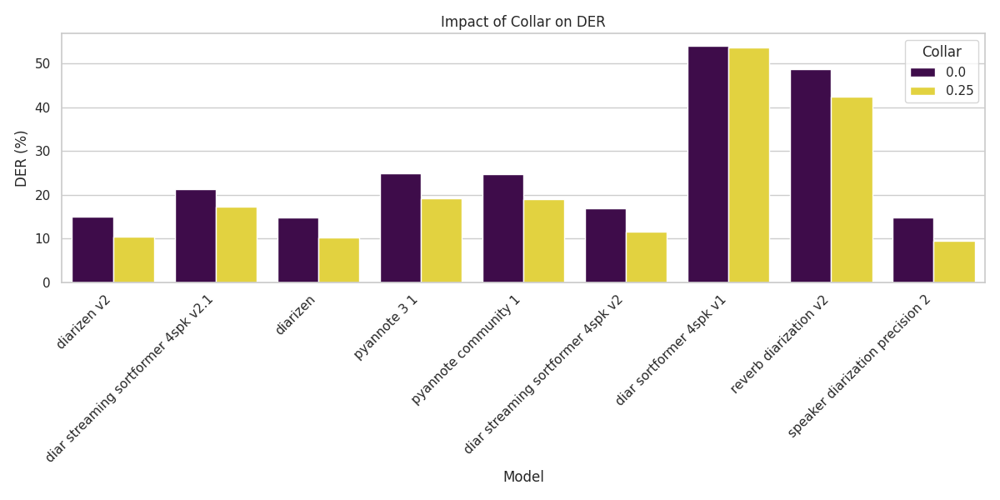

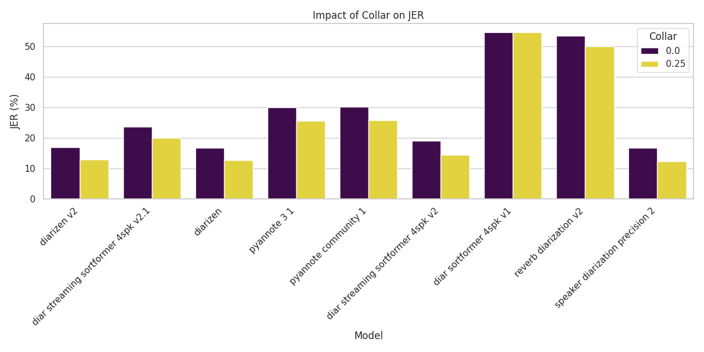

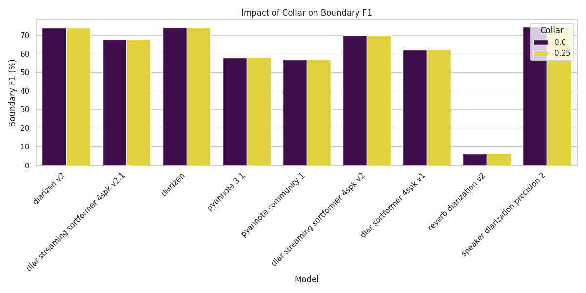

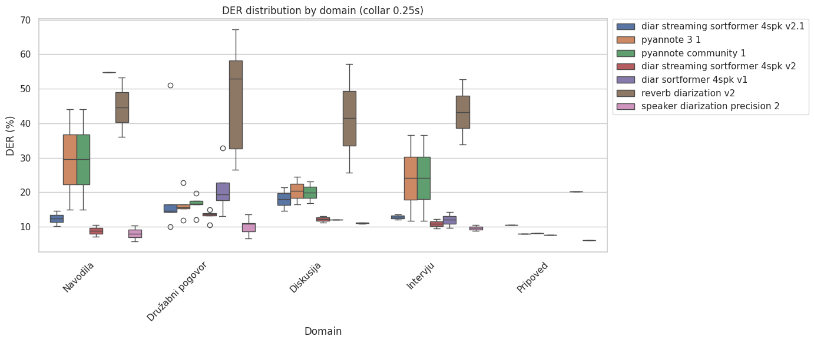

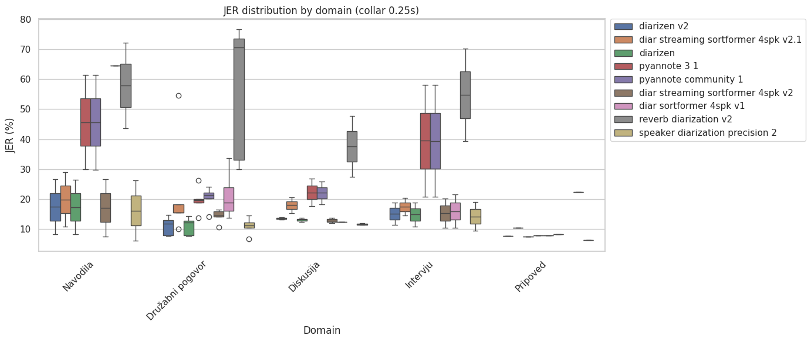

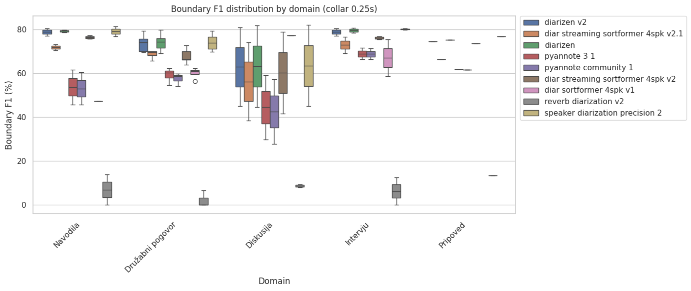

### Domain Comparison (DER %)
Average DER per domain at collar `0.25`s. **Bold** highlights the best (lowest) model per domain.

| Domain           |      A |     B |     C |     D |     E |     F | G         |   AVG |
|------------------|--------|-------|-------|-------|-------|-------|-----------|-------|
| Diskusija        |  12.06 | 12.2  | 18.03 | 20.41 | 19.94 | 41.46 | **11.03** | 19.31 |
| Družabni pogovor |  21.13 | 13.2  | 21.27 | 16.41 | 16.49 | 47.5  | **10.11** | 20.87 |
| Intervju         |  11.98 | 10.9  | 12.84 | 24.12 | 24.14 | 43.29 | **9.65**  | 19.56 |
| Navodila         |  54.71 |  8.86 | 12.39 | 29.51 | 29.5  | 44.65 | **8.04**  | 26.81 |
| Pripoved         | nan    |  7.62 | 10.52 |  8.03 |  8.06 | 20.28 | **6.12**  | 10.1  |

### Domain Comparison (JER %)
Average JER per domain at collar `0.25`s. **Bold** highlights the best (lowest) model per domain.

| Domain           |      A |     B |     C |     D |     E |     F | G         |   AVG |
|------------------|--------|-------|-------|-------|-------|-------|-----------|-------|
| Diskusija        |  12.39 | 12.8  | 17.92 | 22.19 | 22.03 | 37.6  | **11.61** | 19.51 |
| Družabni pogovor |  21.21 | 14.32 | 22.74 | 19.66 | 20.38 | 56.73 | **11.00** | 23.72 |
| Intervju         |  15.92 | 15.29 | 17.4  | 39.45 | 39.41 | 54.75 | **14.17** | 28.06 |
| Navodila         |  64.58 | 17.08 | 19.87 | 45.66 | 45.6  | 57.89 | **16.12** | 38.11 |
| Pripoved         | nan    |  8.22 | 10.39 |  7.83 |  7.91 | 22.32 | **6.27**  | 10.49 |

### Domain Comparison (Boundary F1 %)
Average boundary F1 per domain at collar `0.25`s (boundary tolerance 0.250s). **Bold** highlights the best (highest) model per domain.

| Domain           | A         |     B |     C |     D |     E |     F | G         |   AVG |
|------------------|-----------|-------|-------|-------|-------|-------|-----------|-------|
| Diskusija        | **77.18** | 60.16 | 56.23 | 44.45 | 42.5  |  8.72 | 63.40     | 50.38 |
| Družabni pogovor | 60.03     | 67.77 | 68.65 | 59.19 | 57.56 |  1.99 | **74.11** | 55.61 |
| Intervju         | 67.03     | 76.06 | 72.88 | 68.89 | 68.77 |  6.3  | **80.09** | 62.86 |
| Navodila         | 47.18     | 76.33 | 71.72 | 53.7  | 53.05 |  6.94 | **79.01** | 55.42 |
| Pripoved         | nan       | 73.68 | 66.27 | 61.8  | 61.58 | 13.38 | **76.83** | 58.92 |

### Domain comparison model legend (shared)
* **A**: diar sortformer 4spk v1
* **B**: diar streaming sortformer 4spk v2
* **C**: diar streaming sortformer 4spk v2.1
* **D**: pyannote 3 1
* **E**: pyannote community 1
* **F**: reverb diarization v2
* **G**: speaker diarization precision 2

## 5. Deep Dive: File-by-File Analysis
Detailed breakdown for every file. *For metric definitions, see Executive Summary.*

### File: ROG-Dia-GSO-P0005

**Domain:** Navodila | **Quality:** 4 | **Device:** tablični računalnik Samsung Galaxy S6 Lite

> *Z govorkama smo se predhodno dogovorile za snemanje. Da je bil pogovor sproščen, smo govor snemale na domu ene izmed njiju. Pogovor je potekal o temah, ki govorki zanimajo, da sta si lahko izmenjevali navodila.*

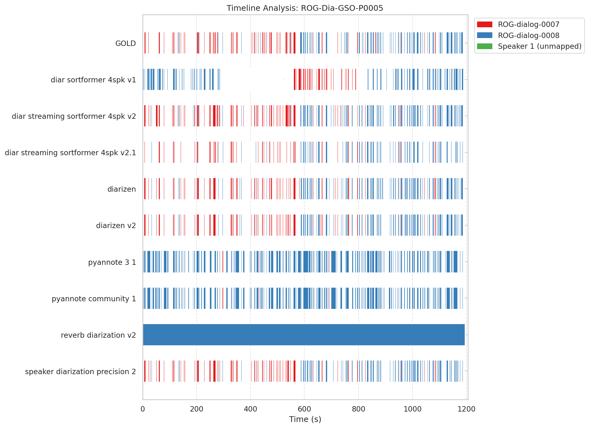

#### 60-Second Snippets (Zoom-in)
Below are 60-second zoomed-in windows showing where the models performed best and worst (based on average DER).

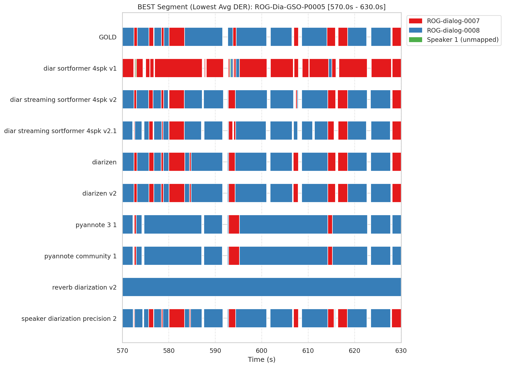

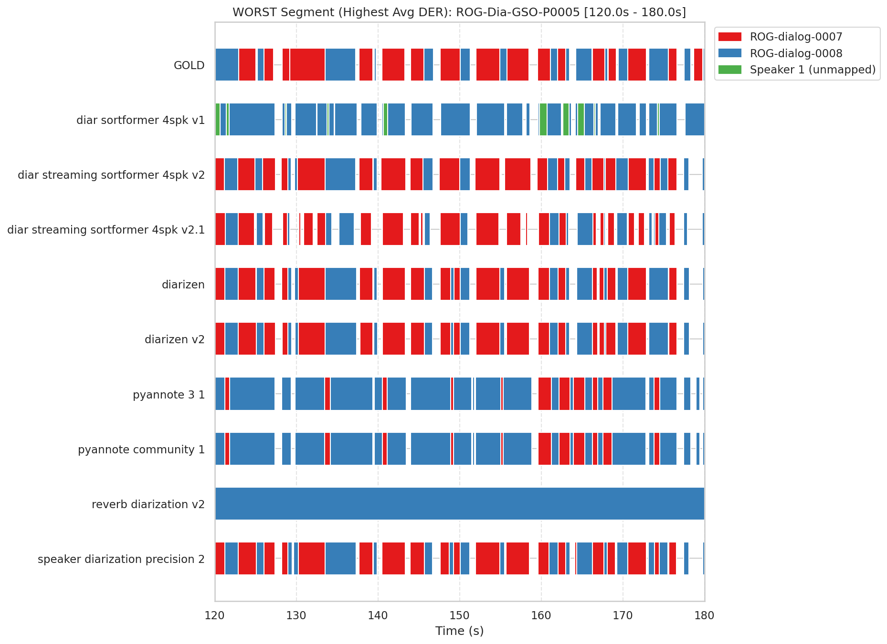

#### Metrics (Collar: 0.00s)

| Model                               | DER       | JER       | Miss     | FA       | Conf     | B-P        | B-R       | B-F1      | Pur       | Cov        | VRAM (GB)   |
|-------------------------------------|-----------|-----------|----------|----------|----------|------------|-----------|-----------|-----------|------------|-------------|
| speaker diarization precision 2     | **10.96** | **11.12** | 4.79     | 5.39     | **0.78** | 81.67      | **80.81** | **81.24** | 80.38     | 80.38      | **0.0**     |
| diar streaming sortformer 4spk v2   | 13.98     | 13.92     | **4.61** | 8.19     | 1.18     | 79.42      | 72.01     | 75.53     | 79.46     | 79.46      | 1.1         |
| diar streaming sortformer 4spk v2.1 | 15.59     | 16.09     | 11.92    | **2.64** | 1.04     | 67.59      | 73.42     | 70.38     | **81.15** | 81.15      | 1.1         |
| pyannote 3 1                        | 47.67     | 61.44     | 4.75     | 10.79    | 32.13    | 62.96      | 35.92     | 45.74     | 53.02     | 82.92      | 1.6         |
| pyannote community 1                | 47.67     | 61.44     | 4.75     | 10.79    | 32.13    | 62.96      | 35.92     | 45.74     | 53.02     | 82.92      | 1.6         |
| reverb diarization v2               | 57.14     | 73.03     | 11.35    | 10.73    | 35.05    | **100.00** | 0.00      | 0.00      | 53.60     | **100.00** | 4.3         |
| diar sortformer 4spk v1             | 57.60     | 65.23     | 15.13    | 5.69     | 36.78    | 39.39      | 58.80     | 47.18     | 56.33     | 57.80      | 47.9        |

#### Metrics (Collar: 0.25s)

| Model                               | DER      | JER      | Miss     | FA       | Conf     | B-P        | B-R       | B-F1      | Pur       | Cov        | VRAM (GB)   |
|-------------------------------------|----------|----------|----------|----------|----------|------------|-----------|-----------|-----------|------------|-------------|
| speaker diarization precision 2     | **5.70** | **6.04** | 3.26     | 2.02     | **0.42** | 81.67      | **80.81** | **81.24** | 82.81     | 84.88      | **0.0**     |
| diar streaming sortformer 4spk v2   | 7.13     | 7.51     | **3.24** | 3.28     | 0.61     | 79.42      | 72.01     | 75.53     | 82.28     | 84.14      | 1.1         |
| diar streaming sortformer 4spk v2.1 | 10.26    | 10.71    | 8.27     | **1.39** | 0.59     | 67.59      | 73.42     | 70.38     | **83.36** | 87.12      | 1.1         |
| pyannote 3 1                        | 44.02    | 61.43    | 3.59     | 6.81     | 33.62    | 62.96      | 35.92     | 45.74     | 53.52     | 85.32      | 1.6         |
| pyannote community 1                | 44.02    | 61.43    | 3.59     | 6.81     | 33.62    | 62.96      | 35.92     | 45.74     | 53.52     | 85.32      | 1.6         |
| reverb diarization v2               | 53.19    | 72.19    | 10.08    | 7.23     | 35.87    | **100.00** | 0.00      | 0.00      | 54.05     | **100.00** | 4.3         |
| diar sortformer 4spk v1             | 54.71    | 64.58    | 13.25    | 3.42     | 38.05    | 39.39      | 58.80     | 47.18     | 57.16     | 62.94      | 47.9        |

---

### File: ROG-Dia-GSO-P0007

**Domain:** Družabni pogovor | **Quality:** 5 | **Device:** Apple iPhone 13

> *Ena sogovornica je obiskala drugo in v kuhinji za mizo sta opravile pogovor, ki se je snemal.*

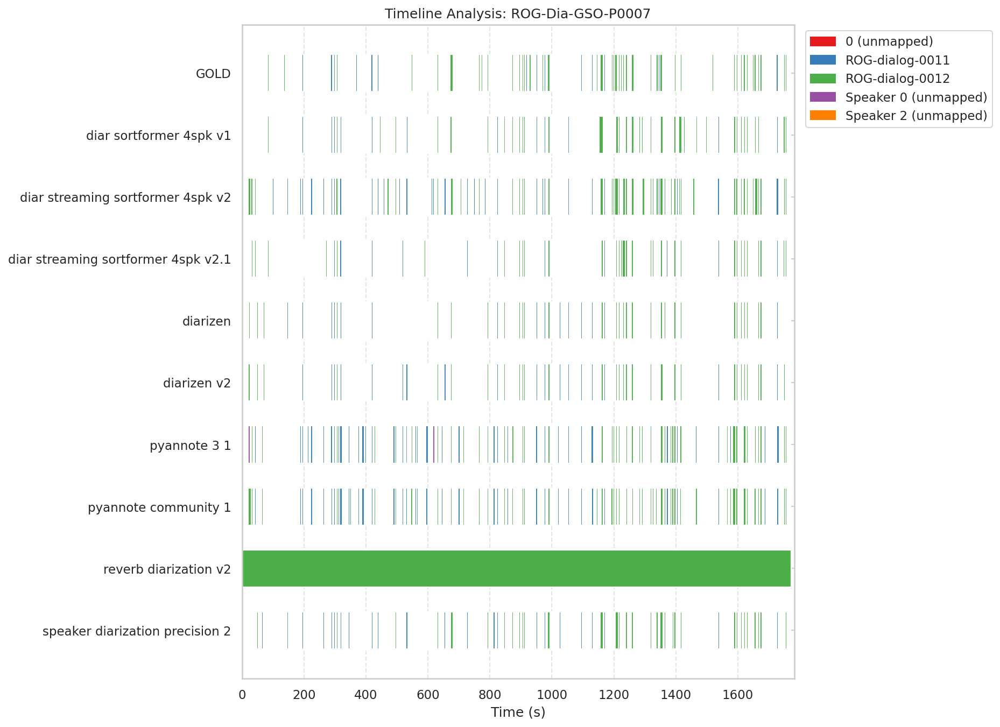

#### 60-Second Snippets (Zoom-in)
Below are 60-second zoomed-in windows showing where the models performed best and worst (based on average DER).

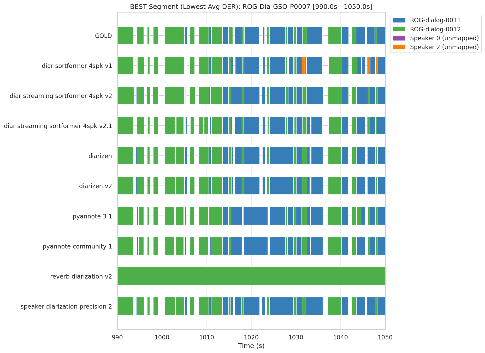

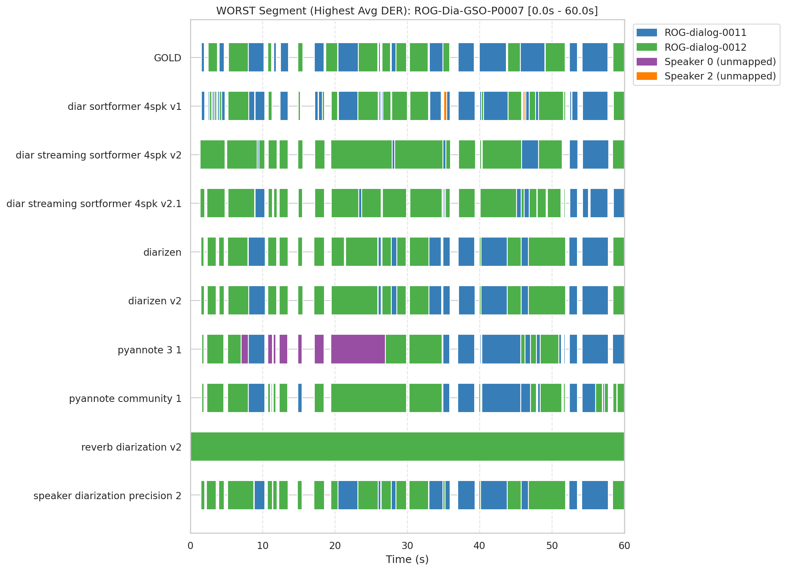

#### Metrics (Collar: 0.00s)

| Model                               | DER       | JER       | Miss     | FA       | Conf     | B-P        | B-R       | B-F1      | Pur       | Cov        | VRAM (GB)   |
|-------------------------------------|-----------|-----------|----------|----------|----------|------------|-----------|-----------|-----------|------------|-------------|
| speaker diarization precision 2     | **18.82** | **19.31** | 10.64    | 6.01     | **2.17** | 70.42      | 69.21     | **69.81** | **75.48** | 75.48      | **0.0**     |
| diar streaming sortformer 4spk v2.1 | 20.91     | 22.38     | 14.01    | **3.73** | 3.17     | 63.56      | 67.89     | 65.65     | 74.54     | 74.43      | 1.5         |
| diar streaming sortformer 4spk v2   | 21.27     | 22.05     | 10.78    | 7.31     | 3.18     | 71.11      | 58.03     | 63.91     | 74.20     | 74.20      | 1.5         |
| diar sortformer 4spk v1             | 24.76     | 22.08     | **9.57** | 8.59     | 6.60     | 52.62      | **71.54** | 60.64     | 72.82     | 67.65      | 104.4       |
| pyannote community 1                | 25.15     | 28.67     | 10.69    | 6.76     | 7.70     | 53.78      | 54.27     | 54.02     | 70.03     | 70.03      | 1.6         |
| pyannote 3 1                        | 28.39     | 30.93     | 10.69    | 6.76     | 10.94    | 54.58      | 54.47     | 54.53     | 69.67     | 67.25      | 1.6         |
| reverb diarization v2               | 57.46     | 71.84     | 16.37    | 10.45    | 30.65    | **100.00** | 0.00      | 0.00      | 52.99     | **100.00** | 4.3         |

#### Metrics (Collar: 0.25s)

| Model                               | DER       | JER       | Miss     | FA       | Conf     | B-P        | B-R       | B-F1      | Pur       | Cov        | VRAM (GB)   |
|-------------------------------------|-----------|-----------|----------|----------|----------|------------|-----------|-----------|-----------|------------|-------------|
| speaker diarization precision 2     | **13.52** | **14.57** | 9.64     | 2.14     | **1.74** | 70.42      | 69.21     | **69.81** | **77.20** | 80.23      | **0.0**     |
| diar streaming sortformer 4spk v2   | 14.98     | 16.45     | 9.29     | 3.14     | 2.54     | 71.11      | 58.03     | 63.91     | 75.93     | 78.86      | 1.5         |
| diar streaming sortformer 4spk v2.1 | 16.43     | 18.14     | 11.64    | **2.03** | 2.76     | 63.56      | 67.89     | 65.65     | 76.01     | 79.58      | 1.5         |
| diar sortformer 4spk v1             | 19.29     | 16.93     | **7.53** | 6.11     | 5.65     | 52.62      | **71.54** | 60.64     | 74.34     | 78.11      | 104.4       |
| pyannote community 1                | 19.78     | 24.02     | 9.52     | 3.52     | 6.74     | 53.78      | 54.27     | 54.02     | 72.15     | 73.48      | 1.6         |
| pyannote 3 1                        | 22.85     | 26.27     | 9.53     | 3.52     | 9.81     | 54.58      | 54.47     | 54.53     | 71.82     | 71.02      | 1.6         |
| reverb diarization v2               | 52.94     | 70.56     | 15.52    | 6.53     | 30.89    | **100.00** | 0.00      | 0.00      | 53.60     | **100.00** | 4.3         |

---

### File: ROG-Dia-GSO-P0008

**Domain:** Diskusija | **Quality:** 4 | **Device:** Iphone 13 mini

> *Pogovor med bratoma o kosilu ter o tehnologiji ter argumentiranje prednosti in slabosti.*

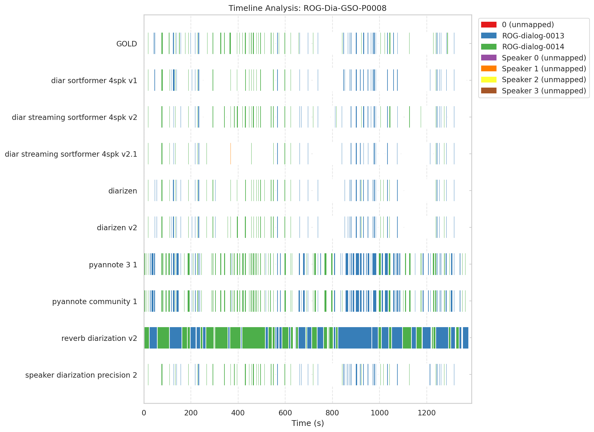

#### 60-Second Snippets (Zoom-in)
Below are 60-second zoomed-in windows showing where the models performed best and worst (based on average DER).

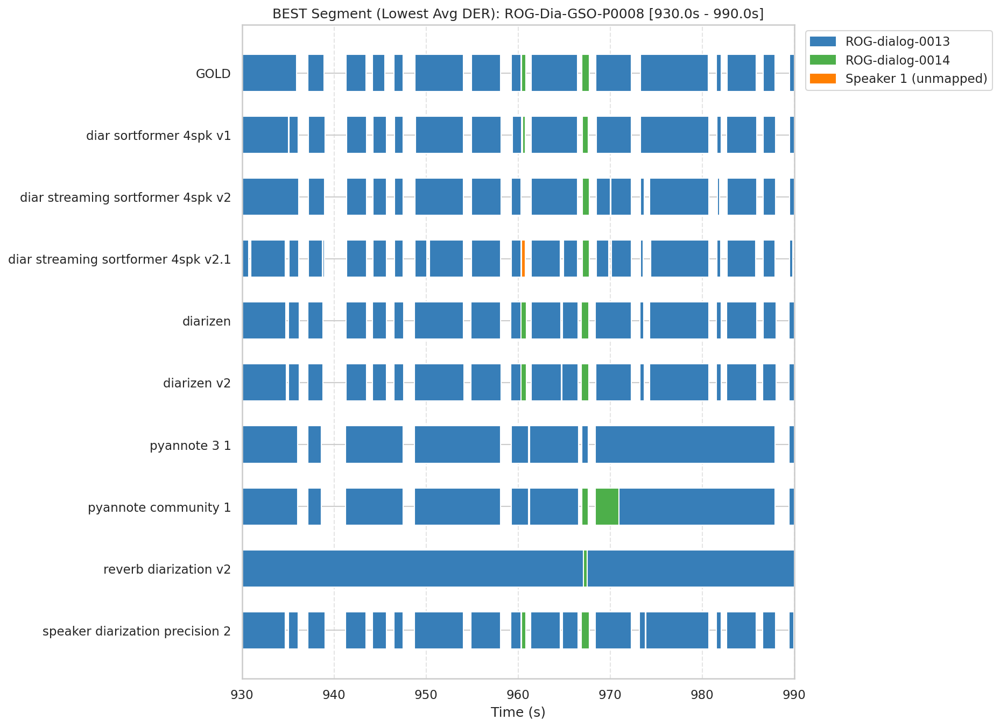

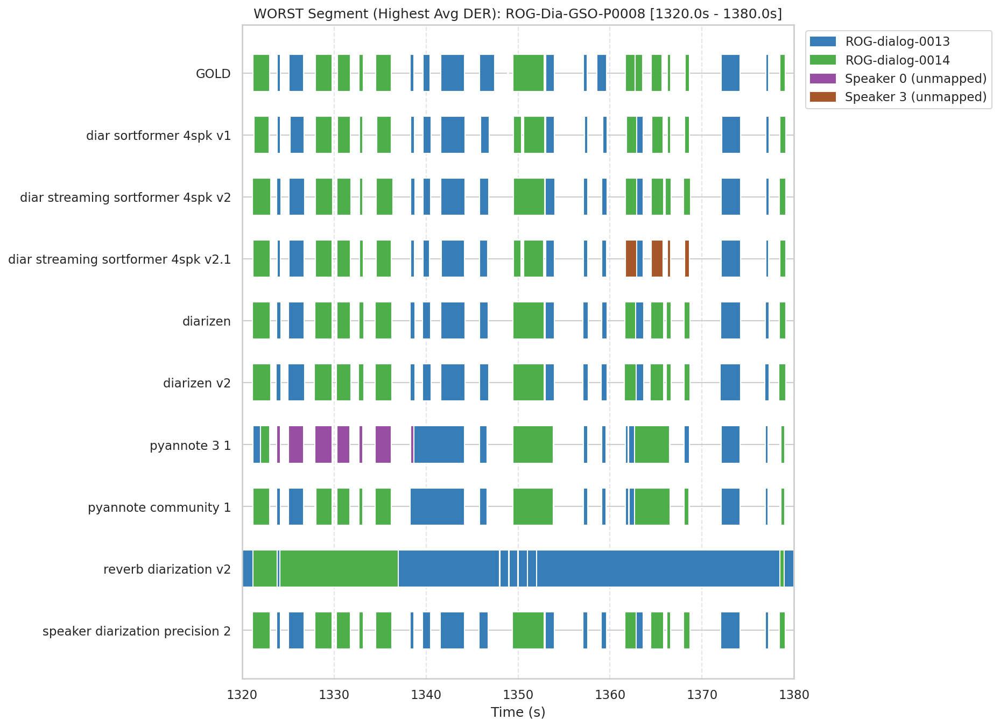

#### Metrics (Collar: 0.00s)

| Model                               | DER       | JER       | Miss     | FA       | Conf     | B-P       | B-R       | B-F1      | Pur       | Cov       | VRAM (GB)   |
|-------------------------------------|-----------|-----------|----------|----------|----------|-----------|-----------|-----------|-----------|-----------|-------------|
| speaker diarization precision 2     | **16.91** | **16.57** | 10.04    | 6.07     | **0.81** | **80.88** | **82.94** | **81.90** | 92.42     | **92.42** | **0.0**     |
| diar sortformer 4spk v1             | 17.78     | 17.61     | 10.82    | 5.34     | 1.62     | 72.45     | 82.58     | 77.18     | 90.43     | 89.80     | 63.9        |
| diar streaming sortformer 4spk v2   | 19.43     | 19.22     | 12.60    | 5.30     | 1.53     | 79.37     | 78.22     | 78.79     | 92.04     | 91.58     | 1.3         |
| diar streaming sortformer 4spk v2.1 | 25.38     | 24.19     | 16.27    | **3.35** | 5.76     | 67.51     | 82.21     | 74.14     | **93.16** | 86.59     | 1.3         |
| pyannote community 1                | 30.69     | 31.24     | 7.19     | 15.65    | 7.84     | 60.40     | 54.26     | 57.17     | 84.21     | 84.21     | 1.6         |
| pyannote 3 1                        | 32.03     | 32.15     | 7.19     | 15.65    | 9.19     | 65.56     | 53.90     | 59.16     | 84.01     | 82.88     | 1.6         |
| reverb diarization v2               | 64.91     | 51.10     | **5.21** | 43.01    | 16.69    | 32.89     | 4.54      | 7.97      | 77.48     | 77.48     | 4.3         |

#### Metrics (Collar: 0.25s)

| Model                               | DER       | JER       | Miss     | FA       | Conf     | B-P       | B-R       | B-F1      | Pur       | Cov       | VRAM (GB)   |
|-------------------------------------|-----------|-----------|----------|----------|----------|-----------|-----------|-----------|-----------|-----------|-------------|
| speaker diarization precision 2     | **10.87** | **11.29** | 9.07     | **1.17** | **0.64** | **80.88** | **82.94** | **81.90** | 93.23     | **94.74** | **0.0**     |
| diar sortformer 4spk v1             | 12.06     | 12.39     | 8.21     | 2.37     | 1.47     | 72.45     | 82.58     | 77.18     | 90.97     | 93.21     | 63.9        |
| diar streaming sortformer 4spk v2   | 13.14     | 13.67     | 10.24    | 1.55     | 1.35     | 79.37     | 78.22     | 78.79     | 92.61     | 93.84     | 1.3         |
| diar streaming sortformer 4spk v2.1 | 21.44     | 20.57     | 14.07    | 1.61     | 5.76     | 67.51     | 82.21     | 74.14     | **93.79** | 89.15     | 1.3         |
| pyannote community 1                | 23.14     | 25.87     | 6.22     | 9.88     | 7.04     | 60.40     | 54.26     | 57.17     | 85.50     | 86.08     | 1.6         |
| pyannote 3 1                        | 24.41     | 26.76     | 6.22     | 9.87     | 8.31     | 65.56     | 53.90     | 59.16     | 85.42     | 84.88     | 1.6         |
| reverb diarization v2               | 57.25     | 47.80     | **4.97** | 36.75    | 15.54    | 32.89     | 4.54      | 7.97      | 78.91     | 78.11     | 4.3         |

---

### File: ROG-Dia-GSO-P0009

**Domain:** Družabni pogovor | **Quality:** 5 | **Device:** Mobilni telefon Iphone SE 2020

> *Posnetek je nastal v domačem okolju enega izmed govorcev med njim in njegovim dolgoletnim sosedom in prijateljem na pobudo snemalke. *

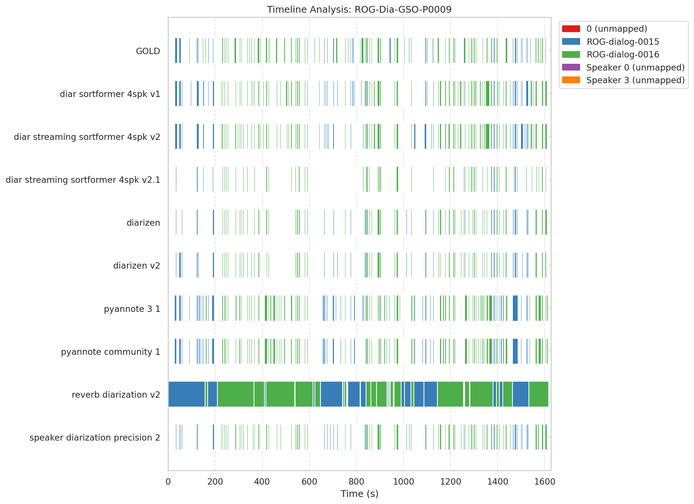

#### 60-Second Snippets (Zoom-in)
Below are 60-second zoomed-in windows showing where the models performed best and worst (based on average DER).

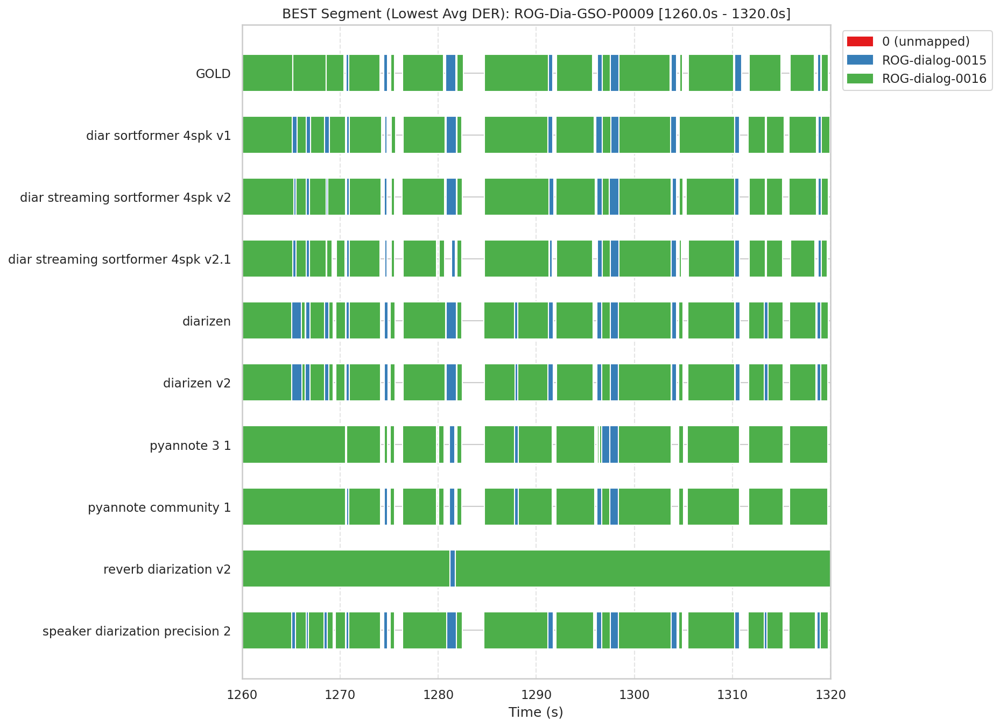

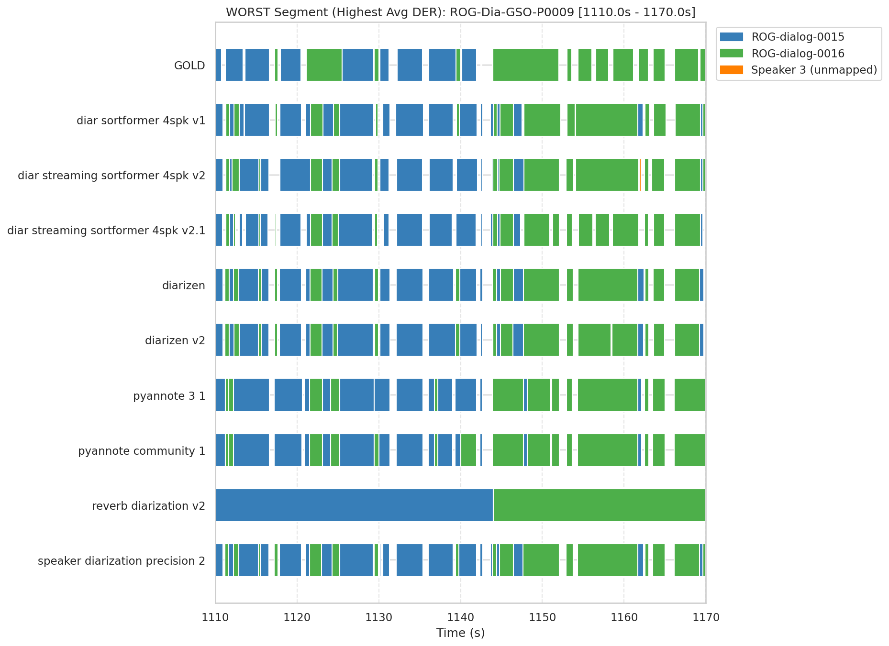

#### Metrics (Collar: 0.00s)

| Model                               | DER       | JER       | Miss     | FA       | Conf     | B-P       | B-R       | B-F1      | Pur       | Cov       | VRAM (GB)   |
|-------------------------------------|-----------|-----------|----------|----------|----------|-----------|-----------|-----------|-----------|-----------|-------------|
| speaker diarization precision 2     | **16.86** | **17.17** | **7.98** | 7.87     | **1.01** | **67.54** | 74.93     | **71.04** | 79.79     | 79.79     | **0.0**     |
| diar streaming sortformer 4spk v2.1 | 18.72     | 19.60     | 13.35    | **4.19** | 1.19     | 60.43     | **78.13** | 68.15     | 80.67     | 80.60     | 1.4         |
| diar streaming sortformer 4spk v2   | 18.87     | 19.21     | 10.69    | 6.91     | 1.27     | 66.86     | 65.60     | 66.23     | **80.71** | **80.64** | 1.4         |
| diar sortformer 4spk v1             | 19.31     | 19.25     | 8.89     | 9.00     | 1.42     | 60.95     | 63.70     | 62.30     | 79.57     | 79.57     | 87.1        |
| pyannote community 1                | 22.45     | 25.34     | 10.48    | 7.41     | 4.57     | 60.36     | 59.04     | 59.69     | 77.81     | 77.81     | 1.6         |
| pyannote 3 1                        | 22.49     | 25.30     | 10.48    | 7.41     | 4.60     | 65.07     | 57.58     | 61.10     | 77.78     | 77.78     | 1.6         |
| reverb diarization v2               | 39.31     | 37.94     | 12.88    | 18.64    | 7.79     | 27.27     | 1.75      | 3.29      | 78.63     | 78.63     | 4.3         |

#### Metrics (Collar: 0.25s)

| Model                               | DER       | JER       | Miss     | FA       | Conf     | B-P       | B-R       | B-F1      | Pur       | Cov       | VRAM (GB)   |
|-------------------------------------|-----------|-----------|----------|----------|----------|-----------|-----------|-----------|-----------|-----------|-------------|
| speaker diarization precision 2     | **11.09** | **12.19** | **7.24** | 3.13     | **0.73** | **67.54** | 74.93     | **71.04** | 80.63     | 84.44     | **0.0**     |
| diar sortformer 4spk v1             | 13.03     | 13.72     | 7.61     | 4.53     | 0.89     | 60.95     | 63.70     | 62.30     | 80.56     | 84.58     | 87.1        |
| diar streaming sortformer 4spk v2   | 13.19     | 14.15     | 8.91     | 3.39     | 0.90     | 66.86     | 65.60     | 66.23     | **81.43** | 85.58     | 1.4         |
| diar streaming sortformer 4spk v2.1 | 14.19     | 15.39     | 11.37    | **1.98** | 0.84     | 60.43     | **78.13** | 68.15     | 81.36     | **85.98** | 1.4         |
| pyannote 3 1                        | 16.43     | 19.90     | 9.48     | 3.33     | 3.61     | 65.07     | 57.58     | 61.10     | 79.02     | 80.46     | 1.6         |
| pyannote community 1                | 16.49     | 20.15     | 9.48     | 3.33     | 3.67     | 60.36     | 59.04     | 59.69     | 78.97     | 80.56     | 1.6         |
| reverb diarization v2               | 32.60     | 33.06     | 12.65    | 13.75    | 6.20     | 27.27     | 1.75      | 3.29      | 80.43     | 79.16     | 4.3         |

---

### File: ROG-Dia-GSO-P0011

**Domain:** Intervju | **Quality:** 4 | **Device:** Mobilna naprava Iphone 13, aplikacija Voice Record.

> *Govorca sta ženska in moški, oba stara okrog 50 let. Je večer, sedita za kuhinjsko mizo. Ženska postavlja moškemu vprašanja o domačem kraju, običajih in spominih iz otroštva ter mladosti. Moški odgovarja na njena vprašanja, ona pa ga med tem tudi spomni na pomembne točke, ki bi jih lahko vključil v svoje odgovore.*

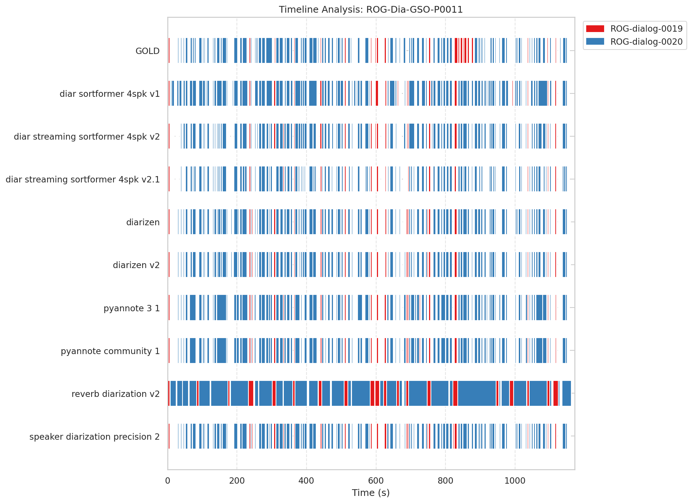

#### 60-Second Snippets (Zoom-in)
Below are 60-second zoomed-in windows showing where the models performed best and worst (based on average DER).

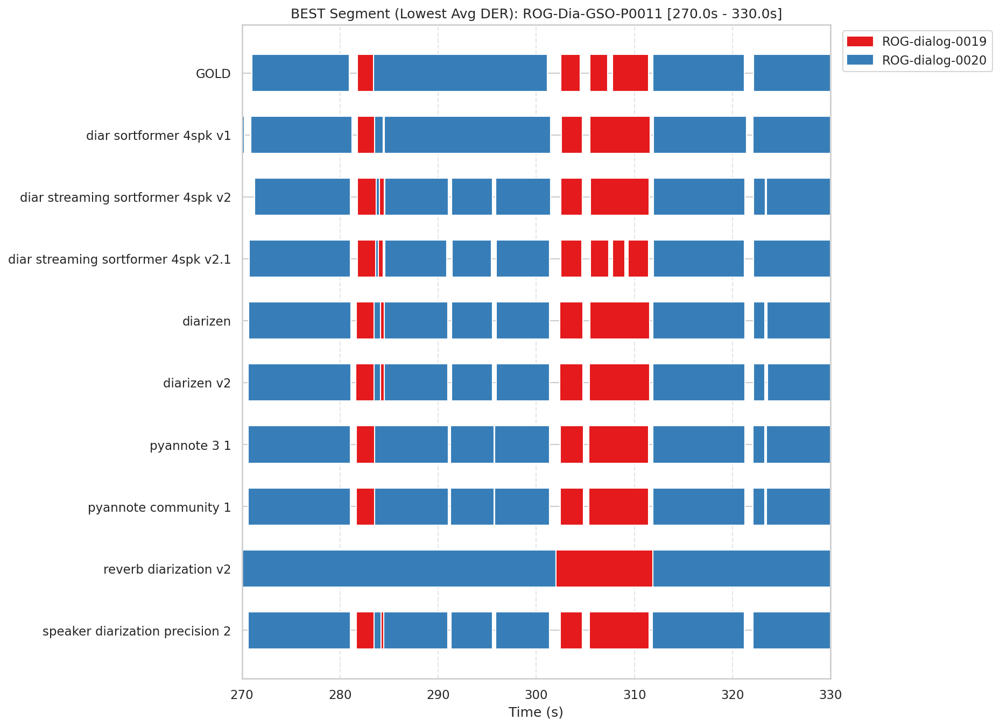

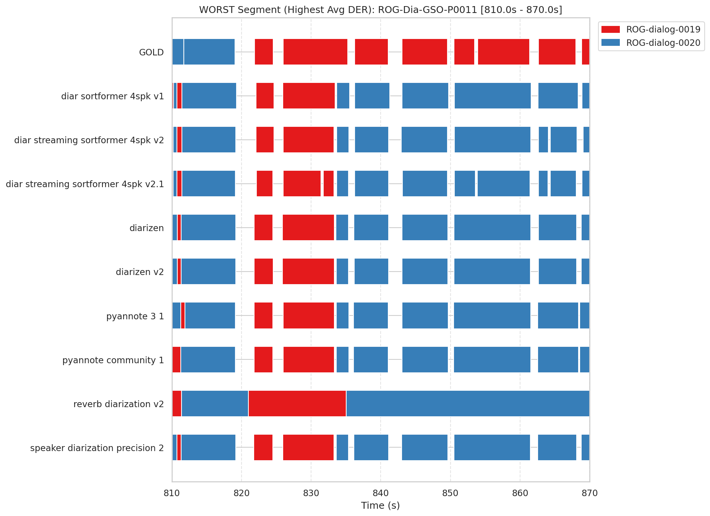

#### Metrics (Collar: 0.00s)

| Model                               | DER       | JER       | Miss     | FA       | Conf     | B-P       | B-R       | B-F1      | Pur       | Cov       | VRAM (GB)   |
|-------------------------------------|-----------|-----------|----------|----------|----------|-----------|-----------|-----------|-----------|-----------|-------------|
| speaker diarization precision 2     | **15.16** | **22.26** | **2.83** | 7.69     | 4.65     | **79.40** | 80.12     | **79.76** | 87.33     | 87.33     | **0.0**     |
| diar streaming sortformer 4spk v2.1 | 15.35     | 22.95     | 6.15     | **4.55** | 4.65     | 71.24     | **82.83** | 76.60     | 87.31     | 87.31     | 1.1         |
| pyannote 3 1                        | 16.32     | 24.11     | 3.19     | 8.16     | 4.96     | 72.31     | 70.78     | 71.54     | 87.18     | 87.18     | 1.6         |
| pyannote community 1                | 16.35     | 24.00     | 3.19     | 8.16     | 4.99     | 71.52     | 71.08     | 71.30     | 87.15     | 87.15     | 1.6         |
| diar streaming sortformer 4spk v2   | 16.91     | 23.60     | 5.86     | 6.48     | **4.58** | 78.25     | 72.59     | 75.31     | 87.52     | 87.52     | 1.1         |
| diar sortformer 4spk v1             | 19.75     | 25.29     | 3.84     | 11.20    | 4.71     | 65.43     | 53.01     | 58.57     | **87.62** | **87.62** | 45.7        |
| reverb diarization v2               | 39.69     | 42.16     | 4.63     | 27.01    | 8.05     | 32.10     | 7.83      | 12.59     | 86.50     | 86.50     | 4.3         |

#### Metrics (Collar: 0.25s)

| Model                               | DER       | JER       | Miss     | FA       | Conf     | B-P       | B-R       | B-F1      | Pur       | Cov       | VRAM (GB)   |
|-------------------------------------|-----------|-----------|----------|----------|----------|-----------|-----------|-----------|-----------|-----------|-------------|
| speaker diarization precision 2     | **10.48** | **18.94** | **2.14** | 3.74     | 4.60     | **79.40** | 80.12     | **79.76** | 87.95     | 89.93     | **0.0**     |
| pyannote 3 1                        | 11.72     | 20.80     | 2.39     | 4.50     | 4.83     | 72.31     | 70.78     | 71.54     | 87.82     | 89.27     | 1.6         |
| pyannote community 1                | 11.75     | 20.72     | 2.39     | 4.50     | 4.87     | 71.52     | 71.08     | 71.30     | 87.79     | 89.29     | 1.6         |
| diar streaming sortformer 4spk v2.1 | 12.02     | 20.30     | 4.60     | **2.79** | 4.63     | 71.24     | **82.83** | 76.60     | 87.96     | 89.97     | 1.1         |
| diar streaming sortformer 4spk v2   | 12.25     | 20.21     | 4.21     | 3.50     | **4.54** | 78.25     | 72.59     | 75.31     | 88.20     | 89.91     | 1.1         |
| diar sortformer 4spk v1             | 14.22     | 21.53     | 2.79     | 6.82     | 4.61     | 65.43     | 53.01     | 58.57     | **88.26** | **90.15** | 45.7        |
| reverb diarization v2               | 33.86     | 39.24     | 4.16     | 22.24    | 7.46     | 32.10     | 7.83      | 12.59     | 87.65     | 87.35     | 4.3         |

---

### File: ROG-Dia-GSO-P0012

**Domain:** Intervju | **Quality:** 4 | **Device:** Pametni telefon Samsung Galaxy a53

> *Ena od sogovornic je prišla na obisk k drugi. Usedli sta se za mizo in pričeli s pogovorom.*

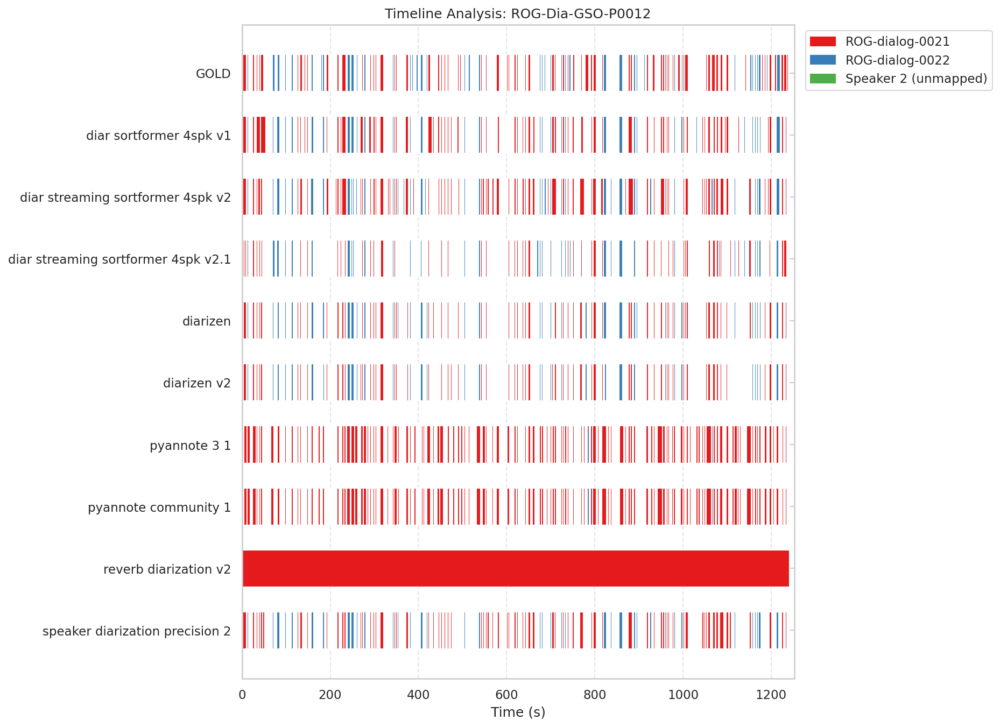

#### 60-Second Snippets (Zoom-in)
Below are 60-second zoomed-in windows showing where the models performed best and worst (based on average DER).

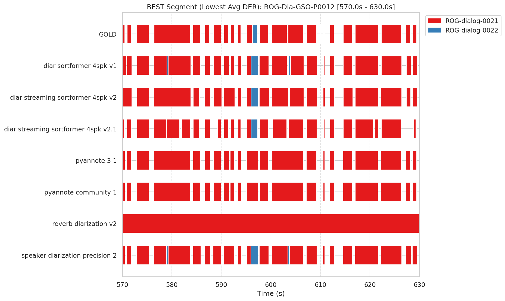

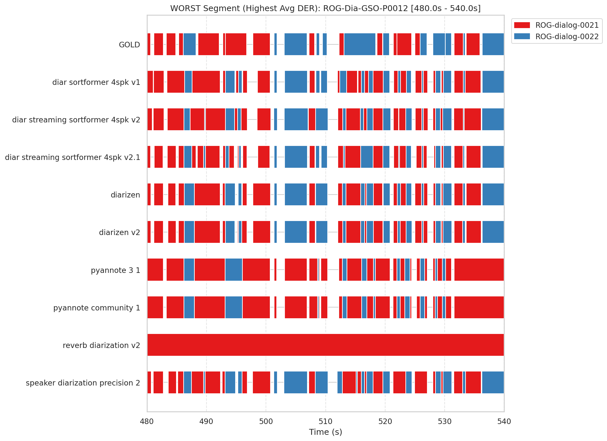

#### Metrics (Collar: 0.00s)

| Model                               | DER       | JER       | Miss     | FA       | Conf     | B-P        | B-R       | B-F1      | Pur       | Cov        | VRAM (GB)   |
|-------------------------------------|-----------|-----------|----------|----------|----------|------------|-----------|-----------|-----------|------------|-------------|
| speaker diarization precision 2     | **14.49** | **14.41** | **7.02** | 6.82     | **0.64** | 78.04      | **82.94** | **80.42** | 82.26     | 82.26      | **0.0**     |
| diar sortformer 4spk v1             | 14.66     | 14.84     | 8.21     | 5.71     | 0.74     | 72.43      | 78.82     | 75.49     | 82.40     | 82.40      | 51.9        |
| diar streaming sortformer 4spk v2   | 16.26     | 16.17     | 7.18     | 8.25     | 0.84     | 79.45      | 74.31     | 76.80     | 81.52     | 81.52      | 1.2         |
| diar streaming sortformer 4spk v2.1 | 17.86     | 18.54     | 14.18    | **2.75** | 0.93     | 63.40      | 76.08     | 69.16     | **83.15** | 83.15      | 1.2         |
| pyannote community 1                | 40.78     | 59.68     | 7.06     | 6.69     | 27.03    | 73.91      | 60.00     | 66.23     | 58.54     | 87.50      | 1.6         |
| pyannote 3 1                        | 40.78     | 59.68     | 7.06     | 6.69     | 27.03    | 73.91      | 60.00     | 66.23     | 58.54     | 87.50      | 1.6         |
| reverb diarization v2               | 58.66     | 71.90     | 12.04    | 18.46    | 28.15    | **100.00** | 0.00      | 0.00      | 59.81     | **100.00** | 4.3         |

#### Metrics (Collar: 0.25s)

| Model                               | DER      | JER      | Miss     | FA       | Conf     | B-P        | B-R       | B-F1      | Pur       | Cov        | VRAM (GB)   |
|-------------------------------------|----------|----------|----------|----------|----------|------------|-----------|-----------|-----------|------------|-------------|
| speaker diarization precision 2     | **8.82** | **9.40** | 6.62     | 1.71     | 0.49     | 78.04      | **82.94** | **80.42** | 82.91     | 86.66      | **0.0**     |
| diar streaming sortformer 4spk v2   | 9.55     | 10.36    | **6.17** | 2.78     | 0.61     | 79.45      | 74.31     | 76.80     | 82.21     | 85.33      | 1.2         |
| diar sortformer 4spk v1             | 9.73     | 10.32    | 6.92     | 2.34     | **0.48** | 72.43      | 78.82     | 75.49     | 83.00     | 87.51      | 51.9        |
| diar streaming sortformer 4spk v2.1 | 13.66    | 14.50    | 11.99    | **0.93** | 0.74     | 63.40      | 76.08     | 69.16     | **83.75** | 87.94      | 1.2         |
| pyannote community 1                | 36.52    | 58.10    | 6.33     | 3.01     | 27.18    | 73.91      | 60.00     | 66.23     | 58.81     | 89.79      | 1.6         |
| pyannote 3 1                        | 36.52    | 58.10    | 6.33     | 3.01     | 27.18    | 73.91      | 60.00     | 66.23     | 58.81     | 89.79      | 1.6         |
| reverb diarization v2               | 52.73    | 70.26    | 11.76    | 12.87    | 28.11    | **100.00** | 0.00      | 0.00      | 60.14     | **100.00** | 4.3         |

---

### File: ROG-Dia-GSO-P0016

**Domain:** Diskusija | **Quality:** 3 | **Device:** pametni telefon Huawei P30 PRO

> *Starejši moški in ženska imata diskusijo o svojem otroštvu, odraščanju na kmetih. *

> ⚠️ **ERRATA APPLIED**: Evaluation bounded to 1172.092s.

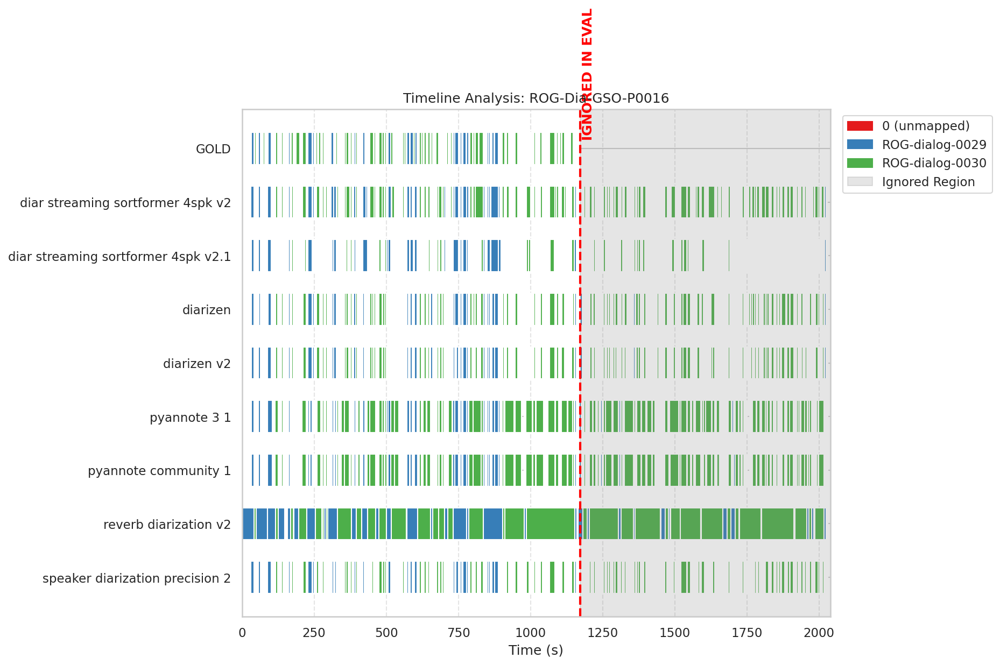

#### 60-Second Snippets (Zoom-in)
Below are 60-second zoomed-in windows showing where the models performed best and worst (based on average DER).

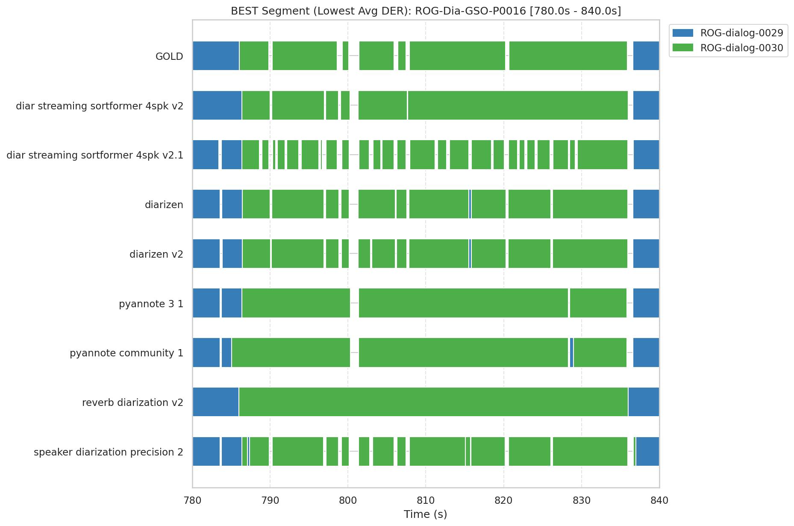

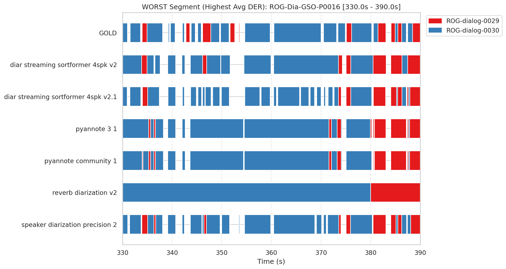

#### Metrics (Collar: 0.00s)

| Model                               | DER       | JER       | Miss     | FA       | Conf     | B-P       | B-R       | B-F1      | Pur       | Cov       | VRAM (GB)   | Status   |
|-------------------------------------|-----------|-----------|----------|----------|----------|-----------|-----------|-----------|-----------|-----------|-------------|----------|
| speaker diarization precision 2     | **15.21** | **15.49** | 8.73     | 5.55     | **0.93** | 34.02     | 65.95     | **44.89** | 79.25     | 79.25     | **0.0**     | nan      |
| diar streaming sortformer 4spk v2   | 16.23     | 16.25     | **7.94** | 7.22     | 1.08     | **34.92** | 51.21     | 41.52     | 79.11     | 79.11     | 1.6         | nan      |
| diar streaming sortformer 4spk v2.1 | 18.04     | 18.40     | 12.65    | **4.14** | 1.26     | 26.65     | **68.10** | 38.31     | 79.40     | 79.40     | 1.6         | nan      |
| pyannote 3 1                        | 20.95     | 21.49     | 9.63     | 8.66     | 2.66     | 27.09     | 32.98     | 29.75     | 78.25     | 78.25     | 1.6         | nan      |
| pyannote community 1                | 21.28     | 22.03     | 9.63     | 8.66     | 2.99     | 24.07     | 32.98     | 27.83     | 77.95     | 77.95     | 1.6         | nan      |
| reverb diarization v2               | 30.66     | 31.21     | 13.43    | 11.38    | 5.85     | 23.91     | 5.90      | 9.46      | **79.89** | **79.89** | 4.3         | nan      |
| diar sortformer 4spk v1             | nan       | nan       | nan      | nan      | nan      | nan       | nan       | nan       | nan       | nan       | nan         | OOM/ERR  |

#### Metrics (Collar: 0.25s)

| Model                               | DER       | JER       | Miss     | FA       | Conf     | B-P       | B-R       | B-F1      | Pur       | Cov       | VRAM (GB)   | Status   |
|-------------------------------------|-----------|-----------|----------|----------|----------|-----------|-----------|-----------|-----------|-----------|-------------|----------|
| speaker diarization precision 2     | **11.19** | 11.94     | 7.93     | 2.51     | **0.76** | 34.02     | 65.95     | **44.89** | 79.90     | 82.90     | **0.0**     | nan      |
| diar streaming sortformer 4spk v2   | 11.26     | **11.92** | **7.06** | 3.39     | 0.81     | **34.92** | 51.21     | 41.52     | 79.88     | 82.72     | 1.6         | nan      |
| diar streaming sortformer 4spk v2.1 | 14.62     | 15.26     | 11.41    | **2.16** | 1.05     | 26.65     | **68.10** | 38.31     | 79.97     | **83.19** | 1.6         | nan      |
| pyannote 3 1                        | 16.42     | 17.62     | 8.93     | 5.32     | 2.16     | 27.09     | 32.98     | 29.75     | 79.10     | 81.30     | 1.6         | nan      |
| pyannote community 1                | 16.74     | 18.20     | 8.93     | 5.32     | 2.49     | 24.07     | 32.98     | 27.83     | 78.81     | 81.02     | 1.6         | nan      |
| reverb diarization v2               | 25.67     | 27.41     | 13.01    | 7.52     | 5.13     | 23.91     | 5.90      | 9.46      | **81.04** | 80.53     | 4.3         | nan      |
| diar sortformer 4spk v1             | nan       | nan       | nan      | nan      | nan      | nan       | nan       | nan       | nan       | nan       | nan         | OOM/ERR  |

---

### File: ROG-Dia-GSO-P0018

**Domain:** Družabni pogovor | **Quality:** 5 | **Device:** telefon Samsung A52

> *Dobili smo se v župnišču, se pogovorili o prostoru snemanja, zahtevah posnetka. Govorki sta se odločili za spontan družabni pogovor brez vnaprej pripravljenih tem in vprašanj.*

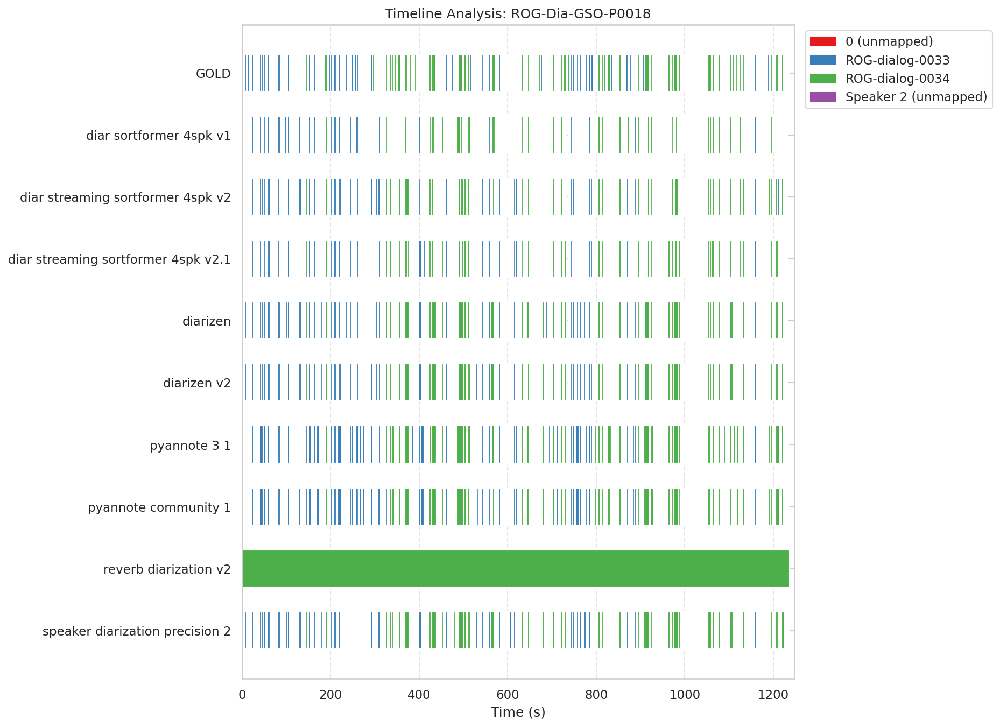

#### 60-Second Snippets (Zoom-in)
Below are 60-second zoomed-in windows showing where the models performed best and worst (based on average DER).

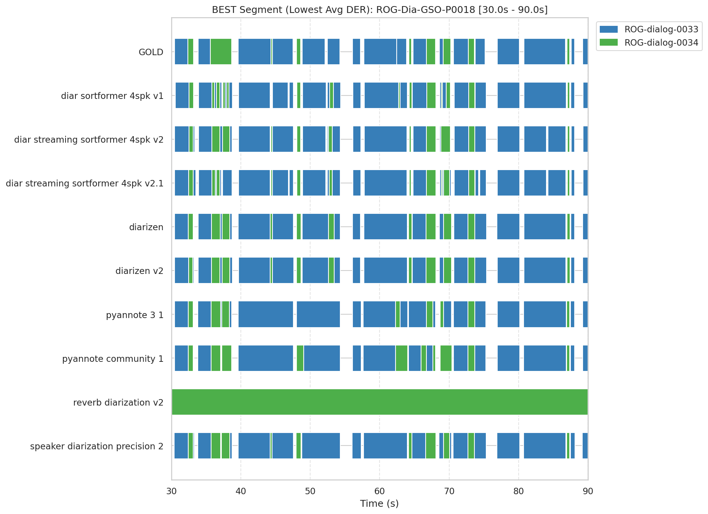

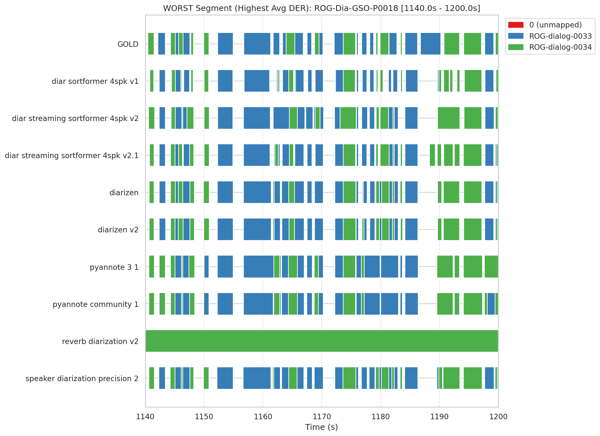

#### Metrics (Collar: 0.00s)

| Model                               | DER       | JER       | Miss     | FA       | Conf     | B-P        | B-R       | B-F1      | Pur       | Cov        | VRAM (GB)   |
|-------------------------------------|-----------|-----------|----------|----------|----------|------------|-----------|-----------|-----------|------------|-------------|
| speaker diarization precision 2     | **17.62** | **17.32** | **8.71** | 7.66     | **1.25** | 76.75      | 71.30     | **73.92** | **78.67** | 78.67      | **0.0**     |
| diar streaming sortformer 4spk v2   | 19.32     | 19.63     | 11.85    | 5.66     | 1.81     | 69.12      | 71.00     | 70.04     | 77.99     | 77.96      | 1.2         |
| diar streaming sortformer 4spk v2.1 | 19.74     | 20.20     | 12.44    | 5.31     | 1.99     | 66.80      | **73.56** | 70.02     | 78.15     | 78.08      | 1.2         |
| pyannote 3 1                        | 22.54     | 25.16     | 8.92     | 7.56     | 6.06     | 64.22      | 52.87     | 58.00     | 74.70     | 74.70      | 1.6         |
| pyannote community 1                | 24.43     | 28.04     | 8.92     | 7.57     | 7.95     | 57.10      | 55.89     | 56.49     | 73.03     | 73.03      | 1.6         |
| diar sortformer 4spk v1             | 24.88     | 25.86     | 17.50    | **4.61** | 2.77     | 53.82      | 70.24     | 60.94     | 76.71     | 76.71      | 51.6        |
| reverb diarization v2               | 63.54     | 74.80     | 13.10    | 14.77    | 35.67    | **100.00** | 0.00      | 0.00      | 51.23     | **100.00** | 4.3         |

#### Metrics (Collar: 0.25s)

| Model                               | DER       | JER       | Miss     | FA       | Conf     | B-P        | B-R       | B-F1      | Pur       | Cov        | VRAM (GB)   |
|-------------------------------------|-----------|-----------|----------|----------|----------|------------|-----------|-----------|-----------|------------|-------------|
| speaker diarization precision 2     | **10.78** | **11.27** | **7.65** | **2.29** | **0.84** | 76.75      | 71.30     | **73.92** | **80.76** | 82.43      | **0.0**     |
| diar streaming sortformer 4spk v2   | 13.56     | 14.40     | 9.83     | 2.34     | 1.39     | 69.12      | 71.00     | 70.04     | 79.79     | 82.49      | 1.2         |
| diar streaming sortformer 4spk v2.1 | 14.58     | 15.50     | 10.61    | 2.38     | 1.59     | 66.80      | **73.56** | 70.02     | 79.84     | 83.02      | 1.2         |
| pyannote 3 1                        | 15.37     | 18.78     | 7.80     | 2.73     | 4.83     | 64.22      | 52.87     | 58.00     | 77.17     | 78.18      | 1.6         |
| pyannote community 1                | 17.44     | 22.21     | 7.80     | 2.74     | 6.90     | 57.10      | 55.89     | 56.49     | 75.34     | 76.57      | 1.6         |
| diar sortformer 4spk v1             | 19.43     | 20.59     | 15.25    | 2.30     | 1.88     | 53.82      | 70.24     | 60.94     | 78.70     | 81.59      | 51.6        |
| reverb diarization v2               | 58.25     | 73.54     | 12.33    | 9.85     | 36.06    | **100.00** | 0.00      | 0.00      | 51.60     | **100.00** | 4.3         |

---

### File: ROG-Dia-GSO-P0019

**Domain:** Pripoved | **Quality:** 4 | **Device:** Iphone 13 mini

> *Pogovor med sestro in bratom, ki sta se pogovarjala o potovanjih. Sestra je delila svojo izkušnjo potovanja v tujino, medtem ko jo je brat spraševal še o drugih vidikih potovanja – od priprav pred odhodom do krajev, ki jih je obiskala.*

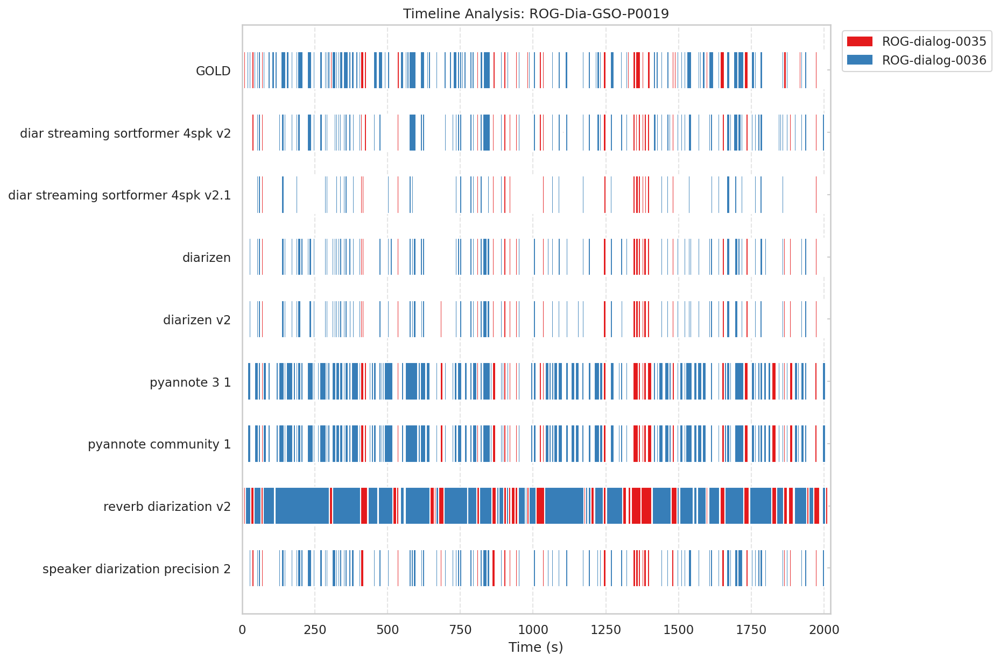

#### 60-Second Snippets (Zoom-in)
Below are 60-second zoomed-in windows showing where the models performed best and worst (based on average DER).

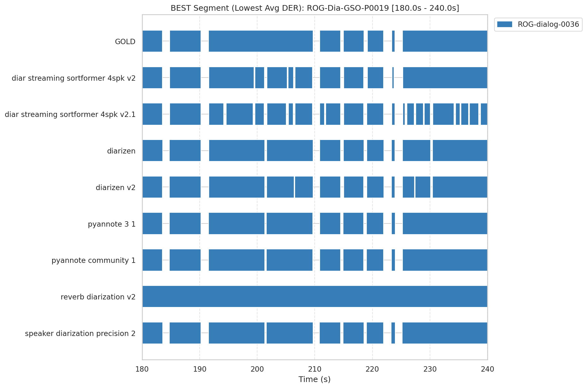

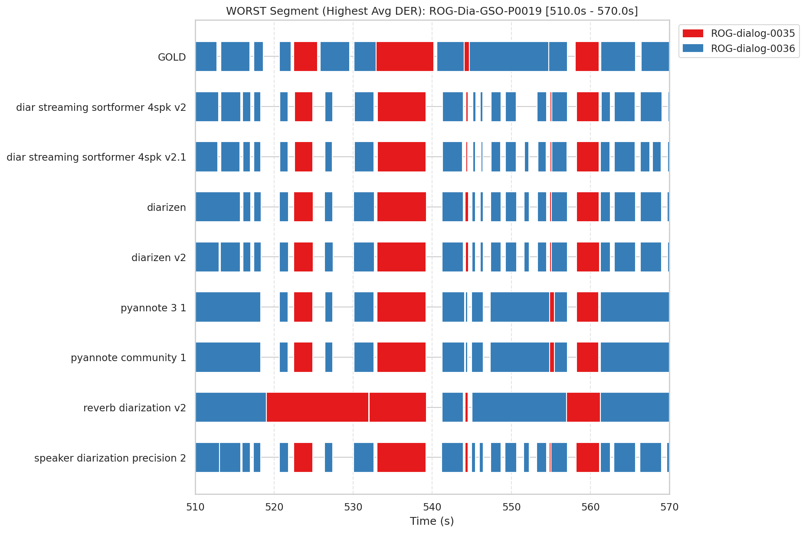

#### Metrics (Collar: 0.00s)

| Model                               | DER      | JER      | Miss     | FA       | Conf     | B-P       | B-R       | B-F1      | Pur       | Cov       | VRAM (GB)   | Status   |
|-------------------------------------|----------|----------|----------|----------|----------|-----------|-----------|-----------|-----------|-----------|-------------|----------|
| speaker diarization precision 2     | **9.46** | **9.61** | 6.88     | 2.53     | 0.04     | **70.93** | **83.80** | **76.83** | 98.32     | 98.32     | **0.0**     | nan      |
| diar streaming sortformer 4spk v2   | 10.82    | 11.49    | 8.87     | 1.92     | **0.03** | 69.33     | 78.62     | 73.68     | 98.30     | 98.30     | 1.6         | nan      |
| pyannote 3 1                        | 12.24    | 11.61    | 5.10     | 7.01     | 0.13     | 69.35     | 55.72     | 61.80     | 97.86     | 97.86     | 1.6         | nan      |
| pyannote community 1                | 12.28    | 11.70    | 5.10     | 7.01     | 0.16     | 68.80     | 55.72     | 61.58     | 97.83     | 97.83     | 1.6         | nan      |
| diar streaming sortformer 4spk v2.1 | 13.24    | 13.32    | 12.39    | **0.81** | 0.04     | 54.89     | 83.59     | 66.27     | **98.35** | **98.35** | 1.6         | nan      |
| reverb diarization v2               | 25.98    | 26.34    | **1.67** | 20.11    | 4.20     | 36.19     | 8.21      | 13.38     | 93.77     | 93.77     | 4.3         | nan      |
| diar sortformer 4spk v1             | nan      | nan      | nan      | nan      | nan      | nan       | nan       | nan       | nan       | nan       | nan         | OOM/ERR  |

#### Metrics (Collar: 0.25s)

| Model                               | DER      | JER      | Miss     | FA       | Conf     | B-P       | B-R       | B-F1      | Pur       | Cov       | VRAM (GB)   | Status   |
|-------------------------------------|----------|----------|----------|----------|----------|-----------|-----------|-----------|-----------|-----------|-------------|----------|
| speaker diarization precision 2     | **6.12** | **6.27** | 5.69     | 0.42     | 0.00     | **70.93** | **83.80** | **76.83** | **98.60** | 98.82     | **0.0**     | nan      |
| diar streaming sortformer 4spk v2   | 7.62     | 8.22     | 7.11     | 0.50     | **0.00** | 69.33     | 78.62     | 73.68     | 98.55     | 98.84     | 1.6         | nan      |
| pyannote 3 1                        | 8.03     | 7.83     | 4.04     | 3.94     | 0.04     | 69.35     | 55.72     | 61.80     | 98.19     | 98.43     | 1.6         | nan      |
| pyannote community 1                | 8.06     | 7.91     | 4.04     | 3.94     | 0.08     | 68.80     | 55.72     | 61.58     | 98.16     | 98.41     | 1.6         | nan      |
| diar streaming sortformer 4spk v2.1 | 10.52    | 10.39    | 10.36    | **0.15** | 0.01     | 54.89     | 83.59     | 66.27     | 98.59     | **98.85** | 1.6         | nan      |
| reverb diarization v2               | 20.28    | 22.32    | **1.42** | 15.04    | 3.82     | 36.19     | 8.21      | 13.38     | 94.37     | 94.51     | 4.3         | nan      |
| diar sortformer 4spk v1             | nan      | nan      | nan      | nan      | nan      | nan       | nan       | nan       | nan       | nan       | nan         | OOM/ERR  |

---

### File: ROG-Dia-GSO-P0021

**Domain:** Družabni pogovor | **Quality:** 4 | **Device:** Apple iPhone 15 Pro

> *Prijateljski pogovor med 2 osebama, ki se pogovarjata o splošnih temah; delo, prosti čas, hišni ljubljenčki, načrti za prihodnost, opis dela, itd*

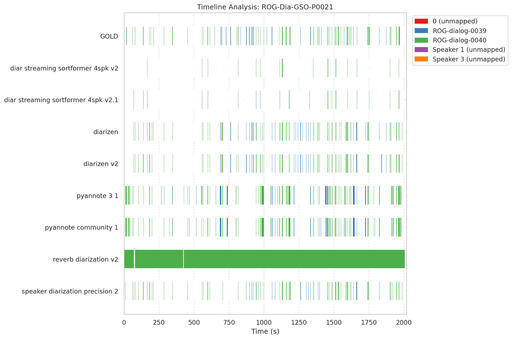

#### 60-Second Snippets (Zoom-in)
Below are 60-second zoomed-in windows showing where the models performed best and worst (based on average DER).

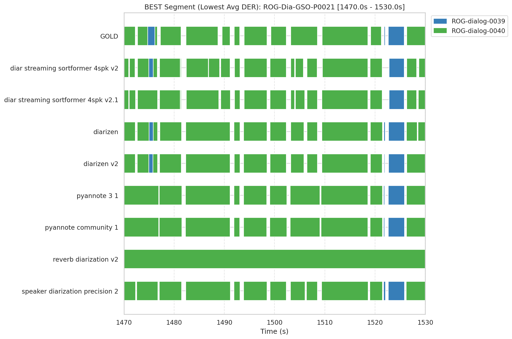

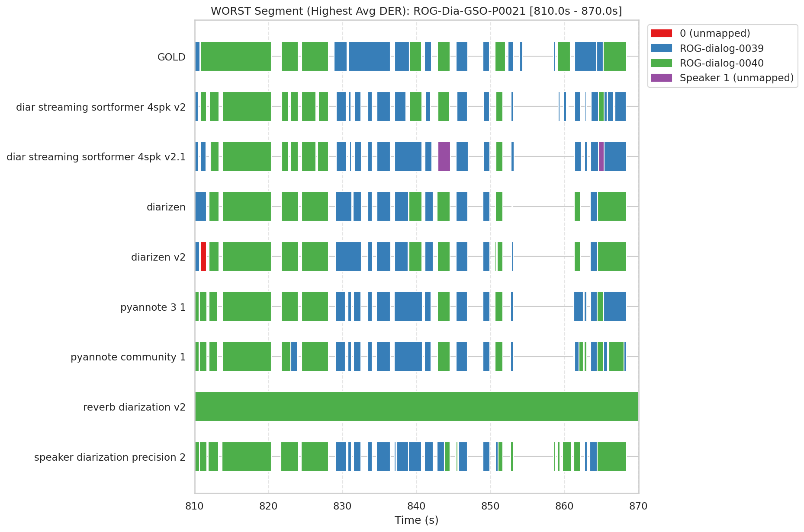

#### Metrics (Collar: 0.00s)

| Model                               | DER       | JER       | Miss     | FA       | Conf     | B-P       | B-R       | B-F1      | Pur       | Cov        | VRAM (GB)   | Status   |
|-------------------------------------|-----------|-----------|----------|----------|----------|-----------|-----------|-----------|-----------|------------|-------------|----------|
| speaker diarization precision 2     | **14.37** | **15.44** | 4.79     | 7.37     | **2.21** | **74.49** | 84.89     | **79.35** | **92.80** | 92.80      | **0.0**     | nan      |
| diar streaming sortformer 4spk v2   | 17.84     | 19.56     | 12.16    | **3.29** | 2.40     | 62.72     | **86.19** | 72.61     | 92.71     | 92.71      | 1.6         | nan      |
| pyannote 3 1                        | 21.90     | 24.91     | 5.73     | 9.69     | 6.47     | 59.92     | 64.75     | 62.24     | 89.25     | 89.25      | 1.6         | nan      |
| pyannote community 1                | 22.86     | 26.31     | 5.74     | 9.69     | 7.43     | 52.52     | 66.04     | 58.51     | 88.28     | 88.28      | 1.6         | nan      |
| diar streaming sortformer 4spk v2.1 | 54.50     | 56.32     | 11.43    | 4.69     | 38.38    | 59.56     | 84.75     | 69.95     | 81.77     | 53.63      | 1.6         | nan      |
| reverb diarization v2               | 74.57     | 78.02     | **2.31** | 31.26    | 41.00    | 0.00      | 0.00      | 0.00      | 56.73     | **100.00** | 4.3         | nan      |
| diar sortformer 4spk v1             | nan       | nan       | nan      | nan      | nan      | nan       | nan       | nan       | nan       | nan        | nan         | OOM/ERR  |

#### Metrics (Collar: 0.25s)

| Model                               | DER      | JER       | Miss     | FA       | Conf     | B-P       | B-R       | B-F1      | Pur       | Cov        | VRAM (GB)   | Status   |
|-------------------------------------|----------|-----------|----------|----------|----------|-----------|-----------|-----------|-----------|------------|-------------|----------|
| speaker diarization precision 2     | **8.62** | **10.38** | 4.09     | 2.66     | **1.87** | **74.49** | 84.89     | **79.35** | **93.88** | 94.82      | **0.0**     | nan      |
| diar streaming sortformer 4spk v2   | 13.85    | 15.91     | 10.13    | **1.53** | 2.19     | 62.72     | **86.19** | 72.61     | 93.48     | 94.67      | 1.6         | nan      |
| pyannote 3 1                        | 15.58    | 19.66     | 4.62     | 5.32     | 5.63     | 59.92     | 64.75     | 62.24     | 90.68     | 90.98      | 1.6         | nan      |
| pyannote community 1                | 16.63    | 21.33     | 4.62     | 5.32     | 6.68     | 52.52     | 66.04     | 58.51     | 89.62     | 90.37      | 1.6         | nan      |
| diar streaming sortformer 4spk v2.1 | 51.09    | 54.64     | 9.48     | 2.48     | 39.13    | 59.56     | 84.75     | 69.95     | 82.37     | 54.62      | 1.6         | nan      |
| reverb diarization v2               | 67.16    | 76.57     | **1.95** | 24.64    | 40.56    | 0.00      | 0.00      | 0.00      | 57.52     | **100.00** | 4.3         | nan      |
| diar sortformer 4spk v1             | nan      | nan       | nan      | nan      | nan      | nan       | nan       | nan       | nan       | nan        | nan         | OOM/ERR  |

---

### File: ROG-Dia-GSO-P0022

**Domain:** Družabni pogovor | **Quality:** 5 | **Device:** Pametni telefon iphone 11 z aplikacijo Voice Record Pro z naročenimi nastavitvami. 

> *Pogovor med sorodnikoma o glasbenih skupinah in glasbenih izkušnjah.*

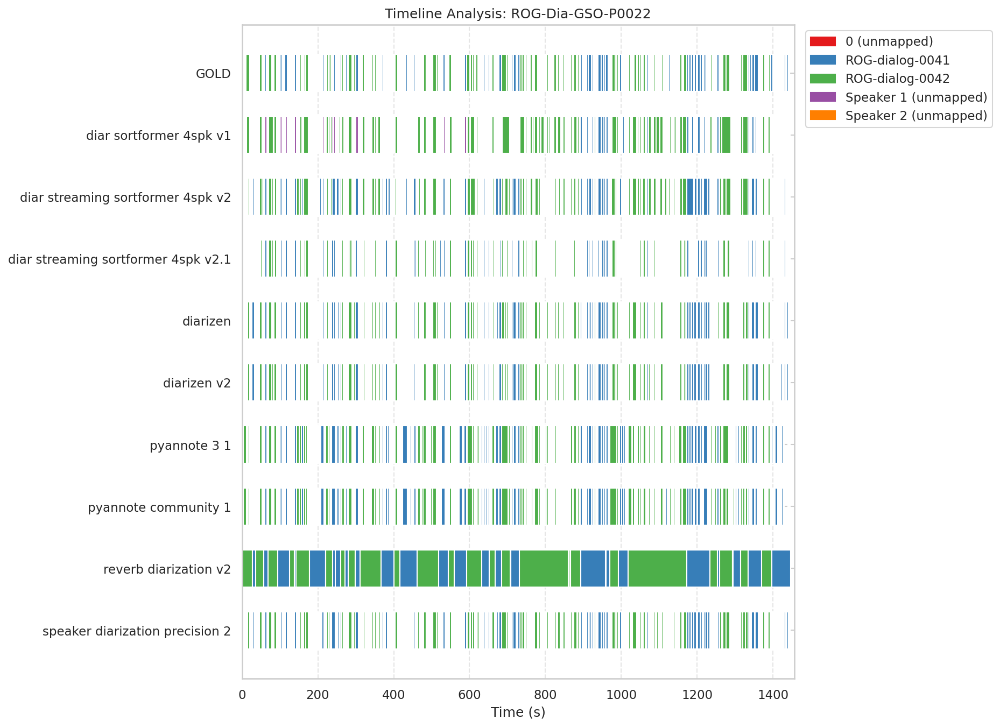

#### 60-Second Snippets (Zoom-in)
Below are 60-second zoomed-in windows showing where the models performed best and worst (based on average DER).

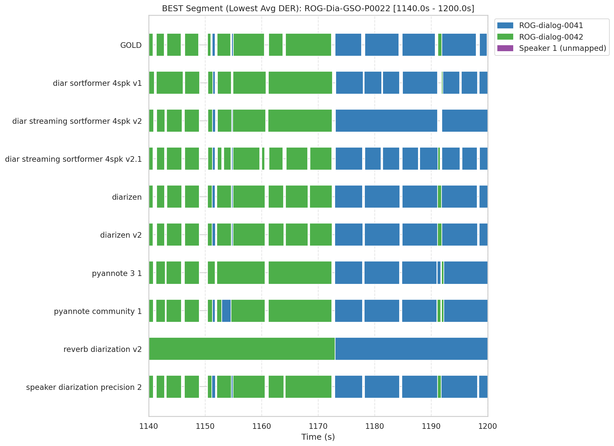

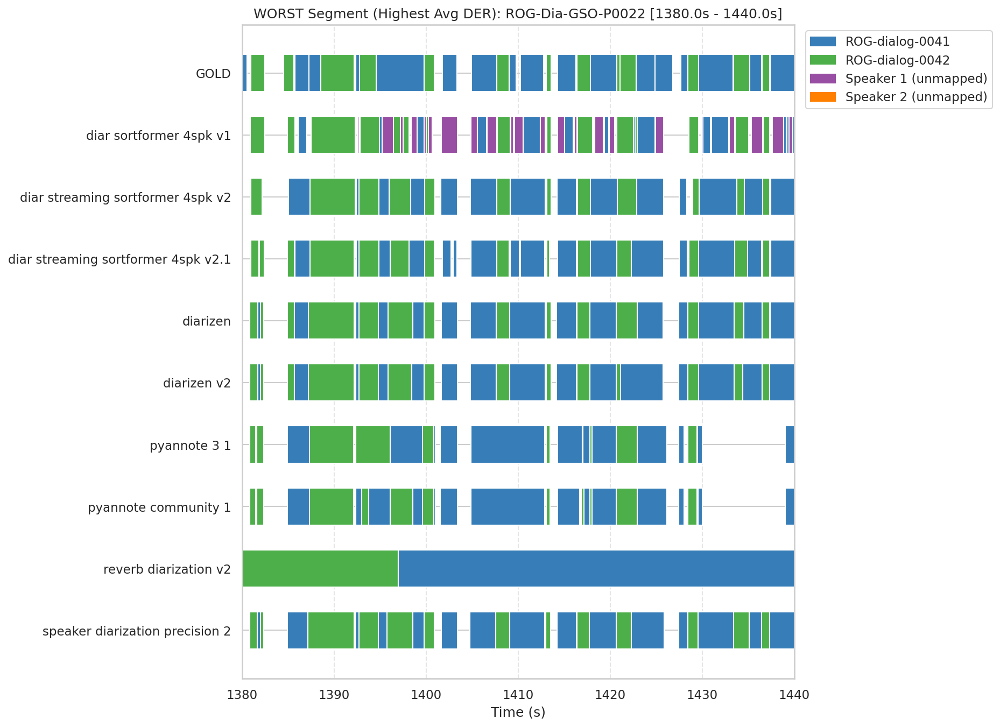

#### Metrics (Collar: 0.00s)

| Model                               | DER       | JER       | Miss     | FA       | Conf     | B-P       | B-R       | B-F1      | Pur       | Cov       | VRAM (GB)   |
|-------------------------------------|-----------|-----------|----------|----------|----------|-----------|-----------|-----------|-----------|-----------|-------------|
| speaker diarization precision 2     | **12.56** | **12.14** | **3.03** | 8.81     | **0.73** | **83.67** | 70.36     | **76.44** | 86.40     | 86.40     | **0.0**     |
| diar streaming sortformer 4spk v2.1 | 14.41     | 14.34     | 8.21     | **5.27** | 0.93     | 68.01     | **70.98** | 69.47     | 87.13     | 87.08     | 1.3         |
| diar streaming sortformer 4spk v2   | 16.40     | 16.28     | 7.05     | 7.83     | 1.51     | 76.97     | 57.88     | 66.07     | 87.25     | **87.15** | 1.3         |
| pyannote 3 1                        | 18.61     | 19.93     | 4.94     | 9.77     | 3.90     | 70.44     | 52.42     | 60.11     | 84.08     | 84.08     | 1.6         |
| pyannote community 1                | 18.84     | 20.27     | 4.94     | 9.77     | 4.13     | 66.67     | 53.04     | 59.08     | 83.87     | 83.87     | 1.6         |
| reverb diarization v2               | 34.22     | 35.94     | 6.40     | 16.33    | 11.49    | 44.23     | 3.59      | 6.64      | 81.80     | 81.80     | 4.3         |
| diar sortformer 4spk v1             | 38.46     | 37.50     | 9.02     | 8.76     | 20.68    | 52.28     | 60.84     | 56.24     | **87.48** | 68.54     | 69.9        |

#### Metrics (Collar: 0.25s)

| Model                               | DER      | JER      | Miss     | FA       | Conf     | B-P       | B-R       | B-F1      | Pur       | Cov       | VRAM (GB)   |
|-------------------------------------|----------|----------|----------|----------|----------|-----------|-----------|-----------|-----------|-----------|-------------|
| speaker diarization precision 2     | **6.51** | **6.58** | **1.96** | 4.16     | **0.39** | **83.67** | 70.36     | **76.44** | 88.51     | 90.31     | **0.0**     |
| diar streaming sortformer 4spk v2.1 | 10.04    | 10.02    | 6.19     | **3.34** | 0.51     | 68.01     | **70.98** | 69.47     | 88.84     | **91.90** | 1.3         |
| diar streaming sortformer 4spk v2   | 10.44    | 10.68    | 5.24     | 4.27     | 0.93     | 76.97     | 57.88     | 66.07     | 89.13     | 91.25     | 1.3         |
| pyannote 3 1                        | 11.81    | 13.72    | 3.81     | 5.15     | 2.85     | 70.44     | 52.42     | 60.11     | 86.86     | 87.31     | 1.6         |
| pyannote community 1                | 12.10    | 14.19    | 3.81     | 5.15     | 3.15     | 66.67     | 53.04     | 59.08     | 86.59     | 87.18     | 1.6         |
| reverb diarization v2               | 26.56    | 29.90    | 5.37     | 11.74    | 9.45     | 44.23     | 3.59      | 6.64      | 84.89     | 82.20     | 4.3         |
| diar sortformer 4spk v1             | 32.75    | 33.61    | 6.92     | 4.93     | 20.90    | 52.28     | 60.84     | 56.24     | **89.71** | 73.29     | 69.9        |

---

### File: ROG-Dia-GSO-P0025

**Domain:** Navodila | **Quality:** 5 | **Device:** prenosni računalnik acer predator helios 300 z zunanjim mikrofonom RODE NT-USB

> *Pogovor o potovanju na Japonsko, iskanju novega stanovanja, službi in pripravi raznih Japonskih jedi*

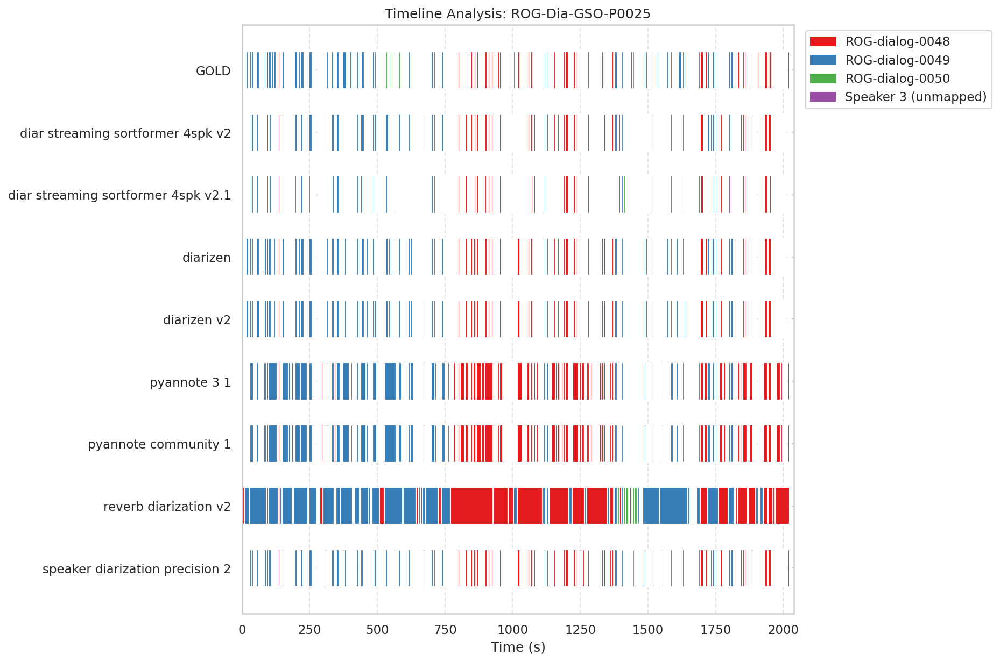

#### 60-Second Snippets (Zoom-in)
Below are 60-second zoomed-in windows showing where the models performed best and worst (based on average DER).

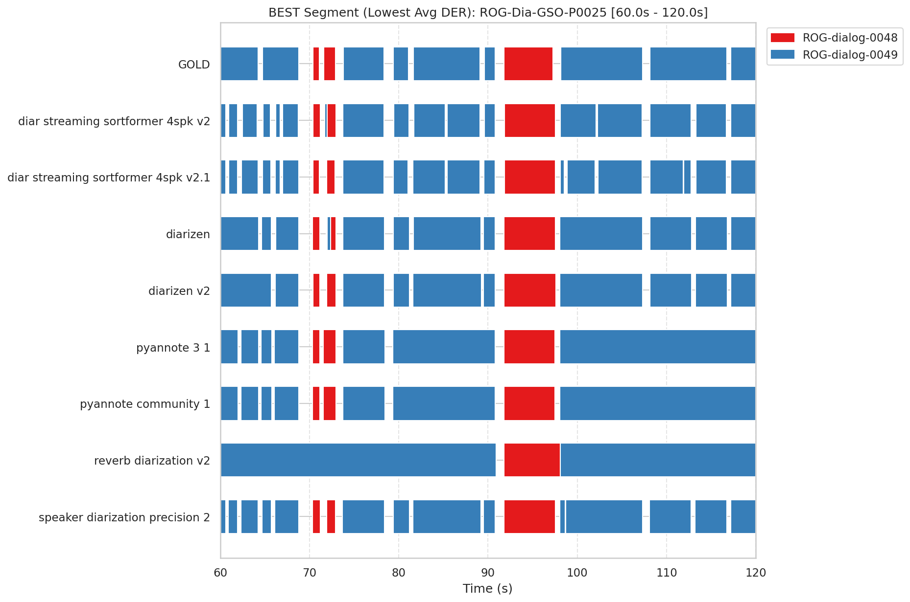

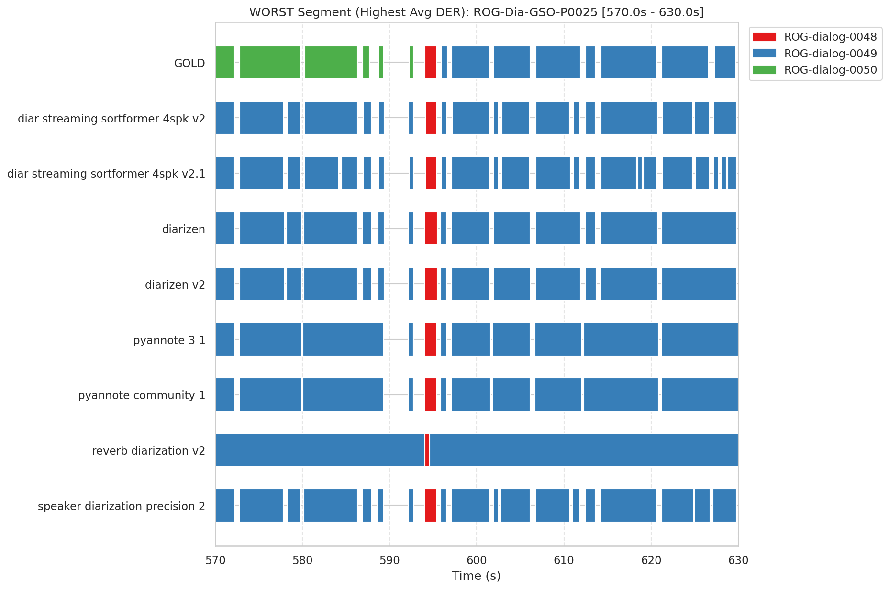

#### Metrics (Collar: 0.00s)

| Model                               | DER       | JER       | Miss     | FA       | Conf     | B-P       | B-R       | B-F1      | Pur       | Cov       | VRAM (GB)   | Status   |
|-------------------------------------|-----------|-----------|----------|----------|----------|-----------|-----------|-----------|-----------|-----------|-------------|----------|
| diar streaming sortformer 4spk v2   | **15.07** | 29.45     | 5.63     | 5.51     | 3.93     | 73.81     | 80.78     | **77.14** | 90.92     | 92.04     | 1.6         | nan      |
| speaker diarization precision 2     | 15.70     | **29.39** | 4.90     | 6.89     | **3.92** | **75.00** | 78.66     | 76.79     | 91.25     | **92.23** | **0.0**     | nan      |
| diar streaming sortformer 4spk v2.1 | 18.05     | 31.22     | 7.72     | **4.27** | 6.06     | 65.10     | **83.22** | 73.05     | **91.51** | 89.93     | 1.6         | nan      |
| pyannote community 1                | 21.04     | 33.31     | 4.28     | 12.01    | 4.75     | 65.40     | 56.03     | 60.35     | 90.67     | 91.83     | 1.6         | nan      |
| pyannote 3 1                        | 21.07     | 33.42     | 4.28     | 12.01    | 4.78     | 69.31     | 55.54     | 61.66     | 90.64     | 91.75     | 1.6         | nan      |
| reverb diarization v2               | 42.99     | 46.39     | **2.52** | 32.52    | 7.95     | 38.52     | 8.47      | 13.89     | 88.48     | 89.99     | 4.3         | nan      |
| diar sortformer 4spk v1             | nan       | nan       | nan      | nan      | nan      | nan       | nan       | nan       | nan       | nan       | nan         | OOM/ERR  |

#### Metrics (Collar: 0.25s)

| Model                               | DER       | JER       | Miss     | FA       | Conf     | B-P       | B-R       | B-F1      | Pur       | Cov       | VRAM (GB)   | Status   |
|-------------------------------------|-----------|-----------|----------|----------|----------|-----------|-----------|-----------|-----------|-----------|-------------|----------|
| speaker diarization precision 2     | **10.38** | **26.20** | 4.07     | 2.45     | **3.86** | **75.00** | 78.66     | 76.79     | 91.98     | **94.30** | **0.0**     | nan      |
| diar streaming sortformer 4spk v2   | 10.60     | 26.64     | 4.24     | 2.44     | 3.92     | 73.81     | 80.78     | **77.14** | 91.59     | 94.26     | 1.6         | nan      |
| diar streaming sortformer 4spk v2.1 | 14.53     | 29.02     | 6.42     | **2.01** | 6.10     | 65.10     | **83.22** | 73.05     | **92.05** | 92.20     | 1.6         | nan      |
| pyannote community 1                | 14.99     | 29.77     | 3.37     | 7.14     | 4.48     | 65.40     | 56.03     | 60.35     | 91.53     | 93.66     | 1.6         | nan      |
| pyannote 3 1                        | 14.99     | 29.89     | 3.37     | 7.14     | 4.49     | 69.31     | 55.54     | 61.66     | 91.53     | 93.46     | 1.6         | nan      |
| reverb diarization v2               | 36.11     | 43.60     | **2.12** | 26.59    | 7.41     | 38.52     | 8.47      | 13.89     | 89.56     | 90.97     | 4.3         | nan      |
| diar sortformer 4spk v1             | nan       | nan       | nan      | nan      | nan      | nan       | nan       | nan       | nan       | nan       | nan         | OOM/ERR  |

---

