# ROG-Art Benchmark Report

**Date:** 2026-04-28

## 0. Gold RTTM

- **File:** `default_gold_standard_trimmed.rttm`
- **Path (resolved):** `/g/gold_dir/default_gold_standard_trimmed.rttm`

The benchmark gold reference is the RTTM above. When generated in this repository, the first header line is produced by `gold_rttm_from_annotations.format_gold_rttm_header` (fields such as `pipeline`, `source`, `merge_threshold`, `min_duration`, `output`, and annotation/audio directories). If silence **edge** trimming was applied when building the file, a second line records trim parameters via `format_trim_provenance_line` (`; trim_params …`).

**Embedded header lines (verbatim from the gold RTTM):**

1. Gold generation provenance (`format_gold_rttm_header`)

```text
; gold_rttm pipeline=ROG-Art source=trs merge_threshold=1.0s min_duration=0.1s prioritize_pog=false output=default_gold_standard_trimmed.rttm trs_dir=data/ROG-Art/annotations/trs audio_dir=data/ROG-Art/audio
```

2. Silence-edge trim parameters (`format_trim_provenance_line`)

```text
; trim_params pitch_floor=75.0 pitch_ceiling=500.0 intensity_drop_db=15.0 guard_ms=30.0 max_trim_s=1.5 min_duration=0.1 pad_s=0.5 time_step=0.01 method=pitch_or_intensity trim_silence_within=True min_silence_dur=0.5 verbose=True
```

**Decoded gold generation metadata (from first header line):**

| Key | Value | Description |
|---|---|---|
| `pipeline` | `ROG-Art` | Benchmark pipeline / dataset name |
| `source` | `trs` | Annotation source (e.g. trs, cha) |
| `merge_threshold` | `1.0s` | Adjacent same-speaker merge threshold (s) |
| `min_duration` | `0.1s` | Minimum kept segment duration (s) |
| `prioritize_pog` | `false` | ROG TRS variant preference (pog/std) |
| `output` | `default_gold_standard_trimmed.rttm` | Gold RTTM filename written |
| `trs_dir` | `data/ROG-Art/annotations/trs` | TRS directory used |
| `audio_dir` | `data/ROG-Art/audio` | Audio directory used for trimming / filtering |

**Decoded trim parameters (from second header line):**

| Key | Value | Description |
|---|---|---|
| `pitch_floor` | `75.0` | Lower bound (Hz) for Praat pitch tracking when locating voiced speech at segment edges |
| `pitch_ceiling` | `500.0` | Upper bound (Hz) for Praat pitch tracking |
| `intensity_drop_db` | `15.0` | dB below local max intensity treated as non-speech for edge refinement |
| `guard_ms` | `30.0` | Minimum margin (ms) kept at trimmed boundaries after VAD |
| `max_trim_s` | `1.5` | Maximum seconds an edge may move inward (caps aggressive trims) |
| `min_duration` | `0.1` | Segments shorter than this (s) after trimming are dropped |
| `pad_s` | `0.5` | Padding (s) added back after trimming to avoid cutting into speech |
| `time_step` | `0.01` | Analysis frame step (s) for pitch/intensity sampling |
| `method` | `pitch_or_intensity` | VAD mode: pitch_or_intensity | pitch_only | intensity_only |
| `trim_silence_within` | `True` | If true, split segments at internal silences (not only edge trim) |
| `min_silence_dur` | `0.5` | Minimum internal silence duration (s) required to split a segment |
| `verbose` | `True` | If true, trimmer emits detailed per-file diagnostics to the console |

### Errata and evaluation window (UEM)

Metrics and timelines use a single evaluation interval per file: `[trim_start, trim_end]` when set (seconds), intersected with audio duration from run metadata. Auto errata is written beside trimmed gold as `AUTO_DATASET_ERRATA.json` and merged with manual errata by default.

- **Manual errata path:** `/g/errata.json`
- **Auto errata path:** `/g/gold_dir/AUTO_DATASET_ERRATA.json`

*No manual errata file entries.*

#### Auto-generated errata (silence trim caps)

| File ID | trim_start (s) | trim_end (s) | source | reason (trunc.) |
|---|---|---|---|---|
| Rog-Art-J-Gvecg-P500014 | 579.2589920833406 | 944.1678241235887 | auto | auto: VAD-informed speech boundary exceeds what max_trim_s can move on the gold RTTM edge; residual margin still contains misleading speech labels. UEM excludes these edges during evaluation. |
| Rog-Art-J-Gvecg-P500016 | 57.63891802715242 | 477.8005996484289 | auto | auto: VAD-informed speech boundary exceeds what max_trim_s can move on the gold RTTM edge; residual margin still contains misleading speech labels. UEM excludes these edges during evaluation. |
| Rog-Art-J-Gvecg-P500026 | 351.6169894653151 | 730.9212988627132 | auto | auto: VAD-informed speech boundary exceeds what max_trim_s can move on the gold RTTM edge; residual margin still contains misleading speech labels. UEM excludes these edges during evaluation. |
| Rog-Art-J-Gvecg-P500028 | 340.9927782424506 | 727.2418686658195 | auto | auto: VAD-informed speech boundary exceeds what max_trim_s can move on the gold RTTM edge; residual margin still contains misleading speech labels. UEM excludes these edges during evaluation. |
| Rog-Art-J-Gvecg-P500046 | 619.0369940121694 | 978.7550333988212 | auto | auto: VAD-informed speech boundary exceeds what max_trim_s can move on the gold RTTM edge; residual margin still contains misleading speech labels. UEM excludes these edges during evaluation. |
| Rog-Art-J-Gvecg-P500048 |  | 409.0241017594584 | auto | auto: VAD-informed speech boundary exceeds what max_trim_s can move on the gold RTTM edge; residual margin still contains misleading speech labels. UEM excludes these edges during evaluation. |
| Rog-Art-J-Gvecg-P500054 |  | 435.3360663825315 | auto | auto: VAD-informed speech boundary exceeds what max_trim_s can move on the gold RTTM edge; residual margin still contains misleading speech labels. UEM excludes these edges during evaluation. |
| Rog-Art-J-Gvecg-P500063 |  | 792.4261582294264 | auto | auto: VAD-informed speech boundary exceeds what max_trim_s can move on the gold RTTM edge; residual margin still contains misleading speech labels. UEM excludes these edges during evaluation. |
| Rog-Art-J-Gvecg-P500064 | 1525.02 | 1913.4553078470824 | auto | auto: VAD-informed speech boundary exceeds what max_trim_s can move on the gold RTTM edge; residual margin still contains misleading speech labels. UEM excludes these edges during evaluation. |
| Rog-Art-J-Gvecg-P580002 |  | 383.17359217877095 | auto | auto: VAD-informed speech boundary exceeds what max_trim_s can move on the gold RTTM edge; residual margin still contains misleading speech labels. UEM excludes these edges during evaluation. |
| Rog-Art-J-Gvecg-P580003 |  | 337.79442065278556 | auto | auto: VAD-informed speech boundary exceeds what max_trim_s can move on the gold RTTM edge; residual margin still contains misleading speech labels. UEM excludes these edges during evaluation. |
| Rog-Art-J-Gvecg-P580009 |  | 365.81699999999995 | auto | auto: VAD-informed speech boundary exceeds what max_trim_s can move on the gold RTTM edge; residual margin still contains misleading speech labels. UEM excludes these edges during evaluation. |
| Rog-Art-J-Gvecg-P580041 |  | 346.12833513931884 | auto | auto: VAD-informed speech boundary exceeds what max_trim_s can move on the gold RTTM edge; residual margin still contains misleading speech labels. UEM excludes these edges during evaluation. |
| Rog-Art-J-Gvecg-P580047 |  | 324.7493414199072 | auto | auto: VAD-informed speech boundary exceeds what max_trim_s can move on the gold RTTM edge; residual margin still contains misleading speech labels. UEM excludes these edges during evaluation. |
| Rog-Art-J-Gvecg-P580051 | 555.8339963333754 | 1088.2351830228845 | auto | auto: VAD-informed speech boundary exceeds what max_trim_s can move on the gold RTTM edge; residual margin still contains misleading speech labels. UEM excludes these edges during evaluation. |

#### Merged effective UEM (used for scoring)

| File ID | trim_start (s) | trim_end (s) | reason |
|---|---|---|---|
| Rog-Art-J-Gvecg-P500014 | 579.2589920833406 | 944.1678241235887 | auto: auto: VAD-informed speech boundary exceeds what max_trim_s can move on the gold RTTM edge; residual margin still contains misleading speech labels. UEM excludes these edges during evaluation. |
| Rog-Art-J-Gvecg-P500016 | 57.63891802715242 | 477.8005996484289 | auto: auto: VAD-informed speech boundary exceeds what max_trim_s can move on the gold RTTM edge; residual margin still contains misleading speech labels. UEM excludes these edges during evaluation. |
| Rog-Art-J-Gvecg-P500026 | 351.6169894653151 | 730.9212988627132 | auto: auto: VAD-informed speech boundary exceeds what max_trim_s can move on the gold RTTM edge; residual margin still contains misleading speech labels. UEM excludes these edges during evaluation. |
| Rog-Art-J-Gvecg-P500028 | 340.9927782424506 | 727.2418686658195 | auto: auto: VAD-informed speech boundary exceeds what max_trim_s can move on the gold RTTM edge; residual margin still contains misleading speech labels. UEM excludes these edges during evaluation. |
| Rog-Art-J-Gvecg-P500046 | 619.0369940121694 | 978.7550333988212 | auto: auto: VAD-informed speech boundary exceeds what max_trim_s can move on the gold RTTM edge; residual margin still contains misleading speech labels. UEM excludes these edges during evaluation. |
| Rog-Art-J-Gvecg-P500048 |  | 409.0241017594584 | auto: auto: VAD-informed speech boundary exceeds what max_trim_s can move on the gold RTTM edge; residual margin still contains misleading speech labels. UEM excludes these edges during evaluation. |
| Rog-Art-J-Gvecg-P500054 |  | 435.3360663825315 | auto: auto: VAD-informed speech boundary exceeds what max_trim_s can move on the gold RTTM edge; residual margin still contains misleading speech labels. UEM excludes these edges during evaluation. |
| Rog-Art-J-Gvecg-P500063 |  | 792.4261582294264 | auto: auto: VAD-informed speech boundary exceeds what max_trim_s can move on the gold RTTM edge; residual margin still contains misleading speech labels. UEM excludes these edges during evaluation. |
| Rog-Art-J-Gvecg-P500064 | 1525.02 | 1913.4553078470824 | auto: auto: VAD-informed speech boundary exceeds what max_trim_s can move on the gold RTTM edge; residual margin still contains misleading speech labels. UEM excludes these edges during evaluation. |
| Rog-Art-J-Gvecg-P580002 |  | 383.17359217877095 | auto: auto: VAD-informed speech boundary exceeds what max_trim_s can move on the gold RTTM edge; residual margin still contains misleading speech labels. UEM excludes these edges during evaluation. |
| Rog-Art-J-Gvecg-P580003 |  | 337.79442065278556 | auto: auto: VAD-informed speech boundary exceeds what max_trim_s can move on the gold RTTM edge; residual margin still contains misleading speech labels. UEM excludes these edges during evaluation. |
| Rog-Art-J-Gvecg-P580009 |  | 365.81699999999995 | auto: auto: VAD-informed speech boundary exceeds what max_trim_s can move on the gold RTTM edge; residual margin still contains misleading speech labels. UEM excludes these edges during evaluation. |
| Rog-Art-J-Gvecg-P580041 |  | 346.12833513931884 | auto: auto: VAD-informed speech boundary exceeds what max_trim_s can move on the gold RTTM edge; residual margin still contains misleading speech labels. UEM excludes these edges during evaluation. |
| Rog-Art-J-Gvecg-P580047 |  | 324.7493414199072 | auto: auto: VAD-informed speech boundary exceeds what max_trim_s can move on the gold RTTM edge; residual margin still contains misleading speech labels. UEM excludes these edges during evaluation. |
| Rog-Art-J-Gvecg-P580051 | 555.8339963333754 | 1088.2351830228845 | auto: auto: VAD-informed speech boundary exceeds what max_trim_s can move on the gold RTTM edge; residual margin still contains misleading speech labels. UEM excludes these edges during evaluation. |
## 1. Evaluated Models
* **diar sortformer 4spk v1** (`nvidia/diar_sortformer_4spk-v1`) - [HuggingFace](https://huggingface.co/nvidia/diar_sortformer_4spk-v1)
* **diar streaming sortformer 4spk v2** (`nvidia/diar_streaming_sortformer_4spk-v2`) - [HuggingFace](https://huggingface.co/nvidia/diar_streaming_sortformer_4spk-v2)
* **diar streaming sortformer 4spk v2.1** (`nvidia/diar_streaming_sortformer_4spk-v2.1`) - [HuggingFace](https://huggingface.co/nvidia/diar_streaming_sortformer_4spk-v2.1)
* **diarizen** (`BUT-FIT/diarizen-wavlm-large-s80-md`) - [HuggingFace](https://huggingface.co/BUT-FIT/diarizen-wavlm-large-s80-md)
* **diarizen v2** (`BUT-FIT/diarizen-wavlm-large-s80-md-v2`) - [HuggingFace](https://huggingface.co/BUT-FIT/diarizen-wavlm-large-s80-md-v2)
* **pyannote 3 1** (`pyannote/speaker-diarization-3.1`) - [HuggingFace](https://huggingface.co/pyannote/speaker-diarization-3.1)
* **pyannote community 1** (`pyannote/speaker-diarization-community-1`) - [HuggingFace](https://huggingface.co/pyannote/speaker-diarization-community-1)
* **reverb diarization v2** (`Revai/reverb-diarization-v2`) - [HuggingFace](https://huggingface.co/Revai/reverb-diarization-v2)
* **speaker diarization precision 2** (`pyannote/speaker-diarization-precision-2`) - [HuggingFace](https://huggingface.co/pyannote/speaker-diarization-precision-2)

## 2. Executive Summary

### Dataset overview

- **Files:** 16
- **Gold timeline span (extent):** total 3.23 h; min 5.53 min, mean 12.11 min, max 31.91 min
- **Gold RTTM speech time (sum of RTTM segments; overlaps add up):** total 3.03 h; min 5.24 min, mean 11.36 min, max 31.53 min
- **Primary category:** PopTV, 24ur (38), doma, družina (20), doma, prijatelji (20), klic prijatelju (15), prosti dialog med dvema sogovornikoma (14), TVSlo, Odmevi (10), …
- **Type:** informativno-izobraževalni (158), zasebni (99), nezasebni (45), razvedrilni (42)
- **Audio technicals (best effort):** audio directory was found but no files were probed.

| Model                               |   Collar | DER      | JER      | B-P       | B-R       | B-F1      | Purity    | Cover     | Miss     | FA       | Conf     | RTF      | VRAM (GB)   | Completed   |
|-------------------------------------|----------|----------|----------|-----------|-----------|-----------|-----------|-----------|----------|----------|----------|----------|-------------|-------------|
| speaker diarization precision 2     |     0.25 | **9.86** | **7.71** | 61.53     | **88.77** | 72.68     | 99.71     | 99.78     | 5.30     | **0.99** | **0.01** | 0.03     | **0.0**     | 16/16       |
| diarizen                            |     0.25 | 10.09    | 8.18     | 65.58     | 85.12     | 74.08     | 99.65     | 99.37     | 4.99     | 1.05     | 0.47     | **0.00** | 0.3         | 16/16       |
| diarizen v2                         |     0.25 | 10.12    | 8.20     | **66.38** | 84.72     | **74.44** | 99.65     | 99.37     | 4.96     | 1.12     | 0.47     | **0.00** | 0.3         | 16/16       |
| diar streaming sortformer 4spk v2.1 |     0.25 | 10.98    | 8.57     | 56.97     | 41.42     | 47.97     | **99.73** | 99.76     | 4.28     | 3.15     | 0.05     | < 0.01   | 15.0        | 16/16       |
| diar streaming sortformer 4spk v2   |     0.25 | 11.05    | 11.04    | 57.91     | 34.31     | 43.09     | 99.29     | **99.81** | 3.77     | 3.26     | 0.49     | < 0.01   | 15.0        | 16/16       |
| pyannote 3 1                        |     0.25 | 11.08    | 8.83     | 57.56     | 55.74     | 56.64     | 99.54     | 99.64     | 4.85     | 2.62     | 0.16     | 0.15     | 1.6         | 16/16       |
| pyannote community 1                |     0.25 | 11.48    | 9.24     | 55.72     | 56.26     | 55.99     | 99.53     | 99.26     | 4.85     | 2.62     | 0.59     | 0.15     | 1.6         | 16/16       |
| reverb diarization v2               |     0.25 | 17.66    | 15.71    | 15.20     | 3.44      | 5.61      | 98.49     | 98.46     | 3.34     | 10.23    | 1.39     | 0.18     | 4.3         | 16/16       |
| diar sortformer 4spk v1             |     0.25 | 20.96    | 35.43    | 39.75     | 47.68     | 43.35     | 82.54     | 99.64     | **1.32** | 2.63     | 16.82    | 0.02     | 88.8        | 6/16        |

> **Note on aggregation:** Headline DER/JER/Boundary/Purity/Coverage are pooled only over recordings with per-file `Status == OK` (the numerator in the `Completed` column). Miss/FA/Conf are also averaged over the same completed recordings. Recordings with missing/failed outputs are shown in the deep dive tables but are not included in these headline aggregates.


### Terminology & Methodology
* **DER (Diarization Error Rate):** Primary metric. Lower is better. Sum of Missed, False Alarm, and Confusion rates.
* **JER (Jaccard Error Rate):** Speaker-balanced diarization error. Lower is better.
* **Miss (%):** Speech present in Gold Standard but missed by the model.
* **FA (False Alarm %):** Model predicted speech where Gold Standard is silent.
* **Conf (Confusion %):** Speech correctly detected but assigned to the wrong speaker.
* **Boundary P/R/F1 (%):** Segmentation boundary precision/recall/F1 using tolerance 0.250s.
* **Purity (%):** Evaluates cluster purity. High purity = when a model identifies a speaker, it is consistently the same person.
* **Cover (Coverage %):** Evaluates how much of the original speaker's speech was captured under a single hypothesis cluster.
* **RTF (Real Time Factor):** Processing time divided by audio length. e.g., `< 0.01` means exceptionally fast processing.
* **VRAM (GB):** Peak GPU memory utilized. `0.0 GB` indicates an API/Cloud-based model.

## 3. Dataset Errata (Corrections Applied)
Corrections applied via Universal Evaluation Maps (UEM). See **§0** for full manual vs auto errata tables and merged bounds.

* **`Rog-Art-J-Gvecg-P500014`**: from **579.2589920833406**s to **944.1678241235887**s. *auto: auto: VAD-informed speech boundary exceeds what max_trim_s can move on the gold RTTM edge; residual margin still contains misleading speech labels. UEM excludes these edges during evaluation.*
* **`Rog-Art-J-Gvecg-P500016`**: from **57.63891802715242**s to **477.8005996484289**s. *auto: auto: VAD-informed speech boundary exceeds what max_trim_s can move on the gold RTTM edge; residual margin still contains misleading speech labels. UEM excludes these edges during evaluation.*
* **`Rog-Art-J-Gvecg-P500026`**: from **351.6169894653151**s to **730.9212988627132**s. *auto: auto: VAD-informed speech boundary exceeds what max_trim_s can move on the gold RTTM edge; residual margin still contains misleading speech labels. UEM excludes these edges during evaluation.*
* **`Rog-Art-J-Gvecg-P500028`**: from **340.9927782424506**s to **727.2418686658195**s. *auto: auto: VAD-informed speech boundary exceeds what max_trim_s can move on the gold RTTM edge; residual margin still contains misleading speech labels. UEM excludes these edges during evaluation.*
* **`Rog-Art-J-Gvecg-P500046`**: from **619.0369940121694**s to **978.7550333988212**s. *auto: auto: VAD-informed speech boundary exceeds what max_trim_s can move on the gold RTTM edge; residual margin still contains misleading speech labels. UEM excludes these edges during evaluation.*
* **`Rog-Art-J-Gvecg-P500048`**: to **409.0241017594584**s. *auto: auto: VAD-informed speech boundary exceeds what max_trim_s can move on the gold RTTM edge; residual margin still contains misleading speech labels. UEM excludes these edges during evaluation.*
* **`Rog-Art-J-Gvecg-P500054`**: to **435.3360663825315**s. *auto: auto: VAD-informed speech boundary exceeds what max_trim_s can move on the gold RTTM edge; residual margin still contains misleading speech labels. UEM excludes these edges during evaluation.*
* **`Rog-Art-J-Gvecg-P500063`**: to **792.4261582294264**s. *auto: auto: VAD-informed speech boundary exceeds what max_trim_s can move on the gold RTTM edge; residual margin still contains misleading speech labels. UEM excludes these edges during evaluation.*
* **`Rog-Art-J-Gvecg-P500064`**: from **1525.02**s to **1913.4553078470824**s. *auto: auto: VAD-informed speech boundary exceeds what max_trim_s can move on the gold RTTM edge; residual margin still contains misleading speech labels. UEM excludes these edges during evaluation.*
* **`Rog-Art-J-Gvecg-P580002`**: to **383.17359217877095**s. *auto: auto: VAD-informed speech boundary exceeds what max_trim_s can move on the gold RTTM edge; residual margin still contains misleading speech labels. UEM excludes these edges during evaluation.*
* **`Rog-Art-J-Gvecg-P580003`**: to **337.79442065278556**s. *auto: auto: VAD-informed speech boundary exceeds what max_trim_s can move on the gold RTTM edge; residual margin still contains misleading speech labels. UEM excludes these edges during evaluation.*
* **`Rog-Art-J-Gvecg-P580009`**: to **365.81699999999995**s. *auto: auto: VAD-informed speech boundary exceeds what max_trim_s can move on the gold RTTM edge; residual margin still contains misleading speech labels. UEM excludes these edges during evaluation.*
* **`Rog-Art-J-Gvecg-P580041`**: to **346.12833513931884**s. *auto: auto: VAD-informed speech boundary exceeds what max_trim_s can move on the gold RTTM edge; residual margin still contains misleading speech labels. UEM excludes these edges during evaluation.*
* **`Rog-Art-J-Gvecg-P580047`**: to **324.7493414199072**s. *auto: auto: VAD-informed speech boundary exceeds what max_trim_s can move on the gold RTTM edge; residual margin still contains misleading speech labels. UEM excludes these edges during evaluation.*
* **`Rog-Art-J-Gvecg-P580051`**: from **555.8339963333754**s to **1088.2351830228845**s. *auto: auto: VAD-informed speech boundary exceeds what max_trim_s can move on the gold RTTM edge; residual margin still contains misleading speech labels. UEM excludes these edges during evaluation.*

## 4. Visual & Category Analysis
Bar charts compare models across **all** configured collars; boxplots and comparison tables use one evaluation collar and group files by **Primary category** (from recording metadata).

* **Category analysis collar:** `0.25`s.

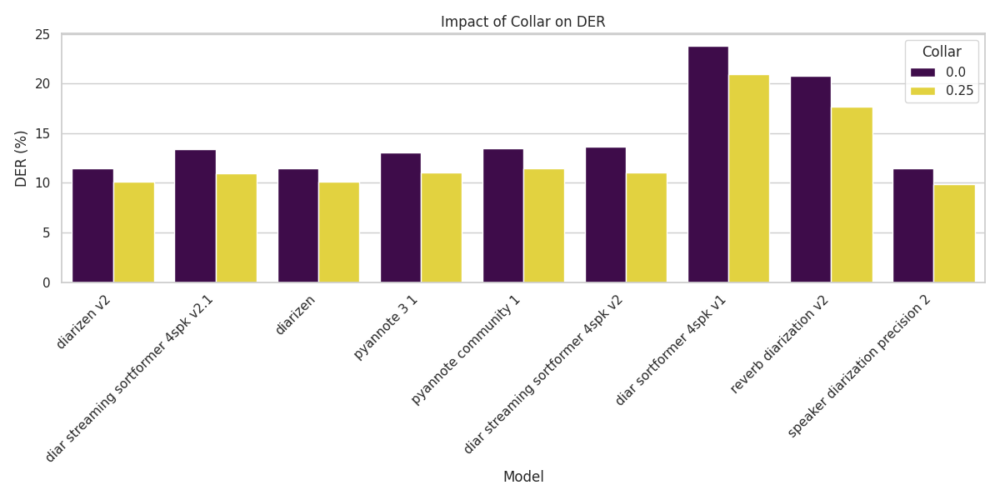

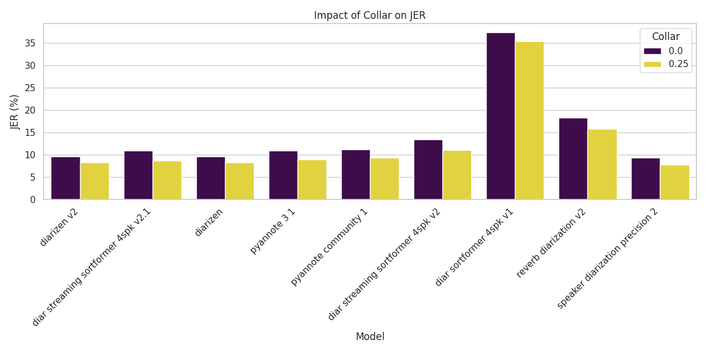

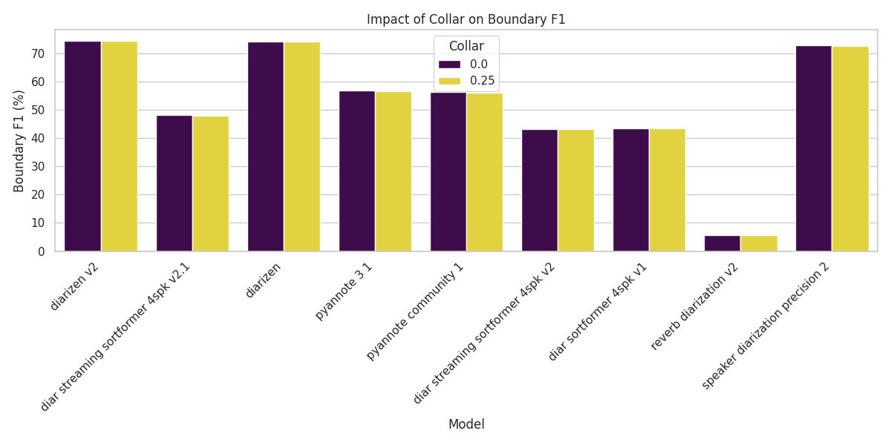

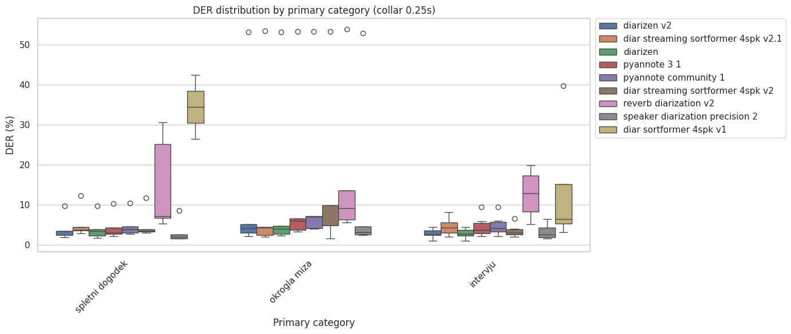

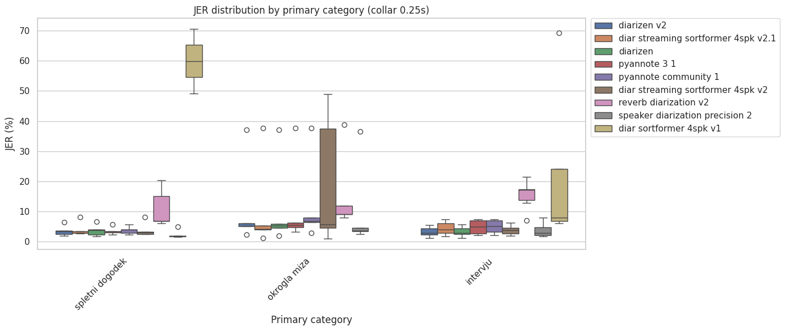

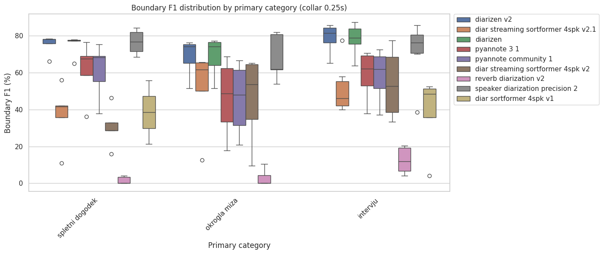

### Category comparison (DER %)
Average DER per primary category at collar `0.25`s. **Bold** highlights the best (lowest) model per row.

| Primary category   |      A |     B |     C |     D | E        |     F |     G |     H | I         |   AVG |
|--------------------|--------|-------|-------|-------|----------|-------|-------|-------|-----------|-------|
| intervju           |  13.94 |  3.5  |  4.48 |  2.76 | **2.74** |  4.56 |  4.84 | 12.69 | 3.23      |  5.86 |
| okrogla miza       | nan    | 14.86 | 13.24 | 13.35 | 13.53    | 14.53 | 15.1  | 17.68 | **13.08** | 14.42 |
| spletni dogodek    |  34.41 |  5.02 |  5.32 |  4.18 | 4.15     |  4.42 |  4.88 | 14.95 | **3.20**  |  8.95 |

### Category comparison (JER %)
Average JER per primary category at collar `0.25`s. **Bold** highlights the best (lowest) model per row.

| Primary category   |      A |     B |     C |     D | E        |     F |     G |     H | I         |   AVG |
|--------------------|--------|-------|-------|-------|----------|-------|-------|-------|-----------|-------|
| intervju           |  22.84 |  3.83 |  4.41 |  3.25 | **3.24** |  4.85 |  5.01 | 15.52 | 3.80      |  7.42 |
| okrogla miza       | nan    | 19.51 | 10.5  | 10.95 | 11.11    | 11.47 | 12.38 | 15.37 | **10.12** | 12.68 |
| spletni dogodek    |  59.89 |  3.92 |  4    |  3.66 | 3.60     |  3.52 |  3.77 | 11.06 | **2.43**  | 10.65 |

### Category comparison (Boundary F1 %)
Average boundary F1 per primary category at collar `0.25`s (boundary tolerance 0.250s). **Bold** highlights the best (highest) model per row.

| Primary category   |      A |     B |     C | D         | E         |     F |     G |     H | I         |   AVG |
|--------------------|--------|-------|-------|-----------|-----------|-------|-------|-------|-----------|-------|
| intervju           |  38.4  | 54    | 51.43 | 78.16     | **78.92** | 59.04 | 58.72 | 12.43 | 71.32     | 55.83 |
| okrogla miza       | nan    | 45.54 | 51.06 | **68.69** | 68.53     | 46.2  | 45.73 |  2.99 | 68.02     | 49.6  |
| spletni dogodek    |  38.55 | 30.44 | 37.29 | 75.07     | 75.34     | 61.56 | 61.2  |  1.5  | **76.56** | 50.83 |

### Category comparison model legend (shared)
* **A**: diar sortformer 4spk v1
* **B**: diar streaming sortformer 4spk v2
* **C**: diar streaming sortformer 4spk v2.1
* **D**: diarizen
* **E**: diarizen v2
* **F**: pyannote 3 1
* **G**: pyannote community 1
* **H**: reverb diarization v2
* **I**: speaker diarization precision 2

## 5. Deep Dive: File-by-File Analysis
Detailed breakdown for every file. *For metric definitions, see Executive Summary.*

### File: Rog-Art-J-Gvecg-P500014

**Primary category:** spletni dogodek | **Quality:** Unknown | **Device:** Unknown

> *Predstavitev prilagoditve programov za oporo bolnikom*

> **ERRATA (UEM):** start **579.2589920833406**s, end **944.1678241235887**s

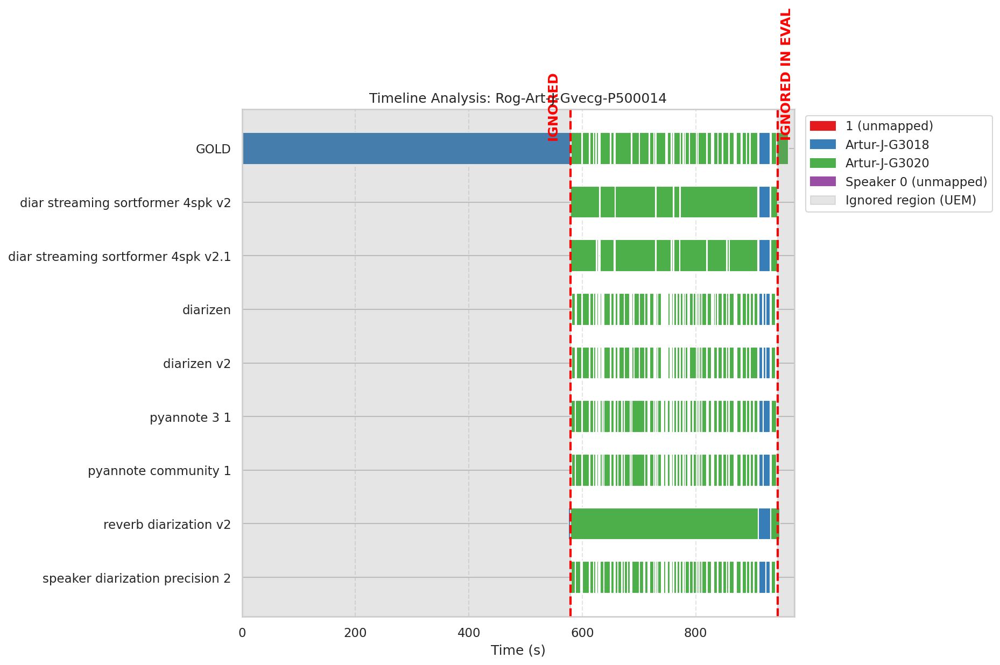

#### 60-Second Snippets (Zoom-in)
Below are 60-second zoomed-in windows showing where the models performed best and worst (based on average DER).

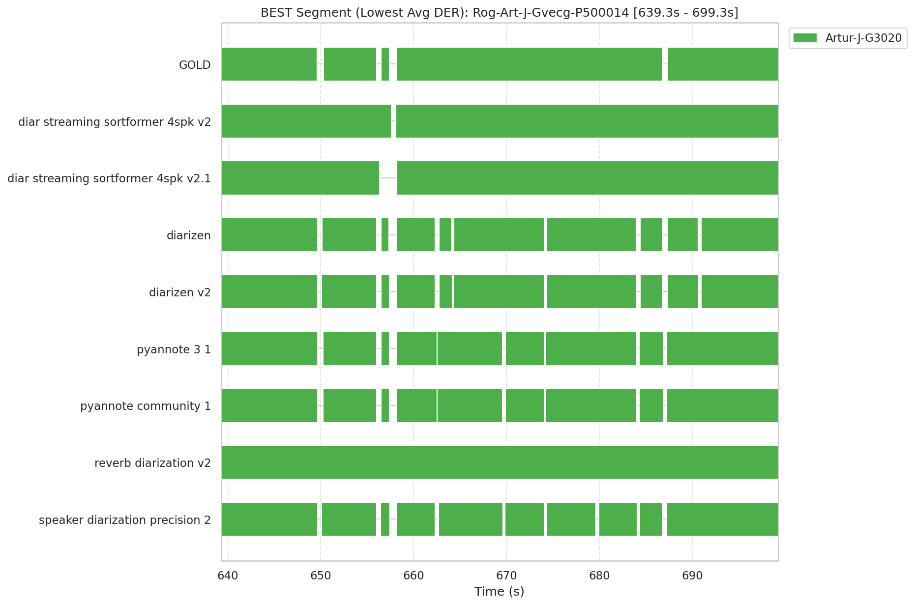

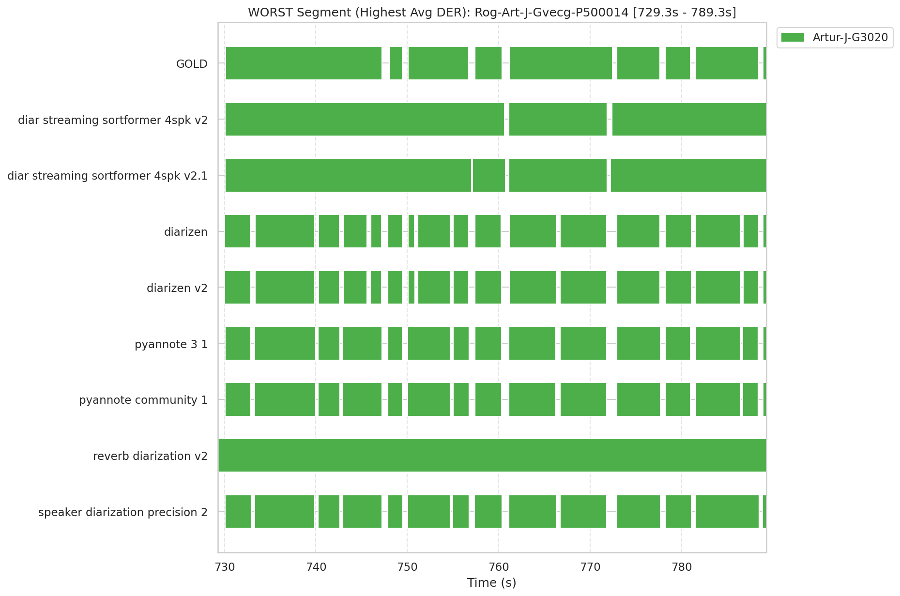

#### Metrics (Collar: 0.00s)

| Model                               | DER      | JER      | Miss     | FA       | Conf     | B-P       | B-R       | B-F1      | Pur        | Cov       | VRAM (GB)   | Status   |
|-------------------------------------|----------|----------|----------|----------|----------|-----------|-----------|-----------|------------|-----------|-------------|----------|
| pyannote 3 1                        | **3.64** | 4.91     | 2.42     | 1.10     | 0.12     | 55.71     | 90.70     | 69.03     | 99.87      | 99.87     | 1.6         | nan      |
| speaker diarization precision 2     | 3.77     | **3.00** | 2.31     | 1.45     | 0.01     | **59.09** | 90.70     | **71.56** | 99.99      | 99.99     | **0.0**     | nan      |
| pyannote community 1                | 4.07     | 3.31     | 2.42     | 1.10     | 0.55     | 55.71     | 90.70     | 69.03     | **100.00** | 99.44     | 1.6         | nan      |
| diarizen v2                         | 4.49     | 4.46     | 3.22     | 1.04     | 0.23     | 52.00     | 90.70     | 66.10     | 99.99      | 99.76     | nan         | nan      |
| diarizen                            | 4.87     | 4.72     | 3.75     | **0.89** | 0.23     | 50.00     | **93.02** | 65.04     | 99.99      | 99.76     | nan         | nan      |
| diar streaming sortformer 4spk v2   | 6.66     | 4.38     | 0.17     | 6.48     | **0.01** | 57.14     | 9.30      | 16.00     | 99.99      | **99.99** | 2.3         | nan      |
| diar streaming sortformer 4spk v2.1 | 7.20     | 4.51     | 1.22     | 5.97     | 0.01     | 25.00     | 6.98      | 10.91     | 99.99      | 99.99     | 2.3         | nan      |
| reverb diarization v2               | 8.23     | 8.76     | **0.00** | 8.22     | 0.01     | 0.00      | 0.00      | 0.00      | 99.99      | 99.99     | 4.3         | nan      |
| diar sortformer 4spk v1             | nan      | nan      | nan      | nan      | nan      | nan       | nan       | nan       | nan        | nan       | nan         | OOM/ERR  |

#### Metrics (Collar: 0.25s)

| Model                               | DER      | JER      | Miss     | FA       | Conf     | B-P       | B-R       | B-F1      | Pur        | Cov        | VRAM (GB)   | Status   |
|-------------------------------------|----------|----------|----------|----------|----------|-----------|-----------|-----------|------------|------------|-------------|----------|
| speaker diarization precision 2     | **2.51** | **1.82** | 2.33     | 0.18     | **0.00** | **59.09** | 90.70     | **71.56** | **100.00** | **100.00** | **0.0**     | nan      |
| pyannote 3 1                        | 2.63     | 2.99     | 2.34     | 0.24     | 0.05     | 55.71     | 90.70     | 69.03     | 99.95      | 99.94      | 1.6         | nan      |
| pyannote community 1                | 3.00     | 2.33     | 2.34     | 0.24     | 0.42     | 55.71     | 90.70     | 69.03     | **100.00** | 99.54      | 1.6         | nan      |
| diarizen v2                         | 3.42     | 3.50     | 3.14     | 0.16     | 0.11     | 52.00     | 90.70     | 66.10     | **100.00** | 99.93      | nan         | nan      |
| diar streaming sortformer 4spk v2   | 3.75     | 2.54     | 0.15     | 3.60     | **0.00** | 57.14     | 9.30      | 16.00     | **100.00** | **100.00** | 2.3         | nan      |
| diarizen                            | 3.87     | 3.74     | 3.65     | **0.11** | 0.11     | 50.00     | **93.02** | 65.04     | **100.00** | 99.93      | nan         | nan      |
| diar streaming sortformer 4spk v2.1 | 4.32     | 2.65     | 1.00     | 3.32     | **0.00** | 25.00     | 6.98      | 10.91     | **100.00** | **100.00** | 2.3         | nan      |
| reverb diarization v2               | 5.27     | 6.85     | **0.00** | 5.27     | **0.00** | 0.00      | 0.00      | 0.00      | **100.00** | 99.99      | 4.3         | nan      |
| diar sortformer 4spk v1             | nan      | nan      | nan      | nan      | nan      | nan       | nan       | nan       | nan        | nan        | nan         | OOM/ERR  |


---

### File: Rog-Art-J-Gvecg-P500016

**Primary category:** spletni dogodek | **Quality:** Unknown | **Device:** Unknown

> *Pogovor o pomenu in dostopnosti verodostojnih informacij o zdravljenju kroničnih nenalezljivih bolezni*

> **ERRATA (UEM):** start **57.63891802715242**s, end **477.8005996484289**s

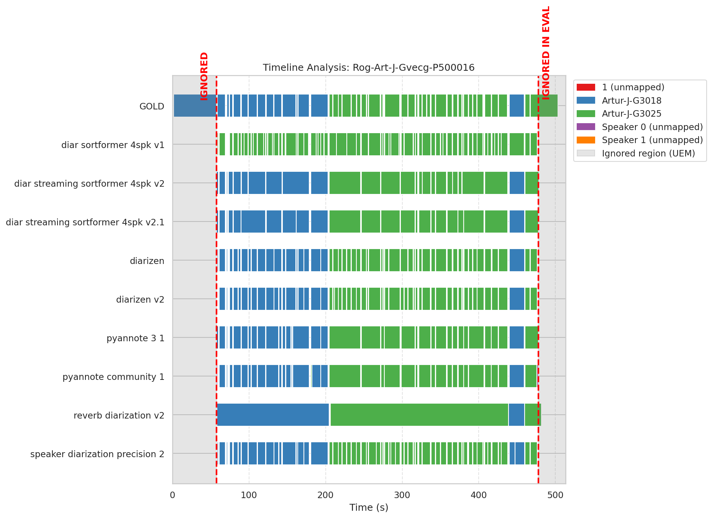

#### 60-Second Snippets (Zoom-in)
Below are 60-second zoomed-in windows showing where the models performed best and worst (based on average DER).

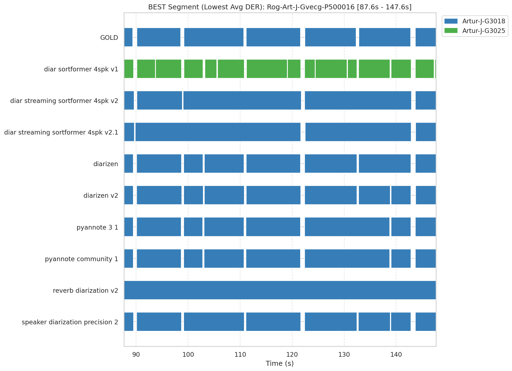

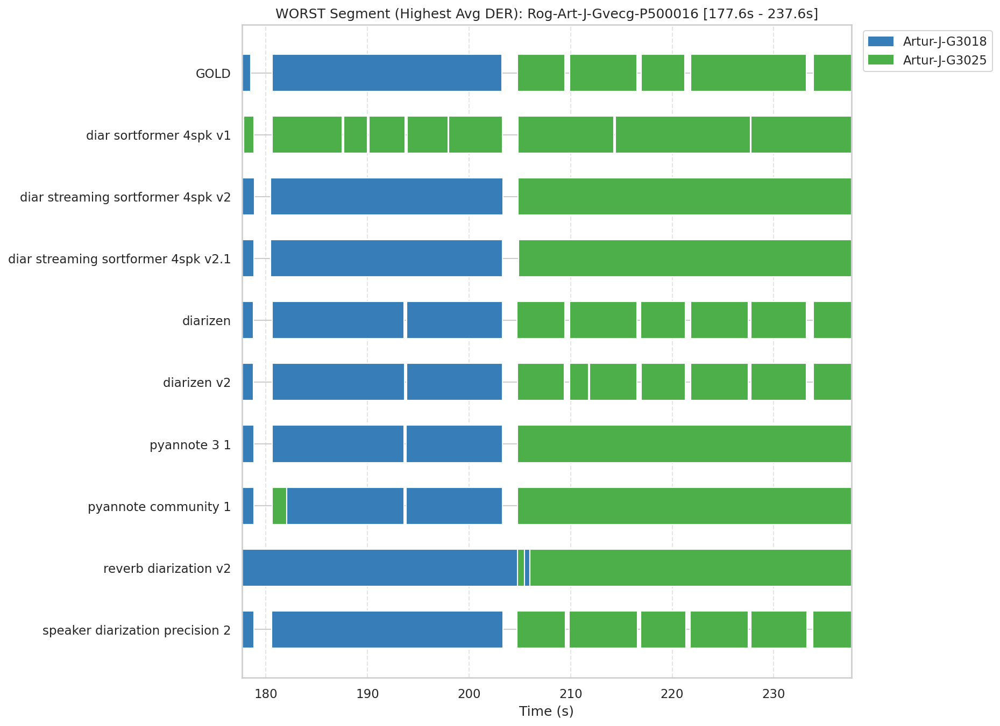

#### Metrics (Collar: 0.00s)

| Model                               | DER      | JER      | Miss     | FA       | Conf     | B-P       | B-R       | B-F1      | Pur       | Cov        | VRAM (GB)   |
|-------------------------------------|----------|----------|----------|----------|----------|-----------|-----------|-----------|-----------|------------|-------------|
| diarizen                            | **3.51** | **3.44** | 1.30     | 1.73     | 0.48     | **70.97** | 86.27     | **77.88** | 99.95     | 99.47      | nan         |
| diarizen v2                         | 3.66     | 3.63     | 1.39     | **1.66** | 0.61     | 67.69     | 86.27     | 75.86     | 99.82     | 99.33      | nan         |
| speaker diarization precision 2     | 3.80     | 3.69     | 1.55     | 2.25     | **0.00** | 66.67     | **90.20** | 76.67     | **99.95** | 99.95      | **0.0**     |
| pyannote 3 1                        | 5.29     | 5.18     | 0.96     | 4.16     | 0.16     | 65.85     | 52.94     | 58.70     | 99.84     | 99.84      | 1.6         |
| pyannote community 1                | 6.18     | 6.02     | 0.96     | 4.16     | 1.05     | 60.47     | 50.98     | 55.32     | 99.57     | 98.94      | 1.6         |
| diar streaming sortformer 4spk v2   | 6.22     | 5.76     | 0.57     | 5.49     | 0.16     | 42.31     | 21.57     | 28.57     | 99.84     | 99.84      | 1.2         |
| diar streaming sortformer 4spk v2.1 | 6.55     | 5.99     | 0.60     | 5.79     | 0.16     | 64.00     | 31.37     | 42.11     | 99.84     | 99.84      | 1.2         |
| reverb diarization v2               | 10.20    | 9.32     | **0.00** | 10.04    | 0.16     | 16.67     | 1.96      | 3.51      | 99.68     | 99.68      | 4.3         |
| diar sortformer 4spk v1             | 43.97    | 70.98    | 2.05     | 3.04     | 38.88    | 46.15     | 70.59     | 55.81     | 60.31     | **100.00** | 51.4        |

#### Metrics (Collar: 0.25s)

| Model                               | DER      | JER      | Miss     | FA       | Conf     | B-P       | B-R       | B-F1      | Pur       | Cov        | VRAM (GB)   |
|-------------------------------------|----------|----------|----------|----------|----------|-----------|-----------|-----------|-----------|------------|-------------|
| speaker diarization precision 2     | **2.01** | **2.02** | 1.56     | **0.45** | **0.00** | 66.67     | **90.20** | 76.67     | **99.99** | **100.00** | **0.0**     |
| diarizen                            | 2.19     | 2.24     | 1.26     | 0.52     | 0.42     | **70.97** | 86.27     | **77.88** | 99.98     | 99.64      | nan         |
| diarizen v2                         | 2.39     | 2.46     | 1.32     | 0.55     | 0.52     | 67.69     | 86.27     | 75.86     | 99.89     | 99.59      | nan         |
| pyannote 3 1                        | 2.93     | 3.07     | 0.95     | 1.88     | 0.10     | 65.85     | 52.94     | 58.70     | 99.90     | 99.87      | 1.6         |
| diar streaming sortformer 4spk v2   | 3.42     | 3.24     | 0.52     | 2.80     | 0.10     | 42.31     | 21.57     | 28.57     | 99.90     | 99.86      | 1.2         |
| diar streaming sortformer 4spk v2.1 | 3.63     | 3.38     | 0.52     | 3.01     | 0.10     | 64.00     | 31.37     | 42.11     | 99.90     | 99.84      | 1.2         |
| pyannote community 1                | 3.78     | 4.03     | 0.95     | 1.88     | 0.95     | 60.47     | 50.98     | 55.32     | 99.62     | 99.08      | 1.6         |
| reverb diarization v2               | 7.09     | 6.78     | **0.00** | 6.93     | 0.15     | 16.67     | 1.96      | 3.51      | 99.71     | 99.82      | 4.3         |
| diar sortformer 4spk v1             | 42.45    | 70.60    | 1.95     | 1.22     | 39.28    | 46.15     | 70.59     | 55.81     | 59.94     | **100.00** | 51.4        |


---

### File: Rog-Art-J-Gvecg-P500026

**Primary category:** okrogla miza | **Quality:** Unknown | **Device:** Unknown

> *Razprava o drugem valu korone, vplivu znanosti in stroke, ter komunikacijskih napakah*

> **ERRATA (UEM):** start **351.6169894653151**s, end **730.9212988627132**s

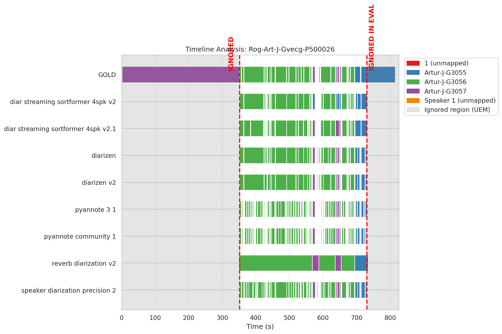

#### 60-Second Snippets (Zoom-in)
Below are 60-second zoomed-in windows showing where the models performed best and worst (based on average DER).


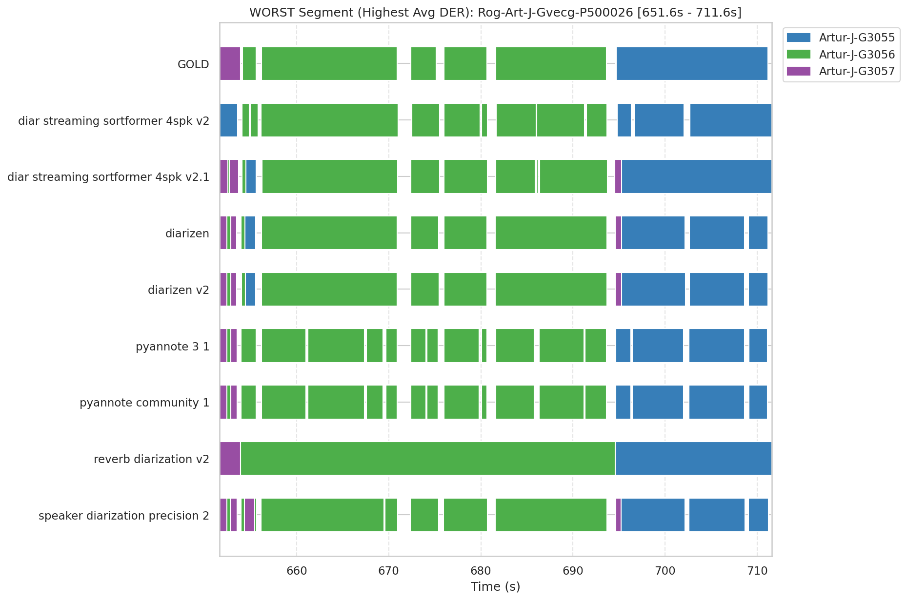

#### Metrics (Collar: 0.00s)

| Model                               | DER      | JER      | Miss     | FA       | Conf     | B-P       | B-R       | B-F1      | Pur       | Cov       | VRAM (GB)   | Status   |
|-------------------------------------|----------|----------|----------|----------|----------|-----------|-----------|-----------|-----------|-----------|-------------|----------|
| diarizen v2                         | **3.57** | 7.19     | 0.99     | 2.21     | 0.37     | **72.73** | 80.00     | 76.19     | 98.83     | 98.46     | nan         | nan      |
| diarizen                            | 3.63     | 7.39     | 1.18     | 2.08     | 0.37     | 70.83     | 85.00     | **77.27** | 98.82     | 98.45     | nan         | nan      |
| diar streaming sortformer 4spk v2.1 | 4.01     | 6.69     | 1.56     | 2.45     | **0.00** | 53.70     | 72.50     | 61.70     | 98.99     | 98.99     | 1.9         | nan      |
| speaker diarization precision 2     | 4.42     | **6.59** | 2.50     | 1.93     | **0.00** | 47.95     | 87.50     | 61.95     | 98.90     | 98.90     | **0.0**     | nan      |
| pyannote 3 1                        | 7.31     | 7.73     | 6.29     | **1.02** | 0.01     | 33.04     | **92.50** | 48.68     | 99.42     | 99.42     | 1.6         | nan      |
| pyannote community 1                | 7.91     | 9.54     | 6.29     | 1.02     | 0.60     | 32.46     | **92.50** | 48.05     | 99.36     | 98.79     | 1.6         | nan      |
| reverb diarization v2               | 9.00     | 11.96    | **0.39** | 8.55     | 0.06     | 20.00     | 2.50      | 4.44      | **99.46** | 99.46     | 4.3         | nan      |
| diar streaming sortformer 4spk v2   | 12.02    | 50.39    | 2.13     | 2.00     | 7.89     | 59.18     | 72.50     | 65.17     | 91.56     | **99.98** | 1.9         | nan      |
| diar sortformer 4spk v1             | nan      | nan      | nan      | nan      | nan      | nan       | nan       | nan       | nan       | nan       | nan         | OOM/ERR  |

#### Metrics (Collar: 0.25s)

| Model                               | DER      | JER      | Miss     | FA       | Conf     | B-P       | B-R       | B-F1      | Pur       | Cov        | VRAM (GB)   | Status   |
|-------------------------------------|----------|----------|----------|----------|----------|-----------|-----------|-----------|-----------|------------|-------------|----------|
| diarizen v2                         | **2.16** | 5.21     | 0.85     | 0.92     | 0.38     | **72.73** | 80.00     | 76.19     | 98.96     | 98.78      | nan         | nan      |
| diarizen                            | 2.25     | 5.38     | 1.04     | 0.82     | 0.38     | 70.83     | 85.00     | **77.27** | 98.96     | 98.77      | nan         | nan      |
| diar streaming sortformer 4spk v2.1 | 2.34     | **3.95** | 1.25     | 1.09     | **0.00** | 53.70     | 72.50     | 61.70     | 99.09     | 99.28      | 1.9         | nan      |
| speaker diarization precision 2     | 3.09     | 4.57     | 2.44     | 0.65     | **0.00** | 47.95     | 87.50     | 61.95     | 98.97     | 99.22      | **0.0**     | nan      |
| reverb diarization v2               | 6.26     | 9.17     | **0.35** | 5.90     | **0.00** | 20.00     | 2.50      | 4.44      | **99.64** | 99.62      | 4.3         | nan      |
| pyannote 3 1                        | 6.52     | 6.17     | 6.21     | **0.31** | **0.00** | 33.04     | **92.50** | 48.68     | 99.48     | 99.49      | 1.6         | nan      |
| pyannote community 1                | 7.10     | 8.02     | 6.21     | **0.31** | 0.57     | 32.46     | **92.50** | 48.05     | 99.46     | 98.91      | 1.6         | nan      |
| diar streaming sortformer 4spk v2   | 9.85     | 48.97    | 1.70     | 0.66     | 7.49     | 59.18     | 72.50     | 65.17     | 92.03     | **100.00** | 1.9         | nan      |
| diar sortformer 4spk v1             | nan      | nan      | nan      | nan      | nan      | nan       | nan       | nan       | nan       | nan        | nan         | OOM/ERR  |


---

### File: Rog-Art-J-Gvecg-P500028

**Primary category:** okrogla miza | **Quality:** Unknown | **Device:** Unknown

> *Pogovor o robotih in umetni inteligenci*

> **ERRATA (UEM):** start **340.9927782424506**s, end **727.2418686658195**s

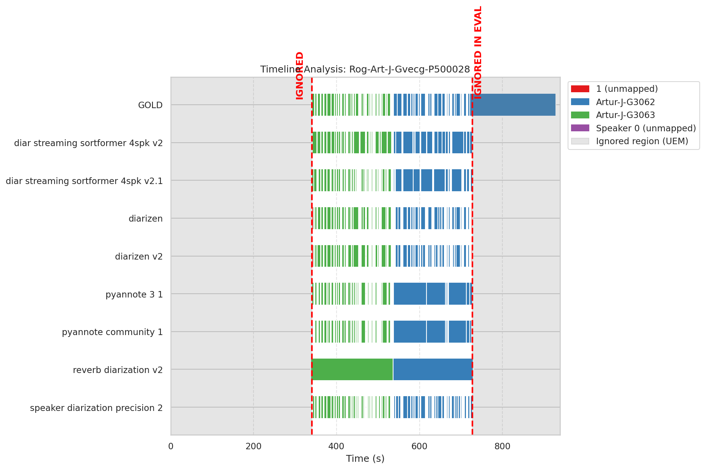

#### 60-Second Snippets (Zoom-in)
Below are 60-second zoomed-in windows showing where the models performed best and worst (based on average DER).

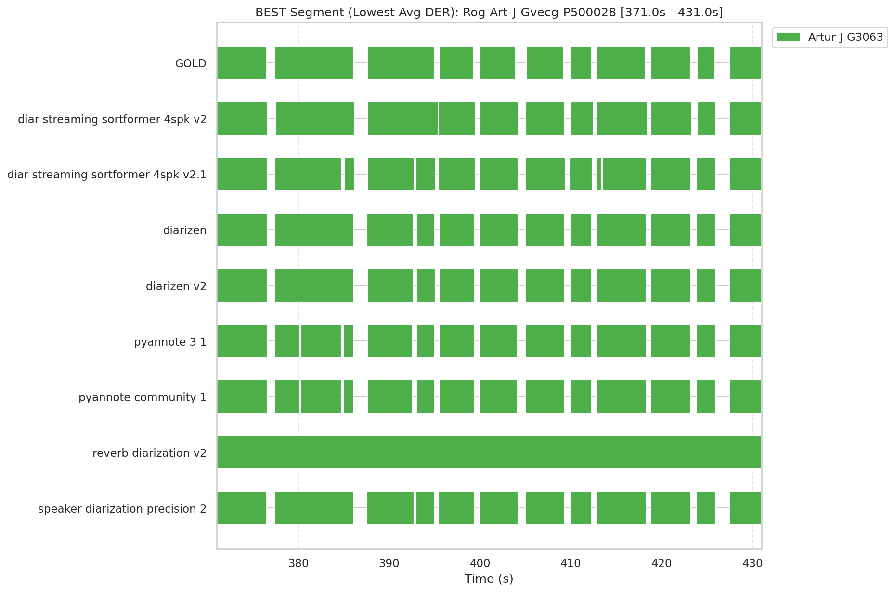

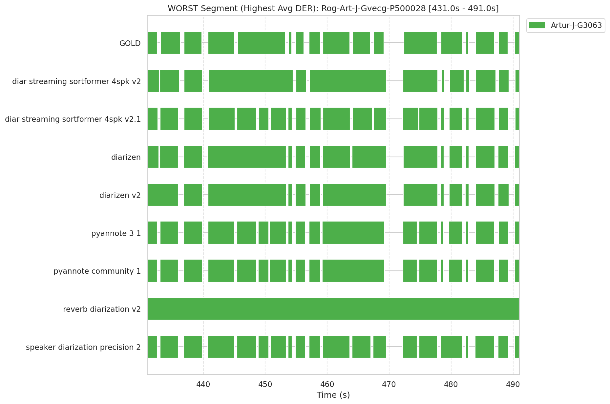

#### Metrics (Collar: 0.00s)

| Model                               | DER      | JER      | Miss     | FA       | Conf     | B-P       | B-R       | B-F1      | Pur        | Cov        | VRAM (GB)   | Status   |
|-------------------------------------|----------|----------|----------|----------|----------|-----------|-----------|-----------|------------|------------|-------------|----------|
| speaker diarization precision 2     | **5.49** | **5.30** | 1.72     | **3.78** | **0.00** | 73.74     | **89.02** | **80.66** | **100.00** | **100.00** | **0.0**     | nan      |
| diarizen                            | 7.35     | 7.08     | 1.83     | 3.83     | 1.69     | 72.04     | 81.71     | 76.57     | 99.22      | 98.28      | nan         | nan      |
| diarizen v2                         | 7.86     | 7.55     | 2.14     | 4.04     | 1.68     | 70.97     | 80.49     | 75.43     | 99.23      | 98.28      | nan         | nan      |
| diar streaming sortformer 4spk v2.1 | 8.62     | 8.03     | 1.53     | 7.10     | **0.00** | 66.25     | 64.63     | 65.43     | **100.00** | **100.00** | 2.4         | nan      |
| diar streaming sortformer 4spk v2   | 9.52     | 8.79     | 1.08     | 8.44     | **0.00** | 69.23     | 43.90     | 53.73     | **100.00** | **100.00** | 2.4         | nan      |
| pyannote 3 1                        | 10.13    | 9.14     | 1.33     | 8.78     | 0.01     | **74.58** | 53.66     | 62.41     | 99.99      | 99.99      | 1.6         | nan      |
| pyannote community 1                | 11.10    | 10.05    | 1.33     | 8.78     | 0.99     | 72.13     | 53.66     | 61.54     | 99.62      | 99.00      | 1.6         | nan      |
| reverb diarization v2               | 19.06    | 15.99    | **0.00** | 19.06    | **0.00** | 0.00      | 0.00      | 0.00      | **100.00** | **100.00** | 4.3         | nan      |
| diar sortformer 4spk v1             | nan      | nan      | nan      | nan      | nan      | nan       | nan       | nan       | nan        | nan        | nan         | OOM/ERR  |

#### Metrics (Collar: 0.25s)

| Model                               | DER      | JER      | Miss     | FA       | Conf     | B-P       | B-R       | B-F1      | Pur        | Cov        | VRAM (GB)   | Status   |
|-------------------------------------|----------|----------|----------|----------|----------|-----------|-----------|-----------|------------|------------|-------------|----------|
| speaker diarization precision 2     | **2.51** | **2.50** | 1.79     | **0.72** | **0.00** | 73.74     | **89.02** | **80.66** | **100.00** | **100.00** | **0.0**     | nan      |
| diar streaming sortformer 4spk v2.1 | 4.37     | 4.23     | 1.38     | 2.98     | **0.00** | 66.25     | 64.63     | 65.43     | **100.00** | **100.00** | 2.4         | nan      |
| diarizen                            | 4.62     | 4.57     | 1.77     | 1.09     | 1.76     | 72.04     | 81.71     | 76.57     | 99.17      | 98.34      | nan         | nan      |
| diar streaming sortformer 4spk v2   | 4.81     | 4.62     | 0.55     | 4.26     | **0.00** | 69.23     | 43.90     | 53.73     | **100.00** | **100.00** | 2.4         | nan      |
| diarizen v2                         | 5.16     | 5.09     | 2.05     | 1.35     | 1.75     | 70.97     | 80.49     | 75.43     | 99.18      | 98.32      | nan         | nan      |
| pyannote 3 1                        | 5.94     | 5.55     | 1.28     | 4.66     | **0.00** | **74.58** | 53.66     | 62.41     | **100.00** | **100.00** | 1.6         | nan      |
| pyannote community 1                | 6.95     | 6.53     | 1.28     | 4.66     | 1.01     | 72.13     | 53.66     | 61.54     | 99.59      | 99.12      | 1.6         | nan      |
| reverb diarization v2               | 13.60    | 11.97    | **0.00** | 13.60    | **0.00** | 0.00      | 0.00      | 0.00      | **100.00** | **100.00** | 4.3         | nan      |
| diar sortformer 4spk v1             | nan      | nan      | nan      | nan      | nan      | nan       | nan       | nan       | nan        | nan        | nan         | OOM/ERR  |


---

### File: Rog-Art-J-Gvecg-P500046

**Primary category:** spletni dogodek | **Quality:** Unknown | **Device:** Unknown

> *Plačilo s karticami, varnost digitalizacije plačil in kriptovalutna plačila*

> **ERRATA (UEM):** start **619.0369940121694**s, end **978.7550333988212**s

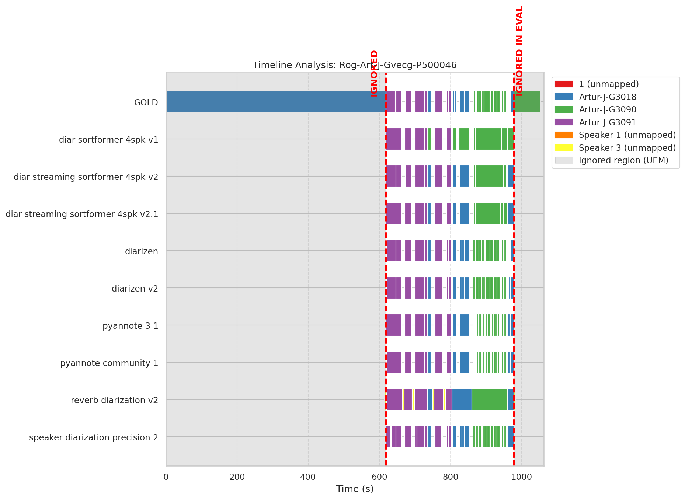

#### 60-Second Snippets (Zoom-in)
Below are 60-second zoomed-in windows showing where the models performed best and worst (based on average DER).

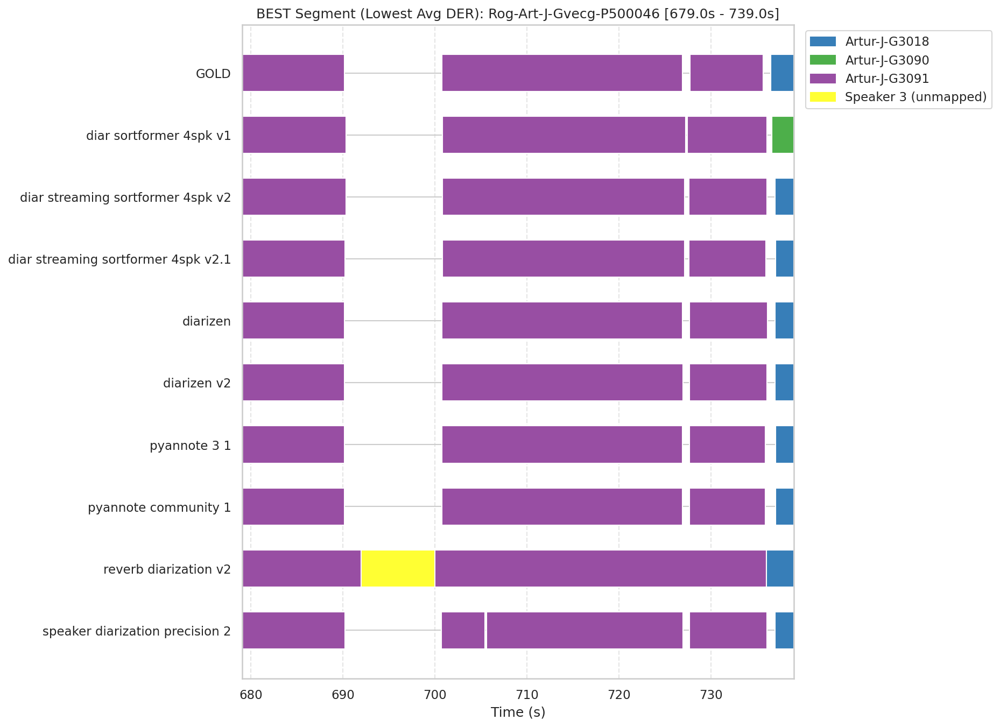

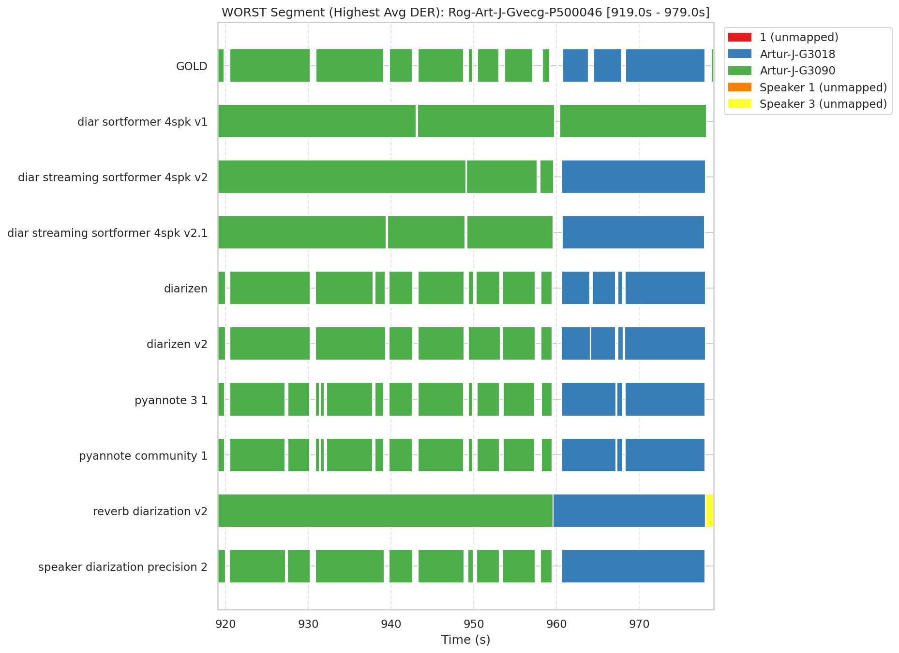

#### Metrics (Collar: 0.00s)

| Model                               | DER      | JER      | Miss     | FA       | Conf     | B-P       | B-R       | B-F1      | Pur        | Cov        | VRAM (GB)   |
|-------------------------------------|----------|----------|----------|----------|----------|-----------|-----------|-----------|------------|------------|-------------|
| speaker diarization precision 2     | **3.31** | 3.51     | 0.88     | 2.43     | **0.00** | 65.79     | 71.43     | 68.49     | **100.00** | **100.00** | **0.0**     |
| diarizen                            | 3.36     | **3.44** | 0.65     | 2.14     | 0.56     | 77.14     | **77.14** | 77.14     | **100.00** | 99.43      | nan         |
| diarizen v2                         | 3.56     | 3.67     | 0.55     | 2.44     | 0.56     | **79.41** | **77.14** | **78.26** | **100.00** | 99.43      | nan         |
| pyannote 3 1                        | 3.64     | 3.94     | 1.52     | **2.12** | **0.00** | 61.90     | 74.29     | 67.53     | **100.00** | **100.00** | 1.6         |
| pyannote community 1                | 4.27     | 4.36     | 1.52     | 2.12     | 0.62     | 61.36     | **77.14** | 68.35     | **100.00** | 99.37      | 1.6         |
| diar streaming sortformer 4spk v2.1 | 5.38     | 5.43     | 0.36     | 5.02     | **0.00** | 76.92     | 28.57     | 41.67     | **100.00** | **100.00** | 1.4         |
| diar streaming sortformer 4spk v2   | 5.52     | 5.62     | 0.29     | 5.23     | **0.00** | 50.00     | 20.00     | 28.57     | **100.00** | **100.00** | 1.4         |
| reverb diarization v2               | 27.44    | 17.05    | **0.00** | 27.12    | 0.32     | 6.67      | 2.86      | 4.00      | 99.96      | 99.68      | 4.3         |
| diar sortformer 4spk v1             | 29.04    | 50.14    | 0.23     | 5.88     | 22.92    | 41.67     | 14.29     | 21.28     | 77.02      | **100.00** | 88.8        |

#### Metrics (Collar: 0.25s)

| Model                               | DER      | JER      | Miss     | FA       | Conf     | B-P       | B-R       | B-F1      | Pur        | Cov        | VRAM (GB)   |
|-------------------------------------|----------|----------|----------|----------|----------|-----------|-----------|-----------|------------|------------|-------------|
| speaker diarization precision 2     | **1.51** | **1.62** | 0.76     | 0.75     | **0.00** | 65.79     | 71.43     | 68.49     | **100.00** | **100.00** | **0.0**     |
| diarizen                            | 1.66     | 1.68     | 0.50     | **0.63** | 0.53     | 77.14     | **77.14** | 77.14     | **100.00** | 99.49      | nan         |
| diarizen v2                         | 1.80     | 1.88     | 0.42     | 0.85     | 0.53     | **79.41** | **77.14** | **78.26** | **100.00** | 99.49      | nan         |
| pyannote 3 1                        | 2.14     | 2.37     | 1.38     | 0.76     | **0.00** | 61.90     | 74.29     | 67.53     | **100.00** | **100.00** | 1.6         |
| pyannote community 1                | 2.74     | 2.80     | 1.38     | 0.76     | 0.60     | 61.36     | **77.14** | 68.35     | **100.00** | 99.42      | 1.6         |
| diar streaming sortformer 4spk v2.1 | 2.81     | 2.96     | 0.15     | 2.66     | **0.00** | 76.92     | 28.57     | 41.67     | **100.00** | **100.00** | 1.4         |
| diar streaming sortformer 4spk v2   | 2.96     | 3.12     | 0.13     | 2.83     | **0.00** | 50.00     | 20.00     | 28.57     | **100.00** | **100.00** | 1.4         |
| reverb diarization v2               | 25.08    | 15.15    | **0.00** | 24.83    | 0.25     | 6.67      | 2.86      | 4.00      | **100.00** | 99.72      | 4.3         |
| diar sortformer 4spk v1             | 26.37    | 49.18    | 0.03     | 3.39     | 22.95    | 41.67     | 14.29     | 21.28     | 77.04      | **100.00** | 88.8        |


---

### File: Rog-Art-J-Gvecg-P500048

**Primary category:** spletni dogodek | **Quality:** Unknown | **Device:** Unknown

> *Imunizacija, Zakon o nalezljivih boleznih, cepljenje v Evropski uniji in cepljenje otrok*

> **ERRATA (UEM):** end **409.0241017594584**s

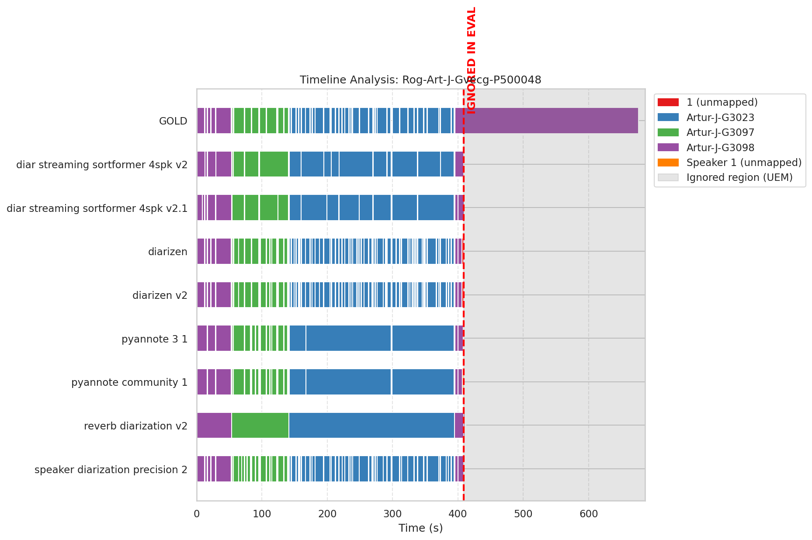

#### 60-Second Snippets (Zoom-in)
Below are 60-second zoomed-in windows showing where the models performed best and worst (based on average DER).

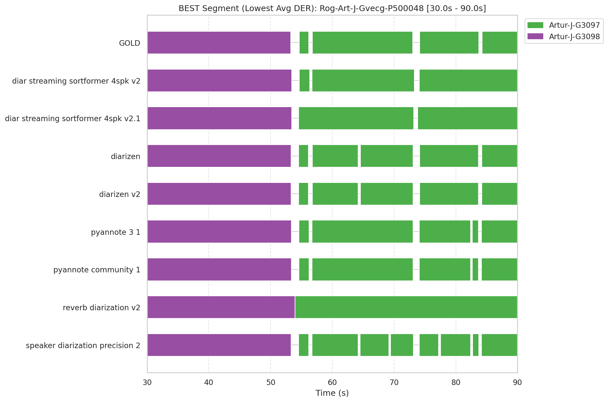

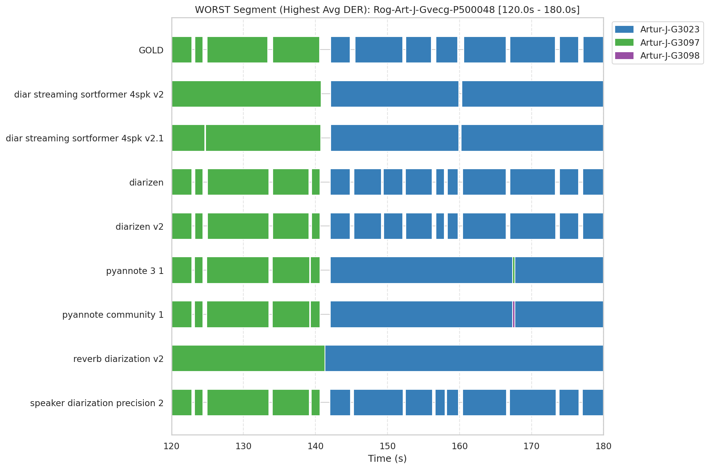

#### Metrics (Collar: 0.00s)

| Model                               | DER      | JER      | Miss     | FA       | Conf     | B-P       | B-R        | B-F1      | Pur        | Cov        | VRAM (GB)   | Status   |
|-------------------------------------|----------|----------|----------|----------|----------|-----------|------------|-----------|------------|------------|-------------|----------|
| speaker diarization precision 2     | **3.40** | **3.27** | 1.30     | 2.10     | **0.00** | **73.85** | 97.96      | **84.21** | **100.00** | **100.00** | **0.0**     | nan      |
| diarizen v2                         | 4.31     | 4.46     | 2.57     | **1.04** | 0.70     | 64.47     | **100.00** | 78.40     | **100.00** | 99.28      | nan         | nan      |
| diarizen                            | 4.42     | 4.79     | 2.49     | 1.08     | 0.84     | 63.64     | **100.00** | 77.78     | 99.88      | 99.14      | nan         | nan      |
| diar streaming sortformer 4spk v2   | 6.20     | 4.83     | 0.02     | 6.18     | **0.00** | 61.11     | 22.45      | 32.84     | **100.00** | **100.00** | 1.6         | nan      |
| diar streaming sortformer 4spk v2.1 | 6.52     | 5.21     | 0.18     | 6.33     | **0.00** | 66.67     | 24.49      | 35.82     | **100.00** | **100.00** | 1.6         | nan      |
| pyannote 3 1                        | 6.92     | 5.41     | 0.46     | 6.19     | 0.26     | 56.52     | 26.53      | 36.11     | 99.65      | 99.65      | 1.6         | nan      |
| pyannote community 1                | 7.18     | 5.83     | 0.46     | 6.19     | 0.53     | 56.00     | 28.57      | 37.84     | 99.92      | 99.39      | 1.6         | nan      |
| reverb diarization v2               | 9.84     | 8.50     | **0.00** | 9.84     | **0.00** | 0.00      | 0.00       | 0.00      | 100.00     | 100.00     | 4.3         | nan      |
| diar sortformer 4spk v1             | nan      | nan      | nan      | nan      | nan      | nan       | nan        | nan       | nan        | nan        | nan         | OOM/ERR  |

#### Metrics (Collar: 0.25s)

| Model                               | DER      | JER      | Miss     | FA       | Conf     | B-P       | B-R        | B-F1      | Pur        | Cov        | VRAM (GB)   | Status   |
|-------------------------------------|----------|----------|----------|----------|----------|-----------|------------|-----------|------------|------------|-------------|----------|
| speaker diarization precision 2     | **1.50** | **1.81** | 1.29     | 0.20     | **0.00** | **73.85** | 97.96      | **84.21** | **100.00** | **100.00** | **0.0**     | nan      |
| diar streaming sortformer 4spk v2   | 3.24     | 2.52     | **0.00** | 3.24     | **0.00** | 61.11     | 22.45      | 32.84     | **100.00** | **100.00** | 1.6         | nan      |
| diarizen v2                         | 3.42     | 3.64     | 2.56     | 0.14     | 0.72     | 64.47     | **100.00** | 78.40     | **100.00** | 99.30      | nan         | nan      |
| diarizen                            | 3.45     | 3.92     | 2.45     | **0.13** | 0.87     | 63.64     | **100.00** | 77.78     | 99.88      | 99.22      | nan         | nan      |
| diar streaming sortformer 4spk v2.1 | 3.56     | 2.89     | 0.18     | 3.39     | **0.00** | 66.67     | 24.49      | 35.82     | **100.00** | **100.00** | 1.6         | nan      |
| pyannote 3 1                        | 4.21     | 3.52     | 0.46     | 3.48     | 0.27     | 56.52     | 26.53      | 36.11     | 99.64      | 99.75      | 1.6         | nan      |
| pyannote community 1                | 4.49     | 3.94     | 0.46     | 3.48     | 0.55     | 56.00     | 28.57      | 37.84     | 99.92      | 99.48      | 1.6         | nan      |
| reverb diarization v2               | 6.70     | 6.13     | **0.00** | 6.70     | **0.00** | 0.00      | 0.00       | 0.00      | 100.00     | **100.00** | 4.3         | nan      |
| diar sortformer 4spk v1             | nan      | nan      | nan      | nan      | nan      | nan       | nan        | nan       | nan        | nan        | nan         | OOM/ERR  |


---

### File: Rog-Art-J-Gvecg-P500054

**Primary category:** okrogla miza | **Quality:** Unknown | **Device:** Unknown

> *Pravice otrok v Sloveniji*

> **ERRATA (UEM):** end **435.3360663825315**s

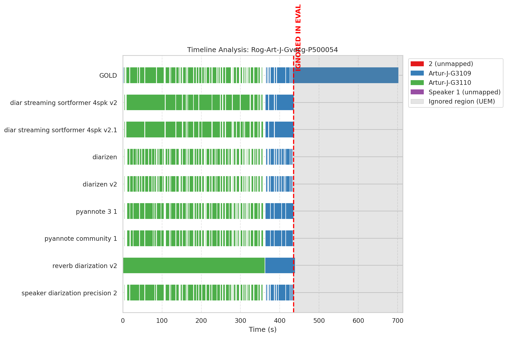

#### 60-Second Snippets (Zoom-in)
Below are 60-second zoomed-in windows showing where the models performed best and worst (based on average DER).

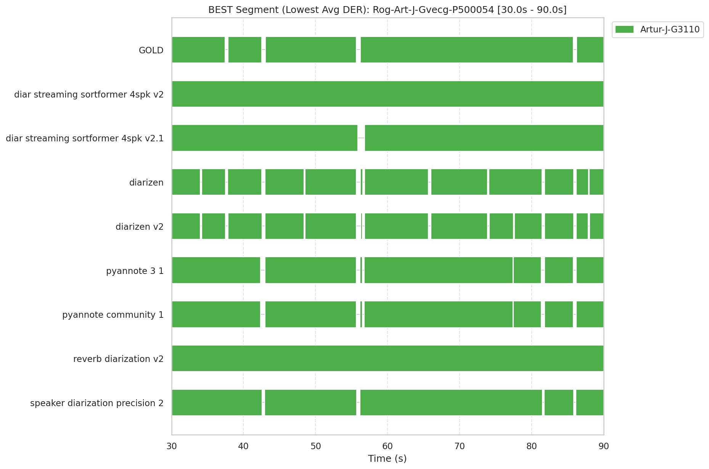

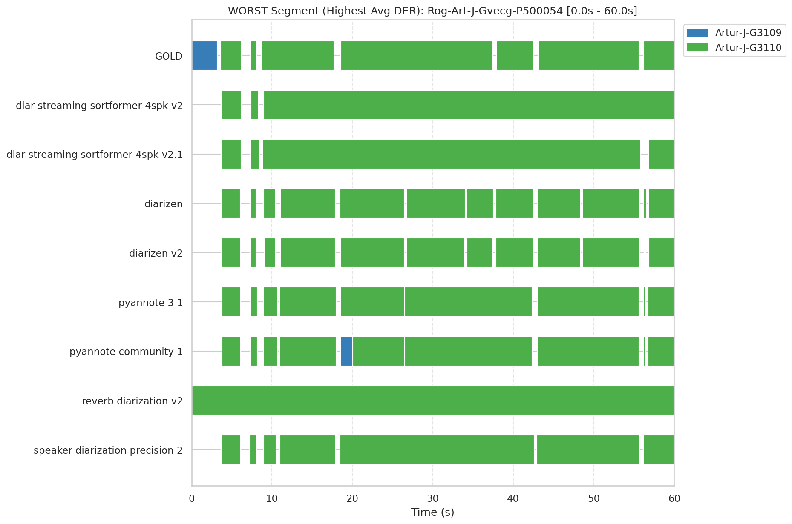

#### Metrics (Collar: 0.00s)

| Model                               | DER      | JER      | Miss     | FA       | Conf     | B-P       | B-R       | B-F1      | Pur        | Cov        | VRAM (GB)   | Status   |
|-------------------------------------|----------|----------|----------|----------|----------|-----------|-----------|-----------|------------|------------|-------------|----------|
| speaker diarization precision 2     | **4.65** | **5.48** | 1.91     | 2.74     | **0.00** | **78.79** | 85.25     | **81.89** | **100.00** | **100.00** | **0.0**     | nan      |
| pyannote 3 1                        | 5.65     | 7.23     | 2.35     | 3.30     | **0.00** | 67.19     | 70.49     | 68.80     | **100.00** | **100.00** | 1.6         | nan      |
| diarizen                            | 5.70     | 7.34     | 3.60     | 1.66     | 0.44     | 62.22     | **91.80** | 74.17     | **100.00** | 99.54      | nan         | nan      |
| diarizen v2                         | 5.79     | 7.42     | 3.74     | **1.61** | 0.44     | 62.22     | **91.80** | 74.17     | **100.00** | 99.54      | nan         | nan      |
| pyannote community 1                | 6.39     | 9.25     | 2.35     | 3.30     | 0.74     | 63.24     | 70.49     | 66.67     | 99.61      | 99.25      | 1.6         | nan      |
| diar streaming sortformer 4spk v2.1 | 7.20     | 8.19     | 1.65     | 5.55     | **0.00** | 74.19     | 37.70     | 50.00     | **100.00** | **100.00** | 2.0         | nan      |
| diar streaming sortformer 4spk v2   | 8.18     | 8.50     | 1.12     | 7.06     | **0.00** | 60.00     | 24.59     | 34.88     | **100.00** | **100.00** | 2.0         | nan      |
| reverb diarization v2               | 12.73    | 12.00    | **0.00** | 11.92    | 0.81     | 0.00      | 0.00      | 0.00      | 99.19      | 99.19      | 4.3         | nan      |
| diar sortformer 4spk v1             | nan      | nan      | nan      | nan      | nan      | nan       | nan       | nan       | nan        | nan        | nan         | OOM/ERR  |

#### Metrics (Collar: 0.25s)

| Model                               | DER      | JER      | Miss     | FA       | Conf     | B-P       | B-R       | B-F1      | Pur        | Cov        | VRAM (GB)   | Status   |
|-------------------------------------|----------|----------|----------|----------|----------|-----------|-----------|-----------|------------|------------|-------------|----------|
| speaker diarization precision 2     | **2.33** | **3.62** | 1.64     | 0.70     | **0.00** | **78.79** | 85.25     | **81.89** | **100.00** | **100.00** | **0.0**     | nan      |
| pyannote 3 1                        | 3.25     | 4.83     | 1.92     | 1.33     | **0.00** | 67.19     | 70.49     | 68.80     | **100.00** | **100.00** | 1.6         | nan      |
| pyannote community 1                | 3.98     | 6.90     | 1.92     | 1.33     | 0.73     | 63.24     | 70.49     | 66.67     | 99.63      | 99.34      | 1.6         | nan      |
| diarizen                            | 4.00     | 5.85     | 3.21     | **0.33** | 0.46     | 62.22     | **91.80** | 74.17     | **100.00** | 99.58      | nan         | nan      |
| diarizen v2                         | 4.14     | 5.98     | 3.33     | 0.35     | 0.46     | 62.22     | **91.80** | 74.17     | **100.00** | 99.58      | nan         | nan      |
| diar streaming sortformer 4spk v2.1 | 4.20     | 5.41     | 1.15     | 3.05     | **0.00** | 74.19     | 37.70     | 50.00     | **100.00** | **100.00** | 2.0         | nan      |
| diar streaming sortformer 4spk v2   | 4.82     | 5.61     | 0.87     | 3.95     | **0.00** | 60.00     | 24.59     | 34.88     | **100.00** | **100.00** | 2.0         | nan      |
| reverb diarization v2               | 9.11     | 9.10     | **0.00** | 8.32     | 0.78     | 0.00      | 0.00      | 0.00      | 99.22      | 99.22      | 4.3         | nan      |
| diar sortformer 4spk v1             | nan      | nan      | nan      | nan      | nan      | nan       | nan       | nan       | nan        | nan        | nan         | OOM/ERR  |


---

### File: Rog-Art-J-Gvecg-P500063

**Primary category:** okrogla miza | **Quality:** Unknown | **Device:** Unknown

> *Kolektivno uveljavljanje avtorskih pravic*

> **ERRATA (UEM):** end **792.4261582294264**s

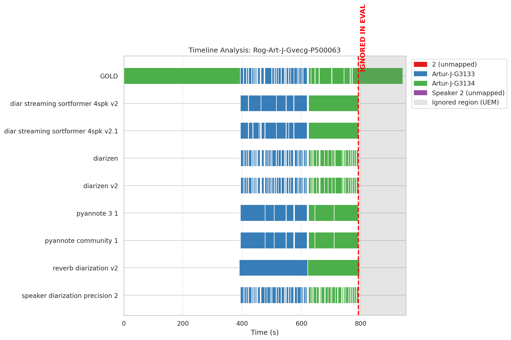

#### 60-Second Snippets (Zoom-in)
Below are 60-second zoomed-in windows showing where the models performed best and worst (based on average DER).

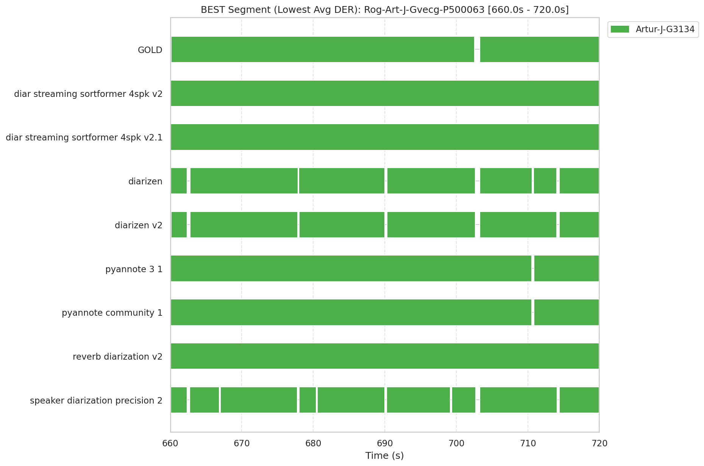

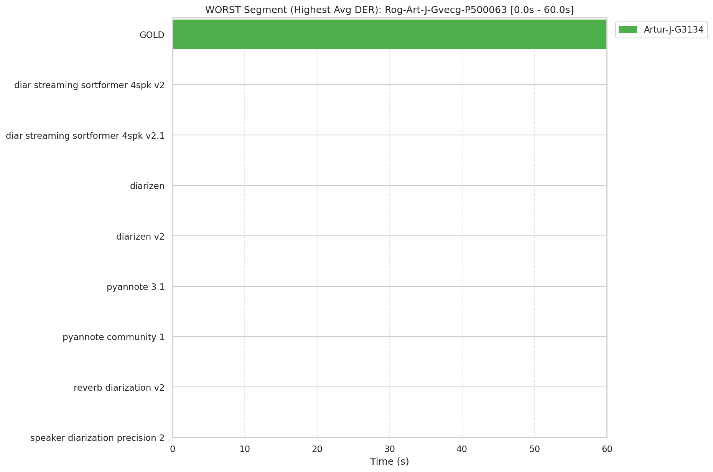

#### Metrics (Collar: 0.00s)

| Model                               | DER       | JER       | Miss      | FA       | Conf     | B-P       | B-R       | B-F1      | Pur        | Cov        | VRAM (GB)   | Status   |
|-------------------------------------|-----------|-----------|-----------|----------|----------|-----------|-----------|-----------|------------|------------|-------------|----------|
| diarizen v2                         | **53.12** | 37.57     | 52.28     | **0.64** | 0.20     | **52.54** | **86.11** | **65.26** | 99.88      | 99.58      | nan         | nan      |
| speaker diarization precision 2     | 53.14     | **37.53** | 52.12     | 1.03     | **0.00** | 50.00     | 80.56     | 61.70     | **100.00** | **100.00** | **0.0**     | nan      |
| diarizen                            | 53.17     | 37.66     | 52.27     | 0.70     | 0.20     | 50.82     | **86.11** | 63.92     | 99.88      | 99.58      | nan         | nan      |
| diar streaming sortformer 4spk v2   | 53.81     | 38.77     | 51.51     | 2.30     | **0.00** | 33.33     | 5.56      | 9.52      | **100.00** | **100.00** | 1.6         | nan      |
| pyannote 3 1                        | 53.84     | 38.90     | 51.49     | 2.35     | **0.00** | 44.44     | 11.11     | 17.78     | **100.00** | **100.00** | 1.6         | nan      |
| pyannote community 1                | 53.92     | 38.98     | 51.49     | 2.35     | 0.08     | 41.67     | 13.89     | 20.83     | 99.95      | 99.83      | 1.6         | nan      |
| diar streaming sortformer 4spk v2.1 | 53.93     | 39.00     | 51.76     | 2.17     | **0.00** | 25.00     | 8.33      | 12.50     | **100.00** | **100.00** | 1.6         | nan      |
| reverb diarization v2               | 54.48     | 40.04     | **50.78** | 3.18     | 0.52     | 0.00      | 0.00      | 0.00      | 98.94      | 98.94      | 4.3         | nan      |
| diar sortformer 4spk v1             | nan       | nan       | nan       | nan      | nan      | nan       | nan       | nan       | nan        | nan        | nan         | OOM/ERR  |

#### Metrics (Collar: 0.25s)

| Model                               | DER       | JER       | Miss      | FA       | Conf     | B-P       | B-R       | B-F1      | Pur        | Cov        | VRAM (GB)   | Status   |
|-------------------------------------|-----------|-----------|-----------|----------|----------|-----------|-----------|-----------|------------|------------|-------------|----------|
| speaker diarization precision 2     | **52.97** | **36.54** | 52.68     | 0.29     | **0.00** | 50.00     | 80.56     | 61.70     | **100.00** | **100.00** | **0.0**     | nan      |
| diarizen v2                         | 53.20     | 37.02     | 52.83     | **0.18** | 0.18     | **52.54** | **86.11** | **65.26** | 99.88      | 99.68      | nan         | nan      |
| diarizen                            | 53.20     | 37.05     | 52.83     | 0.19     | 0.18     | 50.82     | **86.11** | 63.92     | 99.88      | 99.68      | nan         | nan      |
| diar streaming sortformer 4spk v2   | 53.31     | 37.45     | 51.98     | 1.33     | **0.00** | 33.33     | 5.56      | 9.52      | **100.00** | **100.00** | 1.6         | nan      |
| pyannote 3 1                        | 53.34     | 37.60     | 52.04     | 1.30     | **0.00** | 44.44     | 11.11     | 17.78     | **100.00** | **100.00** | 1.6         | nan      |
| pyannote community 1                | 53.41     | 37.66     | 52.04     | 1.30     | 0.07     | 41.67     | 13.89     | 20.83     | 99.98      | 99.92      | 1.6         | nan      |
| diar streaming sortformer 4spk v2.1 | 53.43     | 37.68     | 52.19     | 1.24     | **0.00** | 25.00     | 8.33      | 12.50     | **100.00** | **100.00** | 1.6         | nan      |
| reverb diarization v2               | 53.93     | 38.76     | **51.37** | 2.05     | 0.51     | 0.00      | 0.00      | 0.00      | 98.95      | 98.97      | 4.3         | nan      |
| diar sortformer 4spk v1             | nan       | nan       | nan       | nan      | nan      | nan       | nan       | nan       | nan        | nan        | nan         | OOM/ERR  |


---

### File: Rog-Art-J-Gvecg-P500064

**Primary category:** okrogla miza | **Quality:** Unknown | **Device:** Unknown

> *Družine z otroki z redkoozdravljivimi boleznimi, pravica do dodatka za nego, zdravniške komisije*

> **ERRATA (UEM):** start **1525.02**s, end **1913.4553078470824**s

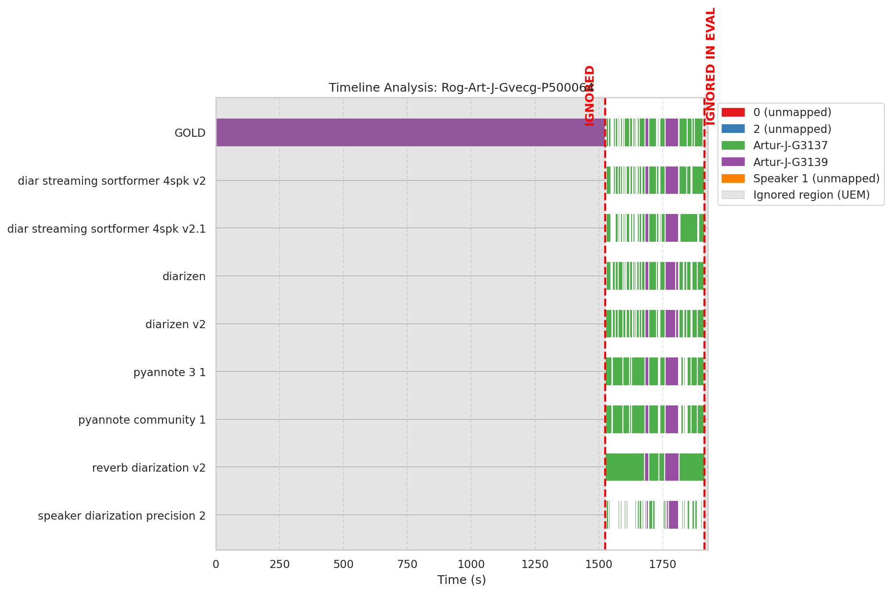

#### 60-Second Snippets (Zoom-in)
Below are 60-second zoomed-in windows showing where the models performed best and worst (based on average DER).

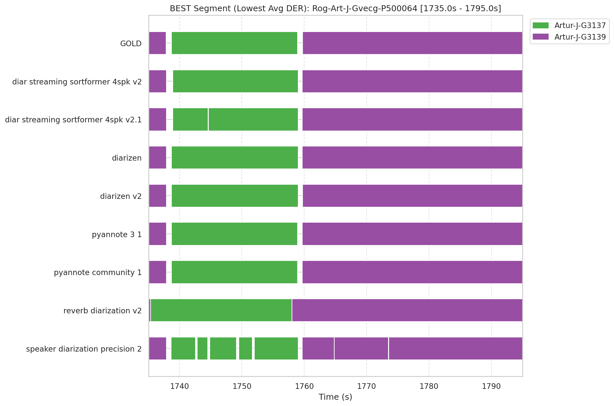

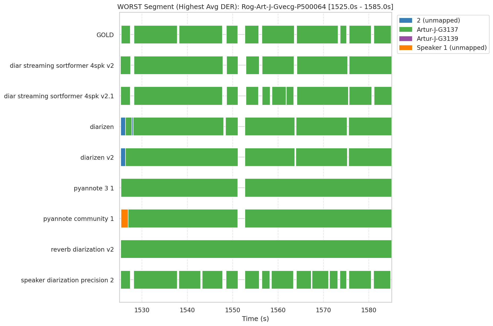

#### Metrics (Collar: 0.00s)

| Model                               | DER      | JER      | Miss     | FA       | Conf     | B-P       | B-R       | B-F1      | Pur       | Cov       | VRAM (GB)   | Status   |
|-------------------------------------|----------|----------|----------|----------|----------|-----------|-----------|-----------|-----------|-----------|-------------|----------|
| diar streaming sortformer 4spk v2   | **3.04** | **2.12** | 1.13     | 1.90     | 0.01     | **70.37** | 59.38     | 64.41     | 99.99     | 99.99     | 2.4         | nan      |
| diar streaming sortformer 4spk v2.1 | 3.31     | 2.29     | 1.72     | 1.59     | 0.01     | 62.86     | 68.75     | **65.67** | **99.99** | **99.99** | 2.4         | nan      |
| diarizen                            | 4.38     | 3.05     | 0.90     | 2.84     | 0.65     | 50.00     | 53.12     | 51.52     | 99.91     | 99.06     | nan         | nan      |
| diarizen v2                         | 4.74     | 3.43     | 0.84     | 3.19     | 0.71     | 53.33     | 50.00     | 51.61     | 99.86     | 98.99     | nan         | nan      |
| pyannote 3 1                        | 5.26     | 4.34     | 0.63     | 4.63     | **0.00** | 40.91     | 28.12     | 33.33     | 99.47     | 99.47     | 1.6         | nan      |
| speaker diarization precision 2     | 5.56     | 4.20     | 4.23     | **1.14** | 0.19     | 37.35     | **96.88** | 53.91     | 99.80     | 99.54     | **0.0**     | nan      |
| pyannote community 1                | 5.78     | 3.95     | 0.63     | 4.63     | 0.52     | 36.00     | 28.12     | 31.58     | 99.75     | 98.96     | 1.6         | nan      |
| reverb diarization v2               | 7.67     | 9.84     | **0.01** | 6.62     | 1.04     | 33.33     | 6.25      | 10.53     | 98.47     | 98.47     | 4.3         | nan      |
| diar sortformer 4spk v1             | nan      | nan      | nan      | nan      | nan      | nan       | nan       | nan       | nan       | nan       | nan         | OOM/ERR  |

#### Metrics (Collar: 0.25s)

| Model                               | DER      | JER      | Miss     | FA       | Conf     | B-P       | B-R       | B-F1      | Pur        | Cov        | VRAM (GB)   | Status   |
|-------------------------------------|----------|----------|----------|----------|----------|-----------|-----------|-----------|------------|------------|-------------|----------|
| diar streaming sortformer 4spk v2   | **1.49** | **0.92** | 0.75     | 0.75     | **0.00** | **70.37** | 59.38     | 64.41     | **100.00** | **100.00** | 2.4         | nan      |
| diar streaming sortformer 4spk v2.1 | 1.88     | 1.20     | 1.18     | 0.70     | **0.00** | 62.86     | 68.75     | **65.67** | **100.00** | **100.00** | 2.4         | nan      |
| diarizen                            | 2.66     | 1.87     | 0.75     | 1.33     | 0.58     | 50.00     | 53.12     | 51.52     | 99.91      | 99.41      | nan         | nan      |
| diarizen v2                         | 3.01     | 2.22     | 0.75     | 1.65     | 0.61     | 53.33     | 50.00     | 51.61     | 99.89      | 99.41      | nan         | nan      |
| pyannote 3 1                        | 3.61     | 3.21     | 0.58     | 3.04     | **0.00** | 40.91     | 28.12     | 33.33     | 99.47      | 99.87      | 1.6         | nan      |
| pyannote community 1                | 4.05     | 2.80     | 0.58     | 3.04     | 0.44     | 36.00     | 28.12     | 31.58     | 99.75      | 99.49      | 1.6         | nan      |
| speaker diarization precision 2     | 4.49     | 3.35     | 4.03     | **0.30** | 0.16     | 37.35     | **96.88** | 53.91     | 99.79      | 99.90      | **0.0**     | nan      |
| reverb diarization v2               | 5.50     | 7.88     | **0.00** | 4.56     | 0.94     | 33.33     | 6.25      | 10.53     | 98.62      | 98.78      | 4.3         | nan      |
| diar sortformer 4spk v1             | nan      | nan      | nan      | nan      | nan      | nan       | nan       | nan       | nan        | nan        | nan         | OOM/ERR  |


---

### File: Rog-Art-J-Gvecg-P580002

**Primary category:** intervju | **Quality:** Unknown | **Device:** Unknown

> *Radijski pogovor z Alenko Rumbak, direktorico Zavoda za zaposlovanje, delo v času korone*

> **ERRATA (UEM):** end **383.17359217877095**s

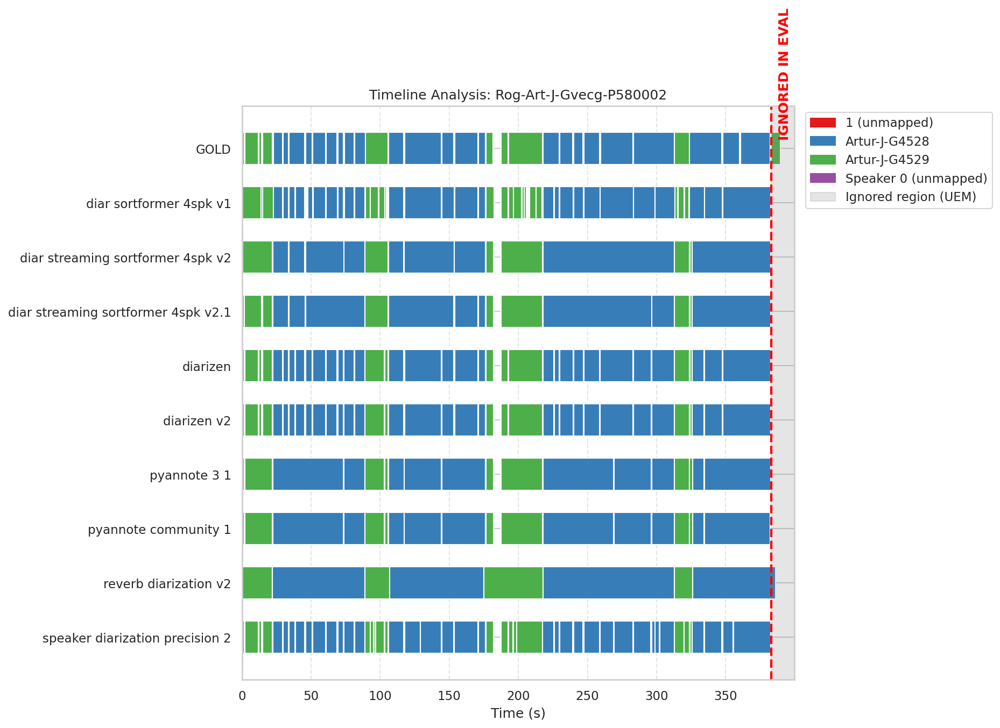

#### 60-Second Snippets (Zoom-in)
Below are 60-second zoomed-in windows showing where the models performed best and worst (based on average DER).

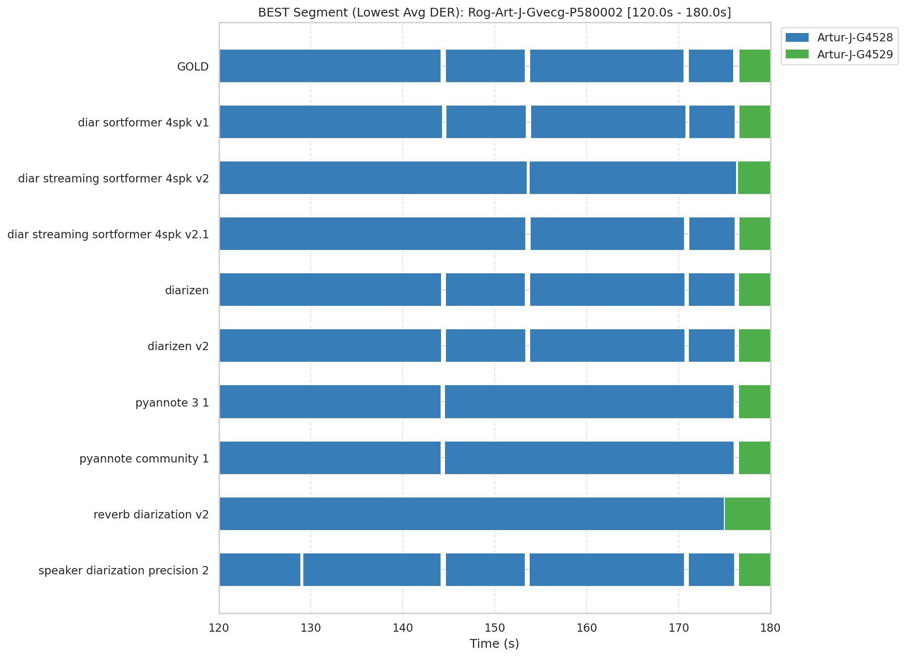

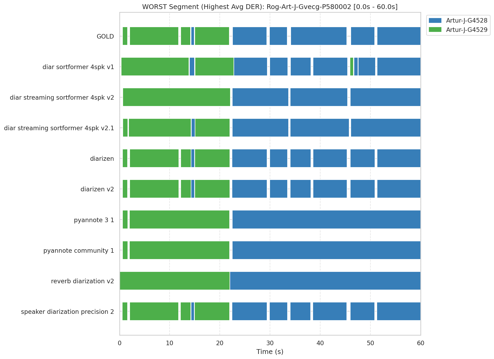

#### Metrics (Collar: 0.00s)

| Model                               | DER      | JER      | Miss     | FA       | Conf     | B-P       | B-R       | B-F1      | Pur       | Cov       | VRAM (GB)   |
|-------------------------------------|----------|----------|----------|----------|----------|-----------|-----------|-----------|-----------|-----------|-------------|
| diarizen v2                         | **2.02** | **2.37** | 0.66     | 1.33     | 0.04     | **76.92** | **90.91** | **83.33** | 98.80     | 98.80     | nan         |
| diarizen                            | 2.03     | 2.38     | 0.65     | 1.35     | 0.03     | 74.36     | 87.88     | 80.56     | 98.80     | 98.80     | nan         |
| speaker diarization precision 2     | 2.59     | 3.27     | 1.27     | **1.28** | 0.04     | 60.00     | **90.91** | 72.29     | 98.71     | 98.71     | **0.0**     |
| diar streaming sortformer 4spk v2.1 | 3.76     | 3.60     | 0.39     | 3.36     | **0.02** | 66.67     | 36.36     | 47.06     | **98.89** | **98.89** | 1.3         |
| diar streaming sortformer 4spk v2   | 3.94     | 4.20     | **0.24** | 3.51     | 0.19     | 53.33     | 24.24     | 33.33     | 98.72     | 98.72     | 1.3         |
| pyannote 3 1                        | 3.97     | 4.05     | 0.28     | 3.49     | 0.20     | 50.00     | 30.30     | 37.74     | 98.48     | 98.48     | 1.6         |
| pyannote community 1                | 4.06     | 4.07     | 0.28     | 3.49     | 0.29     | 47.62     | 30.30     | 37.04     | 98.48     | 98.38     | 1.6         |
| diar sortformer 4spk v1             | 4.86     | 8.13     | 1.84     | 2.08     | 0.94     | 36.21     | 63.64     | 46.15     | 98.42     | 98.42     | 66.7        |
| reverb diarization v2               | 7.32     | 9.42     | 0.60     | 5.90     | 0.82     | 57.14     | 12.12     | 20.00     | 98.58     | 98.58     | 4.3         |

#### Metrics (Collar: 0.25s)

| Model                               | DER      | JER      | Miss     | FA       | Conf     | B-P       | B-R       | B-F1      | Pur       | Cov       | VRAM (GB)   |
|-------------------------------------|----------|----------|----------|----------|----------|-----------|-----------|-----------|-----------|-----------|-------------|
| diarizen                            | **0.89** | **1.10** | 0.56     | 0.34     | **0.00** | 74.36     | 87.88     | 80.56     | 98.94     | 99.24     | nan         |
| diarizen v2                         | 0.90     | 1.11     | 0.57     | **0.34** | **0.00** | **76.92** | **90.91** | **83.33** | 98.94     | 99.24     | nan         |
| speaker diarization precision 2     | 1.54     | 2.08     | 1.20     | 0.34     | **0.00** | 60.00     | **90.91** | 72.29     | 98.86     | 99.12     | **0.0**     |
| diar streaming sortformer 4spk v2   | 1.91     | 2.02     | **0.15** | 1.66     | 0.11     | 53.33     | 24.24     | 33.33     | 98.91     | 99.10     | 1.3         |
| diar streaming sortformer 4spk v2.1 | 1.93     | 1.76     | 0.23     | 1.70     | **0.00** | 66.67     | 36.36     | 47.06     | **99.02** | **99.34** | 1.3         |
| pyannote 3 1                        | 2.07     | 2.05     | 0.24     | 1.71     | 0.11     | 50.00     | 30.30     | 37.74     | 98.70     | 98.69     | 1.6         |
| pyannote community 1                | 2.13     | 2.07     | 0.24     | 1.71     | 0.17     | 47.62     | 30.30     | 37.04     | 98.70     | 98.63     | 1.6         |
| diar sortformer 4spk v1             | 3.09     | 6.05     | 1.55     | 0.77     | 0.77     | 36.21     | 63.64     | 46.15     | 98.66     | 99.03     | 66.7        |
| reverb diarization v2               | 5.08     | 7.10     | 0.54     | 3.93     | 0.61     | 57.14     | 12.12     | 20.00     | 98.85     | 98.75     | 4.3         |


---

### File: Rog-Art-J-Gvecg-P580003

**Primary category:** intervju | **Quality:** Unknown | **Device:** Unknown

> *Pogovor z Alešem Klinarjem, članom skupine Agropop, komični muzikal po 18 letih, začetki skupine*

> **ERRATA (UEM):** end **337.79442065278556**s

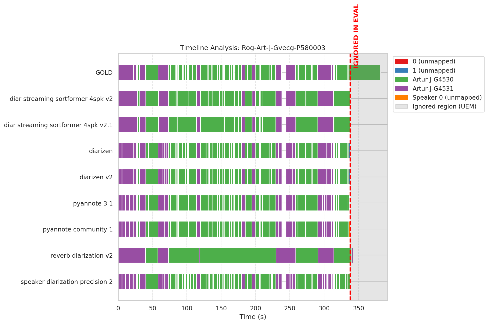

#### 60-Second Snippets (Zoom-in)
Below are 60-second zoomed-in windows showing where the models performed best and worst (based on average DER).

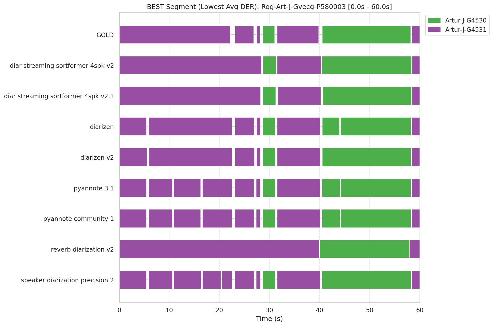

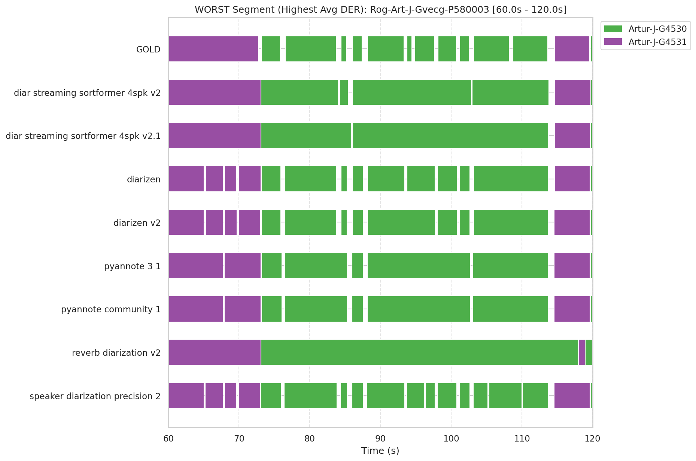

#### Metrics (Collar: 0.00s)

| Model                               | DER      | JER      | Miss     | FA       | Conf     | B-P       | B-R       | B-F1      | Pur       | Cov       | VRAM (GB)   | Status   |
|-------------------------------------|----------|----------|----------|----------|----------|-----------|-----------|-----------|-----------|-----------|-------------|----------|
| diarizen                            | **4.93** | 4.80     | 1.24     | **2.96** | 0.74     | **68.66** | **88.46** | **77.31** | 99.43     | 98.69     | nan         | nan      |
| diarizen v2                         | 4.93     | **4.75** | 1.04     | 3.16     | 0.74     | 67.69     | 84.62     | 75.21     | 99.43     | 98.69     | nan         | nan      |
| speaker diarization precision 2     | 5.52     | 5.53     | 2.03     | 3.49     | **0.00** | 58.23     | **88.46** | 70.23     | 99.41     | 99.41     | **0.0**     | nan      |
| pyannote 3 1                        | 5.98     | 5.92     | 1.16     | 4.49     | 0.33     | 66.67     | 73.08     | 69.72     | 99.06     | 99.06     | 1.6         | nan      |
| pyannote community 1                | 6.42     | 6.06     | 1.16     | 4.49     | 0.76     | 65.52     | 73.08     | 69.09     | 99.20     | 98.62     | 1.6         | nan      |
| diar streaming sortformer 4spk v2   | 7.57     | 6.46     | **0.15** | 7.42     | 0.00     | 48.28     | 26.92     | 34.57     | **99.43** | **99.43** | 1.5         | nan      |
| diar streaming sortformer 4spk v2.1 | 8.33     | 7.04     | 0.17     | 8.16     | **0.00** | 65.22     | 28.85     | 40.00     | 99.17     | 99.17     | 1.5         | nan      |
| reverb diarization v2               | 17.39    | 20.40    | 0.25     | 11.68    | 5.46     | 20.00     | 3.85      | 6.45      | 94.29     | 94.29     | 4.3         | nan      |
| diar sortformer 4spk v1             | nan      | nan      | nan      | nan      | nan      | nan       | nan       | nan       | nan       | nan       | nan         | OOM/ERR  |

#### Metrics (Collar: 0.25s)

| Model                               | DER      | JER      | Miss     | FA       | Conf     | B-P       | B-R       | B-F1      | Pur       | Cov       | VRAM (GB)   | Status   |
|-------------------------------------|----------|----------|----------|----------|----------|-----------|-----------|-----------|-----------|-----------|-------------|----------|
| diarizen v2                         | **2.60** | **2.71** | 1.05     | 0.81     | 0.74     | 67.69     | 84.62     | 75.21     | 99.61     | 99.08     | nan         | nan      |
| diarizen                            | 2.70     | 2.83     | 1.25     | **0.71** | 0.74     | **68.66** | **88.46** | **77.31** | 99.61     | 99.08     | nan         | nan      |
| speaker diarization precision 2     | 2.85     | 3.23     | 2.12     | 0.74     | **0.00** | 58.23     | **88.46** | 70.23     | 99.59     | 99.53     | **0.0**     | nan      |
| pyannote 3 1                        | 2.96     | 3.40     | 1.15     | 1.51     | 0.30     | 66.67     | 73.08     | 69.72     | 99.28     | 99.30     | 1.6         | nan      |
| pyannote community 1                | 3.42     | 3.56     | 1.15     | 1.51     | 0.76     | 65.52     | 73.08     | 69.09     | 99.43     | 98.93     | 1.6         | nan      |
| diar streaming sortformer 4spk v2   | 3.99     | 3.51     | **0.00** | 3.99     | **0.00** | 48.28     | 26.92     | 34.57     | **99.62** | **99.58** | 1.5         | nan      |
| diar streaming sortformer 4spk v2.1 | 4.82     | 4.19     | **0.00** | 4.82     | **0.00** | 65.22     | 28.85     | 40.00     | 99.37     | 99.45     | 1.5         | nan      |
| reverb diarization v2               | 13.22    | 17.37    | 0.18     | 7.81     | 5.24     | 20.00     | 3.85      | 6.45      | 94.58     | 94.47     | 4.3         | nan      |
| diar sortformer 4spk v1             | nan      | nan      | nan      | nan      | nan      | nan       | nan       | nan       | nan       | nan       | nan         | OOM/ERR  |


---

### File: Rog-Art-J-Gvecg-P580009

**Primary category:** intervju | **Quality:** Unknown | **Device:** Unknown

> *Radijska oddaja Nedeljska srečanja, pogovor z novinarjem Branetom Pianom o izdaji knjige, tedenskih kolumnah in Celju*

> **ERRATA (UEM):** end **365.81699999999995**s

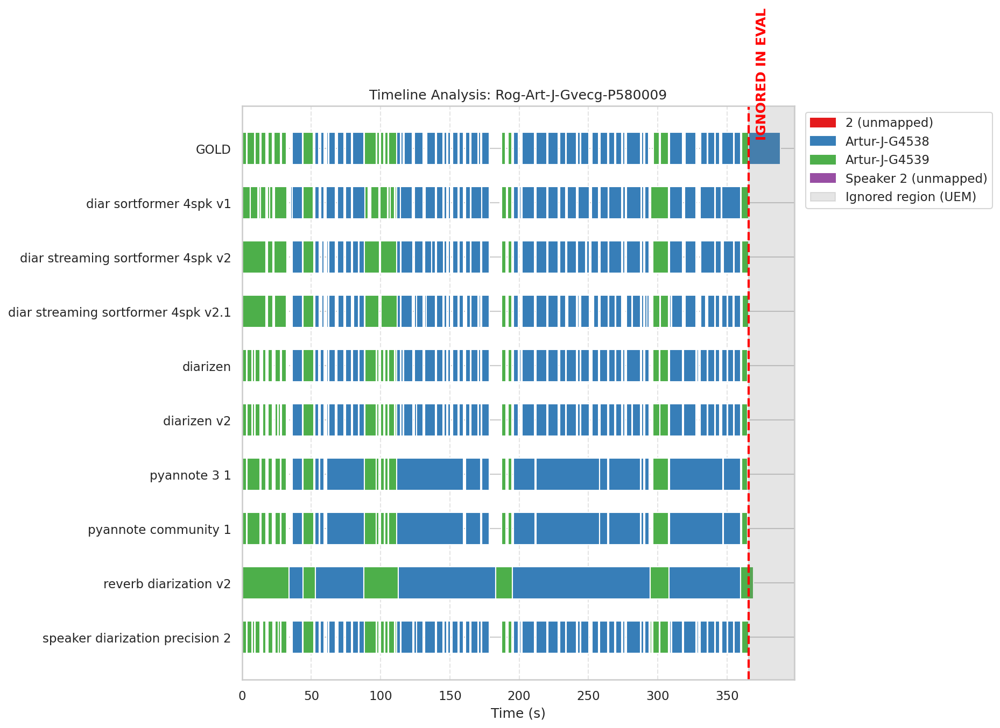

#### 60-Second Snippets (Zoom-in)
Below are 60-second zoomed-in windows showing where the models performed best and worst (based on average DER).

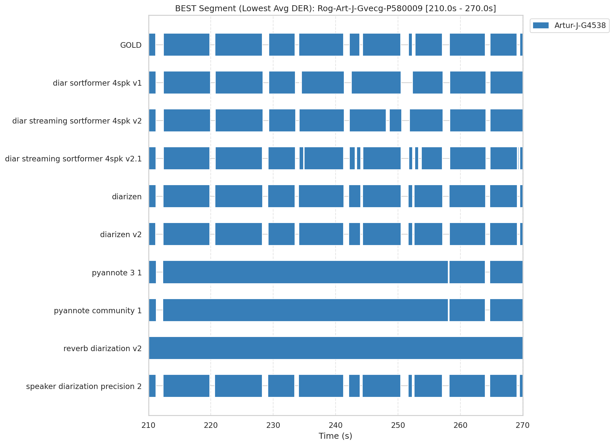

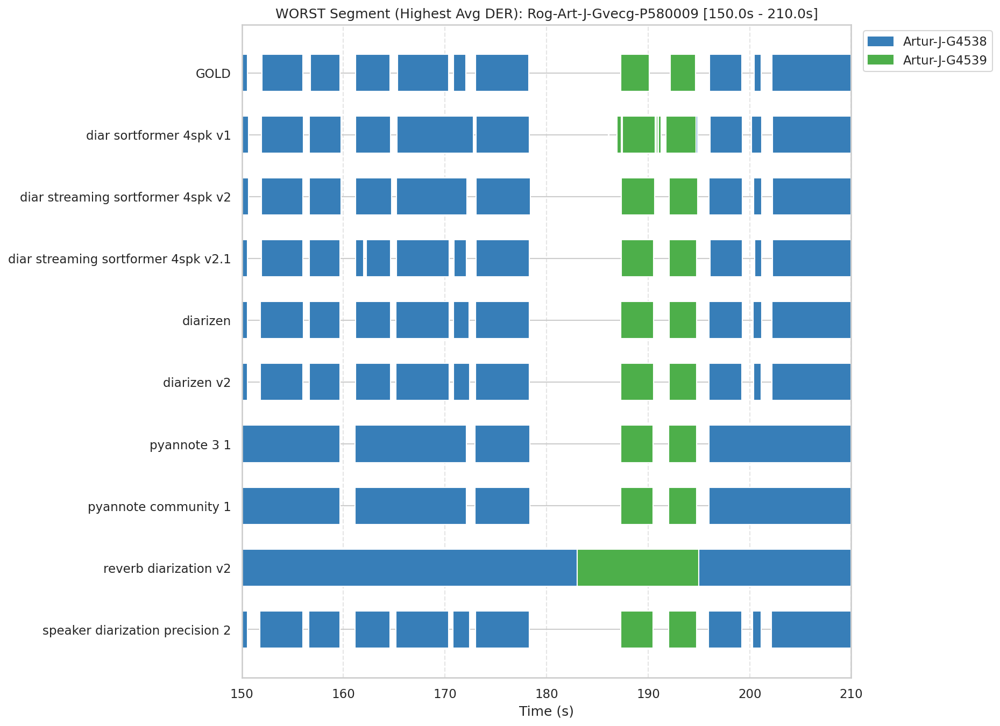

#### Metrics (Collar: 0.00s)

| Model                               | DER      | JER      | Miss     | FA       | Conf     | B-P       | B-R       | B-F1      | Pur       | Cov       | VRAM (GB)   |
|-------------------------------------|----------|----------|----------|----------|----------|-----------|-----------|-----------|-----------|-----------|-------------|
| diarizen v2                         | **4.53** | 5.29     | 1.62     | **2.67** | 0.24     | 82.50     | **89.19** | 85.71     | 98.53     | 98.29     | nan         |
| diarizen                            | 4.62     | 5.24     | 1.37     | 3.01     | 0.24     | 85.71     | **89.19** | **87.42** | **98.54** | 98.30     | nan         |
| speaker diarization precision 2     | 4.90     | **5.19** | 1.32     | 3.58     | **0.00** | 82.50     | **89.19** | 85.71     | 98.52     | 98.52     | **0.0**     |
| diar streaming sortformer 4spk v2.1 | 6.60     | 7.20     | 2.82     | 3.78     | **0.00** | 74.07     | 81.08     | 77.42     | 98.53     | **98.53** | 1.2         |
| diar streaming sortformer 4spk v2   | 7.66     | 8.06     | 1.43     | 6.22     | 0.01     | 81.67     | 66.22     | 73.13     | 98.37     | 98.37     | 1.2         |
| diar sortformer 4spk v1             | 11.45    | 13.13    | 2.11     | 8.54     | 0.80     | 47.78     | 58.11     | 52.44     | 98.16     | 98.16     | 49.0        |
| pyannote 3 1                        | 13.63    | 10.70    | **0.74** | 12.73    | 0.16     | **86.11** | 41.89     | 56.36     | 98.38     | 98.38     | 1.6         |
| pyannote community 1                | 13.65    | 10.61    | 0.74     | 12.73    | 0.18     | **86.11** | 41.89     | 56.36     | 98.53     | 98.35     | 1.6         |
| reverb diarization v2               | 25.16    | 21.49    | 0.85     | 23.51    | 0.79     | 30.00     | 4.05      | 7.14      | 98.28     | 98.28     | 4.3         |

#### Metrics (Collar: 0.25s)

| Model                               | DER      | JER      | Miss     | FA       | Conf     | B-P       | B-R       | B-F1      | Pur       | Cov       | VRAM (GB)   |
|-------------------------------------|----------|----------|----------|----------|----------|-----------|-----------|-----------|-----------|-----------|-------------|
| diarizen                            | **2.06** | 2.86     | 1.18     | 0.67     | 0.21     | 85.71     | **89.19** | **87.42** | 98.54     | 98.59     | nan         |
| speaker diarization precision 2     | 2.12     | **2.52** | 1.24     | 0.88     | **0.00** | 82.50     | **89.19** | 85.71     | 98.53     | 98.73     | **0.0**     |
| diarizen v2                         | 2.30     | 3.13     | 1.42     | **0.67** | 0.21     | 82.50     | **89.19** | 85.71     | 98.53     | 98.57     | nan         |
| diar streaming sortformer 4spk v2   | 3.44     | 4.12     | 0.86     | 2.58     | **0.00** | 81.67     | 66.22     | 73.13     | 98.38     | 98.69     | 1.2         |
| diar streaming sortformer 4spk v2.1 | 3.57     | 3.98     | 2.12     | 1.45     | **0.00** | 74.07     | 81.08     | 77.42     | 98.53     | 98.71     | 1.2         |
| diar sortformer 4spk v1             | 6.84     | 9.08     | 1.49     | 4.64     | 0.71     | 47.78     | 58.11     | 52.44     | 98.31     | **99.05** | 49.0        |
| pyannote 3 1                        | 9.37     | 7.27     | **0.57** | 8.69     | 0.12     | **86.11** | 41.89     | 56.36     | 98.41     | 98.71     | 1.6         |
| pyannote community 1                | 9.40     | 7.19     | 0.57     | 8.69     | 0.15     | **86.11** | 41.89     | 56.36     | 98.53     | 98.69     | 1.6         |
| reverb diarization v2               | 19.88    | 17.47    | 0.82     | 18.58    | 0.48     | 30.00     | 4.05      | 7.14      | **98.62** | 98.51     | 4.3         |


---

### File: Rog-Art-J-Gvecg-P580023

**Primary category:** intervju | **Quality:** Unknown | **Device:** Unknown

> *Pogovor s Špelo Drašler o njeni glasbeni družini, šolanjem na Pedagoški fakulteti in sodelovanju pri Akademskem pevskem zboru ter delu korepetitorja*

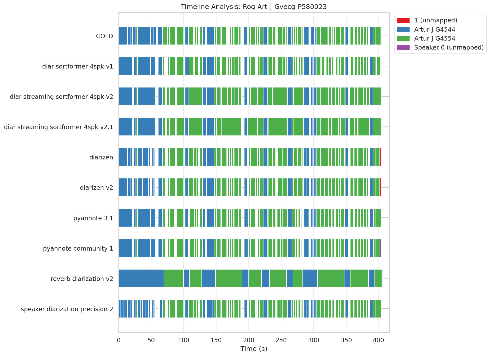

#### 60-Second Snippets (Zoom-in)
Below are 60-second zoomed-in windows showing where the models performed best and worst (based on average DER).

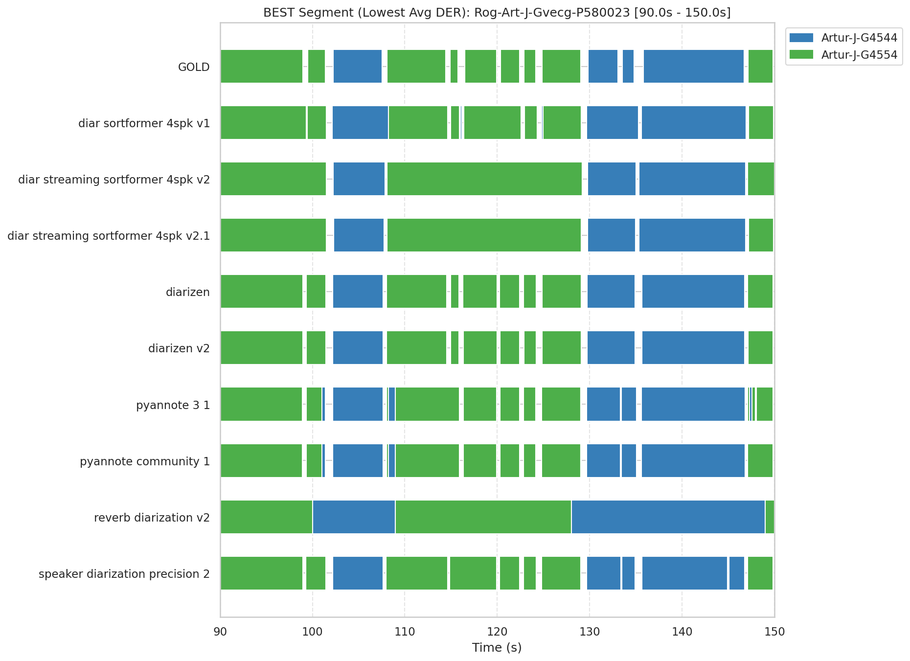

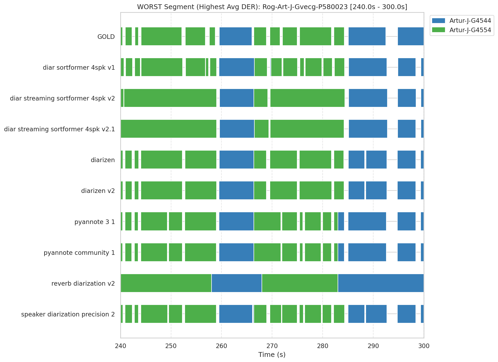

#### Metrics (Collar: 0.00s)

| Model                               | DER      | JER      | Miss     | FA       | Conf     | B-P       | B-R       | B-F1      | Pur       | Cov       | VRAM (GB)   |
|-------------------------------------|----------|----------|----------|----------|----------|-----------|-----------|-----------|-----------|-----------|-------------|
| diarizen v2                         | **6.99** | **7.11** | 2.83     | **3.70** | 0.46     | 82.56     | 86.59     | 84.52     | **99.78** | 99.31     | nan         |
| diarizen                            | 7.12     | 7.23     | 2.77     | 3.89     | 0.46     | **84.34** | 85.37     | **84.85** | 99.76     | 99.30     | nan         |
| speaker diarization precision 2     | 7.48     | 7.71     | 3.64     | 3.84     | **0.00** | 72.12     | **91.46** | 80.65     | 99.77     | **99.77** | **0.0**     |
| pyannote 3 1                        | 9.00     | 10.52    | 2.98     | 4.47     | 1.55     | 62.86     | 80.49     | 70.59     | 98.20     | 98.20     | 1.6         |
| pyannote community 1                | 9.23     | 10.53    | 2.98     | 4.47     | 1.78     | 66.00     | 80.49     | 72.53     | 98.30     | 97.96     | 1.6         |
| diar sortformer 4spk v1             | 10.77    | 11.86    | 3.53     | 5.90     | 1.34     | 41.54     | 65.85     | 50.94     | 98.47     | 98.47     | 34.2        |
| diar streaming sortformer 4spk v2   | 11.32    | 10.25    | 2.29     | 9.03     | 0.01     | 69.81     | 45.12     | 54.81     | 99.73     | 99.73     | 1.0         |
| diar streaming sortformer 4spk v2.1 | 12.63    | 11.02    | 2.48     | 10.12    | 0.03     | 66.67     | 34.15     | 45.16     | 99.74     | 99.74     | 1.0         |
| reverb diarization v2               | 24.37    | 25.61    | **0.00** | 17.38    | 6.98     | 11.11     | 2.44      | 4.00      | 93.02     | 93.02     | 4.3         |

#### Metrics (Collar: 0.25s)

| Model                               | DER      | JER      | Miss     | FA       | Conf     | B-P       | B-R       | B-F1      | Pur       | Cov       | VRAM (GB)   |
|-------------------------------------|----------|----------|----------|----------|----------|-----------|-----------|-----------|-----------|-----------|-------------|
| diarizen v2                         | **4.35** | **4.71** | 2.80     | 1.11     | 0.45     | 82.56     | 86.59     | 84.52     | 99.83     | 99.47     | nan         |
| diarizen                            | 4.40     | 4.77     | 2.74     | 1.21     | 0.45     | **84.34** | 85.37     | **84.85** | 99.83     | 99.46     | nan         |
| speaker diarization precision 2     | 4.73     | 5.24     | 3.71     | **1.02** | **0.00** | 72.12     | **91.46** | 80.65     | **99.84** | 99.89     | **0.0**     |
| pyannote 3 1                        | 5.75     | 7.38     | 2.88     | 1.47     | 1.39     | 62.86     | 80.49     | 70.59     | 98.42     | 98.68     | 1.6         |
| pyannote community 1                | 5.96     | 7.39     | 2.88     | 1.47     | 1.60     | 66.00     | 80.49     | 72.53     | 98.53     | 98.36     | 1.6         |
| diar sortformer 4spk v1             | 6.03     | 6.97     | 2.89     | 2.48     | 0.66     | 41.54     | 65.85     | 50.94     | 99.18     | 99.75     | 34.2        |
| diar streaming sortformer 4spk v2   | 6.50     | 6.29     | 2.13     | 4.37     | **0.00** | 69.81     | 45.12     | 54.81     | 99.79     | 99.89     | 1.0         |
| diar streaming sortformer 4spk v2.1 | 8.06     | 7.35     | 2.22     | 5.83     | **0.00** | 66.67     | 34.15     | 45.16     | 99.79     | **99.91** | 1.0         |
| reverb diarization v2               | 18.62    | 21.49    | **0.00** | 12.15    | 6.46     | 11.11     | 2.44      | 4.00      | 93.53     | 93.43     | 4.3         |


---

### File: Rog-Art-J-Gvecg-P580041

**Primary category:** intervju | **Quality:** Unknown | **Device:** Unknown

> *Pogovor z Martinom Golobom o veliki noči, spominih na ta praznik, otroštvu, družini, poklicu in avtu*

> **ERRATA (UEM):** end **346.12833513931884**s

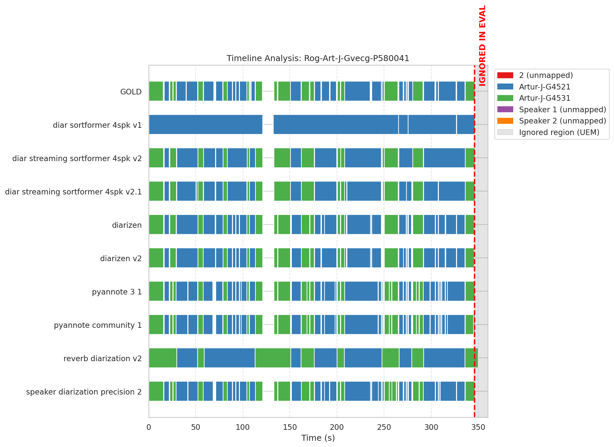

#### 60-Second Snippets (Zoom-in)
Below are 60-second zoomed-in windows showing where the models performed best and worst (based on average DER).

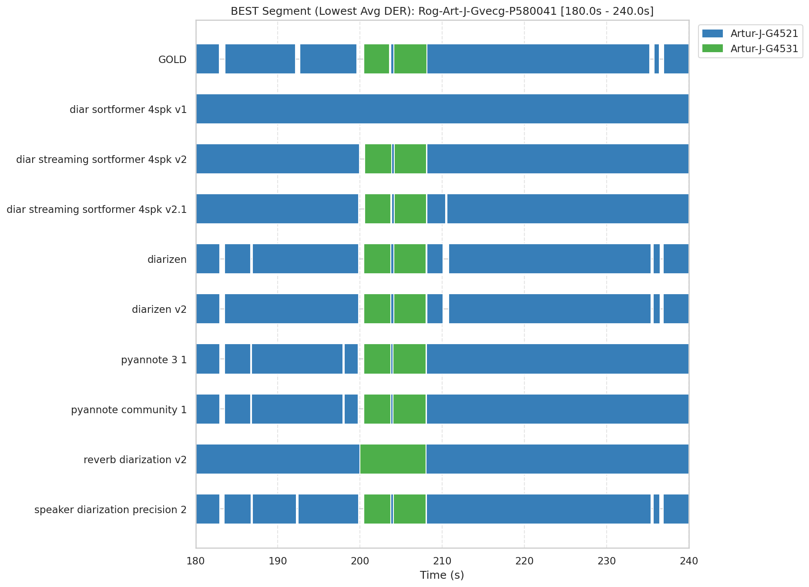

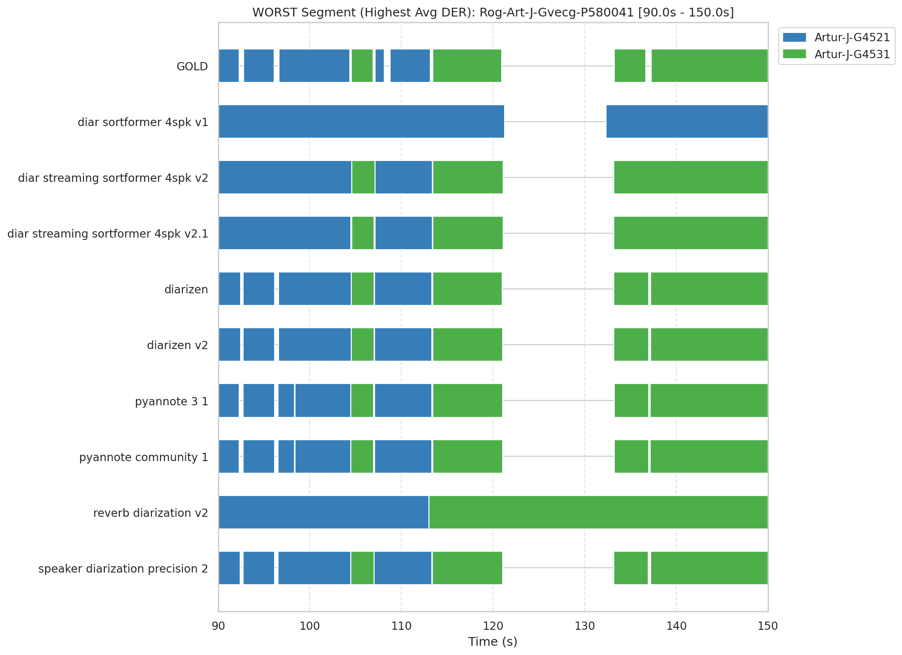

#### Metrics (Collar: 0.00s)

| Model                               | DER      | JER      | Miss     | FA       | Conf     | B-P       | B-R       | B-F1      | Pur       | Cov        | VRAM (GB)   |
|-------------------------------------|----------|----------|----------|----------|----------|-----------|-----------|-----------|-----------|------------|-------------|
| speaker diarization precision 2     | **4.13** | **3.94** | 1.20     | 2.90     | 0.03     | 75.00     | **86.67** | **80.41** | 99.93     | 99.93      | **0.0**     |
| diarizen v2                         | 4.62     | 4.22     | 1.49     | 2.96     | 0.18     | **81.40** | 77.78     | 79.55     | **99.99** | 99.82      | nan         |
| diarizen                            | 4.71     | 4.28     | 1.55     | 2.99     | 0.18     | 76.74     | 73.33     | 75.00     | 99.98     | 99.81      | nan         |
| pyannote 3 1                        | 4.79     | 4.38     | 2.11     | **2.67** | **0.02** | 61.82     | 75.56     | 68.00     | 99.90     | 99.90      | 1.6         |
| pyannote community 1                | 5.14     | 4.85     | 2.11     | 2.67     | 0.37     | 60.71     | 75.56     | 67.33     | 99.90     | 99.54      | 1.6         |
| diar streaming sortformer 4spk v2.1 | 5.44     | 4.91     | 0.73     | 4.50     | 0.21     | 70.97     | 48.89     | 57.89     | 99.98     | 99.79      | 1.3         |
| diar streaming sortformer 4spk v2   | 5.65     | 5.28     | 0.11     | 5.23     | 0.31     | 69.23     | 40.00     | 50.70     | 99.78     | 99.59      | 1.3         |
| reverb diarization v2               | 16.02    | 19.96    | 0.00     | 10.42    | 5.60     | 42.86     | 13.33     | 20.34     | 94.11     | 94.11      | 4.3         |
| diar sortformer 4spk v1             | 42.85    | 70.15    | **0.00** | 6.33     | 36.52    | 25.00     | 2.22      | 4.08      | 63.48     | **100.00** | 67.0        |

#### Metrics (Collar: 0.25s)

| Model                               | DER      | JER      | Miss     | FA       | Conf     | B-P       | B-R       | B-F1      | Pur        | Cov        | VRAM (GB)   |
|-------------------------------------|----------|----------|----------|----------|----------|-----------|-----------|-----------|------------|------------|-------------|
| speaker diarization precision 2     | **1.79** | **1.71** | 1.16     | **0.63** | **0.00** | 75.00     | **86.67** | **80.41** | **100.00** | **100.00** | **0.0**     |
| diarizen v2                         | 2.45     | 2.21     | 1.36     | 0.91     | 0.17     | **81.40** | 77.78     | 79.55     | **100.00** | 99.87      | nan         |
| diarizen                            | 2.55     | 2.29     | 1.43     | 0.95     | 0.17     | 76.74     | 73.33     | 75.00     | **100.00** | 99.87      | nan         |
| diar streaming sortformer 4spk v2   | 2.61     | 2.39     | **0.00** | 2.44     | 0.17     | 69.23     | 40.00     | 50.70     | 99.96      | 99.84      | 1.3         |
| diar streaming sortformer 4spk v2.1 | 2.77     | 2.45     | 0.43     | 2.18     | 0.16     | 70.97     | 48.89     | 57.89     | **100.00** | 99.87      | 1.3         |
| pyannote 3 1                        | 2.85     | 2.54     | 1.99     | 0.86     | **0.00** | 61.82     | 75.56     | 68.00     | 99.99      | **100.00** | 1.6         |
| pyannote community 1                | 3.21     | 3.04     | 1.99     | 0.86     | 0.36     | 60.71     | 75.56     | 67.33     | 99.99      | 99.67      | 1.6         |
| reverb diarization v2               | 12.47    | 16.87    | 0.00     | 7.48     | 4.99     | 42.86     | 13.33     | 20.34     | 94.71      | 94.60      | 4.3         |
| diar sortformer 4spk v1             | 39.79    | 69.27    | **0.00** | 3.26     | 36.53    | 25.00     | 2.22      | 4.08      | 63.47      | **100.00** | 67.0        |


---

### File: Rog-Art-J-Gvecg-P580047

**Primary category:** intervju | **Quality:** Unknown | **Device:** Unknown

> *Pogovor s Tanjo Fajon o delu na radiu, družini, začetkih novinarstva, študiju in delu dopisnice v Bruslju*

> **ERRATA (UEM):** end **324.7493414199072**s

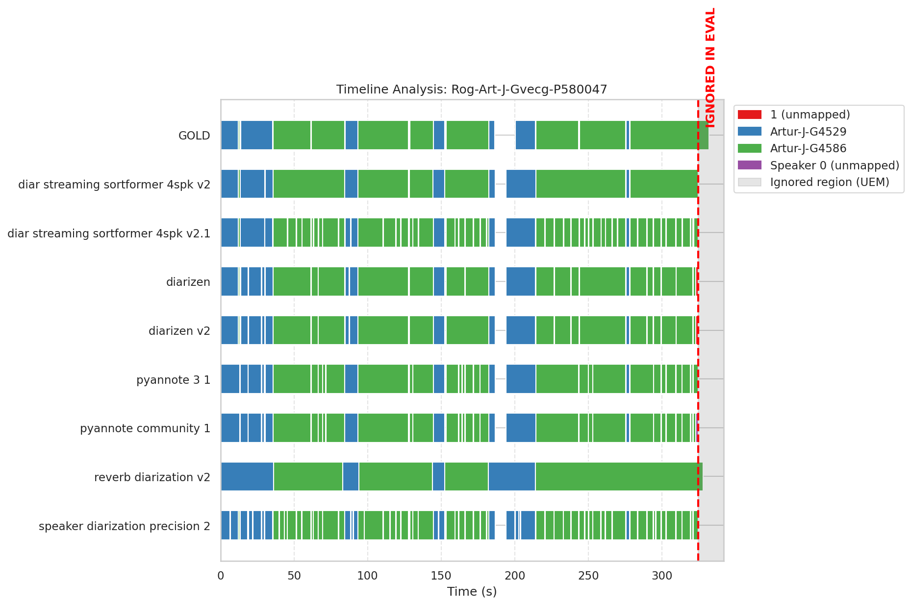

#### 60-Second Snippets (Zoom-in)
Below are 60-second zoomed-in windows showing where the models performed best and worst (based on average DER).

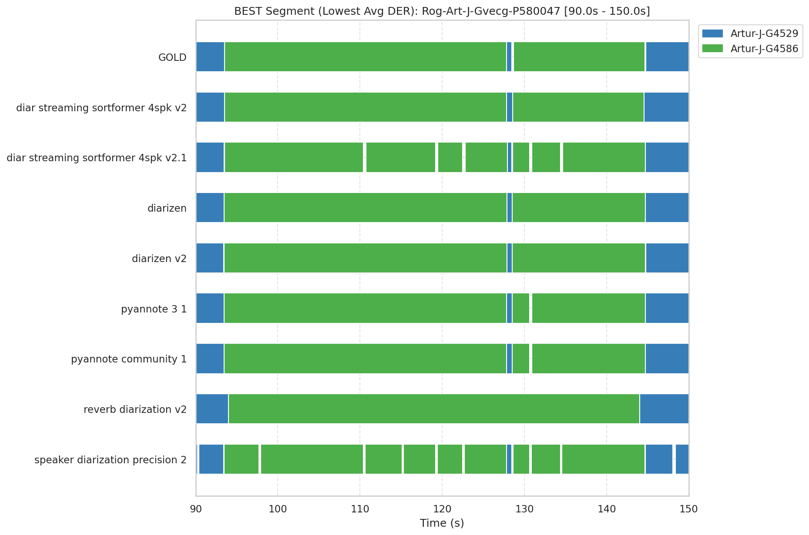

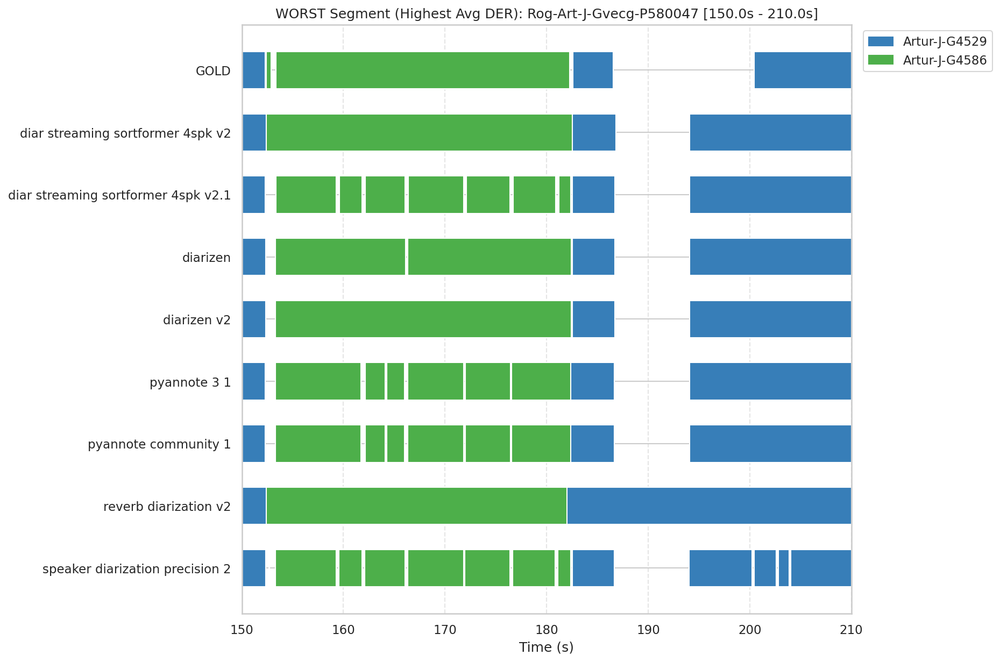

#### Metrics (Collar: 0.00s)

| Model                               | DER      | JER      | Miss     | FA       | Conf     | B-P       | B-R        | B-F1      | Pur       | Cov       | VRAM (GB)   | Status   |
|-------------------------------------|----------|----------|----------|----------|----------|-----------|------------|-----------|-----------|-----------|-------------|----------|
| diar streaming sortformer 4spk v2   | **3.66** | **5.91** | **0.02** | 3.60     | 0.04     | **85.71** | 70.59      | **77.42** | 99.39     | 99.39     | 1.5         | nan      |
| diarizen v2                         | 4.48     | 6.26     | 1.07     | 2.90     | 0.51     | 51.72     | 88.24      | 65.22     | 99.33     | 98.82     | nan         | nan      |
| diarizen                            | 4.60     | 6.33     | 1.22     | 2.86     | 0.51     | 50.00     | 88.24      | 63.83     | 99.32     | 98.82     | nan         | nan      |
| pyannote 3 1                        | 5.10     | 7.37     | 1.85     | 2.89     | 0.36     | 37.84     | 82.35      | 51.85     | 99.04     | 99.04     | 1.6         | nan      |
| pyannote community 1                | 5.65     | 7.72     | 1.85     | 2.89     | 0.92     | 35.90     | 82.35      | 50.00     | 99.04     | 98.47     | 1.6         | nan      |
| diar streaming sortformer 4spk v2.1 | 6.35     | 7.40     | 3.79     | 2.57     | **0.00** | 26.23     | 94.12      | 41.03     | **99.52** | **99.52** | 1.5         | nan      |
| speaker diarization precision 2     | 6.72     | 8.37     | 4.23     | **2.47** | 0.02     | 23.94     | **100.00** | 38.64     | 99.43     | 99.43     | **0.0**     | nan      |
| reverb diarization v2               | 8.45     | 14.64    | 0.21     | 6.16     | 2.08     | 28.57     | 11.76      | 16.67     | 97.49     | 97.49     | 4.3         | nan      |
| diar sortformer 4spk v1             | nan      | nan      | nan      | nan      | nan      | nan       | nan        | nan       | nan       | nan       | nan         | OOM/ERR  |

#### Metrics (Collar: 0.25s)

| Model                               | DER      | JER      | Miss     | FA       | Conf     | B-P       | B-R        | B-F1      | Pur       | Cov       | VRAM (GB)   | Status   |
|-------------------------------------|----------|----------|----------|----------|----------|-----------|------------|-----------|-----------|-----------|-------------|----------|
| diar streaming sortformer 4spk v2   | **2.57** | **4.63** | **0.00** | 2.57     | **0.00** | **85.71** | 70.59      | **77.42** | 99.61     | 99.64     | 1.5         | nan      |
| diarizen v2                         | 3.82     | 5.57     | 0.95     | 2.37     | 0.51     | 51.72     | 88.24      | 65.22     | 99.47     | 99.19     | nan         | nan      |
| diarizen                            | 3.97     | 5.68     | 1.10     | 2.35     | 0.51     | 50.00     | 88.24      | 63.83     | 99.47     | 99.18     | nan         | nan      |
| pyannote 3 1                        | 4.36     | 6.47     | 1.78     | 2.28     | 0.29     | 37.84     | 82.35      | 51.85     | 99.27     | 99.28     | 1.6         | nan      |
| pyannote community 1                | 4.92     | 6.83     | 1.78     | 2.28     | 0.85     | 35.90     | 82.35      | 50.00     | 99.27     | 98.79     | 1.6         | nan      |
| diar streaming sortformer 4spk v2.1 | 5.75     | 6.73     | 3.60     | **2.15** | **0.00** | 26.23     | 94.12      | 41.03     | **99.65** | **99.78** | 1.5         | nan      |
| speaker diarization precision 2     | 6.34     | 8.02     | 4.18     | 2.15     | 0.01     | 23.94     | **100.00** | 38.64     | 99.60     | 99.69     | **0.0**     | nan      |
| reverb diarization v2               | 6.89     | 12.82    | 0.13     | 5.03     | 1.73     | 28.57     | 11.76      | 16.67     | 98.03     | 97.81     | 4.3         | nan      |
| diar sortformer 4spk v1             | nan      | nan      | nan      | nan      | nan      | nan       | nan        | nan       | nan       | nan       | nan         | OOM/ERR  |


---

### File: Rog-Art-J-Gvecg-P580051

**Primary category:** spletni dogodek | **Quality:** Unknown | **Device:** Unknown

> *Govor na konferenci o idejnih horizontih postrazsvetljenske Evrope in pomenu temeljnih zgodovinskih pojmov (svoboda, demokracija, republika)*

> **ERRATA (UEM):** start **555.8339963333754**s, end **1088.2351830228845**s

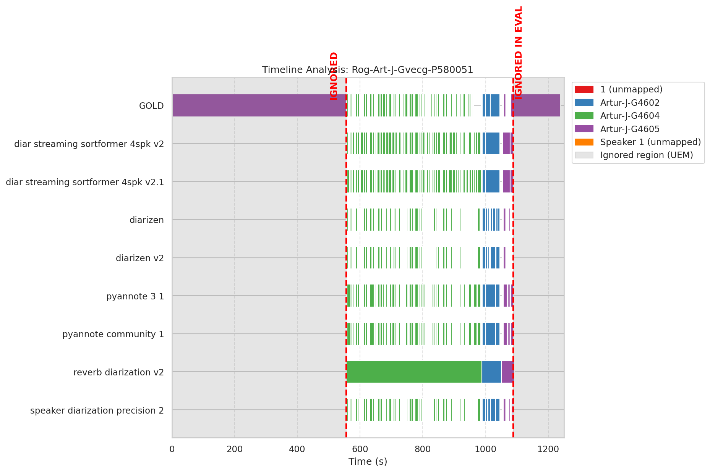

#### 60-Second Snippets (Zoom-in)
Below are 60-second zoomed-in windows showing where the models performed best and worst (based on average DER).

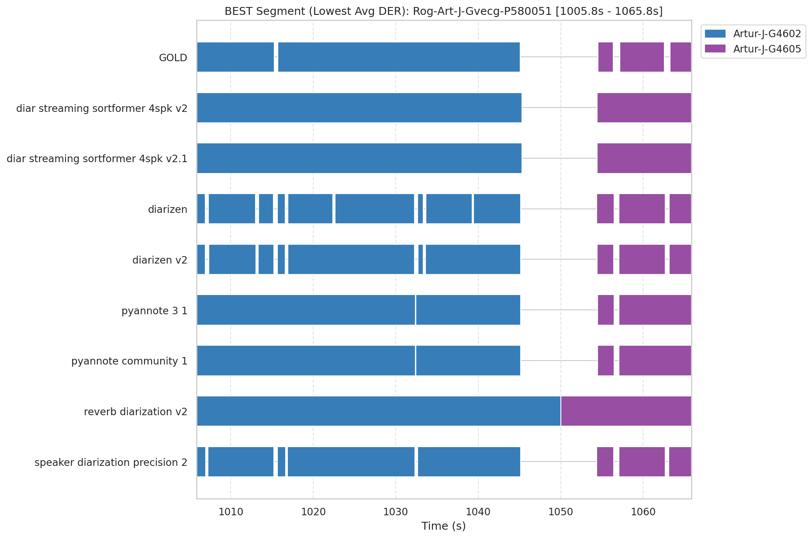

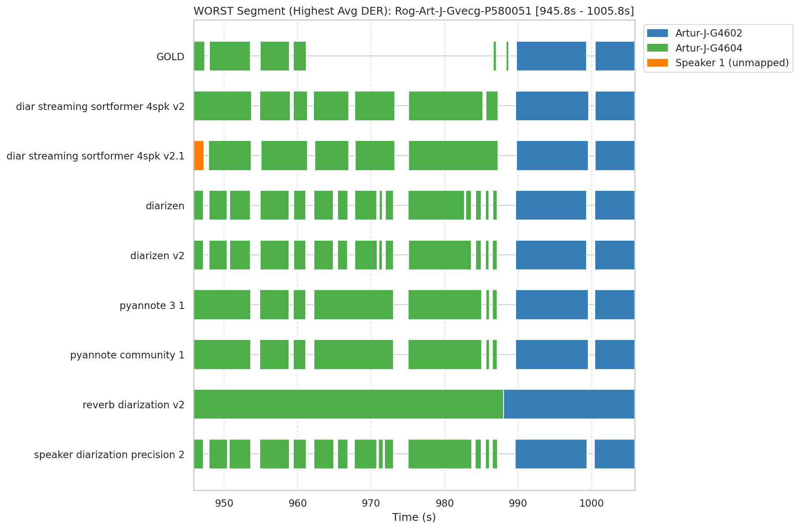

#### Metrics (Collar: 0.00s)

| Model                               | DER       | JER      | Miss     | FA       | Conf     | B-P       | B-R       | B-F1      | Pur        | Cov        | VRAM (GB)   | Status   |
|-------------------------------------|-----------|----------|----------|----------|----------|-----------|-----------|-----------|------------|------------|-------------|----------|
| speaker diarization precision 2     | **11.48** | **7.65** | 2.89     | 8.60     | **0.00** | 74.29     | 91.23     | **81.89** | **100.00** | **100.00** | **0.0**     | nan      |
| diarizen                            | 12.11     | 8.89     | 4.64     | **7.28** | 0.19     | 66.88     | **92.11** | 77.49     | **100.00** | 99.80      | nan         | nan      |
| diarizen v2                         | 12.14     | 8.64     | 4.58     | 7.37     | 0.20     | 67.74     | **92.11** | 78.07     | 99.99      | 99.79      | nan         | nan      |
| pyannote 3 1                        | 13.64     | 8.68     | 2.16     | 11.48    | **0.00** | **77.48** | 75.44     | 76.44     | **100.00** | **100.00** | 1.6         | nan      |
| pyannote community 1                | 13.88     | 8.78     | 2.16     | 11.48    | 0.24     | 75.44     | 75.44     | 75.44     | **100.00** | 99.75      | 1.6         | nan      |
| diar streaming sortformer 4spk v2   | 16.61     | 11.55    | 0.88     | 15.73    | **0.00** | 54.12     | 40.35     | 46.23     | 99.90      | 99.90      | 15.0        | nan      |
| diar streaming sortformer 4spk v2.1 | 16.89     | 11.31    | 1.67     | 14.73    | 0.49     | 68.35     | 47.37     | 55.96     | **100.00** | 99.50      | 15.0        | nan      |
| reverb diarization v2               | 35.75     | 22.88    | **0.01** | 35.65    | 0.09     | 0.00      | 0.00      | 0.00      | 99.91      | 99.91      | 4.3         | nan      |
| diar sortformer 4spk v1             | nan       | nan      | nan      | nan      | nan      | nan       | nan       | nan       | nan        | nan        | nan         | OOM/ERR  |

#### Metrics (Collar: 0.25s)

| Model                               | DER      | JER      | Miss     | FA       | Conf     | B-P       | B-R       | B-F1      | Pur        | Cov        | VRAM (GB)   | Status   |
|-------------------------------------|----------|----------|----------|----------|----------|-----------|-----------|-----------|------------|------------|-------------|----------|
| speaker diarization precision 2     | **8.47** | **4.88** | 2.61     | 5.86     | **0.00** | 74.29     | 91.23     | **81.89** | **100.00** | **100.00** | **0.0**     | nan      |
| diarizen v2                         | 9.72     | 6.54     | 4.00     | 5.55     | 0.17     | 67.74     | **92.11** | 78.07     | 99.99      | 99.84      | nan         | nan      |
| diarizen                            | 9.74     | 6.73     | 4.10     | **5.47** | 0.17     | 66.88     | **92.11** | 77.49     | **100.00** | 99.84      | nan         | nan      |
| pyannote 3 1                        | 10.19    | 5.65     | 1.78     | 8.41     | **0.00** | **77.48** | 75.44     | 76.44     | **100.00** | **100.00** | 1.6         | nan      |
| pyannote community 1                | 10.42    | 5.73     | 1.78     | 8.41     | 0.23     | 75.44     | 75.44     | 75.44     | **100.00** | 99.80      | 1.6         | nan      |
| diar streaming sortformer 4spk v2   | 11.74    | 8.20     | 0.59     | 11.15    | **0.00** | 54.12     | 40.35     | 46.23     | 99.92      | 99.96      | 15.0        | nan      |
| diar streaming sortformer 4spk v2.1 | 12.25    | 8.14     | 0.90     | 10.83    | 0.52     | 68.35     | 47.37     | 55.96     | **100.00** | 99.56      | 15.0        | nan      |
| reverb diarization v2               | 30.63    | 20.36    | **0.00** | 30.60    | 0.03     | 0.00      | 0.00      | 0.00      | 99.97      | 99.94      | 4.3         | nan      |
| diar sortformer 4spk v1             | nan      | nan      | nan      | nan      | nan      | nan       | nan       | nan       | nan        | nan        | nan         | OOM/ERR  |


---

